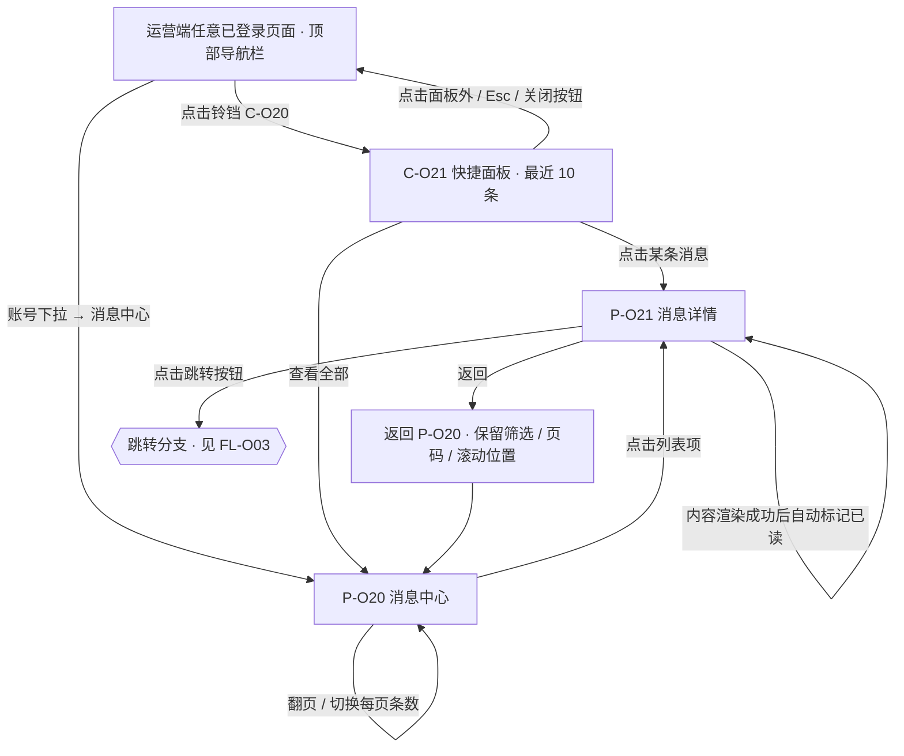
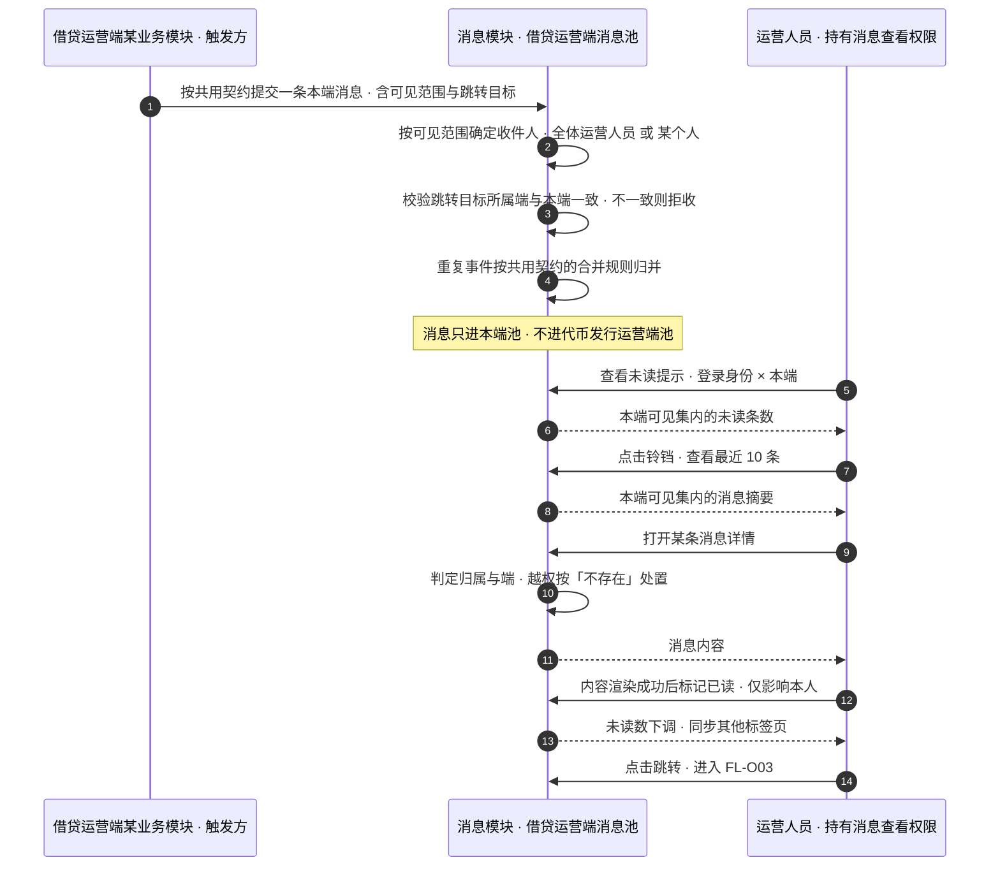
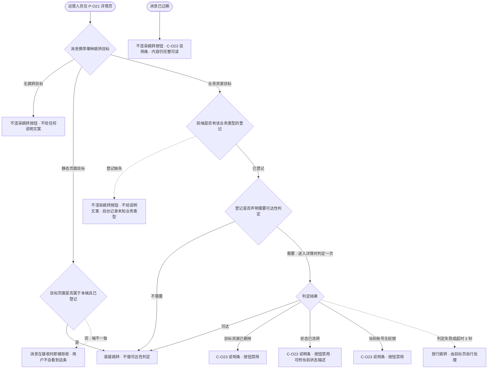
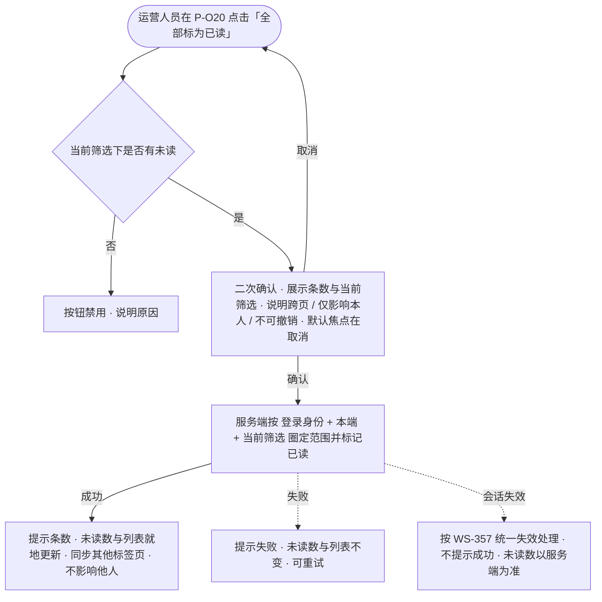
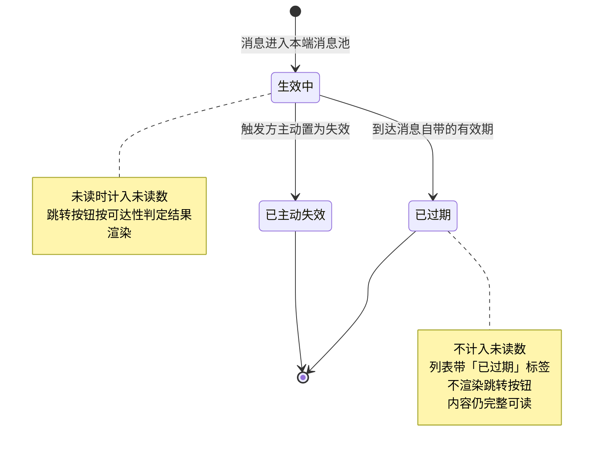
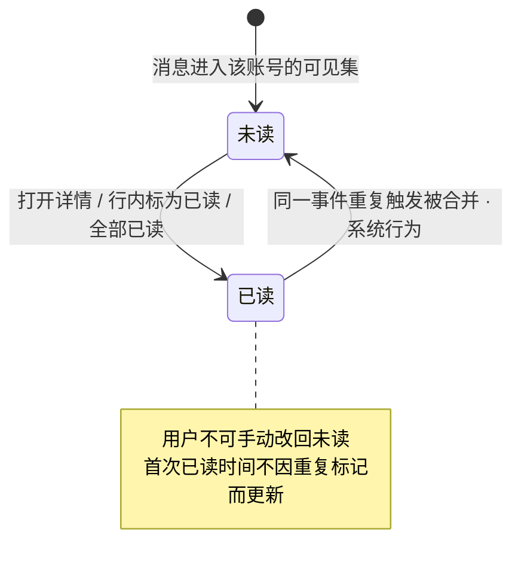

# 借贷平台 · 运营端 · 消息通知 PRD · 03 流程图与状态机

> 本文件是《借贷平台 · 运营端 · 消息通知 PRD V1.0》的图册，**开发与测试共同参考**，设计师据此理解页面流与状态。
> 入口与全文导航见主册 [`v1.0-运营端消息通知-PRD.md`](v1.0-运营端消息通知-PRD.md)；功能规则见 [`01-功能需求说明.md`](01-功能需求说明.md)；验收要求见 [`02-验收需求说明.md`](02-验收需求说明.md)。

**本册讲什么**：本模块全部的业务流程图（`FL-O01`～`FL-O04`）与状态机（`ST-O01`～`ST-O02`）。

**本册怎么读**：

1. **图只表达业务角色、触发入口、主流程、关键分支与业务状态**，不画内部程序执行链。
2. **图不是规则的来源**。每张图都标注了它对应的正文位置与需求编号，规则细节回查正文；**图与正文冲突时以正文为准**。
3. **本册不另造业务口径，也不复制大段规则**；正文在对应模块处直接引用本册图号。

**图号索引**：

| 图号 | 名称 | 关联需求编号 | 对应正文 |
| --- | --- | --- | --- |
| `FL-O01` | 页面流：两个入口到详情与跳转 | `F-O01`～`F-O04`、`F-O12`、`F-O14` | 主册 7.2、7.3；分册 `01` 12.1、12.2、12.4 |
| `FL-O02` | 消息从产生到被运营人员消费 | `F-O02`、`F-O10`、`F-O12`、`F-O16`、`F-O17` | 主册 6.2、6.3；分册 `01` 12.1、12.4、12.5 |
| `FL-O03` | 跳转与四类失效的分支 | `F-O14`、`F-O15` | 分册 `01` 12.6 |
| `FL-O04` | 全部已读 | `F-O11` | 分册 `01` 12.5.2 |
| `ST-O01` | 消息的可用性状态 | `F-O02`、`F-O14` | 分册 `01` 12.1.2、12.6.4、12.8 |
| `ST-O02` | 单个接收者对单条消息的已读状态 | `F-O10`、`F-O11` | 主册 6.1；分册 `01` 12.5 |

**通用图例**：菱形 = 业务判断；矩形 = 页面或业务动作；圆角起止 = 流程起点 / 终点；虚线分支 = 异常或降级出口。

---

## FL-O01 页面流：两个入口到详情与跳转

**关联需求**：`F-O01`～`F-O04`（入口）、`F-O12`（详情）、`F-O14`（跳转）
**对应正文**：主册 7.2「两个入口与落点」、分册 `01` 12.1、12.2、12.4

> **两个入口共用同一份数据与同一份已读状态**：任一处的已读在另一处立即生效（分册 `01` 12.5.4）。**左侧菜单不设消息中心一级入口**（主册 `D-O05`）。

---

## FL-O02 消息从产生到被运营人员消费

**关联需求**：`F-O02`（未读提示）、`F-O10`（已读）、`F-O12`（详情）、`F-O16` / `F-O17`（可见范围与归属判定）
**对应正文**：主册 6.2 可见范围、6.3 按端隔离、6.4 越权处置；分册 `01` 12.1、12.4、12.5

> **跨端事件由触发方各发一条**（主册 6.3）：同一个事件若两端都要知晓，触发方分别提交两条消息，各进各自的池；**两端之间不转发、不合并未读**。

---

## FL-O03 跳转与四类失效的分支

**关联需求**：`F-O14`（跳转形态与失效降级）、`F-O15`（静态页面目标）
**对应正文**：分册 `01` 12.6

> **消息内容永远优先于跳转能力**：四类失效与登记缺失下，标题、正文、时间都**完整展示**（分册 `01` 12.6.4）。
> **「不渲染按钮」与「按钮禁用」不可混用**：本来就没有跳转、或登记缺失 → **不渲染且不解释**；有目标但当前不可用 → **禁用并说明原因**。

---

## FL-O04 全部已读

**关联需求**：`F-O11`
**对应正文**：分册 `01` 12.5.2

> 执行期间「确认」与「取消」**同时禁用**，遮罩点击与 Esc 不关闭（分册 `01` 12.5.2）；执行期间新到达的消息**保持未读**。

---

## ST-O01 消息的可用性状态

**状态对象**：一条消息本身
**关联需求**：`F-O02`（未读计数）、`F-O14`（跳转）
**对应正文**：分册 `01` 12.1.2、12.6.4、12.8

> **「目标资源已删除 / 状态已流转 / 无权限」不是消息的状态**，而是**跳转可达性判定的实时结果，不落到消息上**。理由：这三者是业务侧的动态状态，会随时间变化——一条今天不可操作的记录，明天可能因业务重开而再次可操作，固化到消息上会产生永久性的错误标记。
>
> **消息不因过期或失效而被删除或隐藏**（分册 `01` 12.8）。

---

## ST-O02 单个接收者对单条消息的已读状态

**状态对象**：「一个账号 × 一条消息」
**关联需求**：`F-O10`（单条已读）、`F-O11`（全部已读）
**对应正文**：主册 6.1；分册 `01` 12.5

> **可见范围在这张图里的读法**：一条面向全体运营人员的消息，对应 N 个「账号 × 消息」的**独立**状态机，彼此互不影响——A 走到「已读」，B 仍停在「未读」。这就是「已读个人独立」的表达（主册 6.1、`AC-O51`）。
>
> **承担 SPV 职责的账号没有第二套状态机**：运营端只有一套账号体系、不做机构级数据隔离，其可见集与同角色的其他运营人员一致（主册 5.1、6.2、`AC-O103`）。**没有消息查看权限的账号不进入本图**——它不具备消息功能的准入（主册 6.1、`AC-O101`）。
