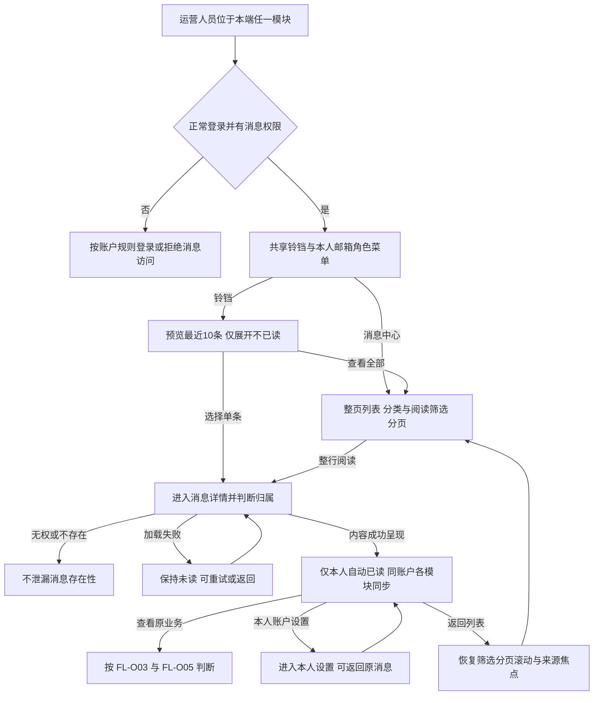
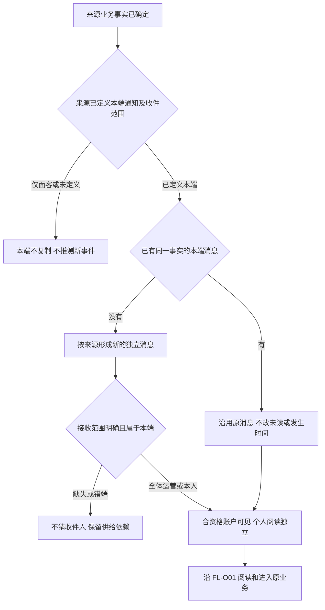
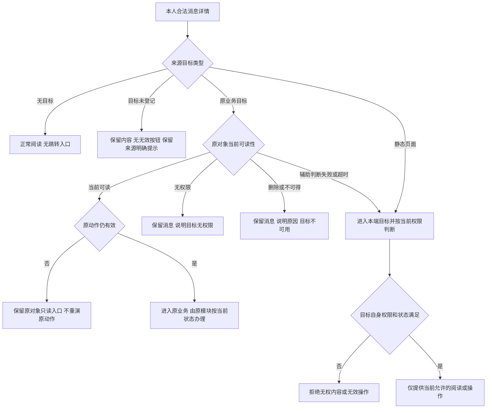
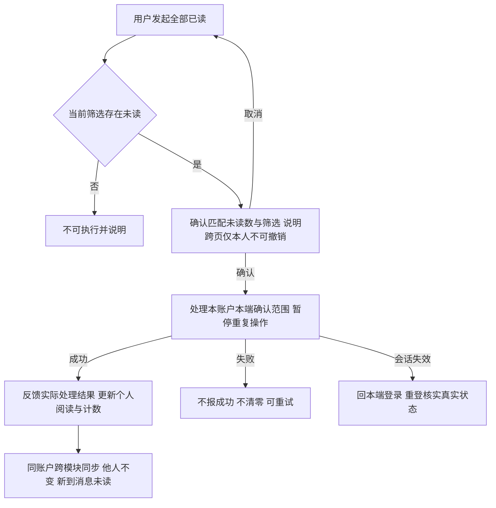
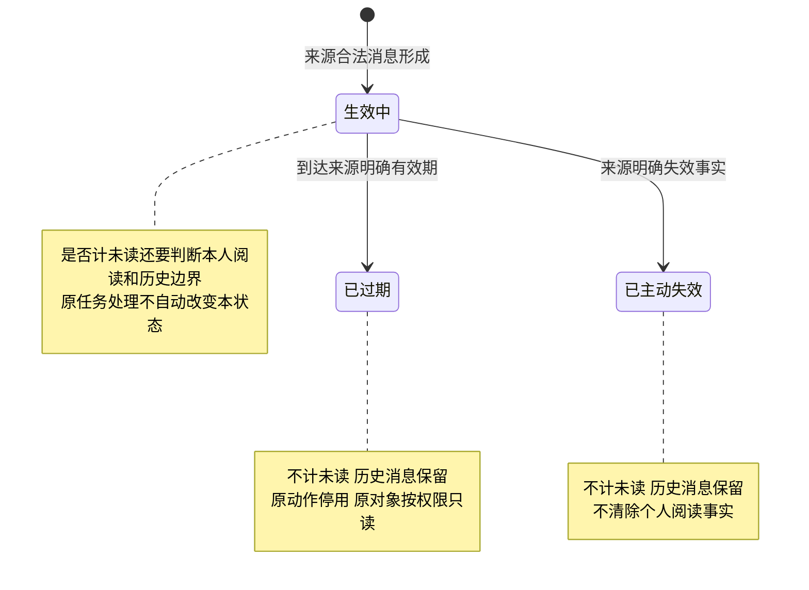
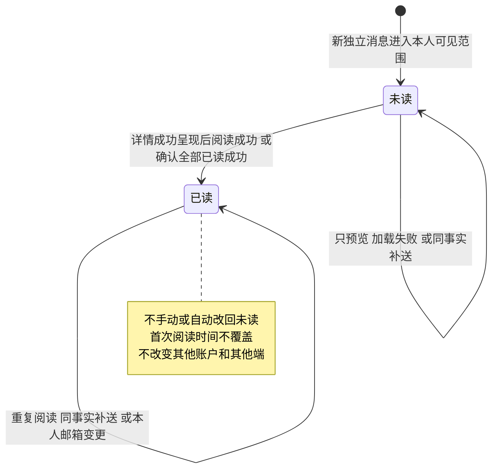
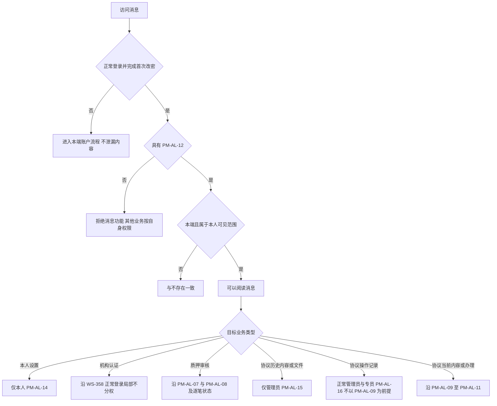

# 运营端消息通知 V1.1 · 流程图与状态机

与[主册](v1.0-运营端消息通知-PRD.md)、[功能册](01-功能需求说明.md)、[验收册](02-验收需求说明.md)同批使用。只画业务角色、阅读和权限结果，不画协议或存储实现。来源真实触发回查主册第 4 章及各来源通知册。

| 图号 | 需求 | 规则入口 |
| --- | --- | --- |
| FL-O01 | F-O01～F-O13 | 功能 12.1～12.5，进入、阅读与返回 |
| FL-O02 | F-O16～F-O18 | 功能 12.12～12.13，来源与收件 |
| FL-O03 | F-O14、F-O15 | 功能 12.6，原目标与动作 |
| FL-O04 | F-O11 | 功能 12.5，全部已读 |
| ST-O01 | F-O02、F-O14 | 功能 12.1、12.6、12.8，消息有效性 |
| ST-O02 | F-O10、F-O11 | 功能 12.5，个人阅读 |
| FL-O05 | F-O16、F-O17 | 功能 12.12，局部权限边界 |

## FL-O01 共享入口、阅读与返回

规则：[功能 12.1](01-功能需求说明.md#entry)、[12.4](01-功能需求说明.md#detail)；验收 AC-O01～33、105～109。

列表无行内已读，预览无全部已读。详情刷新后同会话来源仍可恢复；切换账户不能恢复前一人内容。各模块共用个人已读不意味着跨端或跨人共享。

## FL-O02 已有来源与本端接收

规则：[功能 12.13](01-功能需求说明.md#sources)、[主册第 4 章](v1.0-运营端消息通知-PRD.md#4-既有消息来源与发送责任)；验收 AC-O71～83、100、112～116。

EV-L42 唯一由 WS-349 发送本端待审核；WS-357 负责本人密码安全站内信。WS-358/359 面客结果和 L5～L8 不复制运营。框架无独立事件、模板或邮件发送；共享登记和真实时效未完成不能标已接入。

## FL-O03 原业务目标、历史查看与动作失效

规则：[功能 12.6](01-功能需求说明.md#target)；验收 AC-O34～43、110～111。

消息过期/主动失效不计未读，原动作不恢复；来源明确可留存的原对象仍按当前权限只读。旧机构提交不跳作新提交，不提供旧材料下载；协议历史与操作记录分别按 FL-O05。辅助判断超时绝不免除目标权限。

## FL-O04 当前筛选跨页全部已读

规则：[功能 12.5](01-功能需求说明.md#read)；验收 AC-O31～33、87、93～95、108。

列表总条数包含已读；确认数仅匹配未读。处理过程中到达的新消息不自动纳入范围，其他标签已读不重复计算。执行结果与业务完成无关。

## ST-O01 单条消息的有效性

规则：[功能 12.6](01-功能需求说明.md#target)、功能 12.8；验收 AC-O05～06、42～43、91。

无来源有效期不自设天数。本期不清理归档，故过期/失效后仍保留可查状态；目标无权、对象删除、业务已处理不是此状态机的转换条件。

## ST-O02 一个账户对一条消息的阅读状态

规则：[功能 12.5](01-功能需求说明.md#read)；验收 AC-O25～33、51～53、75、108。

新的真实业务事实有自己的状态机，不把旧消息改成未读。已读不完成审核、不改变资金状态、不关闭异常。失去消息资格期间不得使用阅读功能，资格恢复后沿用原阅读事实；无独立 SPV 阅读状态。

## FL-O05 消息准入与目标权限分别判断

规则：[功能 12.12](01-功能需求说明.md#permissions)；验收 AC-O44～64、101～103、111。

无 PM-AL-12 者仍可从原业务入口读取 PM-AL-16 允许的操作记录；不因记录可读恢复消息准入。机构局部例外不扩展到质押或协议。所有分支仍受本人私人资料边界约束，不能把管理员称谓当作他人个人消息权限。
