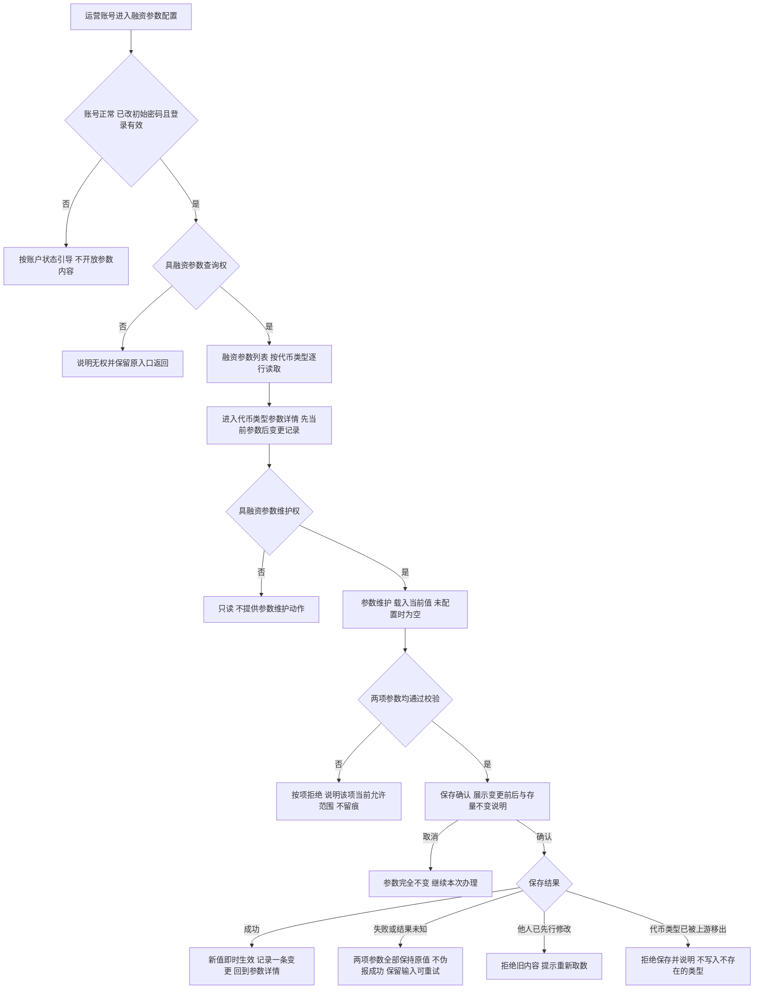
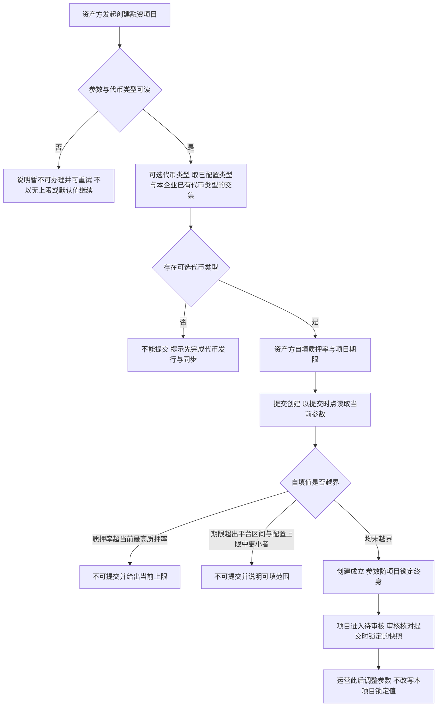
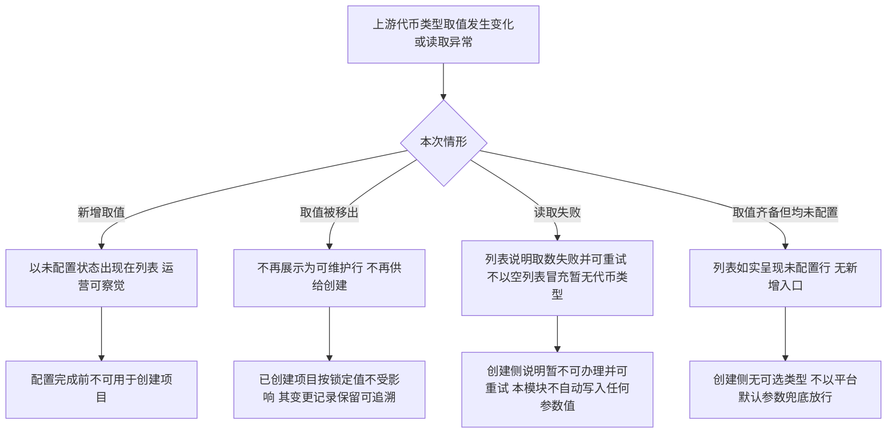
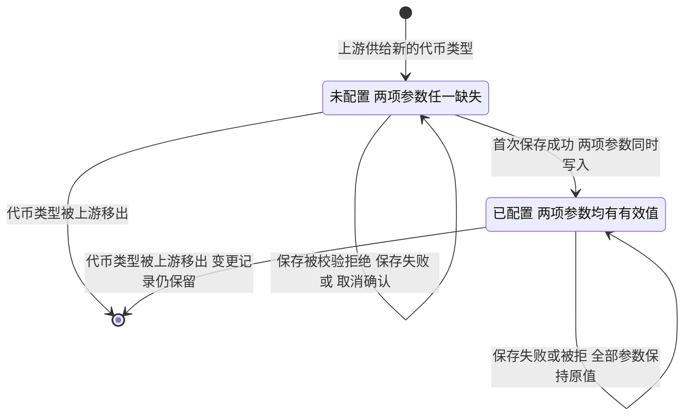
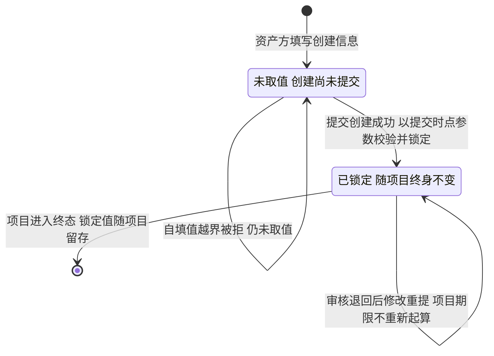

# 运营端融资参数配置 · 流程图与状态机

2026-09-24｜需求评审稿，与[主 PRD](01-运营端融资参数配置-PRD.md)的功能与验收同源。

与[消息通知](03-运营端融资参数配置-消息通知.md)共同使用。本册只表达业务角色、操作结果及对象状态，完整规则以主 PRD 为准。图中节点是业务环节与信息域，不表示页面或组件，承载形式由设计决定（见[统一条款](01-运营端融资参数配置-PRD.md#design-boundary)）；图中不画协议、接口或存储实现，也不画逐笔质押的任何环节。

| 图号 | 主题 | 关联功能与验收 |
| --- | --- | --- |
| [FL-O-FC-01](#fl-o-fc-01) | 参数读取与维护 | [融资参数列表与检索](01-运营端融资参数配置-PRD.md#f-o-fc-01)、[参数详情与变更记录](01-运营端融资参数配置-PRD.md#f-o-fc-02)、[参数维护与保存](01-运营端融资参数配置-PRD.md#f-o-fc-03)；验收 [4.1](01-运营端融资参数配置-PRD.md#ac-1)、[4.2](01-运营端融资参数配置-PRD.md#ac-2)、[4.3](01-运营端融资参数配置-PRD.md#ac-3) |
| [FL-O-FC-02](#fl-o-fc-02) | 创建项目的参数供给与锁定 | [创建项目的参数供给](01-运营端融资参数配置-PRD.md#f-o-fc-05)、[参数生效与存量隔离](01-运营端融资参数配置-PRD.md#f-o-fc-04)；验收 [4.4](01-运营端融资参数配置-PRD.md#ac-4)、[4.5](01-运营端融资参数配置-PRD.md#ac-5) |
| [FL-O-FC-03](#fl-o-fc-03) | 代币类型取值增减与读取失败 | [代币类型供给与未配置处理](01-运营端融资参数配置-PRD.md#f-o-fc-06)；验收 [4.6](01-运营端融资参数配置-PRD.md#ac-6) |
| [ST-O-FC-01](#st-o-fc-01) | 代币类型融资参数状态机 | [参数维护与保存](01-运营端融资参数配置-PRD.md#f-o-fc-03)、[代币类型供给与未配置处理](01-运营端融资参数配置-PRD.md#f-o-fc-06)；验收 [4.3](01-运营端融资参数配置-PRD.md#ac-3)、[4.6](01-运营端融资参数配置-PRD.md#ac-6) |
| [ST-O-FC-02](#st-o-fc-02) | 项目参数取值的锁定 | [参数生效与存量隔离](01-运营端融资参数配置-PRD.md#f-o-fc-04)、[创建项目的参数供给](01-运营端融资参数配置-PRD.md#f-o-fc-05)；验收 [4.4](01-运营端融资参数配置-PRD.md#ac-4) |

## FL-O-FC-01 参数读取与维护

回指[融资参数列表与检索](01-运营端融资参数配置-PRD.md#f-o-fc-01)、[参数详情与变更记录](01-运营端融资参数配置-PRD.md#f-o-fc-02)、[参数维护与保存](01-运营端融资参数配置-PRD.md#f-o-fc-03)。查询权与维护权分别判定；缺查询权的维护权配置不得绕过准入。

仅有查询权时内容完整可读但无办理动作。未提交的编辑、被拒绝的保存与取消确认都不产生变更记录。两项参数要么全部采用新值、要么全部保持原值，不出现一项已改而另一项仍旧。

## FL-O-FC-02 创建项目的参数供给与锁定

回指[创建项目的参数供给](01-运营端融资参数配置-PRD.md#f-o-fc-05)、[参数生效与存量隔离](01-运营端融资参数配置-PRD.md#f-o-fc-04)。面客侧的自填与提示规则以[融资需求与代币质押](../v1.0-借贷广场-融资需求与代币质押/01-融资需求与代币质押-PRD.md#f-ls-01)为准，本图只表达参数从何而来、在哪个时点被取用。

校验与锁定取同一份提交时点的参数值，不出现校验用旧值而锁定用新值。运营保存成功之后提交的创建适用新值；保存失败时仍按原上限校验。

## FL-O-FC-03 代币类型取值增减与读取失败

回指[代币类型供给与未配置处理](01-运营端融资参数配置-PRD.md#f-o-fc-06)。代币类型取值全集由代币发行与同步的上游供给，运营不能在本模块新增、改名或删除。

## ST-O-FC-01 代币类型融资参数状态机

对象是**单个代币类型的融资参数配置**，不是项目、代币或质押笔。状态取自[配置状态（FC-04）](01-运营端融资参数配置-PRD.md#fc-04)：两项参数均有有效值为已配置，任一缺失为未配置。本模块没有草稿、待生效、已归档或已下线状态。

转换只由运营的保存成功与上游取值增减触发，不因时间流逝、项目创建、项目审核或质押结果自动变化。取值被移出后该行不再可维护，但其变更记录不删除；同名取值再次出现时按新的未配置行处理，不恢复旧值。

## ST-O-FC-02 项目参数取值的锁定

对象是**单个融资项目所采用的参数取值**，说明运营参数与项目锁定值之间的关系；项目自身的状态机以[项目状态机](../v1.0-借贷广场-融资需求与代币质押/02-融资需求与代币质押-流程图与状态机.md#st-ls-01)为准，本图不重复。

已锁定的[项目质押率（FP-34）](../v1.0-借贷广场-融资需求与代币质押/01-融资需求与代币质押-PRD.md#fp-34)与[项目期限（FP-35）](../v1.0-借贷广场-融资需求与代币质押/01-融资需求与代币质押-PRD.md#fp-35)终身不变：参数调整不触发额度重算、覆盖判定或到期日变化，[有效质押额（FP-12）](../v1.0-借贷广场-融资需求与代币质押/01-融资需求与代币质押-PRD.md#fp-12)始终按该锁定质押率计算。上限被调至低于存量锁定值不构成冲突，也不产生存量整改。
