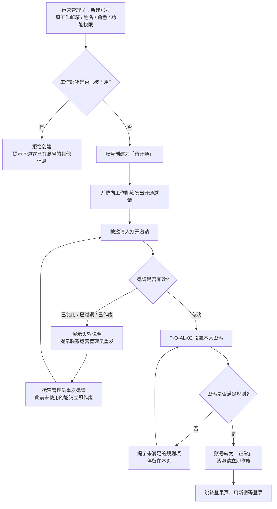
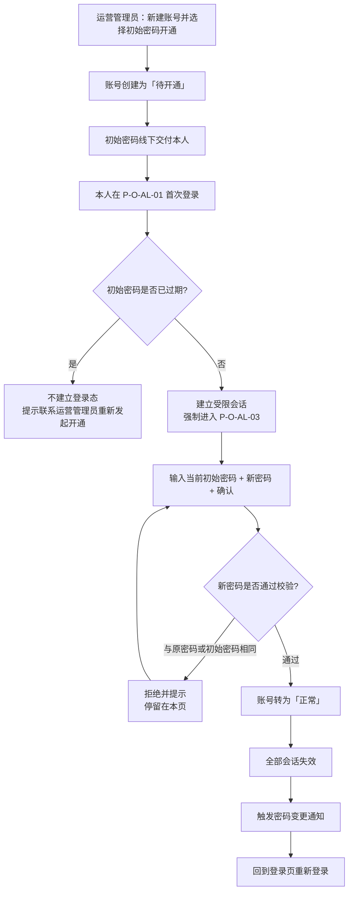
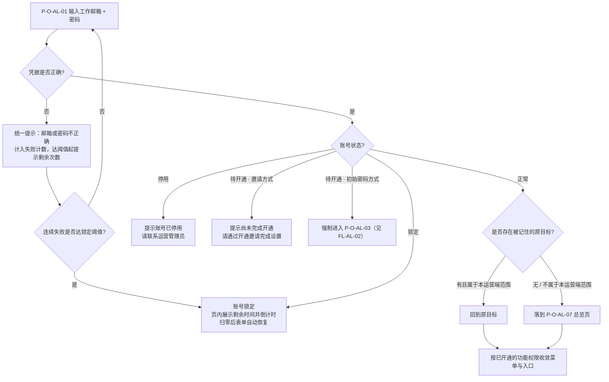
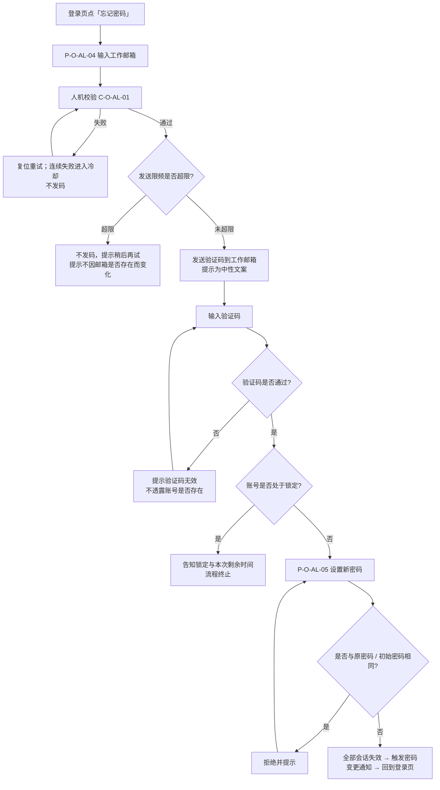
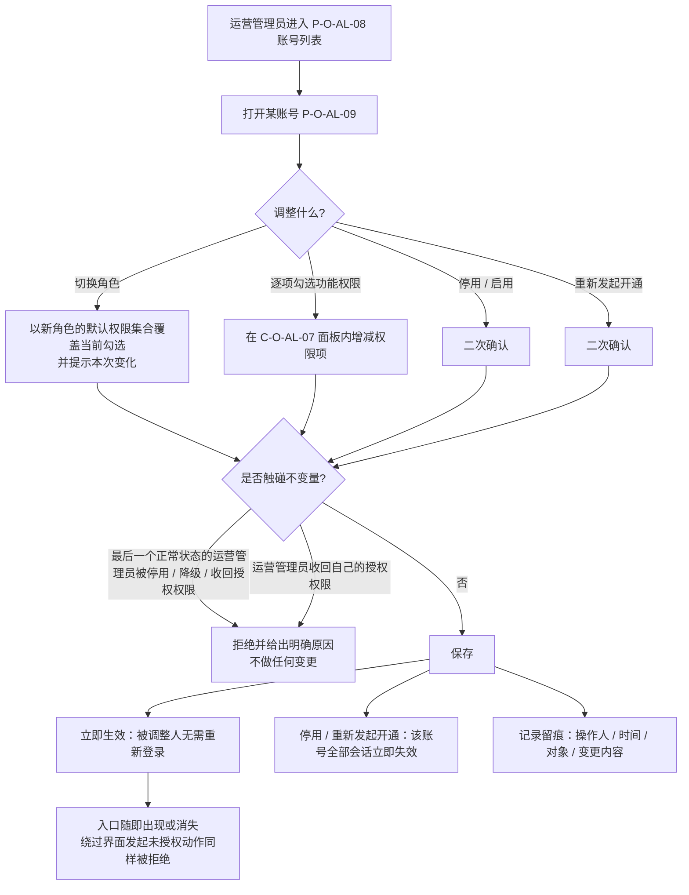
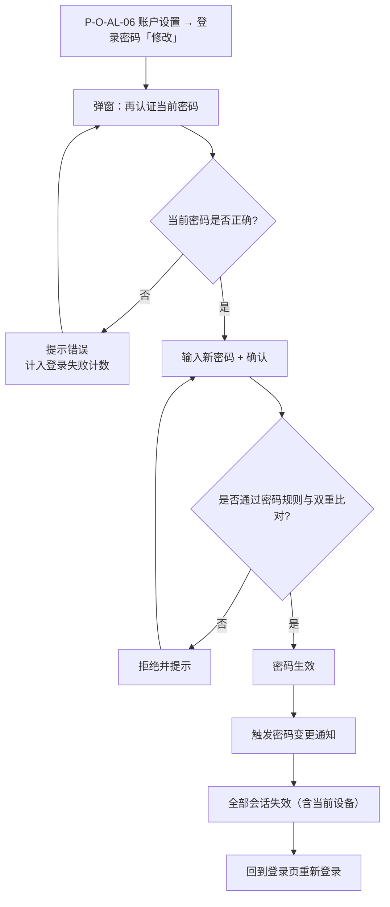
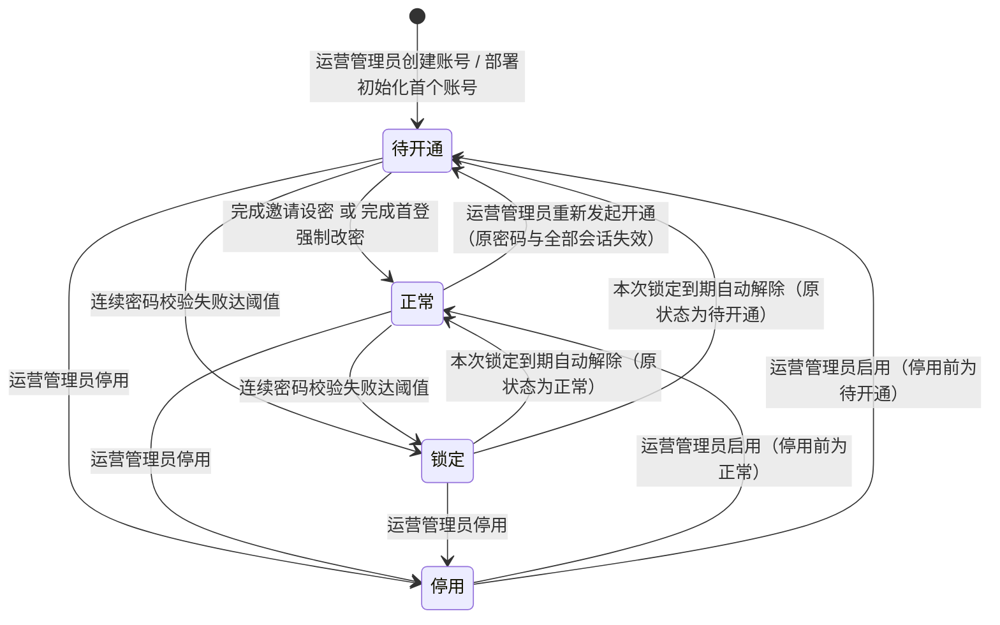
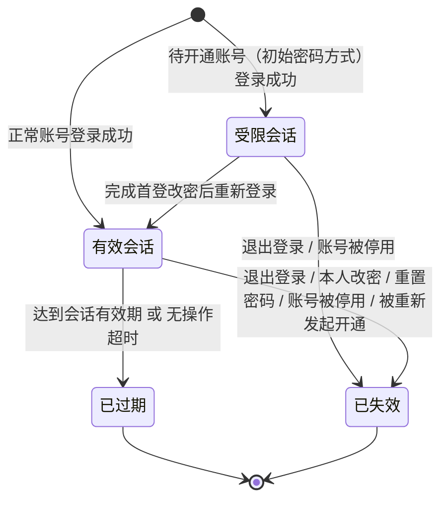
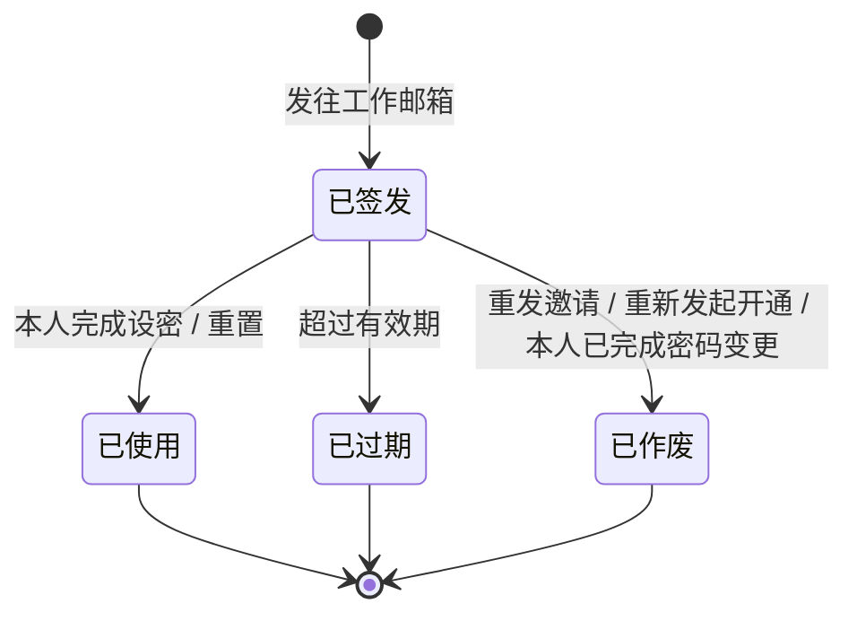

# 运营管理平台 · 运营端 · 账户与登录 —— 流程图与状态机

> **本册是图册，开发与测试共同参考。** 图只表达业务角色、用户流程、关键分支与业务状态；**完整规则在** 主册 [`v1.0-运营端账户与登录-PRD.md`](v1.0-运营端账户与登录-PRD.md) 第 5 章与分册 [`01-功能需求说明.md`](01-功能需求说明.md)，验收在 [`02-验收需求说明.md`](02-验收需求说明.md)。
> 本册**不另造业务口径、不复制规则正文、不画内部实现链路**。图与正文不一致时以正文为准。

**图例**：矩形 = 用户可见的页面或步骤；菱形 = 业务判定；圆角/终止 = 流程结束或落点。角色以泳道注记或步骤前缀标明。

| 图号 | 名称 | 关联功能 | 正文出处 |
| --- | --- | --- | --- |
| `FL-AL-01` | 账号开通 · 邀请方式 | `F-AL-01`、`F-AL-02` | 分册 01 §9.3、§9.8 |
| `FL-AL-02` | 账号开通 · 初始密码方式与首登强制改密 | `F-AL-01`、`F-AL-03` | 分册 01 §9.4 |
| `FL-AL-03` | 日常登录与落地 | `F-AL-04`、`F-AL-06`、`F-AL-13` | 分册 01 §9.2 |
| `FL-AL-04` | 忘记密码 | `F-AL-05` | 分册 01 §9.5 |
| `FL-AL-05` | 角色分配与功能权限授权 | `F-AL-15`、`F-AL-16`、`F-AL-17` | 分册 01 §9.9、§10.5 |
| `FL-AL-06` | 本人修改密码 | `F-AL-08` | 分册 01 §9.6 |
| `SM-AL-01` | 运营账号状态机 | `ST-AL-1`～`ST-AL-4` | 分册 01 §12.1 |
| `SM-AL-02` | 登录会话状态机 | `F-AL-12` | 分册 01 §12.2 |
| `SM-AL-03` | 开通凭据状态机 | `F-AL-02`、`F-AL-05` | 分册 01 §12.3 |

---

## `FL-AL-01` 账号开通 · 邀请方式

> 关键分支：邀请失效只给中性说明；重发后**只有最新一份邀请有效**；全程系统不在任何在线渠道下发明文密码。

---

## `FL-AL-02` 账号开通 · 初始密码方式与首登强制改密

> 受限会话期间，除本页、退出登录与语言切换外**任何功能都不可用**，绕过界面直接发起业务动作同样被拒绝。

---

## `FL-AL-03` 日常登录与落地

> 锁定的告知只在**凭据校验之后**出现；账号是否存在不得从提示、页面表现或响应快慢中被区分出来。

---

## `FL-AL-04` 忘记密码

> **锁定判定必须位于验证码校验之后**：提前会重新打开账号枚举通道。锁定期间用户仍会收到验证码邮件，这是「防枚举」与「锁定期间全通道不可用」同时成立的唯一组合。

---

## `FL-AL-05` 角色分配与功能权限授权

---

## `FL-AL-06` 本人修改密码

---

## `SM-AL-01` 运营账号状态机

| 状态 | 含义 | 该状态下的可用性 |
| --- | --- | --- |
| 待开通 `ST-AL-1` | 账号已创建，本人尚未设置自己的密码 | 只能完成开通；其他功能一律不可用 |
| 正常 `ST-AL-2` | 已完成开通 | 按已开通的功能权限正常使用 |
| 锁定 `ST-AL-3` | 连续密码校验失败达阈值 | 登录与忘记密码全部不可用，无提前解除通道 |
| 停用 `ST-AL-4` | 被运营管理员停用 | 不可登录，已有会话立即失效 |

> **不变量**：系统内最后一个处于「正常」状态的运营管理员**不可被停用、降级或收回账号与权限管理权限**（`D-AL-12`），因此上图中指向「停用」的转换对该账号不成立。

---

## `SM-AL-02` 登录会话状态机

| 状态 | 用户可见的表现 |
| --- | --- |
| 受限会话 | 只能完成首登改密、退出登录与切换语言 |
| 有效会话 | 正常使用；到期前给出续期确认 |
| 已过期 | 清本地登录态（语言偏好保留）、Toast 告知原因、回到登录页并记住原目标 |
| 已失效 | 同上；同一账号的全部设备与同一浏览器的全部标签页一并失效 |

> 只有真实的用户交互才重置无操作计时，**后台轮询、心跳与预取不计**。

---

## `SM-AL-03` 开通凭据状态机

适用于**开通邀请**与**找回验证码**两类一次性凭据。

> 同一账号**同时只有最新一份凭据有效**；已使用、已过期、已作废的凭据再次打开时只给中性的失效说明，不泄露账号信息。
