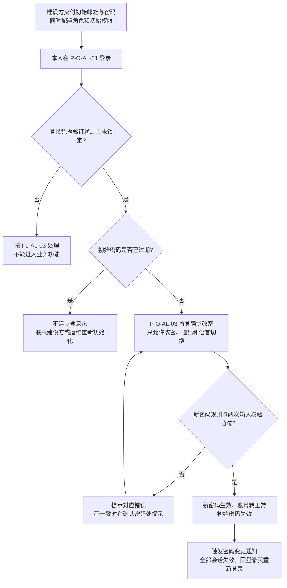
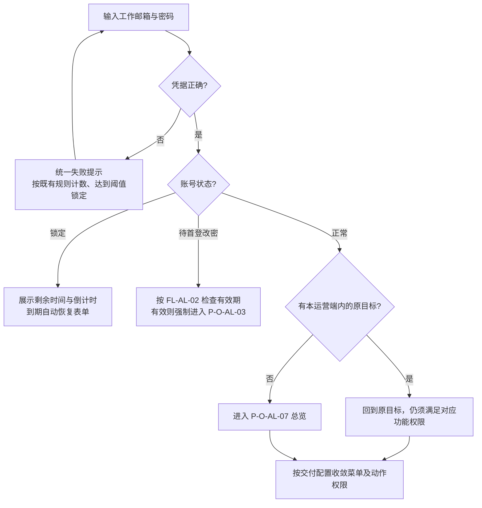
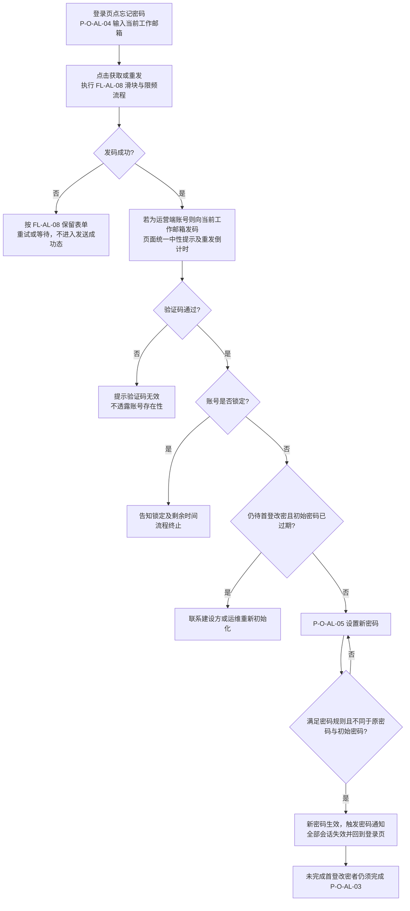
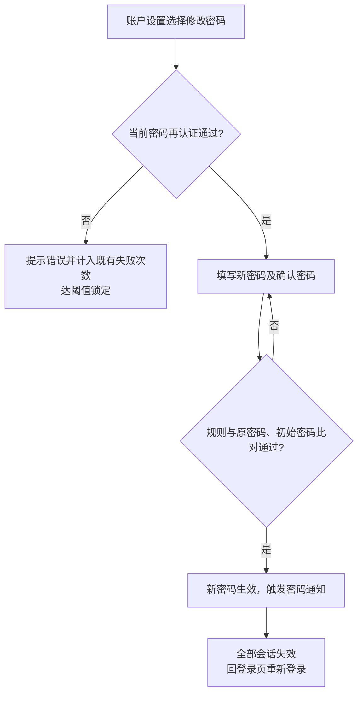
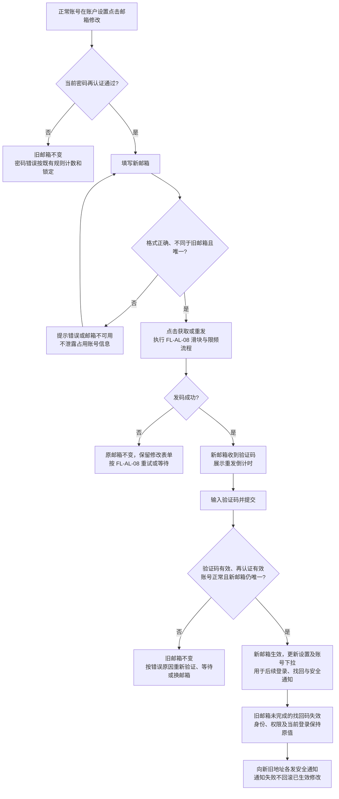
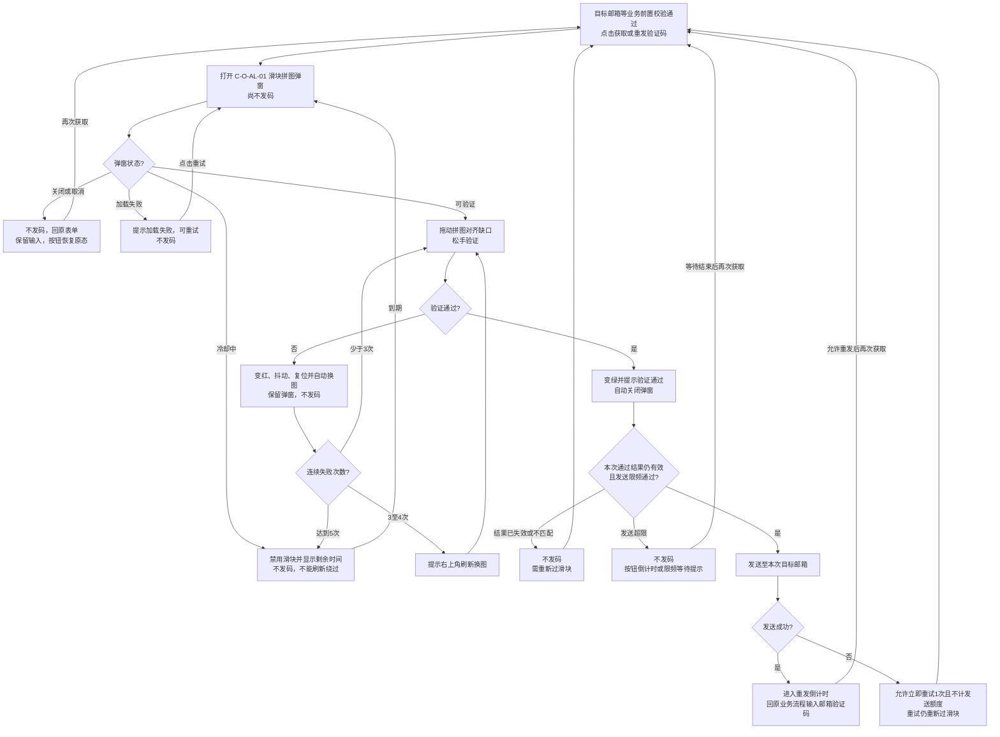
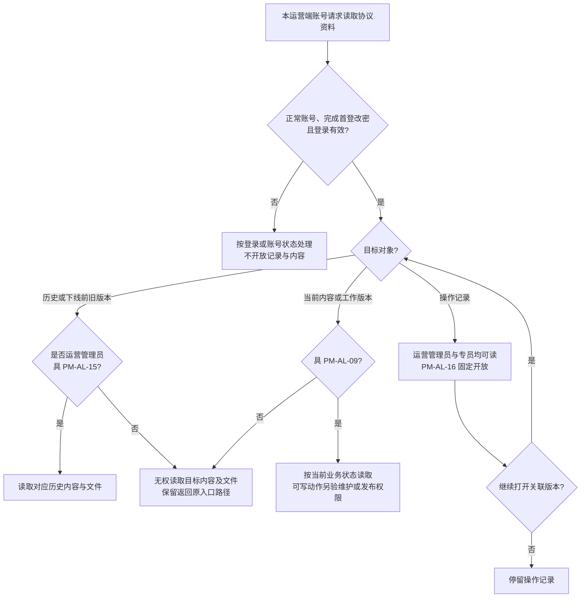
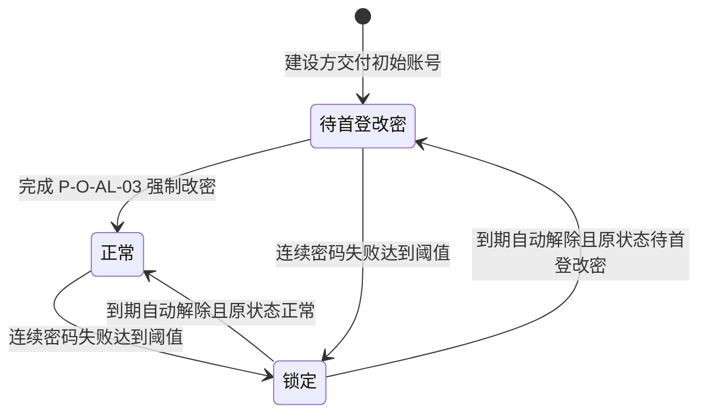
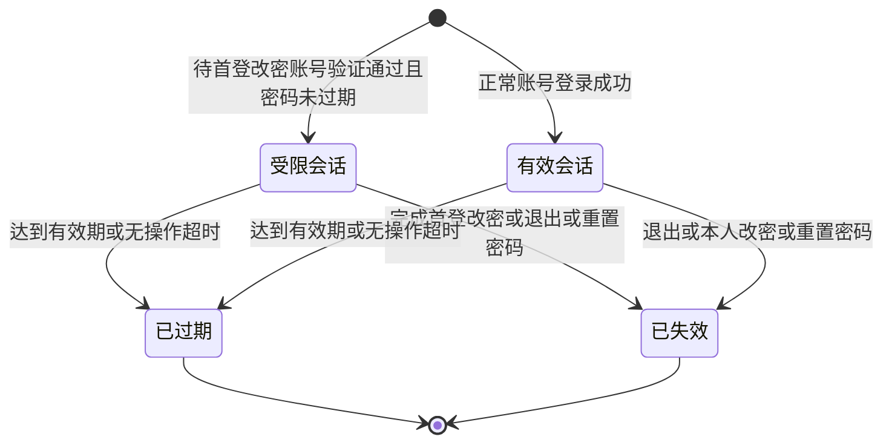
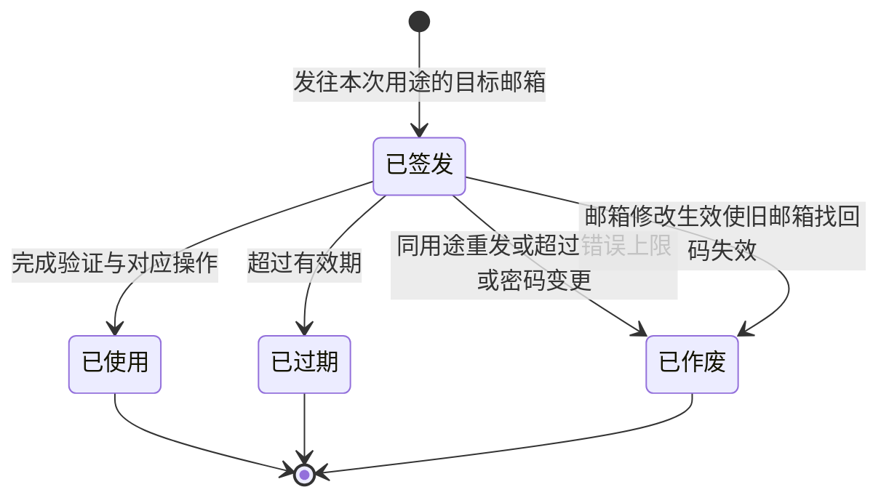

# 运营管理平台 · 运营端 · 账户与登录 —— 流程图与状态机 · V1.1

> 开发、测试、设计共同参考。业务规则见[功能需求说明](01-功能需求说明.md)，范围与统一规则见[主册](v1.0-运营端账户与登录-PRD.md)，预期结果见[验收需求说明](02-验收需求说明.md)。图仅表达业务流程与状态，不另造规则。

| 图号 | 名称 | 关联需求与正文 |
| --- | --- | --- |
| `FL-AL-02` | 初始账密与首登强制改密 | `F-AL-03`；功能册 §9.4 |
| `FL-AL-03` | 日常登录与落地 | `F-AL-04`、`F-AL-06`、`F-AL-13`；§9.2 |
| `FL-AL-04` | 忘记密码 | `F-AL-05`；§9.5 |
| `FL-AL-06` | 本人修改密码 | `F-AL-08`；§9.6 |
| `FL-AL-07` | 本人修改邮箱 | `F-AL-19`；§9.6.1 |
| `FL-AL-08` | 获取与重发邮箱验证码（两入口共用） | `F-AL-13`、`D-AL-22`；§9.1.1 |
| `FL-AL-09` | 协议读取准入与权限隔离 | `F-AL-17`、`D-AL-33`、`D-AL-34`；§10.2～10.6.1 |
| `SM-AL-01` | 运营账号状态 | `ST-AL-1`～`ST-AL-3`；§12.1 |
| `SM-AL-02` | 登录会话状态 | `F-AL-12`；§12.2 |
| `SM-AL-03` | 验证码状态 | `F-AL-05`、`F-AL-19`；§12.3 |

## `FL-AL-02` 初始账密与首登强制改密

所有交付账号必经此流程；本次首登身份已验证，改密页不再输入当前密码，只填写新密码及确认密码。人工重新初始化是线下兜底，无产品管理入口，且不能提前解除锁定。

## `FL-AL-03` 日常登录与落地

锁定告知仅在凭据校验通过后出现；不能从登录提示、页面表现或响应快慢辨别邮箱是否存在。达到提示阈值后的剩余次数提示遵守同一防枚举要求。

## `FL-AL-04` 忘记密码

锁定判定位于验证码校验通过之后；锁定账号仍可收到邮件但不能完成重置。待首登改密的衔接为默认口径。邮箱不可达且无法登录时，只能联系建设方/运维重新初始化。

## `FL-AL-06` 本人修改密码

## `FL-AL-07` 本人修改邮箱

允许本人修改及获取验证码前必须先过滑块均为用户确认需求；其余校验及衔接沿用既有默认口径。

不要求旧邮箱收码。取消、未完成验证或会话失效时旧邮箱不变；验证码邮件不可达时不能完成验证。邮箱修改在账户设置内完成，不新增独立页面。

## `FL-AL-08` 获取与重发邮箱验证码

适用于忘记密码和修改邮箱，包含每次获取、重发及发送失败后的重试。规则见功能册 §9.1.1，来源为资产可信平台 `cly-V1.0.0 @ ea56882`《安全与风控》§12.3。

通过结果仅用于随后一次、相同邮箱/用途/来源的发码且受有效期约束；通过滑块不能绕过发送限频。键盘交互为 Tab 聚焦、方向键位移、Enter 提交；滑块连续失败冷却按功能册阈值执行，不属于账号密码锁定。

## `FL-AL-09` 协议读取准入与权限隔离

对应功能册 §10.6.1、验收 `AC-AL-133`～`138`。本图只定义谁可读什么，不定义协议的发布、下线或重新上线流程。

消息跳转同样按目标重新判定。操作记录全员可读不授予历史读取、维护或发布；专员误配历史权仍不可读。SPV 沿同一运营身份，不新增资金操作、面客准入或跨平台权。账号状态与原有首登、改密、换邮箱、滑块流程均保持。

## `SM-AL-01` 运营账号状态

`ST-AL-1` 待首登改密仅可完成首次改密；`ST-AL-2` 正常按交付权限操作；`ST-AL-3` 锁定不能完成登录、找回或业务操作，无提前解除通道。本期不含停用/启用及产品内他人改密状态转换。

## `SM-AL-02` 登录会话状态

首登改密后必须重新登录，不能把原受限会话直接升级。全部会话失效包括当前设备及多标签页，语言偏好保留；只有真实用户操作计入活动，后台请求不延长无操作时长。邮箱修改默认保留现有会话，账号锁定时任何已有会话均不得执行业务动作。

## `SM-AL-03` 验证码状态

仅适用于**找回密码、新邮箱验证**，详见功能册 §12.3。

同账号同用途仅最新验证码有效，不可跨用途或目标邮箱使用。更换待验证邮箱后，旧目标的验证码不能用于新目标；所有终态均不可重复使用。
