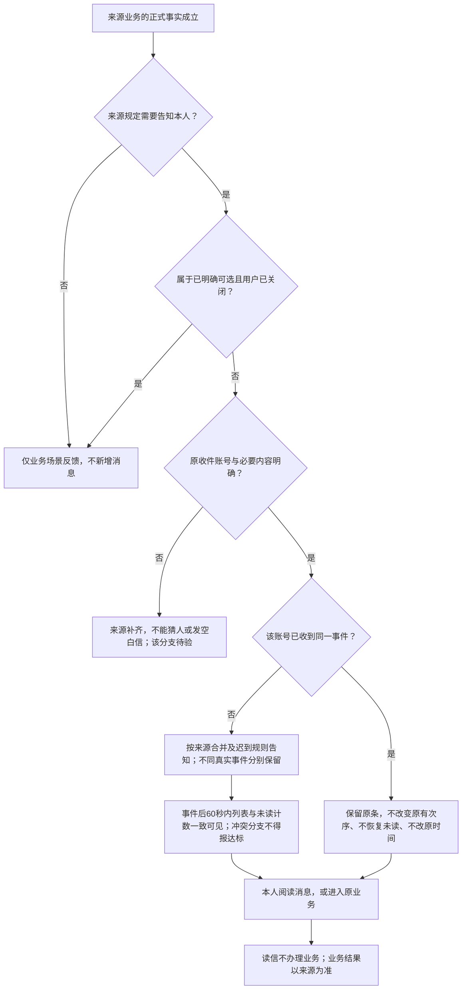
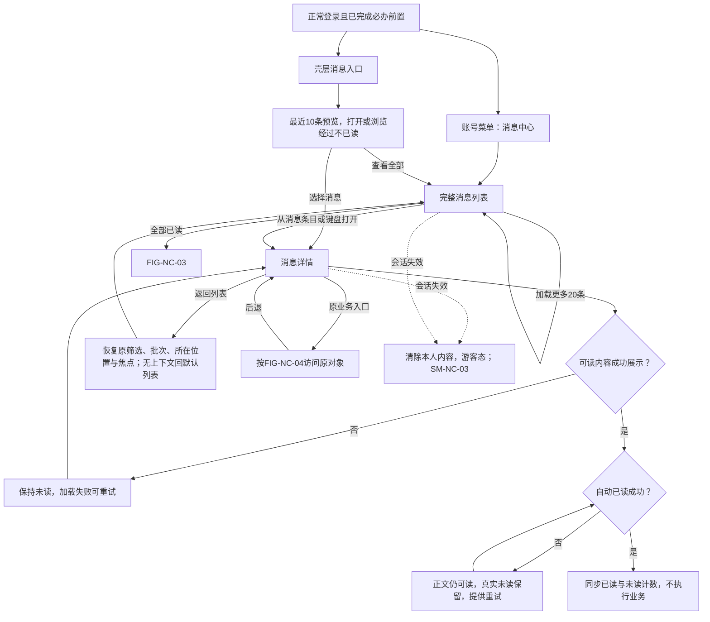
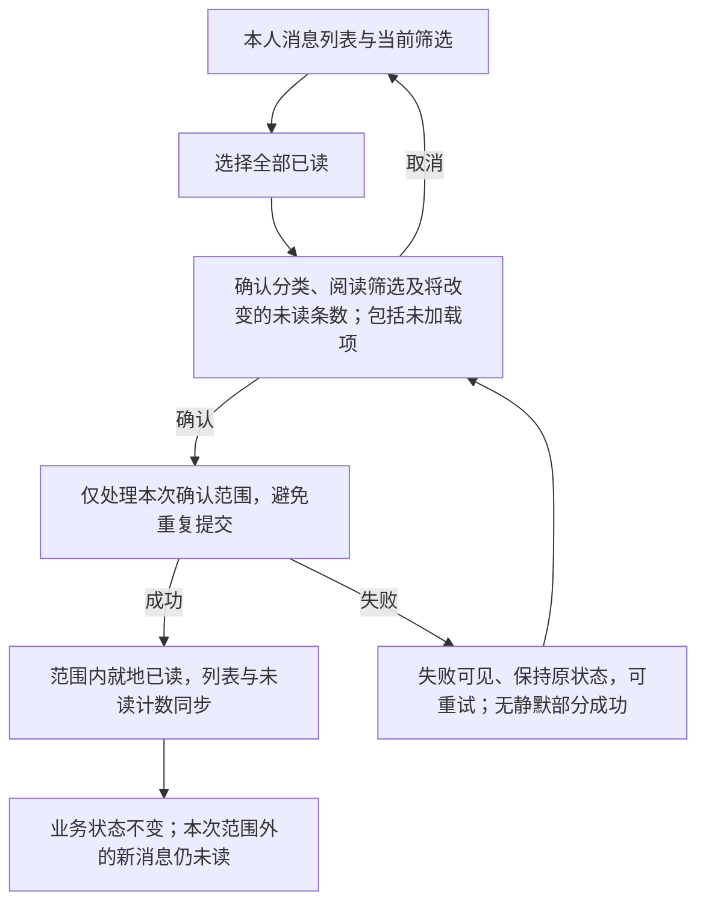
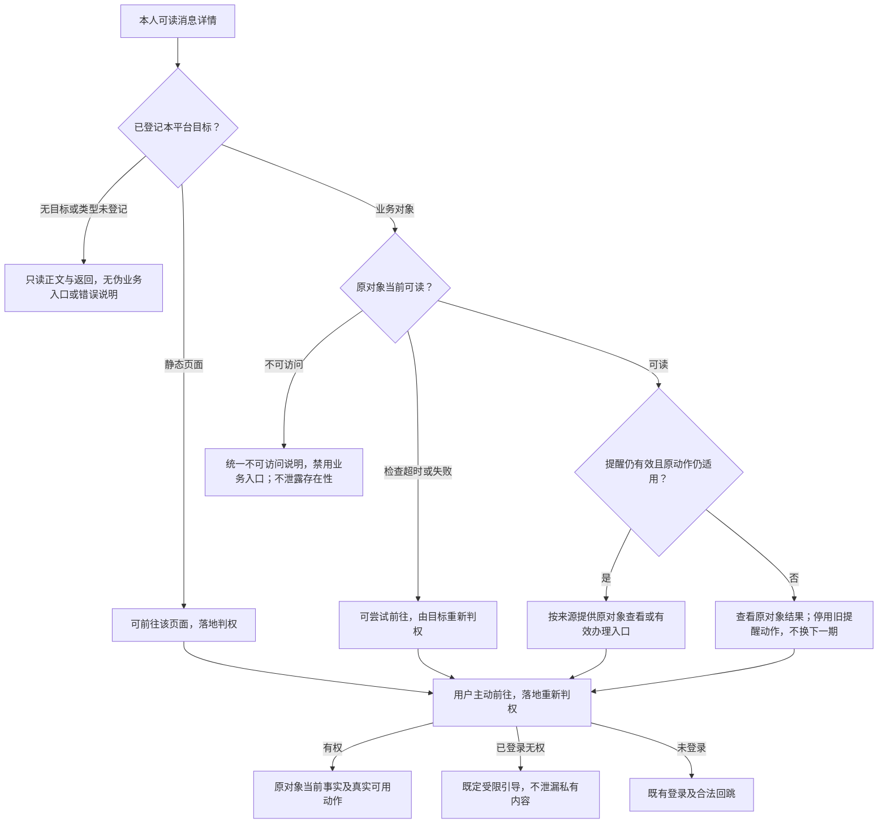
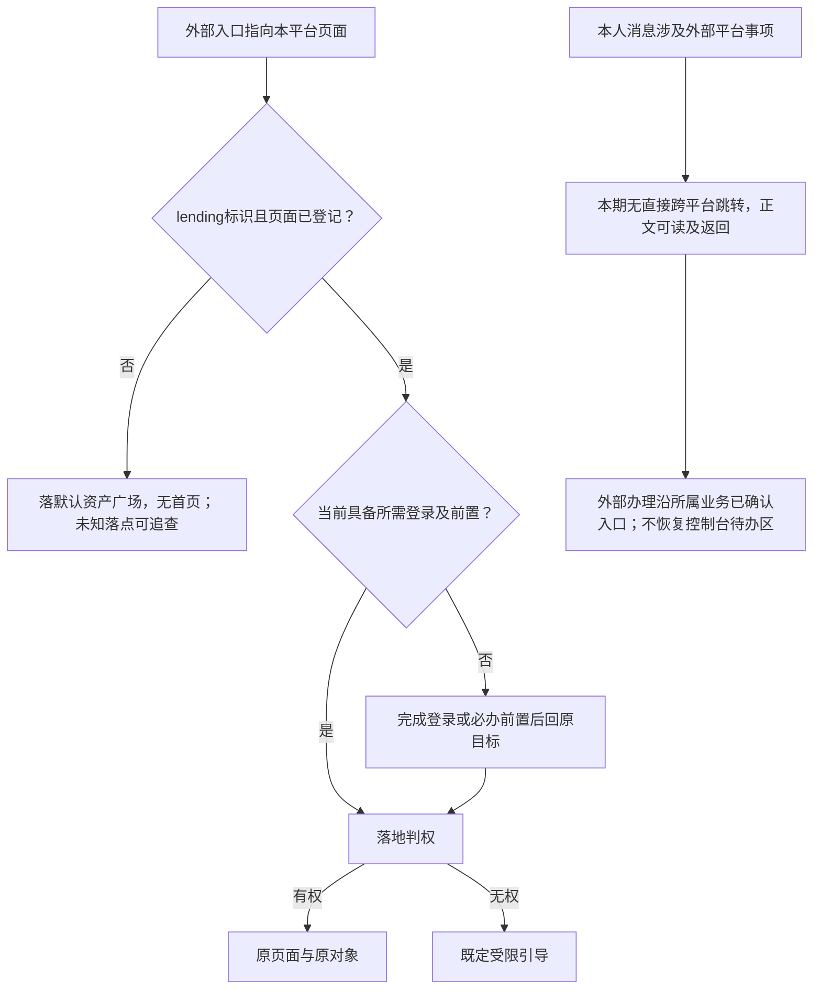
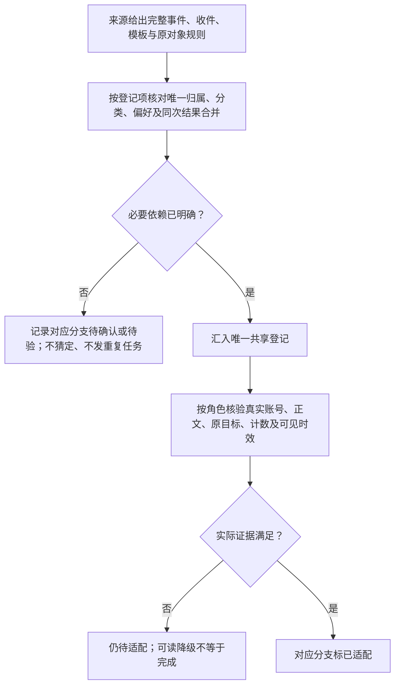
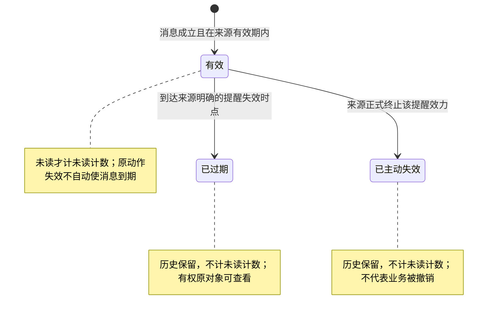
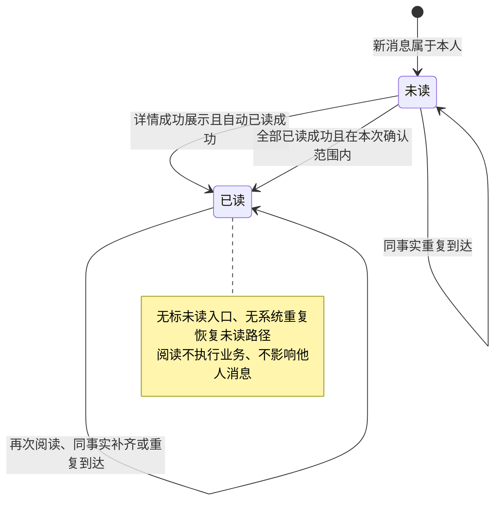
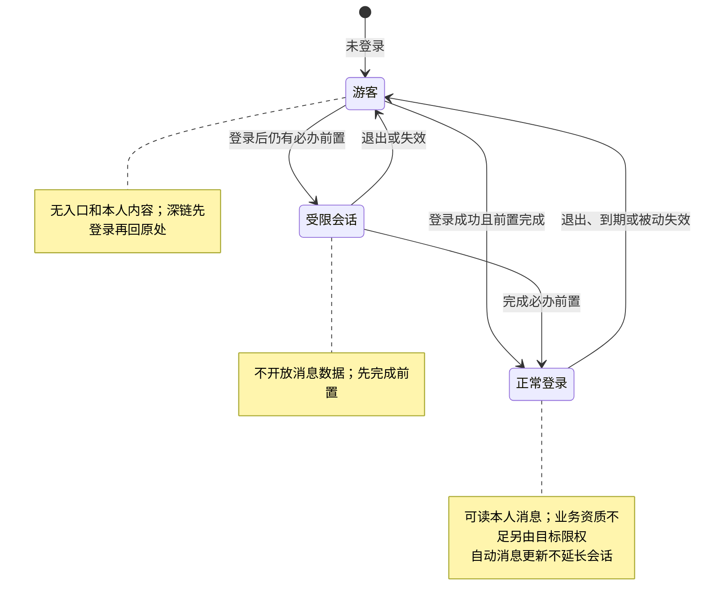

# 面客消息中心 · 流程图与状态机

2026-09-23｜需求评审稿，与[主 PRD](01-面客消息中心-PRD.md)的功能与验收同源。本册只表达业务与阅读状态，不新增发送节点或权限。图中节点是业务环节与信息域，不表示页面或组件，承载形式由设计决定（见[统一条款](01-面客消息中心-PRD.md#design-boundary)）。图中“原对象”始终指消息最初关联的业务及必要期次/动作。

| 图号 | 需求与功能入口 | 含义 |
| --- | --- | --- |
| FIG-NC-01 | F-NC-01～03；[消息池](01-面客消息中心-PRD.md#f-nc-01)、[来源要求](01-面客消息中心-PRD.md#if-nc-01) | 来源到本人阅读，重复不打扰 |
| FIG-NC-02 | F-NC-11～21、27；[入口](01-面客消息中心-PRD.md#f-nc-11)～[详情与已读](01-面客消息中心-PRD.md#f-nc-18) | 完整列表、详情、返回及失败 |
| FIG-NC-03 | F-NC-19；[全部已读](01-面客消息中心-PRD.md#f-nc-19) | 当前筛选全部已读 |
| FIG-NC-04 | F-NC-23～24；[业务目标与可访问性](01-面客消息中心-PRD.md#f-nc-23) | 可办理、可读与不可访问 |
| FIG-NC-05 | F-NC-25～26；[深链行为](01-面客消息中心-PRD.md#f-nc-25) | 本平台两侧深链行为 |
| FIG-NC-06 | F-NC-06、10；[触发登记](01-面客消息中心-PRD.md#f-nc-06) | 来源登记到实际验收 |
| SM-NC-01 | F-NC-24；[未读与消息有效性](01-面客消息中心-PRD.md#f-nc-03) | 消息提醒有效性，独立于业务动作 |
| SM-NC-02 | F-NC-18～19；[阅读与全部已读](01-面客消息中心-PRD.md#f-nc-18) | 单账号对单消息的阅读状态 |
| SM-NC-03 | F-NC-27；[会话与越权](01-面客消息中心-PRD.md#f-nc-27) | 会话与本人内容可达性 |

## FIG-NC-01 来源到本人阅读

关联IF-NC-01～07、D-NC-59。[消息池](01-面客消息中心-PRD.md#f-nc-01)。消息中心不从当前页面状态推导新事件，以下是来源职责与用户可观察结果。

可选清单未明确时不以“关闭全部通知”屏蔽关键通知；强制通知始终接收。消息延迟不回滚业务或顺延期限。

## FIG-NC-02 阅读路径与返回

关联F-NC-11～21、27。[入口与信息域](01-面客消息中心-PRD.md#f-nc-11)。

不提供逐条标为已读的动作；自动已读失败重试只处理阅读结果。业务后退不通过中转自动再进入业务。

## FIG-NC-03 全部已读

关联F-NC-19、D-NC-42。[阅读与全部已读](01-面客消息中心-PRD.md#f-nc-18)。

没有未读时不宣称改变了其他消息；已加载消息不因刚变已读自动消失，重新筛选/刷新再依最新状态匹配。

## FIG-NC-04 原动作与原对象分开判断

关联F-NC-23～24、D-NC-53/55/56/64。[业务目标与可访问性](01-面客消息中心-PRD.md#f-nc-23)。

消息自身过期只终止其提醒效力并退出未读计数，不删除正文，也不取消业务允许的超期办理。本人消息可读不代表目标可读。旧信说当时发生的事实，目标呈现当前事实。

## FIG-NC-05 深链的本平台行为

关联F-NC-25～26、D-NC-34～39/57/58。[深链的本平台行为](01-面客消息中心-PRD.md#f-nc-25)。

## FIG-NC-06 登记与适配

关联F-NC-06、F-NC-10、RG-NC-01～14。[触发登记与来源要求](01-面客消息中心-PRD.md#f-nc-06)。

新业务只扩展来源与共享登记，不追加框架业务章节。本轮核对并不自动完成共享登记或真实投递。

## SM-NC-01 消息提醒有效性

对象是一条消息的提醒效力；与原对象状态、账号阅读状态分开。关联F-NC-24、D-NC-22/23/64。[未读与消息有效性](01-面客消息中心-PRD.md#f-nc-03)。

原对象的可办、可读和不可访问按FIG-NC-04判断，不作为消息提醒状态互相覆盖。没有由重复送达恢复有效的路径。

## SM-NC-02 本人阅读状态

对象为一个收件账号对一条消息。关联F-NC-18～19。[阅读与全部已读](01-面客消息中心-PRD.md#f-nc-18)。

真正新的业务事件产生另一条消息，不能用旧条“已读→未读”代替。消息到期只影响未读计数资格，不改变是否读过的事实。

## SM-NC-03 会话与消息可达性

关联F-NC-27及[会话规则D-NC-26～33](01-面客消息中心-PRD.md#d-nc-26)。[会话、越权保护与异常](01-面客消息中心-PRD.md#f-nc-27)。

失效时入口、预览、列表、正文和未读计数同时清除，迟到结果不重新显示；须真正清除，不能只是遮蔽而数据仍可取得。
