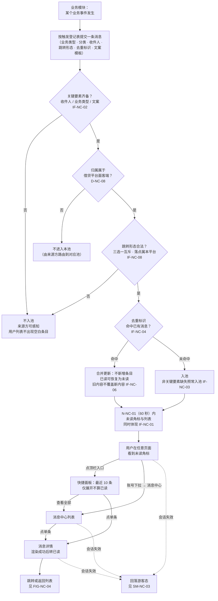
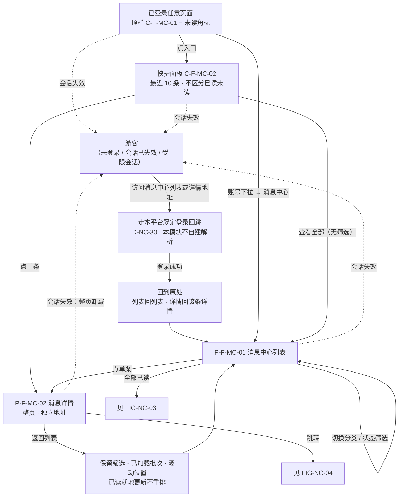
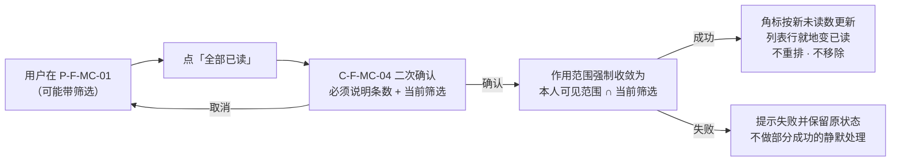
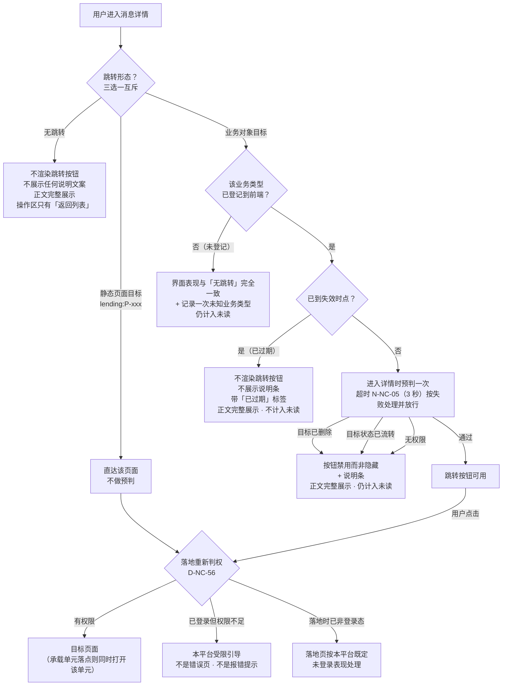
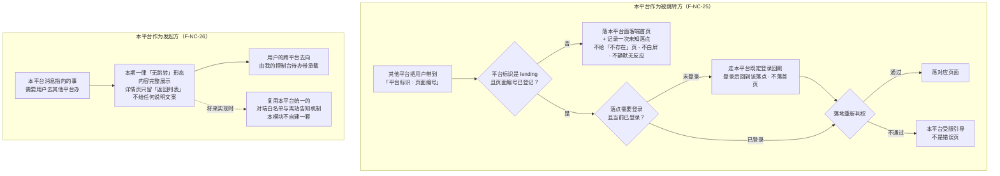
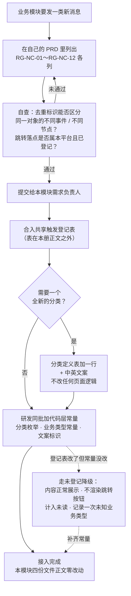
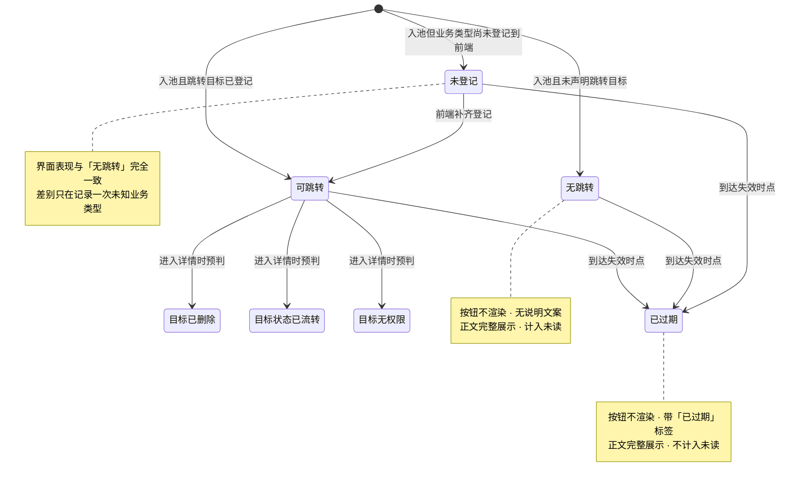
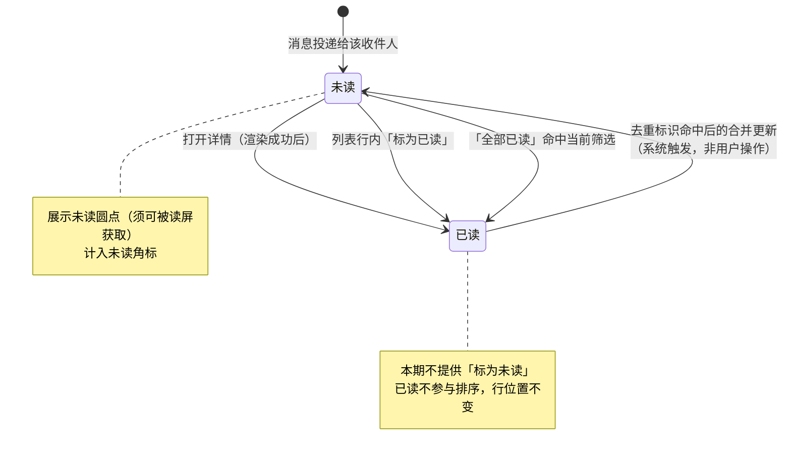
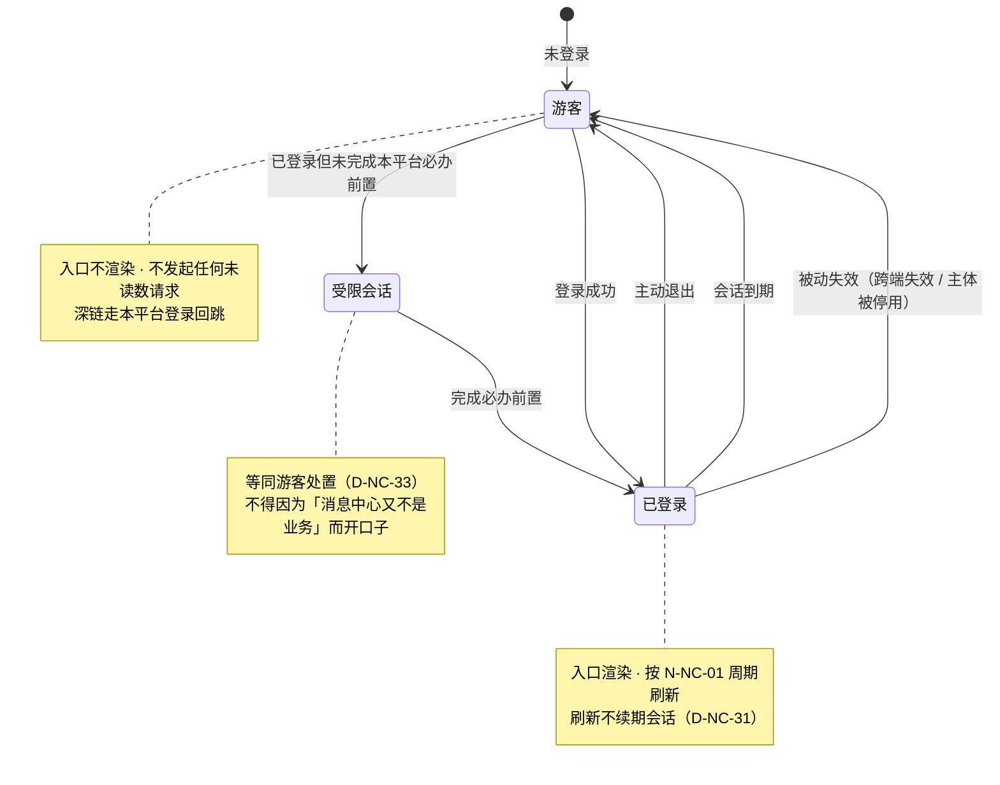

# 面客消息中心 — 流程图与状态机 **V1.0**

> 本文件是《借贷平台 · 面客端 · 面客消息中心 PRD》的图册，**与三册同批交付**，开发与测试共同参考。
> 入口与全文导航见主册 [`v1.0-面客消息中心-PRD.md`](v1.0-面客消息中心-PRD.md)；功能规则见 [`01-功能需求说明.md`](01-功能需求说明.md)；验收见 [`02-验收需求说明.md`](02-验收需求说明.md)。
>
> **本图册的四条纪律**：
>
> 1. **不另造业务口径。** 图只画已在正文中明确的规则；图与正文冲突时**以正文为准**，并按正文修图。
> 2. **只画业务。** 流程图表达业务角色、触发入口、主流程、关键分支与异常出口；**不画报文、不画调用链、不画存储与缓存刷新**。
> 3. **零触发口径。** 图中不出现任何具体业务类型取值、任何具体业务事件、任何一条消息的文案；业务侧一律以「业务模块」「业务事件」表示。
> 4. **双向引用。** 每张图带稳定图号、关联需求编号与回指章节；正文在对应模块直接链接图号。

## 图索引

| 图号 | 图名 | 关联需求 | 正文出处 |
| --- | --- | --- | --- |
| [`FIG-NC-01`](#fig-nc-01) | 消息从产生到被消费 | `F-NC-01`～`F-NC-03`、`IF-NC-01`～`IF-NC-06` | 主册 7、分册 01 第 9 章 |
| [`FIG-NC-02`](#fig-nc-02) | 面客端页面流 | `F-NC-11`～`F-NC-21`、`F-NC-27` | 分册 01 11.1～11.5 |
| [`FIG-NC-03`](#fig-nc-03) | 全部已读 | `F-NC-19` | 分册 01 11.5 |
| [`FIG-NC-04`](#fig-nc-04) | 跳转执行与四类降级 | `F-NC-23`、`F-NC-24` | 分册 01 11.6、11.7 |
| [`FIG-NC-05`](#fig-nc-05) | 跨平台深链中的本平台行为 | `F-NC-25`、`F-NC-26` | 分册 01 第 12 章 |
| [`FIG-NC-06`](#fig-nc-06) | 新业务接入登记 | `F-NC-06`、`F-NC-10` | 分册 01 10.6 |
| [`SM-NC-01`](#sm-nc-01) | 单条消息的可用性状态 | `F-NC-24` | 分册 01 9.4、11.7 |
| [`SM-NC-02`](#sm-nc-02) | 单个收件人对单条消息的已读状态 | `F-NC-18`、`F-NC-19` | 分册 01 11.5 |
| [`SM-NC-03`](#sm-nc-03) | 会话态与消息中心可达性 | `F-NC-27` | 主册 5.5、分册 01 11.1 |

**图例**：实线 = 主流程；虚线 = 被动触发或异常路径；菱形 = 业务判定；`SM-NC-*` 中的 note = 该状态下的界面表现。**三张状态机分属三个不同对象**（一条消息 / 一个收件人对一条消息 / 一个会话），**不混用状态名**。

---

## `FIG-NC-01` 消息从产生到被消费

**关联需求**：`F-NC-01`（承接范围）、`F-NC-02`（可见范围）、`F-NC-03`（未读计数）、`IF-NC-01`～`IF-NC-06`（对来源方的业务要求）
**正文出处**：主册 5.1、5.3、5.7；分册 01 第 9 章

> **两处必须看懂的判定**：
>
> - **`C1` 与 `C3` 的「不入池」是有意的**：一条没有内容、或跳不到合法落点的消息进了列表，用户无法判断发生了什么（`IF-NC-02`、`IF-NC-08`）。**但 `IF-NC-03` 的非关键要素缺失走的是另一条路——照常入池**，丢消息比展示不全严重得多。
> - **`C4` 的合并只按来源方声明的去重标识判定**，本模块**不自行推导**（`IF-NC-05`）。接入方复用同一标识时的覆盖后果由来源方承担。

---

## `FIG-NC-02` 面客端页面流

**关联需求**：`F-NC-11`～`F-NC-21`、`F-NC-27`
**正文出处**：分册 01 11.1～11.5

> **图里刻意没有的三样东西**：① 没有任何「发消息 / 新建通知 / 通知设置」入口（主册 4.2）；② 没有分页器（列表只有「加载更多」，`AC-NC-47`）；③ 快捷面板里没有「全部已读」（范围不一致必然被误解，分册 01 11.2）。
>
> **`RET` 这一步最容易漏**：「加载更多」形态必须记住**已加载到第几批**，否则用户加载了 5 批、点进详情、返回后只剩第 1 批（`AC-NC-58`）。

---

## `FIG-NC-03` 全部已读

**关联需求**：`F-NC-19`
**正文出处**：分册 01 11.5

> **为什么二次确认必须说明筛选**：用户在「未读 + 某分类」筛选下点「全部已读」，若不说明，会以为清掉的是全部消息；反过来在无筛选下点，也可能以为只清掉了眼前这一屏。

---

## `FIG-NC-04` 跳转执行与四类降级

**关联需求**：`F-NC-23`（跳转形态）、`F-NC-24`（失效与降级）
**正文出处**：分册 01 11.6、11.7

> **三条不可削弱的口径**：
>
> 1. **内容一律完整展示。** 失效影响的只是「能不能跳过去」，不影响「能不能读」（`D-NC-55`）。
> 2. **「未登记」与「无跳转」在界面上完全一致**，差别只在是否记录（`D-NC-46`）。
> 3. **跳转按钮不得因为「可能落到无权限」而提前置灰或隐藏**（`AC-NC-72`）。跳转照常发起，落地态由落地页自己表达。

---

## `FIG-NC-05` 跨平台深链中的本平台行为

**关联需求**：`F-NC-25`（被跳转方）、`F-NC-26`（发起方）
**正文出处**：分册 01 第 12 章

> **本图只画本平台侧的行为与结果。** 平台标识如何被解析、谁维护映射，属实现与契约层，**不在本图、不在本册**（`D-NC-39`）。

> **编号形态是本平台侧裁定**：`<平台标识>:<页面编号>`，本平台标识为 `lending`（`D-NC-03`）。**这是提给后续契约册的输入，不被其约束**（`D-NC-05`、`CR-NC-01`）。
>
> **发起方本期落「无跳转」是能力边界，不是缺陷**（`R-NC-02`）。正面写出来，否则会被按不存在的能力验收。

---

## `FIG-NC-06` 新业务接入登记

**关联需求**：`F-NC-06`（登记项与填表规则）、`F-NC-10`（增量接入零改正文）
**正文出处**：分册 01 10.6、10.8

> **整条链路上唯一会改动的是两张共享表与接入方自己的 PRD。** 本模块四份文件正文**零改动**——这是硬性验收 `AC-NC-01`～`AC-NC-06`，做不到即判定本 PRD 结构错误，需返工。
>
> **虚线那条路是预期内的**（`R-NC-06`）：灰度期未登记率不为零，随各接入方登记完成收敛到零，由 `M-NC-03` 跟踪。

---

## `SM-NC-01` 单条消息的可用性状态

**状态对象**：**一条消息**（不是收件人、不是会话）
**关联需求**：`F-NC-24`
**正文出处**：分册 01 9.4、11.7

> **「目标已删除 / 目标状态已流转 / 目标无权限」三态的共同表现**：按钮**禁用而非隐藏** + 说明条 + 正文完整展示 + **计入未读**（分册 01 11.7）。
>
> **「已过期」与另外三类的差别**：过期是消息自身的属性（池中已知），三类失效是**进入详情时的实时判定**——所以过期不计入角标、三类失效计入（`D-NC-22`、`D-NC-23`）。

---

## `SM-NC-02` 单个收件人对单条消息的已读状态

**状态对象**：**一个收件人对一条消息**（与 `SM-NC-01` 的状态名不混用）
**关联需求**：`F-NC-18`、`F-NC-19`
**正文出处**：分册 01 11.5

> **唯一的「已读 → 未读」路径是系统触发的合并更新**，不是用户操作。界面上**不存在「标为未读」入口**（`AC-NC-57`）。
>
> **快捷面板展开、滚动经过都不产生已读**（`AC-NC-40`）。

---

## `SM-NC-03` 会话态与消息中心可达性

**状态对象**：**一个会话**
**关联需求**：`F-NC-27`
**正文出处**：主册 5.5、分册 01 11.1

> **所有失效路径的终点都是「游客」，没有一条通向登录页**（`D-NC-30`）。面客端顶栏在游客态仍然存在，所以消息入口必须被**显式清除**，不能指望页面卸载。
>
> **进入「游客」的瞬间必须同时发生五件事**（分册 01 11.1）：角标从页面移除、入口不再渲染、面板清空收起、停止刷新并中止取数、详情页整页卸载。**不得出现「已回落游客态但入口还在」的中间态**（`AC-NC-76`）。

---

## 维护约定

| 项 | 约定 |
| --- | --- |
| 变更同步 | 需求变更时**同步更新正文、图示与相关验收要求**；交付前核对状态名称、转换条件、角色、分支与编号一致 |
| 冲突处置 | 图与正文冲突时**以正文为准**，并按正文修图，**不在图册里另造口径** |
| 新增图 | 新增流程或状态机时**顺延图号、不回收已用编号**，并在图索引与正文对应章节双向登记 |
| 不做的事 | 不复制正文的大段规则、不写实现细节、不放验收条款全文；**不因接入新业务而改图**——图里没有任何具体业务 |
| 渲染 | 图示语法与链接在交付前已逐张检查；**未实际渲染的不声称渲染验收通过** |
