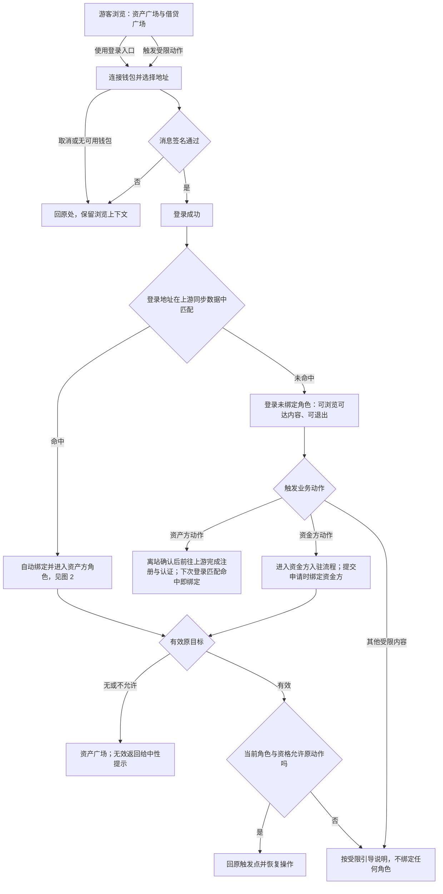
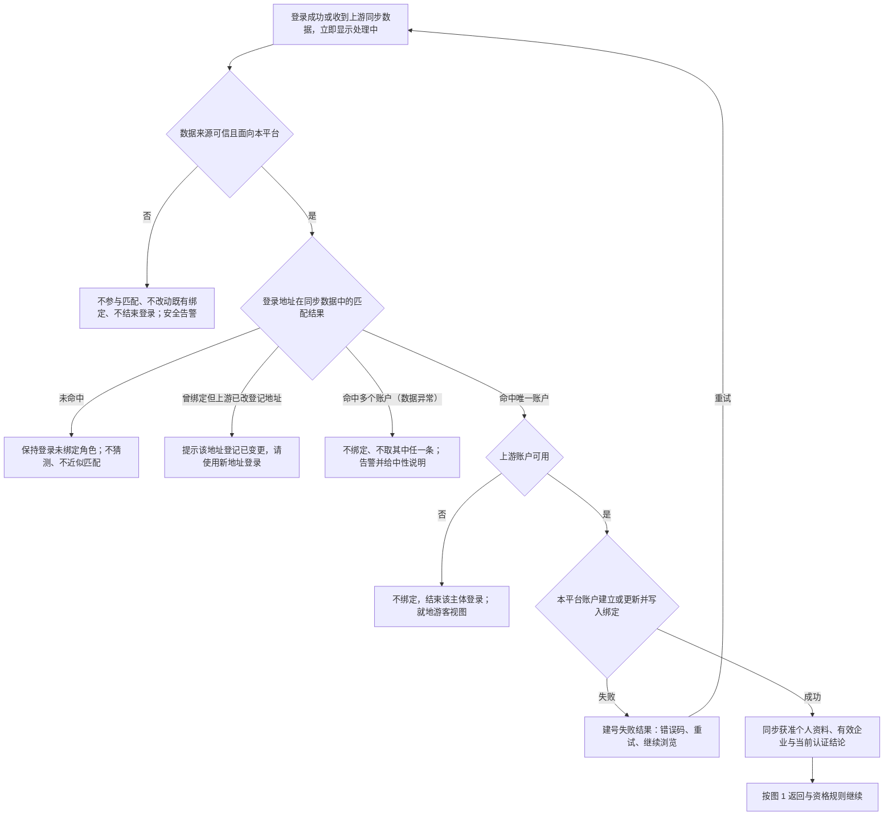
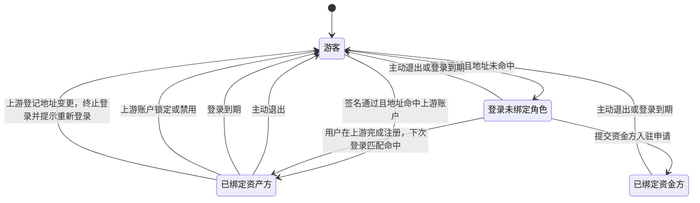
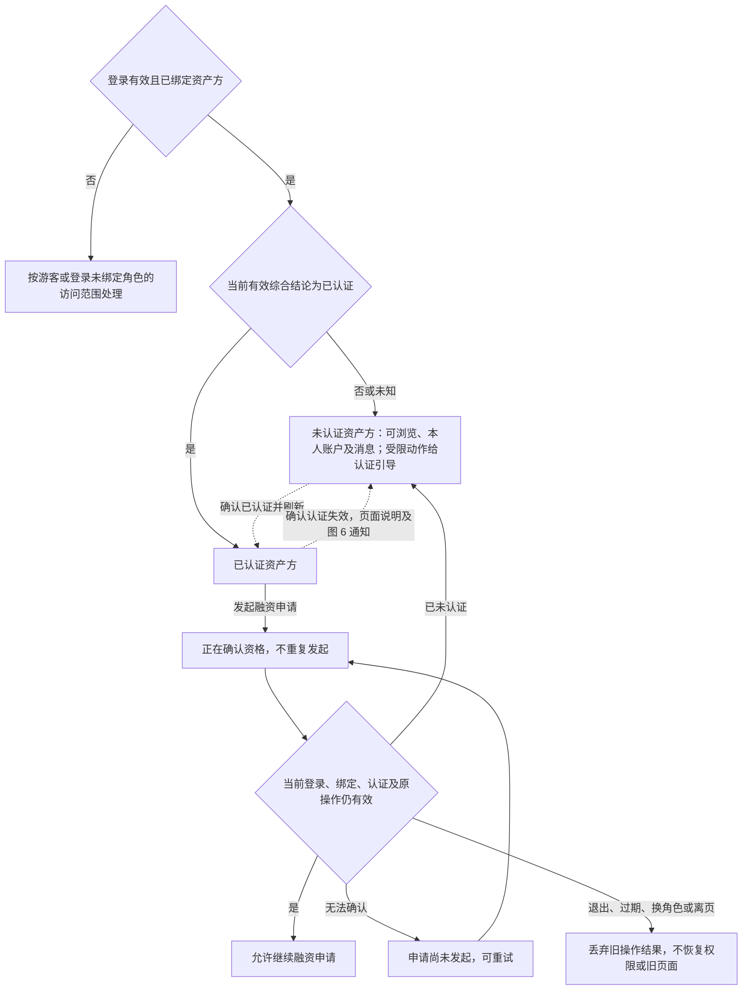
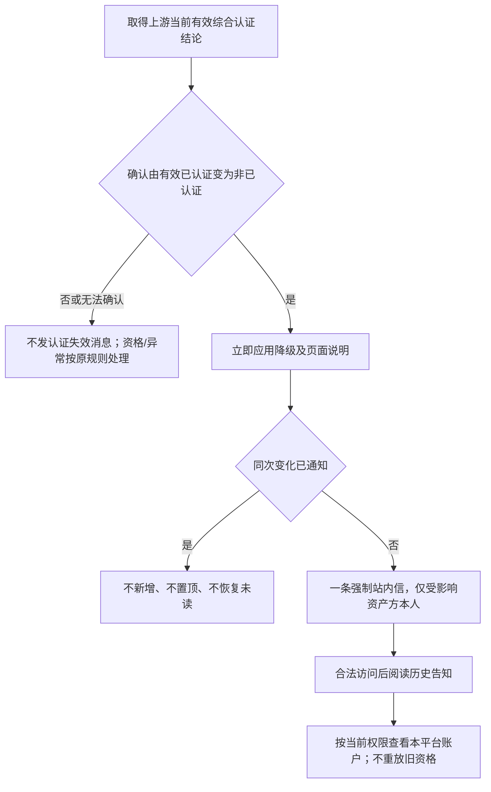
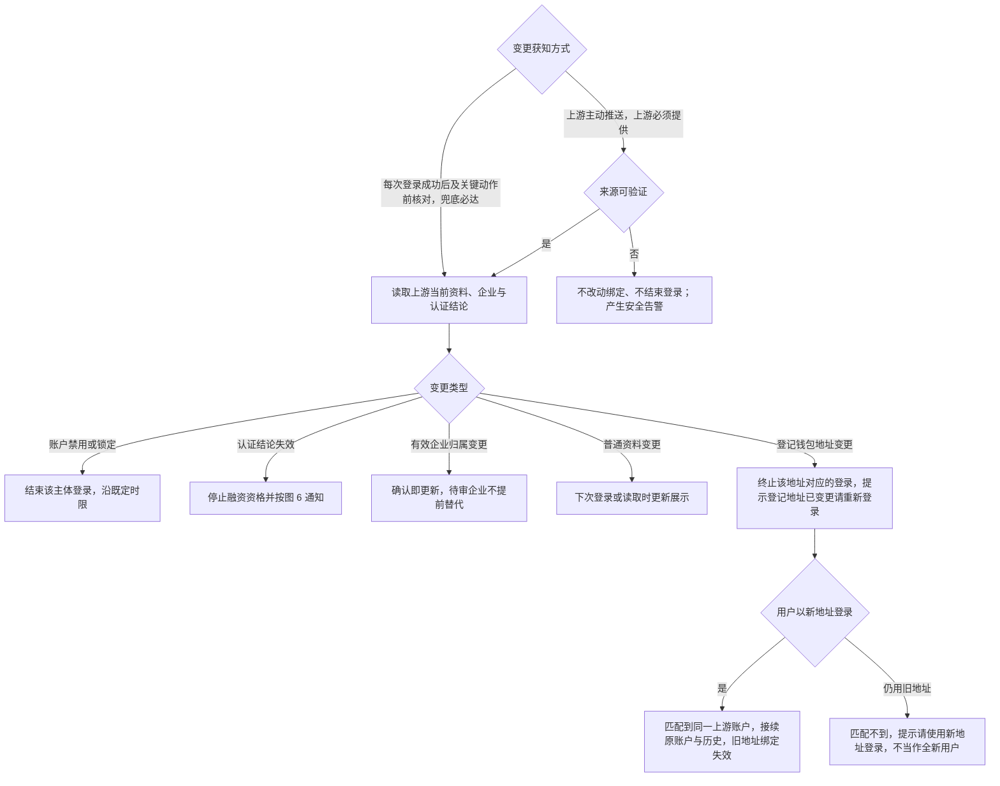

# 登录主干与资产方 SSO 接入 · 流程图与状态机

图仅表达业务流程和状态，**不表达页面布局、组件形态与视觉层级**；承载形式由 Hallmark 设计决定。具体分支、字段与验收统一见[主 PRD](./01-登录主干与资产方SSO接入-PRD.md)。资金方节点仅表示 资金方账户模块的接续边界。

## 图 1 · 从游客浏览到钱包登录、角色匹配与恢复原操作

对应[统一钱包登录入口](./01-登录主干与资产方SSO接入-PRD.md#F-L02)、[登录后的角色匹配](./01-登录主干与资产方SSO接入-PRD.md#F-L34)与[返回](./01-登录主干与资产方SSO接入-PRD.md#F-L04)。

取消登录不执行原业务；未绑定角色不阻断浏览，也不要求用户选择角色；跨平台返回未满足对端确认时按资产广场兜底。

## 图 2 · 上游同步数据、地址匹配与账户建立

对应[同一套匹配判定](./01-登录主干与资产方SSO接入-PRD.md#F-L25)、[来源可信校验](./01-登录主干与资产方SSO接入-PRD.md#F-L20)与[地址匹配](./01-登录主干与资产方SSO接入-PRD.md#F-L35)。本平台直接登录与从上游跳转回来共用此判定。

本期本平台不签任何协议，流程中没有协议同意环节；上游注册时签署的同步授权属上游侧行为。匹配失败不结束已建立的钱包登录。

## 图 3 · 角色与登录状态

对应[登录、角色与认证分别判断](./01-登录主干与资产方SSO接入-PRD.md#state-contract)与[退出与失效](./01-登录主干与资产方SSO接入-PRD.md#F-L27)。角色与认证是两条独立的轴，本图只表达角色与登录。

退出均就地降为游客且解释原因，不自动弹登录；主动退出不退出上游，退出入口全平台唯一。**上游普通退出不结束本平台登录**；上游账户禁用须在 60 秒内结束对应登录。一个地址只绑定一个角色，绑定后不可改选，改用其他地址按全新用户重新匹配。原“钱包待重新确认”状态已停用。

## 图 4 · 认证资格与发起融资

对应[认证更新与发起融资](./01-登录主干与资产方SSO接入-PRD.md#F-L29)。角色绑定先完成；申请审核进度不代替当前有效综合认证。

## 图 5 · 本人资料与偏好

对应[本人账户与企业信息](./01-登录主干与资产方SSO接入-PRD.md#F-L32)。

退出、换账户或离页后，旧资料/操作结果不得恢复旧角色或页面；未成功保存无草稿，已成功值不因离页撤回。资料多少不决定认证资格。

## 图 6 · 认证资格失效站内信

对应[认证资格失效通知](./03-登录主干与资产方SSO接入-消息通知.md#event)。

降级不等待通知成功；持续未认证不催促，恢复后再次真实失效是新事件。资金方和运营人员不接收本模块事件。

## 图 7 · 上游变更同步与登记地址变更处理

对应[上游变更的同步与通知](./01-登录主干与资产方SSO接入-PRD.md#F-L36)。

上游必须承诺并提供主动推送；推送丢失、延迟或不可用时由登录与关键动作前核对兜底并按接入缺口上报。**本期不考虑上游撤回资料可见权限**，该分支不实现。原“标记钱包待重新确认并冻结资金类动作”的处理已停用。
