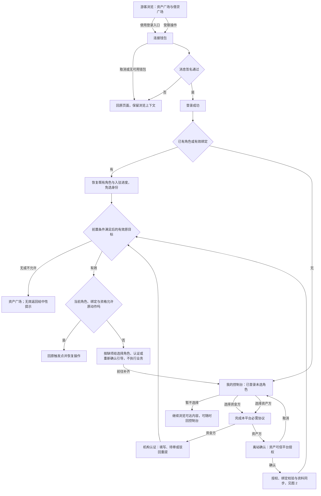
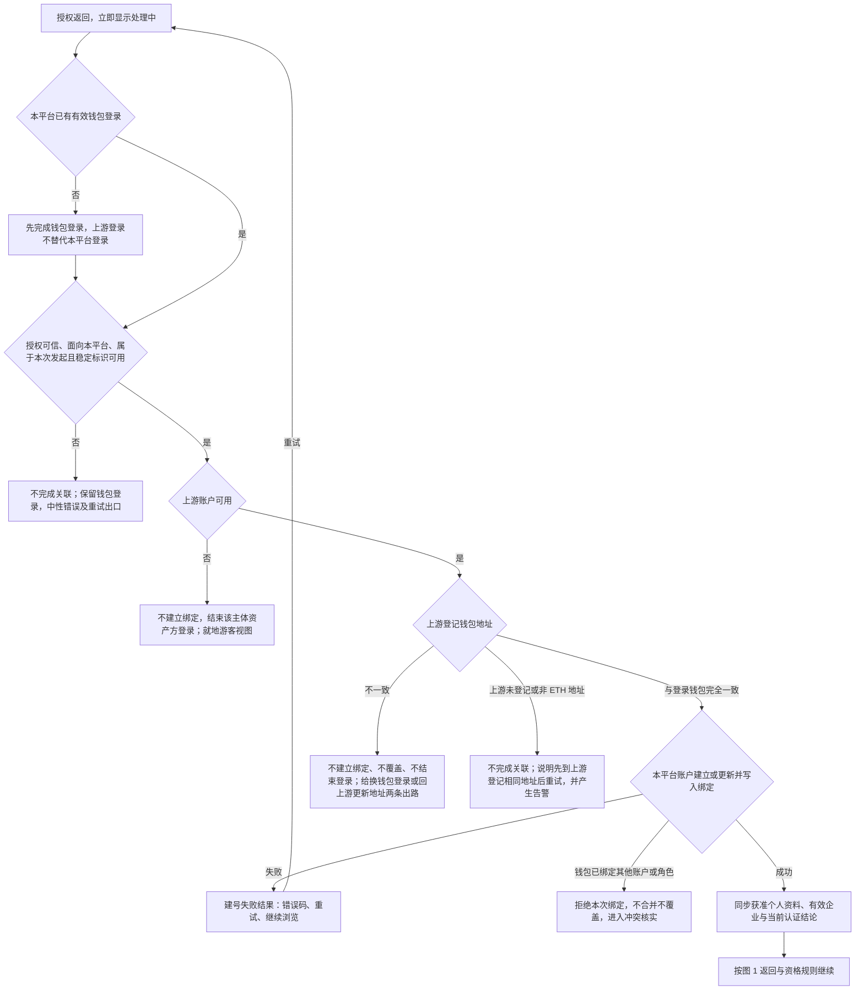
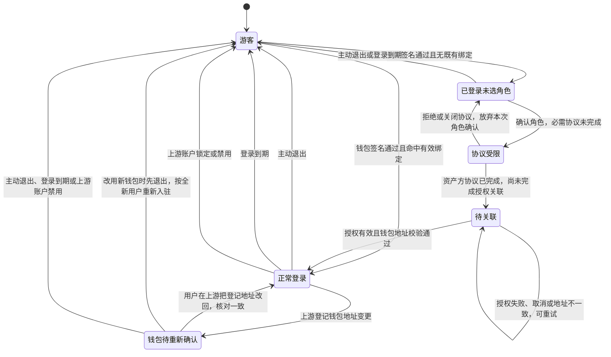
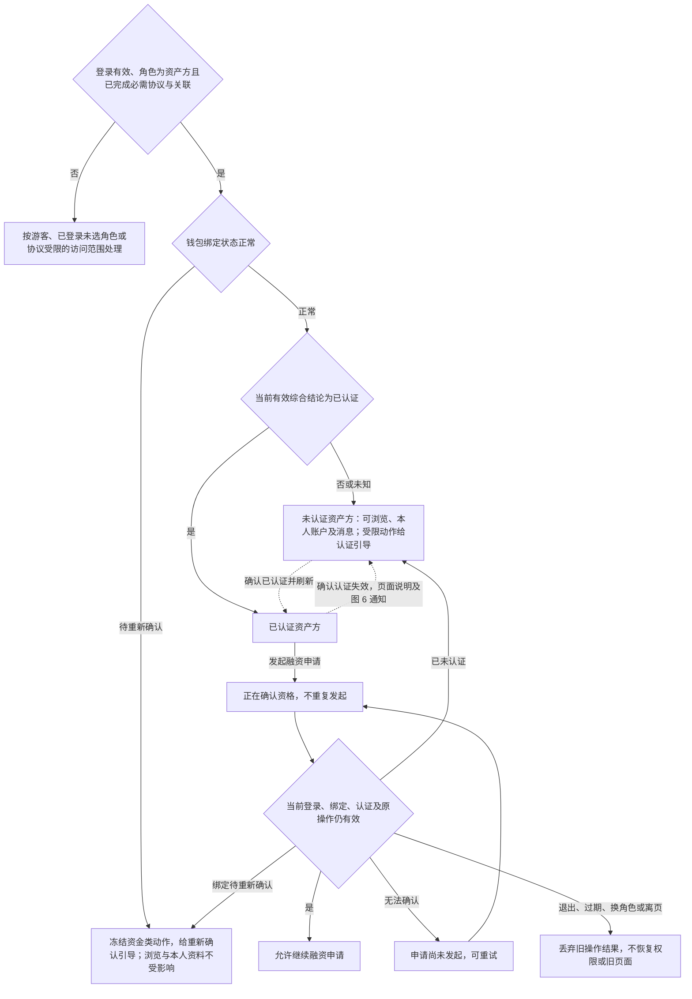
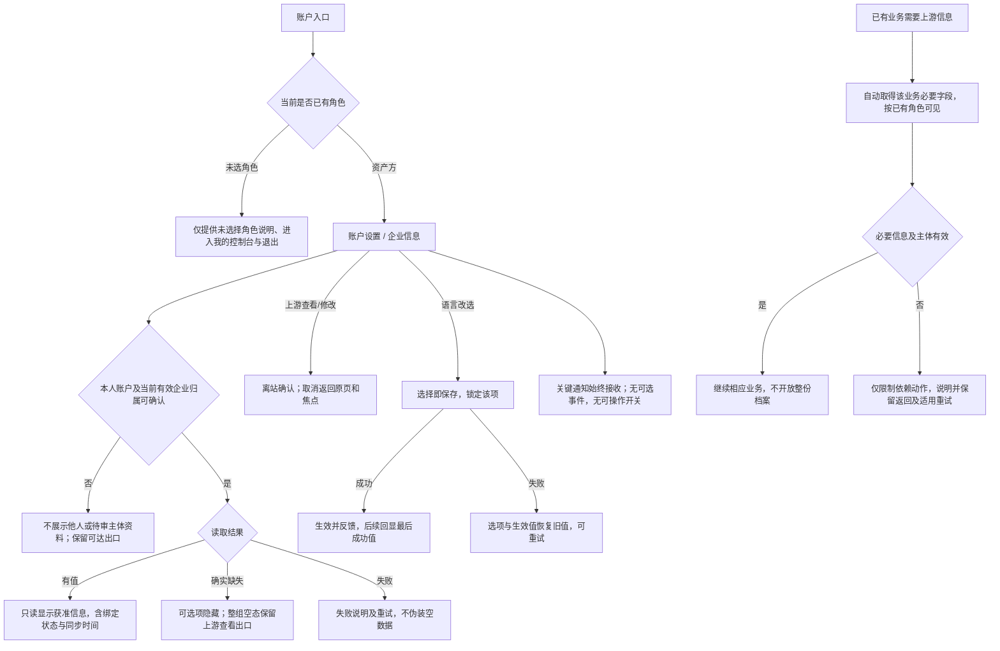
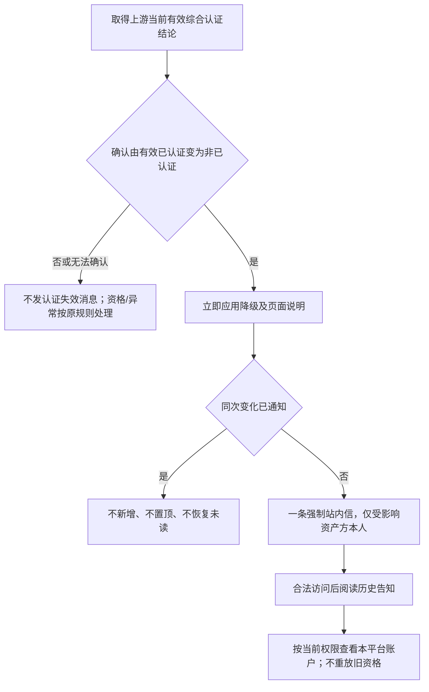
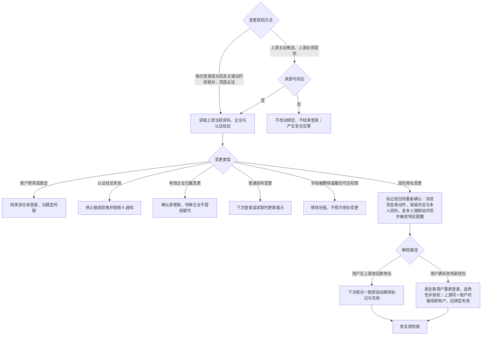

# 登录主干与资产方 SSO 接入 · 流程图与状态机

图仅表达业务流程和状态，**不表达页面布局、组件形态与视觉层级**；承载形式由 Hallmark 设计决定。具体分支、字段与验收统一见[主 PRD](./01-登录主干与资产方SSO接入-PRD.md)。资金方节点仅表示 资金方账户模块的接续边界。

## 图 1 · 从游客浏览到钱包登录、选择角色与恢复原操作

对应[统一钱包登录入口](./01-登录主干与资产方SSO接入-PRD.md#F-L02)、[我的控制台与选择角色](./01-登录主干与资产方SSO接入-PRD.md#F-L34)与[返回](./01-登录主干与资产方SSO接入-PRD.md#F-L04)。

取消登录不执行原业务；未选角色不阻断浏览；跨平台返回未满足对端确认时按资产广场兜底，不阻止本身符合条件的关联授权。

## 图 2 · 授权、钱包绑定校验与必需协议

对应[关联流程](./01-登录主干与资产方SSO接入-PRD.md#F-L25)、[一致性校验](./01-登录主干与资产方SSO接入-PRD.md#F-L35)与[必需协议](./01-登录主干与资产方SSO接入-PRD.md#F-L26)。控制台发起与上游发起共用此流程。

必需协议在控制台**确认角色**时完成，早于本图；上游侧协议不替代本平台必需协议，钱包签名也不视为协议同意。**上游必须登记与登录钱包完全一致的地址才能完成关联**，缺失、非支持链或不一致都不放行。普通授权失败不结束已建立的钱包登录，也不影响无关的有效绑定。

## 图 3 · 资产方登录、角色与绑定状态

对应[登录、角色与认证分别判断](./01-登录主干与资产方SSO接入-PRD.md#state-contract)与[退出与失效](./01-登录主干与资产方SSO接入-PRD.md#F-L27)。

退出均就地降为游客且解释原因，不自动弹登录；主动退出不退出上游，主动退出只有全平台唯一一个入口。**上游普通退出不结束本平台钱包登录**；上游账户禁用须在 60 秒内结束对应登录，含告知失败兜底。钱包待重新确认不结束登录，只冻结资金类动作并触发常驻提醒。一个钱包只绑定一个角色，改用其他钱包按全新用户重新入驻。

## 图 4 · 认证资格与发起融资

对应[认证更新与发起融资](./01-登录主干与资产方SSO接入-PRD.md#F-L29)。必需协议与关联绑定先完成；申请审核进度不代替当前有效综合认证。

## 图 5 · 本人资料与偏好

对应[本人账户与企业信息](./01-登录主干与资产方SSO接入-PRD.md#F-L32)。

退出、换账户或离页后，旧资料/操作结果不得恢复旧角色或页面；未成功保存无草稿，已成功值不因离页撤回。资料多少不决定认证资格。

## 图 6 · 认证资格失效站内信

对应[认证资格失效通知](./03-登录主干与资产方SSO接入-消息通知.md#event)。

降级不等待通知成功；持续未认证不催促，恢复后再次真实失效是新事件。资金方和运营人员不接收本模块事件。

## 图 7 · 上游变更同步与钱包地址变更处理

对应[上游变更的同步与通知](./01-登录主干与资产方SSO接入-PRD.md#F-L36)与[钱包绑定待重新确认通知](./03-登录主干与资产方SSO接入-消息通知.md#event-wallet)。

上游必须承诺并提供主动推送；推送丢失、延迟或不可用时由登录与关键动作前核对兜底并按接入缺口上报，不能以“等下一次用户访问”充当及时性承诺。推送的具体时限随接入确认后补入，确认前不写入秒级时限。
