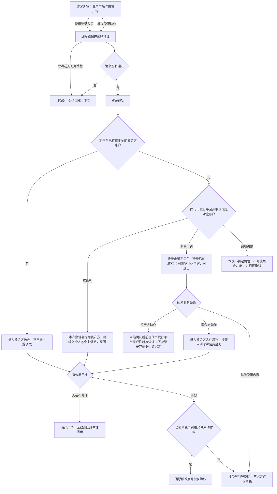
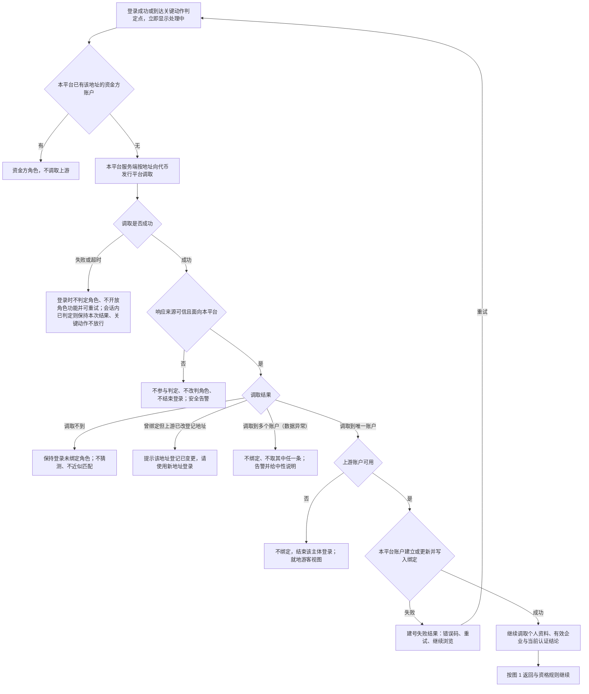
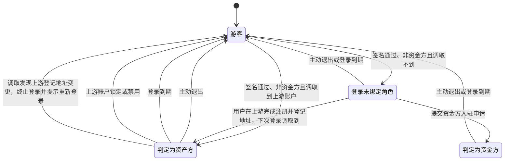
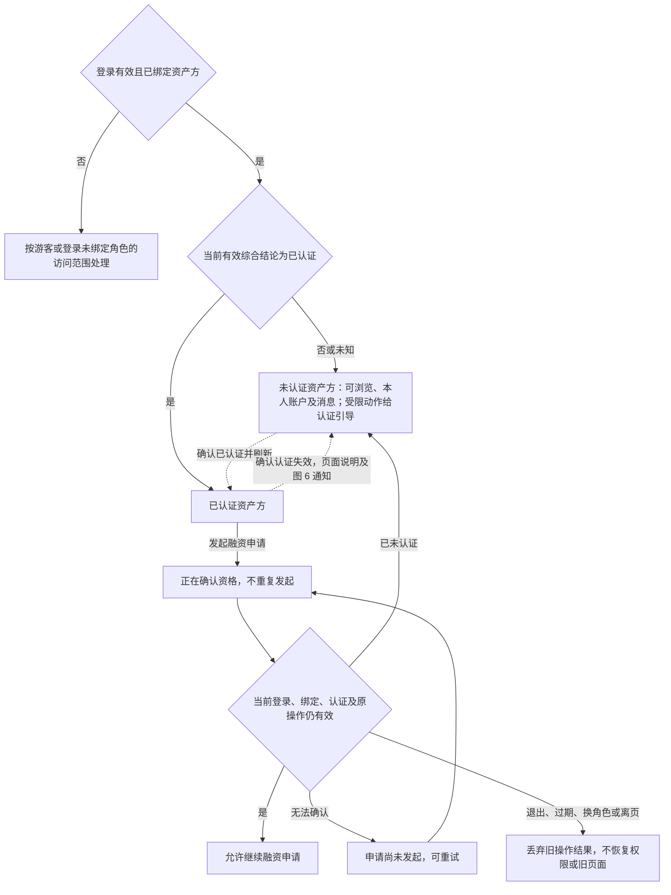
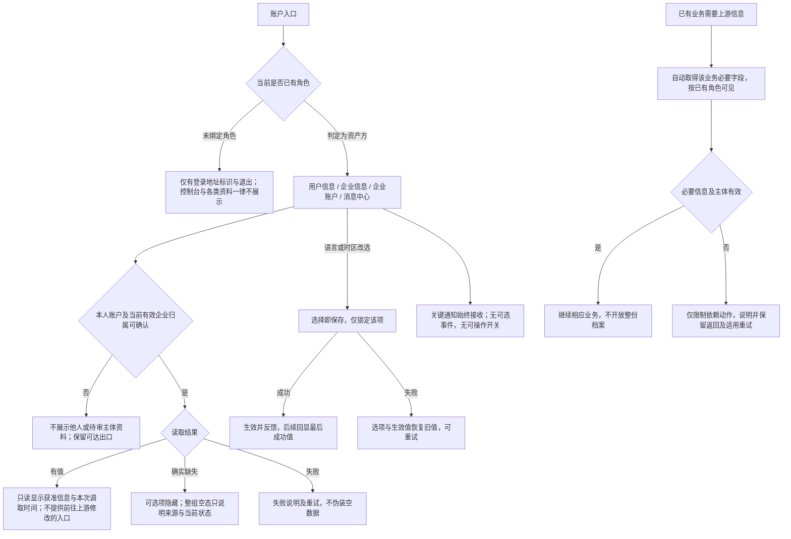
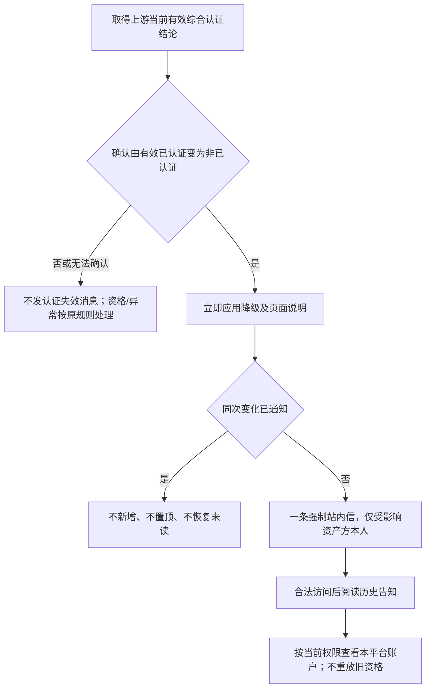
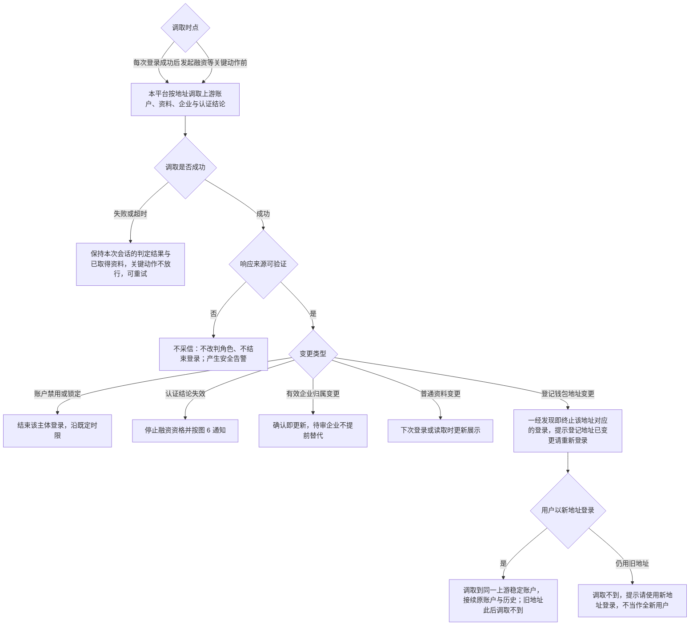

# 登录主干与资产方 SSO 接入 · 流程图与状态机

图仅表达业务流程和状态，**不表达页面布局、组件形态与视觉层级**；承载形式由 Hallmark 设计决定。图中“上游”统一指代币发行平台（用户注册认证与个人、企业信息的来源）。具体分支、字段与验收统一见[主 PRD](./01-登录主干与资产方SSO接入-PRD.md)。资金方节点仅表示 资金方账户模块的接续边界。

## 图 1 · 从游客浏览到钱包登录、角色判定与恢复原操作

对应[统一钱包登录入口](./01-登录主干与资产方SSO接入-PRD.md#F-L02)、[登录后的角色匹配](./01-登录主干与资产方SSO接入-PRD.md#F-L34)与[返回](./01-登录主干与资产方SSO接入-PRD.md#F-L04)。

```mermaid
flowchart TD
    G["游客浏览：资产广场与借贷广场"] -->|使用登录入口| W["连接钱包并选择地址"]
    G -->|触发受限动作| W
    W -->|取消或无可用钱包| O["回原处，保留浏览上下文"]
    W --> S{"消息签名通过"}
    S -->|否| O
    S -->|是| IN["登录成功"]
    IN --> F{"本平台已有该地址的资金方账户"}
    F -->|有| FUNDER["进入资金方角色，不再向上游调取"]
    F -->|无| PULL{"向代币发行平台调取该地址对应账户"}
    PULL -->|调取到| ASSET["本次会话判定为资产方，继续取个人与企业信息，见图 2"]
    PULL -->|调取不到| NONE["登录未绑定角色（登录后的游客）：可浏览可达内容、可退出"]
    PULL -->|调取失败| KEEP["本次不判定角色、不开放角色功能，说明可重试"]
    NONE --> ACT{"触发业务动作"}
    ACT -->|资产方动作| UP["离站确认后前往代币发行平台完成注册与认证；下次登录匹配命中即绑定"]
    ACT -->|资金方动作| FUND["进入资金方入驻流程；提交申请时绑定资金方"]
    ACT -->|其他受限内容| GUIDE["按受限引导说明，不绑定任何角色"]
    ASSET --> NEXT{"有效原目标"}
    FUNDER --> NEXT
    FUND --> NEXT
    NEXT -->|无或不允许| PLAZA["资产广场；无效返回给中性提示"]
    NEXT -->|有效| Q{"当前角色与资格允许原动作吗"}
    Q -->|是| BACK["回原触发点并恢复操作"]
    Q -->|否| GUIDE
```

取消登录不执行原业务；未绑定角色不阻断浏览，也不要求用户选择角色；跨平台返回未满足对端确认时按资产广场兜底。判定顺序固定为先查本平台资金方、再向代币发行平台调取，**本期不接收上游主动推送**；**本平台不保存绑定关系，每次登录都重新判定**，一个地址只对应一个角色。

## 图 2 · 上游信息调取、角色判定与账户建立

对应[同一套判定](./01-登录主干与资产方SSO接入-PRD.md#F-L25)、[调取与来源校验](./01-登录主干与资产方SSO接入-PRD.md#F-L20)与[调取结果](./01-登录主干与资产方SSO接入-PRD.md#F-L35)。本平台直接登录与从上游跳转回来共用此判定。

```mermaid
flowchart TD
    START["登录成功或到达关键动作判定点，立即显示处理中"] --> FUND{"本平台已有该地址的资金方账户"}
    FUND -->|有| ROLEF["资金方角色，不调取上游"]
    FUND -->|无| CALL["本平台服务端按地址向代币发行平台调取"]
    CALL --> OK{"调取是否成功"}
    OK -->|失败或超时| KEEP["登录时不判定角色、不开放角色功能并可重试；会话内已判定则保持本次结果、关键动作不放行"]
    OK -->|成功| SRC{"响应来源可信且面向本平台"}
    SRC -->|否| ALERT["不参与判定、不改判角色、不结束登录；安全告警"]
    SRC -->|是| MATCH{"调取结果"}
    MATCH -->|调取不到| NONE["保持登录未绑定角色；不猜测、不近似匹配"]
    MATCH -->|曾绑定但上游已改登记地址| OLD["提示该地址登记已变更，请使用新地址登录"]
    MATCH -->|调取到多个账户（数据异常）| CONFLICT["不绑定、不取其中任一条；告警并给中性说明"]
    MATCH -->|调取到唯一账户| ACTIVE{"上游账户可用"}
    ACTIVE -->|否| BLOCK["不绑定，结束该主体登录；就地游客视图"]
    ACTIVE -->|是| BIND{"本平台账户建立或更新并写入绑定"}
    BIND -->|失败| ERROR["建号失败结果：错误码、重试、继续浏览"]
    BIND -->|成功| SYNC["继续调取个人资料、有效企业与当前认证结论"]
    SYNC --> LAND["按图 1 返回与资格规则继续"]
    ERROR -->|重试| START
```

本期本平台不签任何协议，流程中没有协议同意环节；上游注册时签署的同步授权属上游侧行为。判定或调取失败都不结束已建立的钱包登录。

## 图 3 · 角色与登录状态

对应[登录、角色与认证分别判断](./01-登录主干与资产方SSO接入-PRD.md#state-contract)与[退出与失效](./01-登录主干与资产方SSO接入-PRD.md#F-L27)。角色与认证是两条独立的轴，本图只表达角色与登录。

```mermaid
stateDiagram-v2
    [*] --> 游客
    游客 --> 登录未绑定角色: 签名通过、非资金方且调取不到
    游客 --> 判定为资产方: 签名通过、非资金方且调取到上游账户
    登录未绑定角色 --> 判定为资产方: 用户在上游完成注册并登记地址，下次登录调取到
    登录未绑定角色 --> 判定为资金方: 提交资金方入驻申请
    登录未绑定角色 --> 游客: 主动退出或登录到期
    判定为资产方 --> 游客: 主动退出
    判定为资产方 --> 游客: 登录到期
    判定为资产方 --> 游客: 上游账户锁定或禁用
    判定为资产方 --> 游客: 调取发现上游登记地址变更，终止登录并提示重新登录
    判定为资金方 --> 游客: 主动退出或登录到期
```

退出均就地降为游客且解释原因，不自动弹登录；主动退出不退出上游，退出入口全平台唯一。**上游普通退出不结束本平台登录**；上游账户禁用须在 60 秒内结束对应登录。一个地址只对应一个角色且**禁止并存**；本次判定出的角色不可由用户改选，改用其他地址按全新用户重新判定。图中状态是本次会话的判定结果，不是账户上保存的绑定。原“钱包待重新确认”状态已停用。

## 图 4 · 认证资格与发起融资

对应[认证更新与发起融资](./01-登录主干与资产方SSO接入-PRD.md#F-L29)。角色绑定先完成；申请审核进度不代替当前有效综合认证。

```mermaid
flowchart TD
    S{"登录有效且已绑定资产方"} -->|否| OUT["按游客或登录未绑定角色的访问范围处理"]
    S -->|是| V{"当前有效综合结论为已认证"}
    V -->|否或未知| UNVERIFIED["未认证资产方：可浏览、本人账户及消息；受限动作给认证引导"]
    V -->|是| VERIFIED["已认证资产方"]
    UNVERIFIED -.->|确认已认证并刷新| VERIFIED
    VERIFIED -.->|确认认证失效，页面说明及图 6 通知| UNVERIFIED
    VERIFIED -->|发起融资申请| WAIT["正在确认资格，不重复发起"]
    WAIT --> CHECK{"当前登录、绑定、认证及原操作仍有效"}
    CHECK -->|是| GO["允许继续融资申请"]
    CHECK -->|已未认证| UNVERIFIED
    CHECK -->|无法确认| RETRY["申请尚未发起，可重试"]
    RETRY --> WAIT
    CHECK -->|退出、过期、换角色或离页| STOP["丢弃旧操作结果，不恢复权限或旧页面"]
```

## 图 5 · 本人资料与偏好

对应[本人账户与企业信息](./01-登录主干与资产方SSO接入-PRD.md#F-L32)。

```mermaid
flowchart TD
    MENU["账户入口"] --> ROLE{"当前是否已有角色"}
    ROLE -->|未绑定角色| ONLY["仅有登录地址标识与退出；控制台与各类资料一律不展示"]
    ROLE -->|判定为资产方| P["用户信息 / 企业信息 / 企业账户 / 消息中心"]
    P --> OWNER{"本人账户及当前有效企业归属可确认"}
    OWNER -->|否| DENY["不展示他人或待审主体资料；保留可达出口"]
    OWNER -->|是| LOAD{"读取结果"}
    LOAD -->|有值| SHOW["只读显示获准信息与本次调取时间；不提供前往上游修改的入口"]
    LOAD -->|确实缺失| EMPTY["可选项隐藏；整组空态只说明来源与当前状态"]
    LOAD -->|失败| FAIL["失败说明及重试，不伪装空数据"]
    P -->|语言或时区改选| SAVE["选择即保存，仅锁定该项"]
    SAVE -->|成功| OK["生效并反馈，后续回显最后成功值"]
    SAVE -->|失败| ROLLBACK["选项与生效值恢复旧值，可重试"]
    P --> NOTICE["关键通知始终接收；无可选事件，无可操作开关"]
    B["已有业务需要上游信息"] --> AUTO["自动取得该业务必要字段，按已有角色可见"]
    AUTO --> NEED{"必要信息及主体有效"}
    NEED -->|是| USE["继续相应业务，不开放整份档案"]
    NEED -->|否| LIMIT["仅限制依赖动作，说明并保留返回及适用重试"]
```

退出、换账户或离页后，旧资料/操作结果不得恢复旧角色或页面；未成功保存无草稿，已成功值不因离页撤回。资料多少不决定认证资格。偏好含语言与时区两项，取值与生效规则见[主 PRD 的偏好设置](./01-登录主干与资产方SSO接入-PRD.md#language-save)；时区只影响时间展示，不改变业务时间与先后。图中第三项按资产方侧展示名“企业账户”，资金方侧显示“机构账户”，字段与模块口径统一为企业账户，见[账户菜单](./01-登录主干与资产方SSO接入-PRD.md#account-menu)。企业账户的维护动作与字段不在本图，见[企业账户 PRD](../v1.0-企业账户/01-企业账户-PRD.md)；在企业账户登记收款地址所发起的一次性签名不是登录，见[主 PRD 的例外说明](./01-登录主干与资产方SSO接入-PRD.md#ownership-signature)。

## 图 6 · 认证资格失效站内信

对应[认证资格失效通知](./03-登录主干与资产方SSO接入-消息通知.md#event)。

```mermaid
flowchart TD
    V["取得上游当前有效综合认证结论"] --> CHANGE{"确认由有效已认证变为非已认证"}
    CHANGE -->|否或无法确认| NONE["不发认证失效消息；资格/异常按原规则处理"]
    CHANGE -->|是| APPLY["立即应用降级及页面说明"]
    APPLY --> SAME{"同次变化已通知"}
    SAME -->|是| KEEP["不新增、不置顶、不恢复未读"]
    SAME -->|否| SEND["一条强制站内信，仅受影响资产方本人"]
    SEND --> READ["合法访问后阅读历史告知"]
    READ --> TARGET["按当前权限查看本平台账户；不重放旧资格"]
```

降级不等待通知成功；持续未认证不催促，恢复后再次真实失效是新事件。资金方和运营人员不接收本模块事件。

## 图 7 · 上游信息调取与登记地址变更处理

对应[上游变更的同步与通知](./01-登录主干与资产方SSO接入-PRD.md#F-L36)。

```mermaid
flowchart TD
    SRC{"调取时点"} -->|每次登录成功后| READ["本平台按地址调取上游账户、资料、企业与认证结论"]
    SRC -->|发起融资等关键动作前| READ
    READ --> OK{"调取是否成功"}
    OK -->|失败或超时| KEEP["保持本次会话的判定结果与已取得资料，关键动作不放行，可重试"]
    OK -->|成功| VERIFY{"响应来源可验证"}
    VERIFY -->|否| ALERT["不采信：不改判角色、不结束登录；产生安全告警"]
    VERIFY -->|是| KIND{"变更类型"}
    KIND -->|账户禁用或锁定| END["结束该主体登录，沿既定时限"]
    KIND -->|认证结论失效| DOWN["停止融资资格并按图 6 通知"]
    KIND -->|有效企业归属变更| ORG["确认即更新，待审企业不提前替代"]
    KIND -->|普通资料变更| MINOR["下次登录或读取时更新展示"]
    KIND -->|登记钱包地址变更| STOP["一经发现即终止该地址对应的登录，提示登记地址已变更请重新登录"]
    STOP --> RELOGIN{"用户以新地址登录"}
    RELOGIN -->|是| SAME["调取到同一上游稳定账户，接续原账户与历史；旧地址此后调取不到"]
    RELOGIN -->|仍用旧地址| TELL["调取不到，提示请使用新地址登录，不当作全新用户"]
```

**本期由本平台主动调取，不接收上游主动推送**：变更（含登记地址变更）都在下一次调取（登录成功后或关键动作前）被发现并应用，不承诺秒级同步；调取失败不改判本次会话的角色、不放行关键动作，重复失败按接入缺口上报。**本期不考虑上游撤回资料可见权限**，该分支不实现。原“标记钱包待重新确认并冻结资金类动作”的处理已停用。
