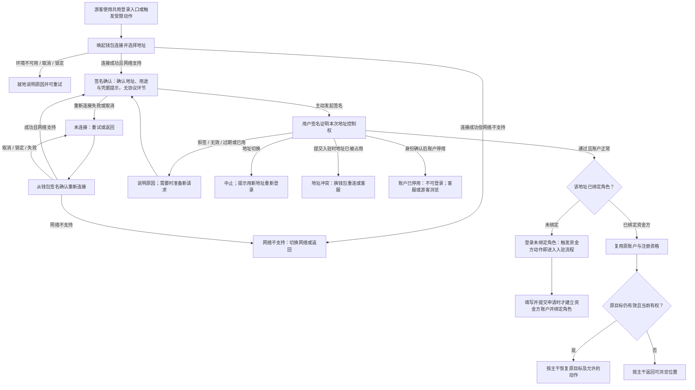
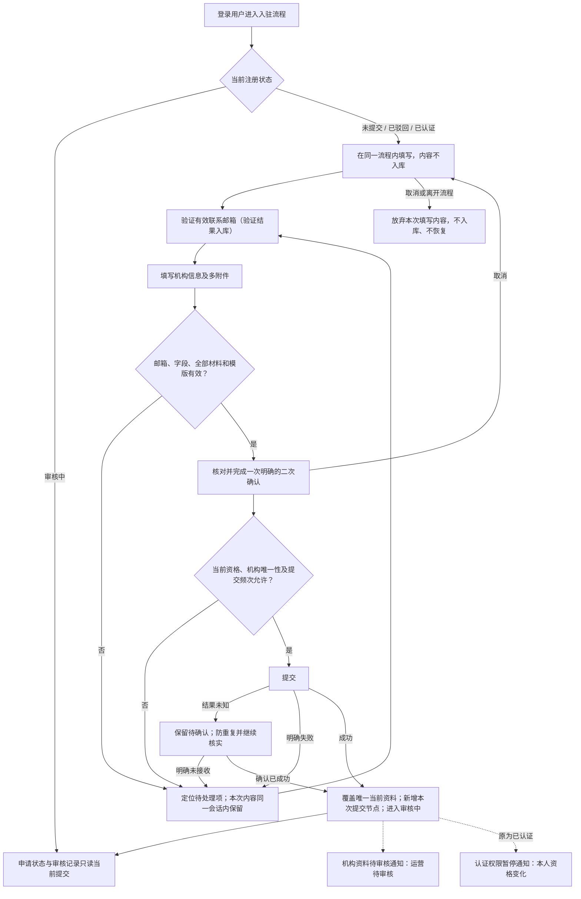
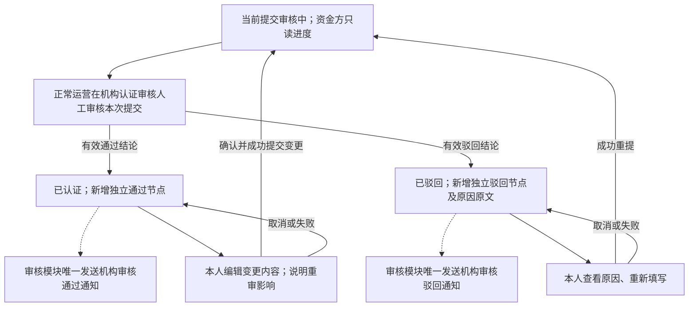
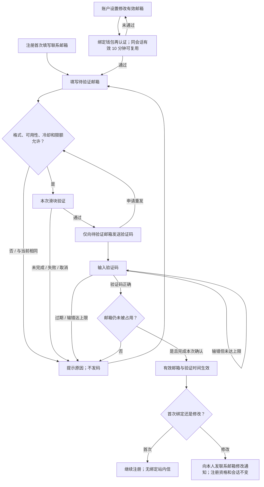
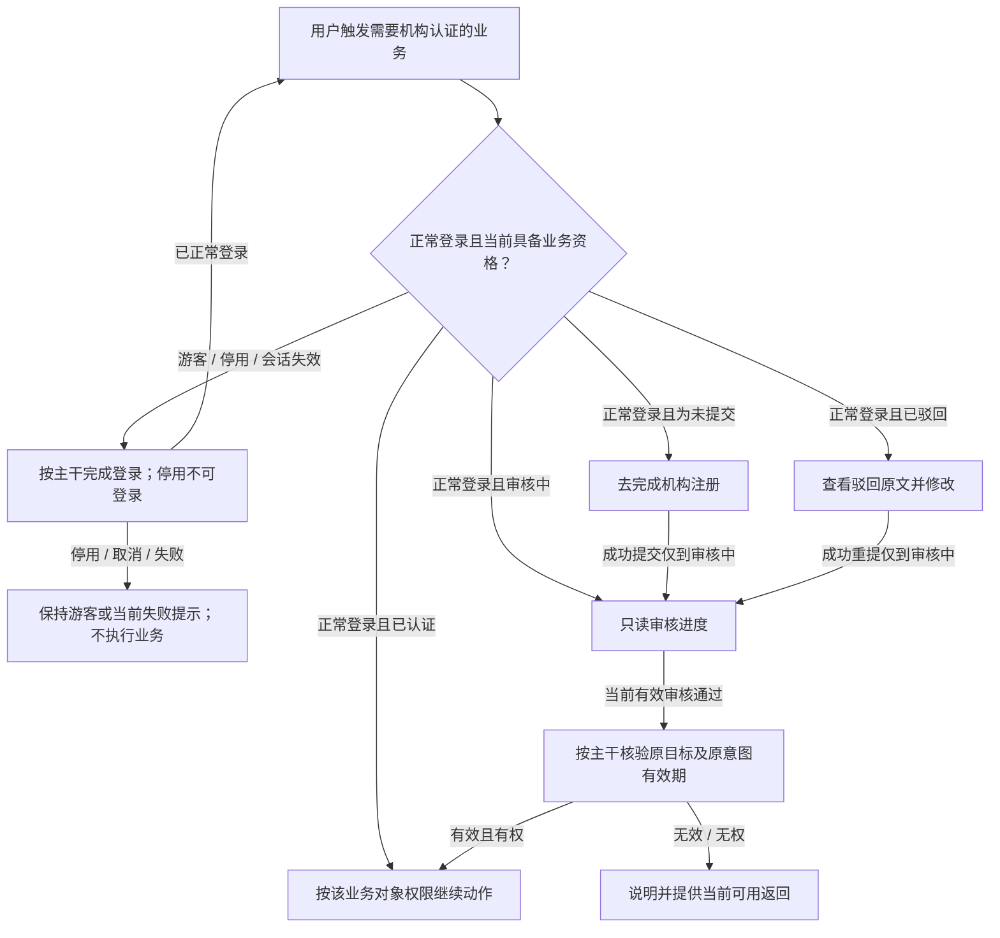
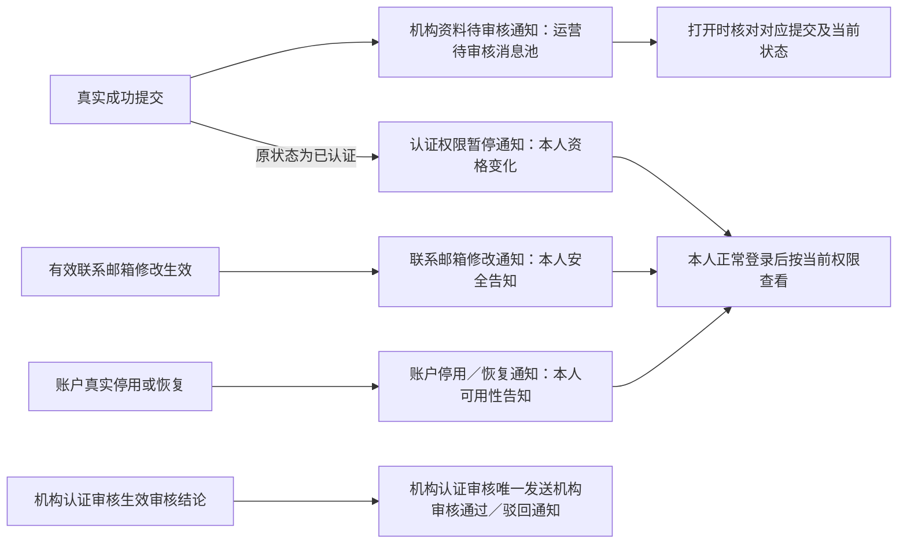
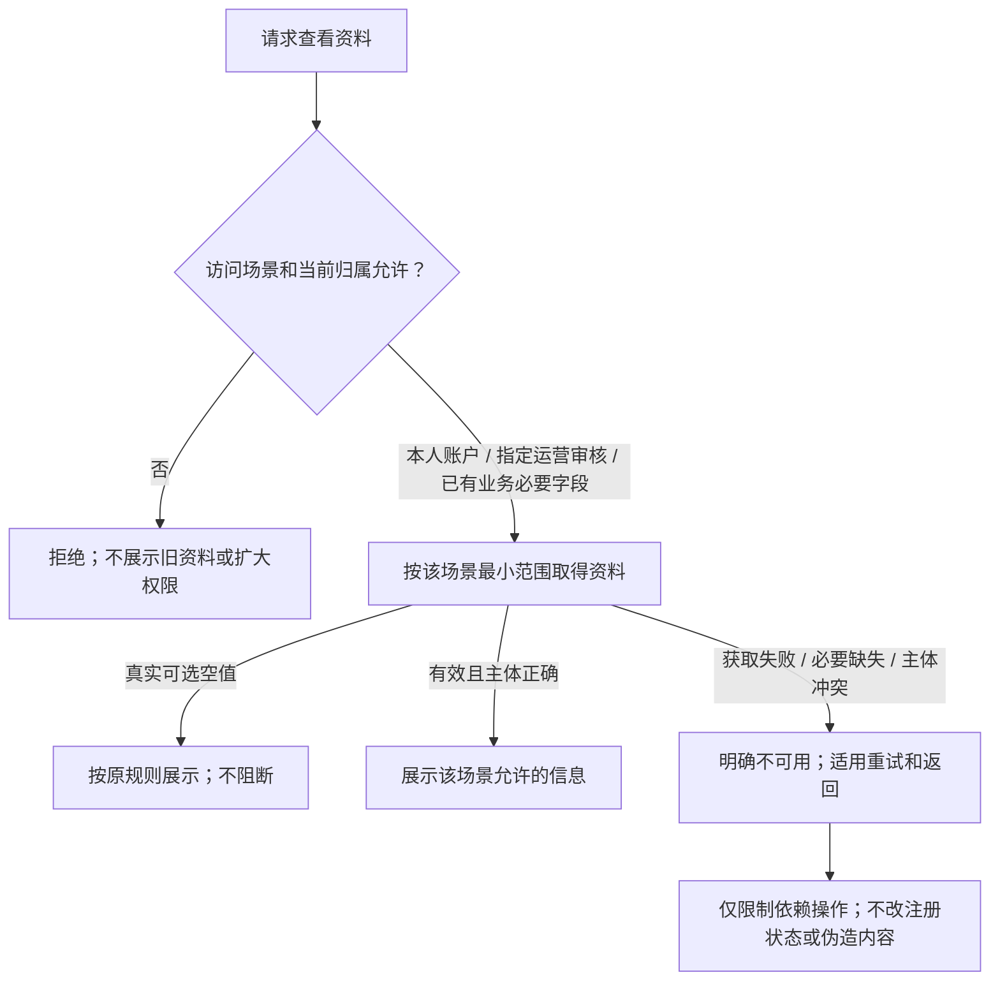
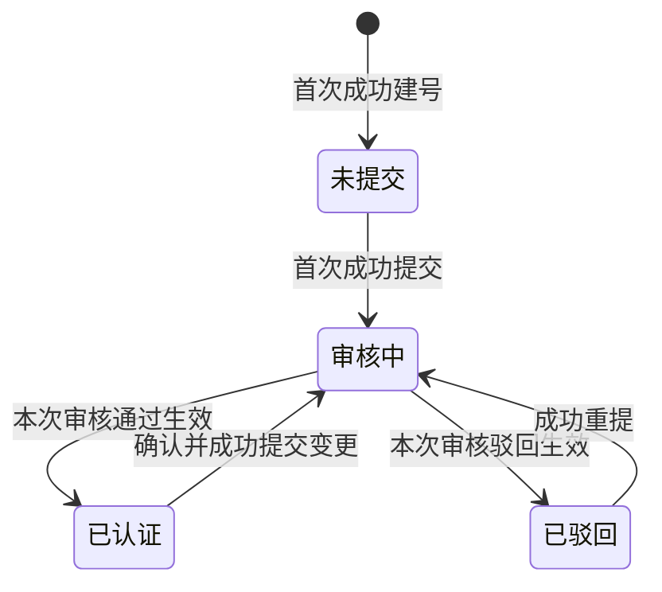
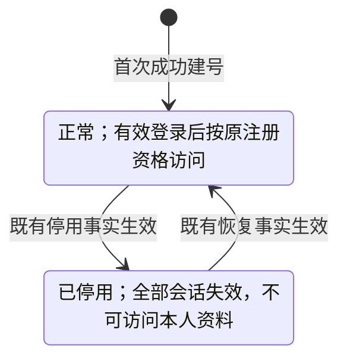

# 资金方登录与账户体系 · 流程图与状态机

版本：2026-09-23。需求：资金方登录与账户（WS-372）。与[主 PRD](./01-资金方登录与账户体系-PRD.md)及[通知册](./03-资金方登录与账户体系-消息通知.md)共同使用。图中只表达角色、业务条件、结果和状态；字段、允许动作、时效与异常的完整定义在主 PRD，不在图册另建一套口径。

本册只定义信息需求与业务行为；页面布局、组件形态、层级与视觉由 Hallmark 设计决定。本册措辞与设计稿冲突时以设计稿为准，业务口径仍以本册为准。图中节点是业务环节与信息域，不表示页面或组件。

实线表示业务推进或状态变化，虚线表示关联通知。机构注册与账户可用性是两个独立业务对象；本册保留图 1～7，并单列两张状态机。各图通过业务名称链接到主 PRD 的对应功能。

## 钱包登录、入驻触发与账户建立（图 1）

对应[钱包登录与首次建号](./01-资金方登录与账户体系-PRD.md#wallet-login)。

签名确认的各状态均可返回发起处，清除本次未完成签名并断开本次连接。连接成功未签名不能建号或登录；登录本身不建立资金方账户，账户与角色绑定都发生在成功提交入驻申请时。登录后的退出与插件断连含义不同，见[会话、退出与账户安全（主 PRD 第 6 章）](./01-资金方登录与账户体系-PRD.md#session)。

## 机构资料填写与提交（图 2）

对应[机构注册与提交](./01-资金方登录与账户体系-PRD.md#registration)。

邮箱未验证可先填机构资料，但不能提交。流程不拆步骤页；填写内容提交前不入库，取消或离开即放弃。编辑、退出或失败分别保持原未提交、已驳回或已认证和已提交资料；只有成功提交才替换，首次提交同时建立账户并绑定资金方角色。每次提交都需二次确认；同一次成功结果不因刷新重复生成。

## 查看审核结果与重提（图 3）

对应[审核结果与记录](./01-资金方登录与账户体系-PRD.md#review)。审核行为以机构认证审核为准。

新提交和新审核分别增加真实节点；只读旧记录不能把旧资格赋予当前资料，也不能查看旧材料副本。机构标准变化或资料自动获取不触发图中任何自动审核迁移。

## 首次验证与修改联系邮箱（图 4）

对应[首次验证联系邮箱](./01-资金方登录与账户体系-PRD.md#email-verification)、[修改联系邮箱](./01-资金方登录与账户体系-PRD.md#email-change)。

流程未完成或离开时不改原邮箱／验证时间；每次重发都重新经过全部条件和本次滑块。审核中仅机构材料只读，不禁止该账户邮箱流程。

## 受限业务与引导回流（图 5）

对应[未认证业务引导](./01-资金方登录与账户体系-PRD.md#guidance)。

首次建号必须先进入注册引导；提交不是获得资格。可浏览场景不因未认证而全局封锁；原业务意图期限不因重登或提交刷新。

## 关键消息及发送归属（图 6）

对应[通知册](./03-资金方登录与账户体系-消息通知.md)，展示机构资料待审核、联系邮箱修改、账户停用／恢复及认证权限暂停四类通知；审核结果归机构认证审核。

资产方无收件。重复事实不产生新消息或重置已读，通知失败不回滚业务；停用用户不能因消息进入账户。普通操作、首次建号／首绑、失败和未读停留不另发消息。

## 本人资料与业务必要信息（图 7）

对应[本人资料与业务必要信息](./01-资金方登录与账户体系-PRD.md#profile-visibility)。

指定运营审核只包含已提交申请资料，不包括账户档案或未提交内容。共用身份、证件供给和脱敏依赖未完成时，不把已取得的其他数据当作权限证明。

## 状态机 · 机构注册

对应[账户与注册状态](./01-资金方登录与账户体系-PRD.md#state-contract)。各状态允许动作以主 PRD 的四态表为准。

编辑、取消、失败、未确认结果、通知阅读均不触发迁移；已认证不是终态。认证资格仅在正常登录时用于权限；账户停用不修改此状态机。

## 状态机 · 账户可用性

对应[账户与注册状态](./01-资金方登录与账户体系-PRD.md#state-contract)、[会话与账户安全](./01-资金方登录与账户体系-PRD.md#session)。

恢复须重新登录，不自动认证或复活旧会话。登出、会话过期、插件断连、休眠标记不把账户状态改成已停用；只影响各自定义的登录／连接／休眠结果。通知消费既有可用性事实，不因此新增运营停用功能。
