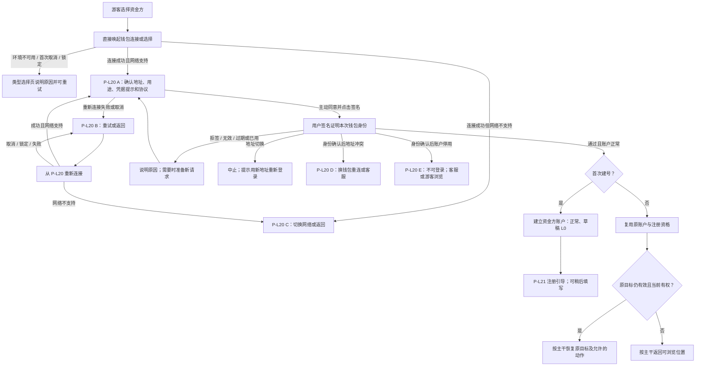
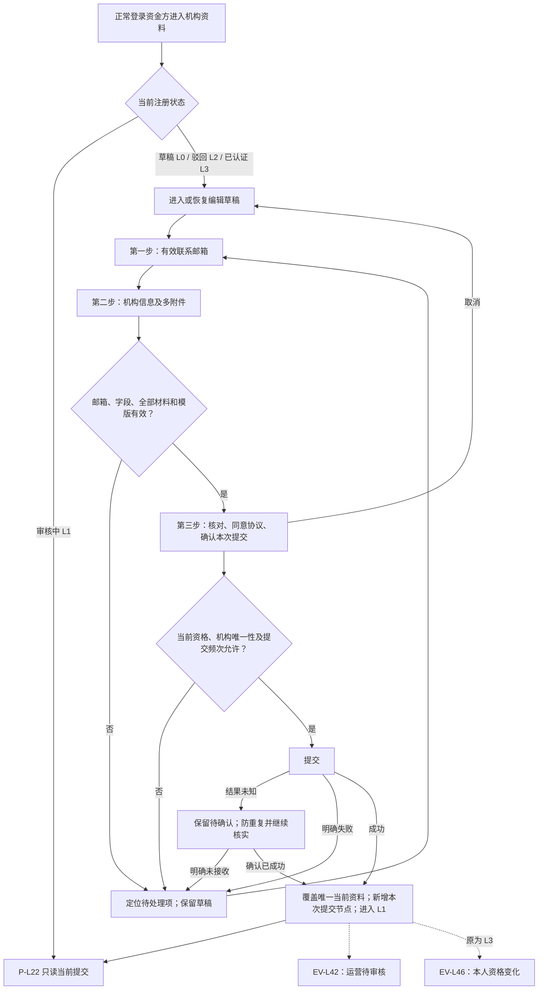
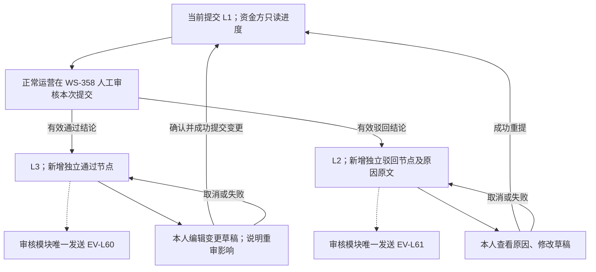
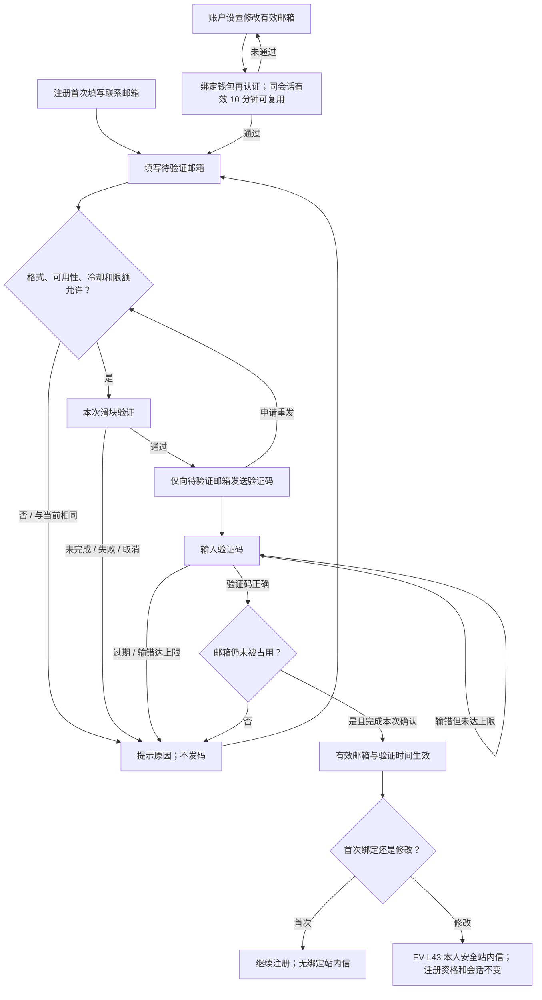
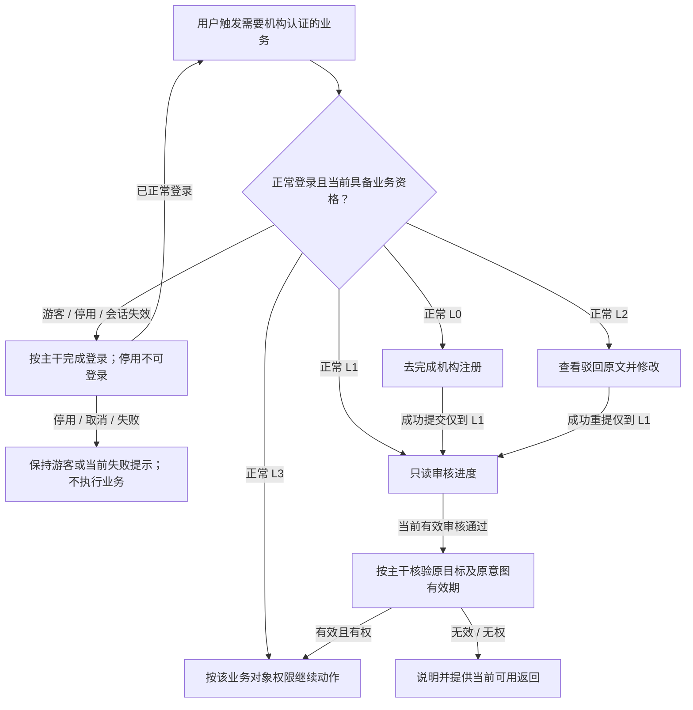
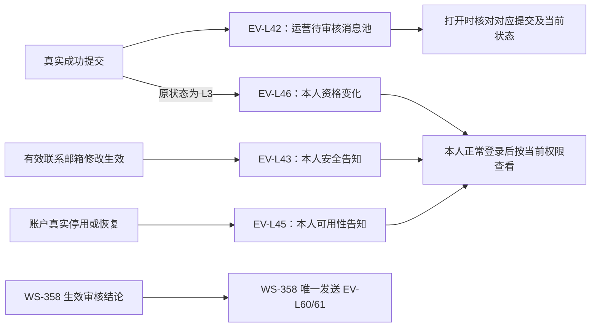
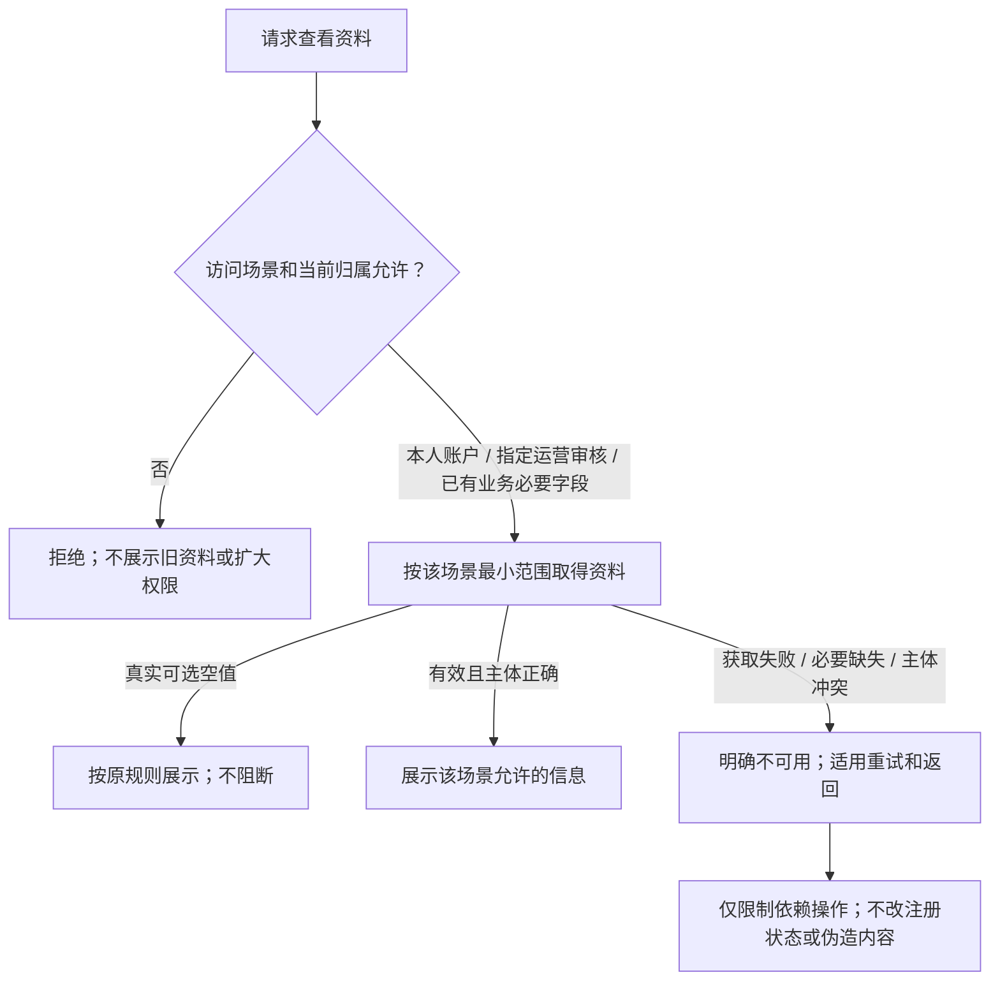
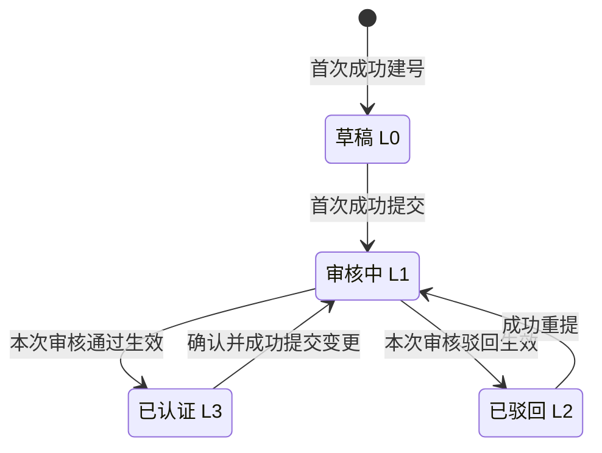
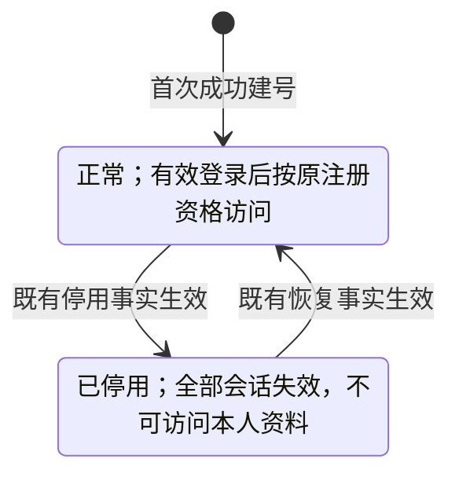

# 资金方登录与账户体系 · 流程图与状态机

版本：2026-09-22。需求：WS-372。与[主 PRD](./01-资金方登录与账户体系-PRD.md)及[通知册](./03-资金方登录与账户体系-消息通知.md)共同使用。图中只表达角色、业务条件、结果和状态；字段、允许动作、时效与异常的完整定义在主 PRD，不在图册另建一套口径。

实线表示业务推进或状态变化，虚线表示关联通知。机构注册与账户可用性是两个独立业务对象；本册保留图 1～7，并单列两张状态机。功能编号定位到主 PRD 具体规则或对应验收。

## 图 1 · 钱包连接、签名与建号

对应[主 PRD 第 2 章](./01-资金方登录与账户体系-PRD.md#wallet-login)，沿用 F-L50～57、77～78。

P-L20 各态均可返回类型选择，清除本次未完成签名并断开本次连接；首次连接取消不落 B。连接成功未签名不能建号或登录，返回不得越过首次注册引导。登录后的退出与插件断连含义不同，见主 PRD 第 6 章。

## 图 2 · 机构资料填写与提交

对应[主 PRD 第 3 章](./01-资金方登录与账户体系-PRD.md#registration)，沿用 F-L58～62、64～65。

邮箱未验证可先填第二步，但不能最终提交。编辑、退出或失败分别保持原 L0/L2/L3 和已提交资料；只有成功提交才替换。每次提交都需确认；已保存草稿和同一次成功结果不因刷新重复生成。

## 图 3 · 查看审核结果与重提

对应[主 PRD 4.1](./01-资金方登录与账户体系-PRD.md#review)，沿用 F-L63～67。审核行为以 WS-358 为准。

新提交和新审核分别增加真实节点；只读旧记录不能把旧资格赋予当前资料，也不能查看旧材料副本。机构标准变化或资料自动获取不触发图中任何自动审核迁移。

## 图 4 · 首次验证与修改联系邮箱

对应[主 PRD 3.2](./01-资金方登录与账户体系-PRD.md#email-verification)、[5.2](./01-资金方登录与账户体系-PRD.md#email-change)，沿用 F-L59、71、74。

流程未完成或离开时不改原邮箱／验证时间；每次重发都重新经过全部条件和本次滑块。审核中仅机构材料只读，不禁止该账户邮箱流程。

## 图 5 · 受限业务与引导回流

对应[主 PRD 4.3～4.4](./01-资金方登录与账户体系-PRD.md#guidance)，沿用 F-L66～68。

首次建号必须先进入注册引导；提交不是获得资格。可浏览场景不因未认证而全局封锁；原业务意图期限不因重登或提交刷新。

## 图 6 · 关键消息及发送归属

对应[通知册](./03-资金方登录与账户体系-消息通知.md)，沿用 EV-L42/43/45/46；审核结果归 WS-358。

资产方无收件。重复事实不产生新消息或重置已读，通知失败不回滚业务；停用用户不能因消息进入账户。普通操作、首次建号／首绑、失败和未读停留不另发消息。

## 图 7 · 本人资料与业务必要信息

对应[主 PRD 5.3](./01-资金方登录与账户体系-PRD.md#profile-visibility)，沿用 F-L73/78、D-L162/163。

指定运营审核只包含已提交申请资料，不包括账户档案或未提交草稿。共用身份、证件供给和脱敏依赖未完成时，不把已取得的其他数据当作权限证明。

## 状态机 · 机构注册

对应[主 PRD 4.2](./01-资金方登录与账户体系-PRD.md#state-contract)，沿用 D-L130～133、157。各状态允许动作以主 PRD 的四态表为准。

编辑、取消、失败、未确认结果、通知阅读均不触发迁移；verified 非终态。L 档仅在正常登录时用于权限；账户停用不修改此状态机。

## 状态机 · 账户可用性

对应[主 PRD 4.2](./01-资金方登录与账户体系-PRD.md#state-contract)、[第 6 章](./01-资金方登录与账户体系-PRD.md#session)，沿用 D-L158。

恢复须重新登录，不自动认证或复活旧会话。登出、会话过期、插件断连、休眠标记不把账户状态改成 disabled；只影响各自定义的登录／连接／休眠结果。通知消费既有可用性事实，不因此新增运营停用功能。
