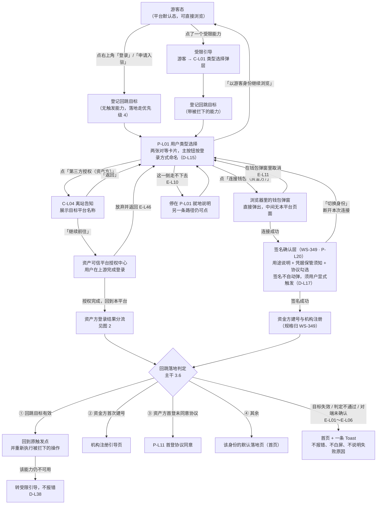
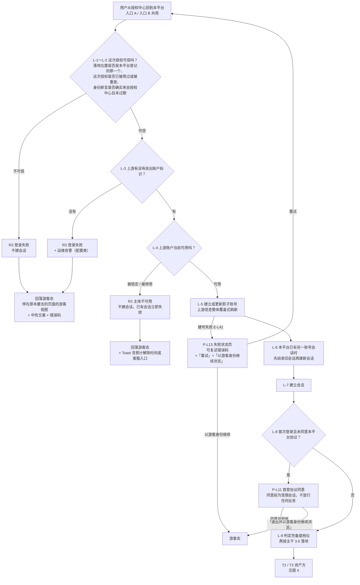
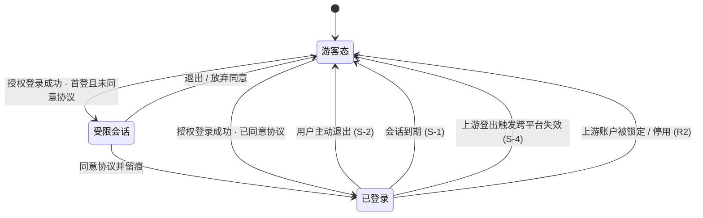
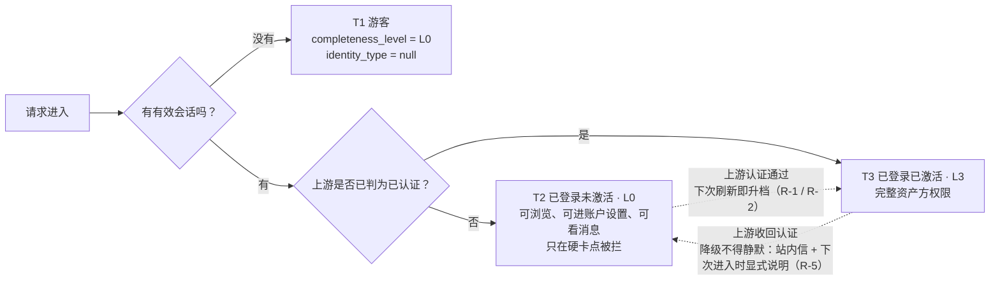

# 借贷平台 · 面客端 · 登录主干与资产方 SSO 接入 PRD
## **流程图与状态机**

> **本册读者**：全体——开发、测试、设计师都从这里看全貌，再回对应的《功能需求说明》读规则。
> **本册只画流程与状态，不定义规则。** 图上出现的每一个判定、分支与去向，其口径都在《功能需求说明》的对应章节，**图与正文冲突时以正文为准**。
> **编号一律沿用**：图中的 `P-L*`（页面）、`C-L*`（组件）、`L-*`（落地步骤）、`R1`/`R2`/`R3`（授权登录结果）、`T1`/`T2`/`T3`（三态）、`L0`～`L3`（完备度档位）、`S-*`（会话规则）与各册完全一致，**本册不新发任何编号**。

### 本册装了哪四张图

| 图 | 名称 | 对应正文 |
| --- | --- | --- |
| **图 1** | 登录入口分流与回跳 | 主干 2.2～2.5（入口与分流，含 `D-L15`～`D-L17`）、主干 3.6～3.7（回跳落地与兜底）、主干 8（`E-L10` / `E-L11`） |
| **图 2** | 资产方授权登录的结果分流与统一落地 | SSO 5.1～5.3 |
| **图 3** | 资产方会话状态机 | SSO 6.1～6.4 |
| **图 4** | 资产方三态判定 | SSO 8.1；状态语义定义处在主干 6.1～6.3 |

> **为什么资金方的流程只画到边界**：本 PRD 的产出边界不含资金方功能正文（主册 2.2）。图 1 画到「钱包连接成功、进入签名确认层」为止——**连接这一步是登录入口的一部分，归本 PRD**；**签名确认及其之后归 WS-349**（`P-L20` 是签名确认层，不是登录页）。资金方的机构注册与账号状态机流程由 WS-349 在它自己的《流程图与状态机》里画；**两边共用同一套三态与档位语义**（主干第 6 章），图 4 的判定结构对资金方同样成立，只是「档位由谁算出来」那一步换成本平台的机构认证审核结论。

---

## 图 1 · 登录入口分流与回跳

**看这张图要回答的问题**：用户是怎么走到登录的、点下按钮之后立刻看到什么、登录完又回到哪里。

> **这张图最要紧的一条是「点击入口就进外部环境，两侧都没有中间页」**（`D-L16`）：`P-L01` 之后，用户下一眼看到的要么是资产可信平台，要么是浏览器里的钱包弹窗，**本平台不再插一页让他把同样的动作再点一次**。
> **但「没有中间页」只作用于「连接」这一步**（`D-L17`）：资金方连接成功之后**不会自动弹签名**，中间还有一层需要用户显式确认；**那一层归 WS-349**，本图画到边界为止。

> **图中两个 WS-349 节点**：`签名确认层（P-L20）` 与 `资金方建号与机构注册`，**本 PRD 只画到它们存在、以及从它们出来能回 `P-L01`**；那一层的页面规格、失败态与返回出路在 WS-349。本图与 WS-349 的口径对齐点是：**`P-L20` 是签名确认层，不是登录页**——登录入口只有 `P-L01` 一个。

**读图要点**

| # | 要点 | 出处 |
| --- | --- | --- |
| 1 | **游客态是默认态**：图左上角那个起点不是「未登录所以要先登录」，而是「可以一直待在这里浏览」 | `D-L01` |
| 2 | **按钮上写的就是下一眼看到的东西**：「第三方授权」→ 另一个平台；「连接钱包」→ 钱包弹窗。不写中性的「继续」 | `D-L15` |
| 3 | **两条分支从 `P-L01` 之后直接进外部环境**，中间没有本平台页面；两侧对称，谁都没有「再点一次」的那一页 | `D-L16` |
| 4 | **合并只到「连接」为止**：连接成功之后还有一层要用户显式确认才签名——因为**签名意味着建号**，而连接不建号、不建会话 | `D-L17` |
| 5 | **去掉中间页之后必须补两条兜底**：这一侧根本走不下去（`E-L10`）、钱包弹窗里点了取消（`E-L11`）——两条都回到**仍然可见的 `P-L01`**，不留空白页 | `E-L10`、`E-L11` |
| 6 | 回跳目标在**进入登录之前**就登记好了，不是登录成功之后再去找 | `D-L45` |
| 7 | 落地优先级 ① 是**重新执行被拦下的操作**，不是「回到那个页面让用户自己再点一次」 | `D-L37` |
| 8 | 失败一路指向「首页 + Toast」，**图上没有任何一条边通向报错页或登录墙** | 主干 3.7 |

---

## 图 2 · 资产方授权登录的结果分流与统一落地

**看这张图要回答的问题**：用户从授权中心回来之后会发生什么、哪些情况算登录失败、失败了他看到什么。

> **两条入口共用这一条链**：无论用户是从资产可信平台点过来（入口 A），还是在本平台点「登录」选了「资产方」（入口 B），从 `L-1` 起完全一致（`D-L96`）。

**读图要点**

| # | 要点 | 出处 |
| --- | --- | --- |
| 1 | **失败一律回落游客态**，用户停在原本要去的那个页面的游客视图，不被送到首页、不弹登录页 | SSO `D-L89` |
| 2 | **唯一的失败页是 `P-L13`**，且只用于「上游身份已经确认、但本平台建号失败」这一种；它必须给两个出口 | SSO `D-L89` |
| 3 | 用户看到的文案**不区分内部原因**——中性说明 + 一个可复述给客服的错误码 | SSO `D-L90` |
| 4 | 图里标「运维告警」的两处是**用户重试多少次都不会好**的情况，必须有人被叫醒 | SSO `D-L91` |
| 5 | **协议未同意时是受限会话**：账号已经存在，但除协议页、协议正文、退出之外什么都不放行 | SSO `D-L95` |

---

## 图 3 · 资产方会话状态机

**看这张图要回答的问题**：本平台的登录状态什么时候开始、什么时候结束、结束之后用户停在哪。

**四条失效路径，用户各看到什么**

| 失效原因 | 用户看到 | 出处 |
| --- | --- | --- |
| 主动退出 | 就地回到当前页面的游客视图 + Toast「已退出登录」。**上游会话不受影响** | `S-2`、`D-L107` |
| 会话到期 | 就地降级为游客视图 + Toast「登录已过期，可重新登录继续」 | `S-1` |
| 上游登出 | 就地降级为游客视图 + 一条说明「你已在资产可信平台登出，本平台登录同时结束」 | `S-4` |
| 上游账户不可用 | 就地降级为游客视图 + Toast 含预计解除时间或客服入口 | `R2` |

**读图要点**

| # | 要点 | 出处 |
| --- | --- | --- |
| 1 | **所有失效路径的终点都是「游客态」，图上没有一条边通向登录页** | `ST-2`、`D-L108` |
| 2 | 「就地降级」的意思是**用户不被跳转**，还停在原来那一页，只是内容换成游客能看的那一份 | SSO 6.4 |
| 3 | 会话失效时**不暂存表单草稿**，只提示内容未保存 | `S-5` |
| 4 | 本平台**没有**「改密码 / 改邮箱导致会话失效」这条边——资产方在本平台没有任何本地凭据 | `S-3` |

---

## 图 4 · 资产方三态判定

**看这张图要回答的问题**：一个进来的请求，怎么判断这个人处于哪一态、能不能做业务。

> **三态由两个互相独立的维度共同判定，不是一条单线的状态机**（`D-L111`）：会话可能因上游登出在任意时刻消失，完备度可能因上游认证被收回而在会话存续期间掉档，两者互不通知。

**读图要点**

| # | 要点 | 出处 |
| --- | --- | --- |
| 1 | **资产方只有 `L0` 和 `L3` 两档**；出现 `L1` / `L2` 属数据异常，按 `L0` 保守处理、不放行 | 主干 `D-L62` |
| 2 | `T2` **不做全局封锁**——他能正常逛，只在「发起融资申请」这一处被拦（资产方链路上唯一的硬卡点） | SSO 8.3 |
| 3 | **升档不需要退出重登**：用户在上游刚认证完回来，下一次刷新就是 `T3` | SSO `R-2`、`US-L27` |
| 4 | **降档不得静默**：功能不能凭空消失，必须发站内信并在下次进入时说明 | `ST-1`、SSO `R-5` |
| 5 | 档位**只由服务端算出来**，业务功能一律读契约四字段，不自己拼状态 | 主干 `D-L64`、`D-L60` |

**两类角色在这张图上的差别只有一处**：中间那个判定框。资产方问的是「上游是否已判为已认证」；资金方问的是「本平台的机构认证审核结论是什么」，并且资金方会落到 `L0` / `L1` / `L2` / `L3` 四档而不是两档。**判定结构、态的名字、档位的名字完全相同**（主干 6.3），这正是两类角色能共用一套权限矩阵与引导组件的原因。

---

> **规则正文**：主干 A [`00-登录主干-01-入口与回跳.md`](./00-登录主干-01-入口与回跳.md)、主干 B [`00-登录主干-02-引导与权限契约.md`](./00-登录主干-02-引导与权限契约.md)、SSO [`01-资产方SSO接入.md`](./01-资产方SSO接入.md)。
> **验收**见 [`02-登录主干与资产方SSO接入-验收需求说明.md`](./02-登录主干与资产方SSO接入-验收需求说明.md)。
