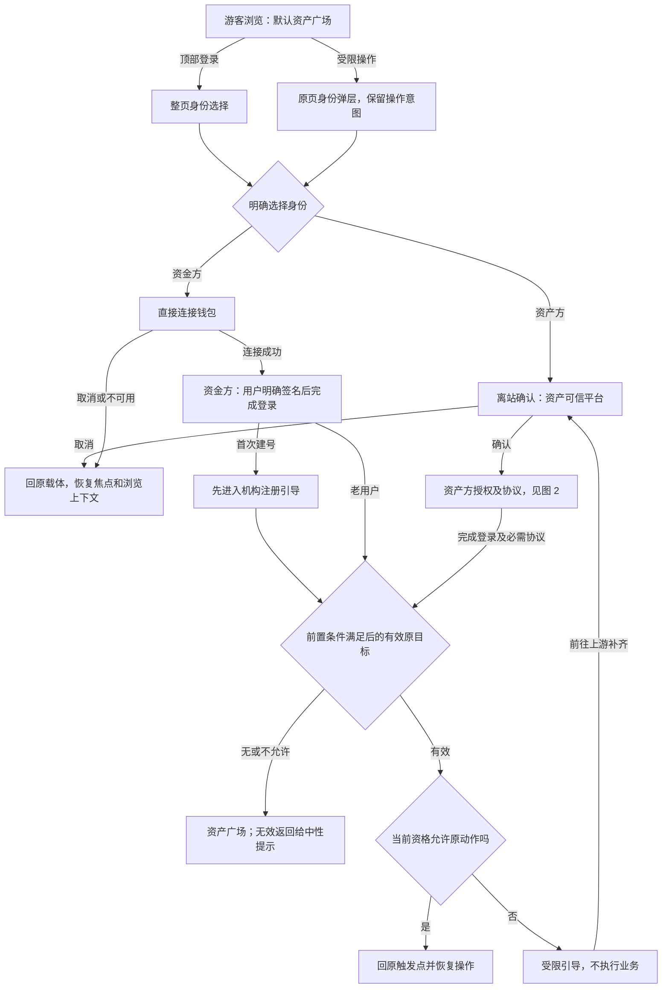
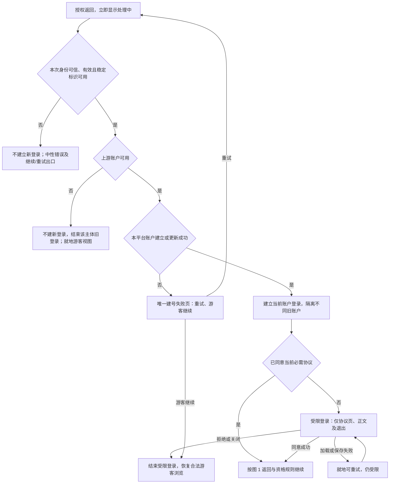
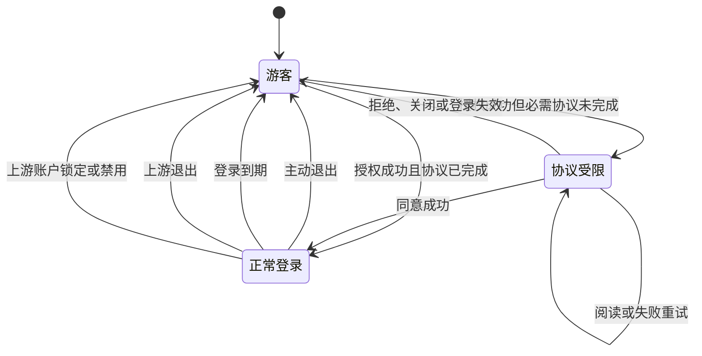
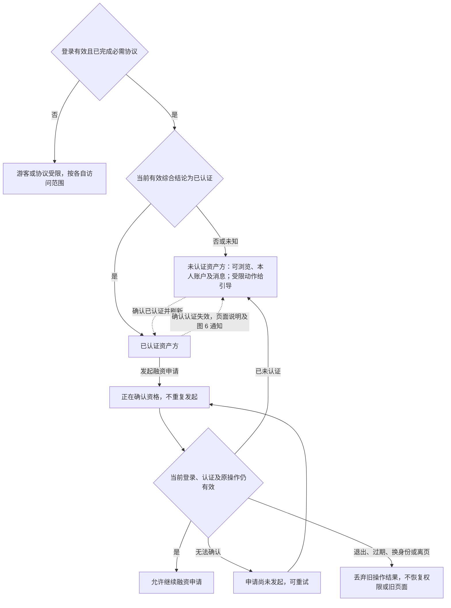
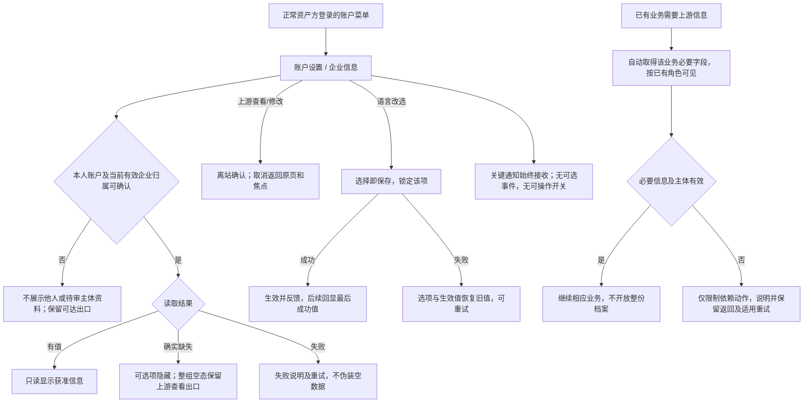
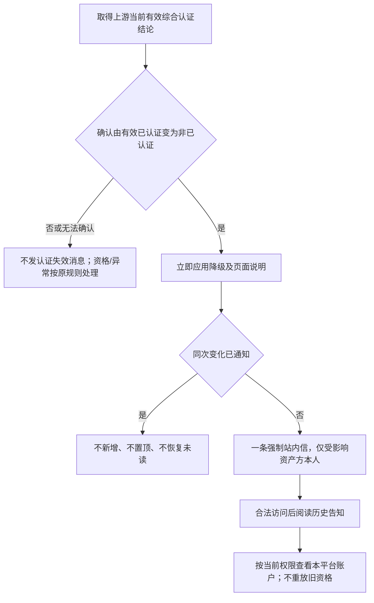

# 登录主干与资产方 SSO 接入 · 流程图与状态机

图仅表达业务流程和状态；具体分支、字段与验收统一见[主 PRD](./00-登录主干与资产方SSO接入-PRD.md)。资金方节点仅表示 资金方账户模块的接续边界。

## 图 1 · 从游客浏览到恢复原操作

对应[入口](./00-登录主干与资产方SSO接入-PRD.md#F-L02)与[返回](./00-登录主干与资产方SSO接入-PRD.md#F-L04)。

取消登录不执行原业务；跨平台返回未满足对端确认时按资产广场兜底，不阻止本身符合条件的授权登录。

## 图 2 · 授权结果与必需协议

对应[授权与协议](./00-登录主干与资产方SSO接入-PRD.md#F-L25)。两个授权发起入口共用此流程。

普通授权失败不结束与本次失败无关的有效登录；原页游客不可读的数据仍不可读。协议阅读不代替同意。

## 图 3 · 资产方登录状态

对应[退出与失效](./00-登录主干与资产方SSO接入-PRD.md#F-L27)。

退出均就地降为游客且解释原因，不自动弹登录；主动退出不退出上游，只有账户菜单提供主动出口。上游退出联动须在 60 秒内结束对应登录，含告知失败兜底。

## 图 4 · 认证资格与发起融资

对应[状态与资格](./00-登录主干与资产方SSO接入-PRD.md#F-L29)。必需协议先完成；申请审核进度不代替当前有效综合认证。

## 图 5 · 本人资料与偏好

对应[本人账户与企业信息](./00-登录主干与资产方SSO接入-PRD.md#F-L32)。

退出、换账户或离页后，旧资料/操作结果不得恢复旧身份或页面；未成功保存无草稿，已成功值不因离页撤回。资料多少不决定认证资格。

## 图 6 · 认证资格失效站内信

对应[独立消息通知](./08-登录主干与资产方SSO接入-消息通知.md#event)。

降级不等待通知成功；持续未认证不催促，恢复后再次真实失效是新事件。资金方和运营人员不接收本模块事件。
