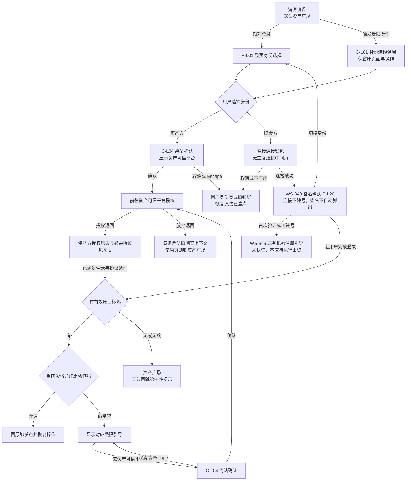
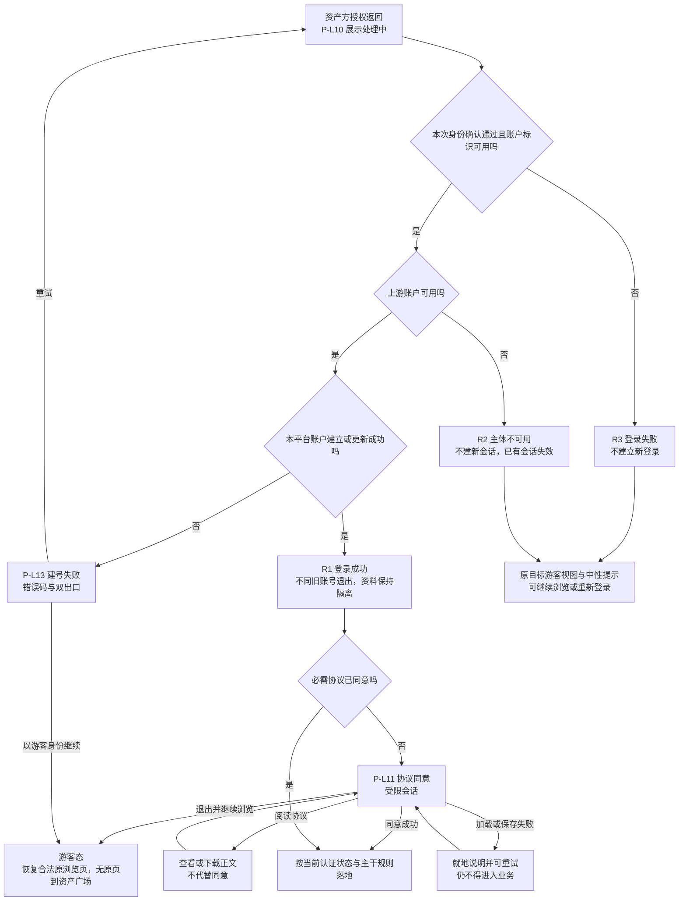
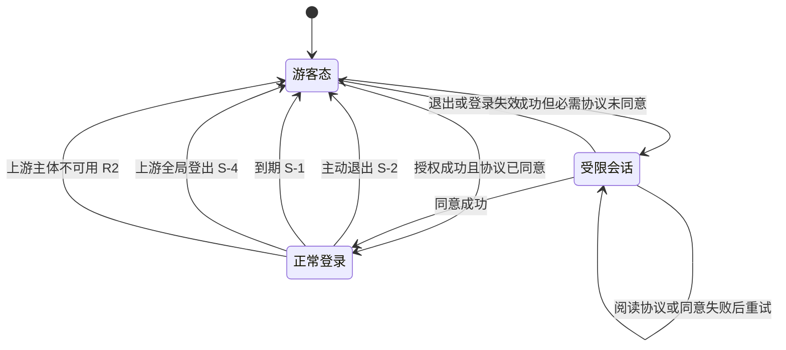
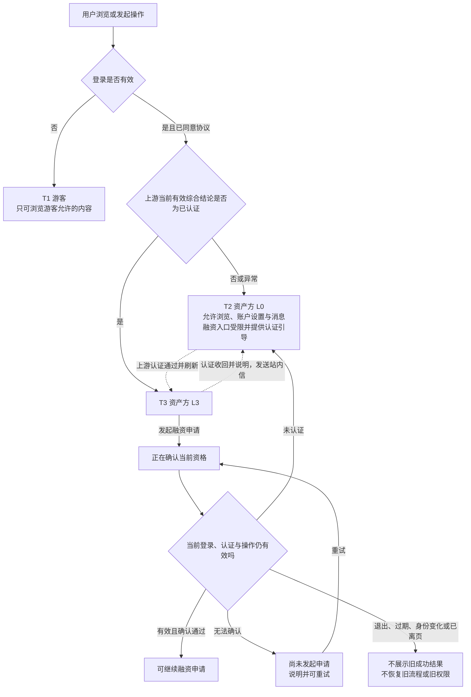
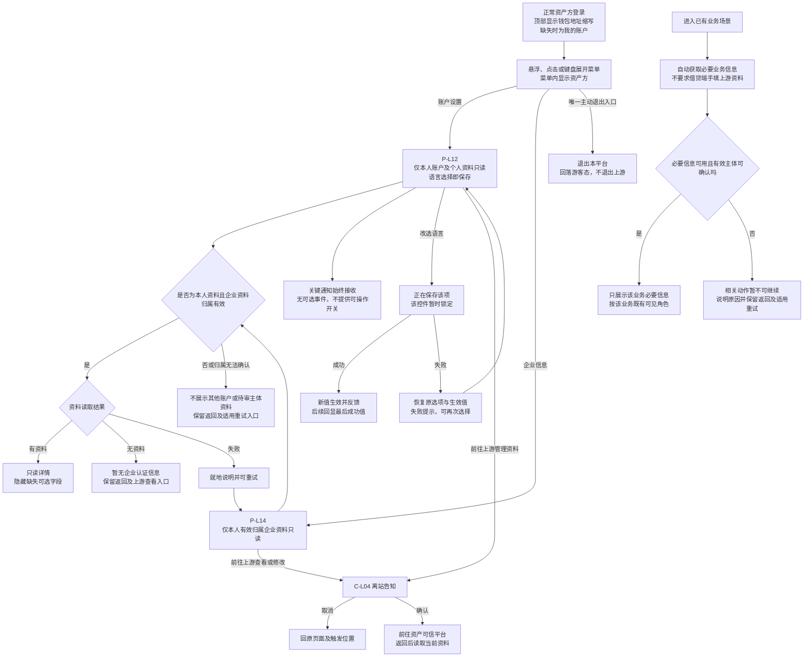
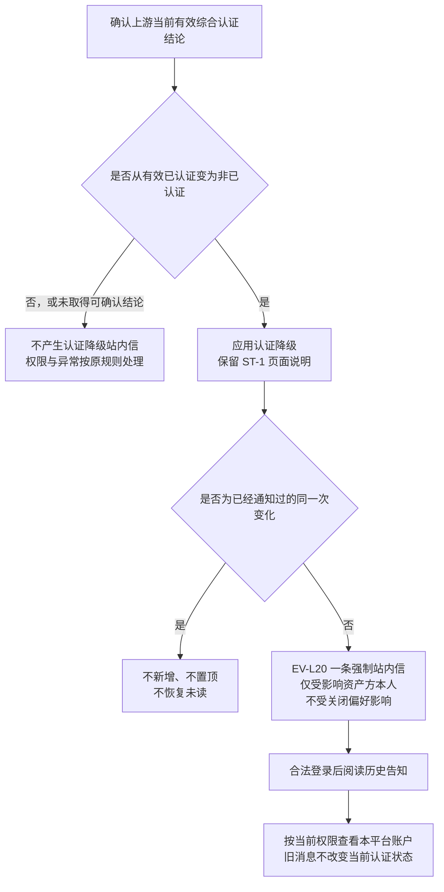

# 借贷平台 · 面客端 · 登录主干与资产方 SSO 接入 PRD
## 流程图与状态机

本册供开发、测试、设计共读，只表达用户流程与业务状态。规则以三份功能正文及消息通知册为准；全部图集中于此。资金方专属页面与状态机由 WS-349 交付，本册只表示主干衔接边界。

| 图号 | 名称 | 关联功能与正文 |
| --- | --- | --- |
| [图 1](#flow-1) | 登录入口、离站返回与登录后落地 | `F-L01`～`F-L08`；主干 2.2～2.6、3.6～3.7 |
| [图 2](#flow-2) | 资产方授权结果与协议同意 | `F-L20`～`F-L26`；SSO 3～5 |
| [图 3](#flow-3) | 资产方登录状态 | `F-L27`、`F-L28`；SSO 6 |
| [图 4](#flow-4) | 资产方认证状态与操作资格 | `F-L29`～`F-L32`；SSO 7～9；主干 6 |
| [图 5](#flow-5) | 资产方本人资料、业务信息与偏好保存 | `F-L32` / `F-L33`；SSO 9 |
| [图 6](#flow-6) | 本模块认证降级通知 | `F-L29` / `F-L30`、`EV-L20`；《消息通知》3～4 |

## 图 1 · 登录入口、离站返回与登录后落地

游客默认进入既有资产广场，顶部只有登录入口；每次进入身份选择都须明确点击，不提供上次身份快捷入口或自动跳转；受限操作使用弹层身份选择，不另开一张选择页。下图的资金方节点只引用 WS-349 的边界，未定义其页面正文。

资金方首次建号先入驻、资产方未同意协议先到 `P-L11`，都不能被回跳绕过。有效返回还须满足主干安全边界；跨平台对端确认未完成时按 3.7 兜底。`C-L03` 和账户页的离站取消同样返回原区域并恢复焦点；取消不同于切换身份，不清除原浏览上下文。

## 图 2 · 资产方授权结果与协议同意

入口 A（资产可信平台发起）与入口 B（借贷平台发起）共用以下业务结果；不在图中展开协议处理或校验算法。

`R3` 不新增登录，不影响与本次失败无关的既有有效登录；`R2` 必须结束对应不可用主体的会话。无合法原浏览页时按主干兜底；不能用原页恢复绕过游客不可见权限。失败信息不得暴露内部判定细节；只有建号失败使用 `P-L13`，其他失败不另增错误死胡同。

## 图 3 · 资产方登录状态

| 失效原因 | 用户可见结果 |
| --- | --- |
| 主动退出 | 就地回游客视图，提示已退出；资产可信平台登录不受影响 |
| 到期 | 就地降级并提示登录已过期，可主动重新登录 |
| 上游登出 | 提示「你已在资产可信平台登出，本平台登录同时结束」 |
| 主体不可用 | 就地降级，显示可取得的解除时间或客服入口；不捏造时间 |

所有失效均不自动弹登录页；原页面受保护内容不可继续读取。尚未成功保存的偏好无草稿，按 `S-5` 提示未保存；已完成保存不撤回，重新进入读取最后成功值。迟到结果不能恢复旧登录或显示旧操作成功。资产方主动退出仅在账户下拉菜单提供，账户页不展示登录状态分区或退出按钮，见 SSO 9。

## 图 4 · 资产方认证状态与操作资格

图中认证判断使用上游当前有效综合结论，不能以资料更新申请的审核进度替代；更新审核中仍有效或驳回后失效均以上游结论为准。当前企业资料对应有效归属，待审核企业变更不提前生效。实际接口对应由开发核实，见[主册 8.4](./00-登录主干与资产方SSO接入-PRD.md#interface-boundary)。

会话与认证是两个独立维度。资产方只有 `L0` / `L3`；资金方 `L1` / `L2` 不套用到资产方。图中的资格等待不是新的账号状态，也不是融资申请已创建；旧结果不得反向覆盖当前降级状态（`D-L116`）。

规则正文：[主干 A](./00-登录主干-01-入口与回跳.md)、[主干 B](./00-登录主干-02-引导与权限契约.md)、[资产方 SSO](./01-资产方SSO接入.md)。测试主读[验收需求说明](./02-登录主干与资产方SSO接入-验收需求说明.md)。

## 图 5 · 资产方本人资料、业务信息与偏好保存

读取中显示占位，空态与失败态分开；个人信息区同样遵循这一区分。资料展示不参与认证资格推断。`Q-L01` 的两类基本信息仅为暂定供给，模拟资料不代表联调通过。退出、过期或身份变化后不再展示旧资料；离开页面后不显示迟到保存成功，已成功保存值不会因离开被撤回。`Q-L03` 已关闭：通知默认开启且仅可控制明确可选事件；本模块可选清单为空，账户页无可操作开关，`EV-L20` 始终接收。本人基本资料与业务信息的边界见 SSO 9.4 `D-L119`，不得以业务展示开放整份资料；业务信息不足只限制依赖该信息的动作。

## 图 6 · 本模块认证降级通知

关联[本模块《消息通知》](./08-登录主干与资产方SSO接入-消息通知.md)与验收 `AC-L315`～`AC-L324`。本图只表示业务判定，不规定通知传输或去重实现；偏好与权限验收补充见 `AC-L325`～`AC-L329`。

持续未认证不重复催促；恢复有效认证后再次降级属于新事件。资金方与运营人员不接收本模块这条通知，其各自业务事件由所属功能模块单独定义。通知不可用不延迟权限降级；消息投递或阅读不恢复登录、不替代业务处理。
