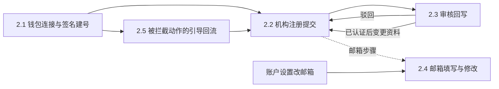
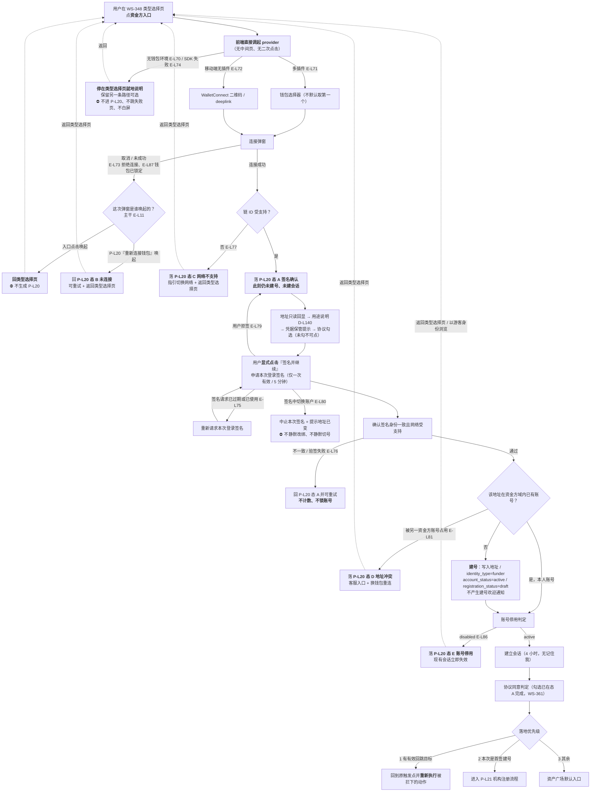
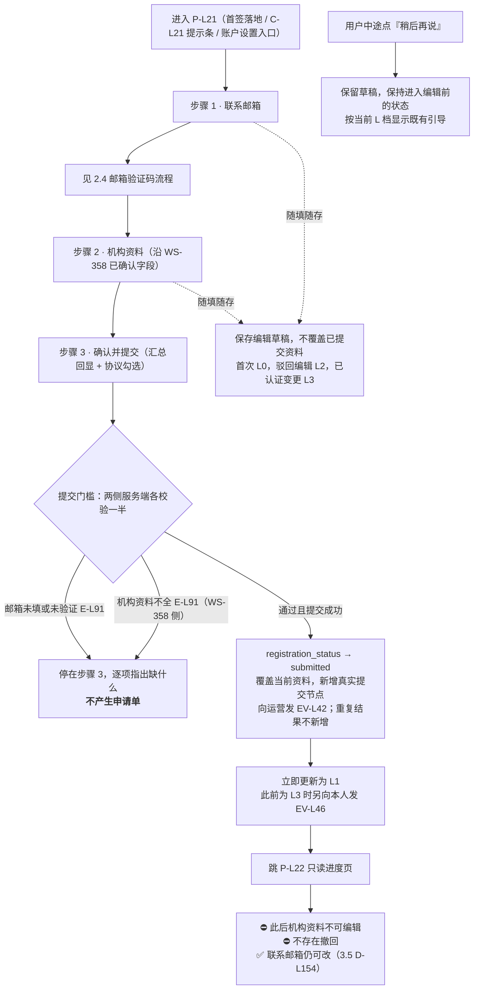
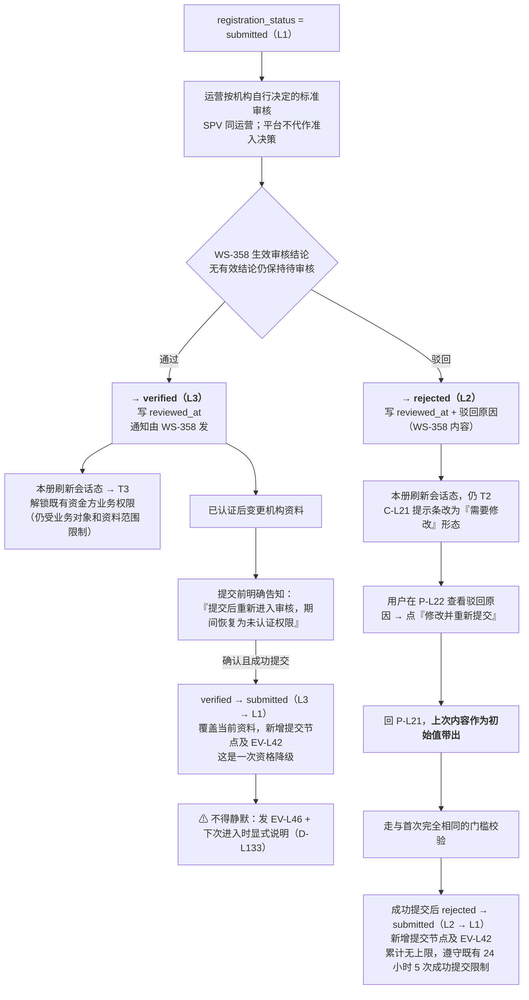
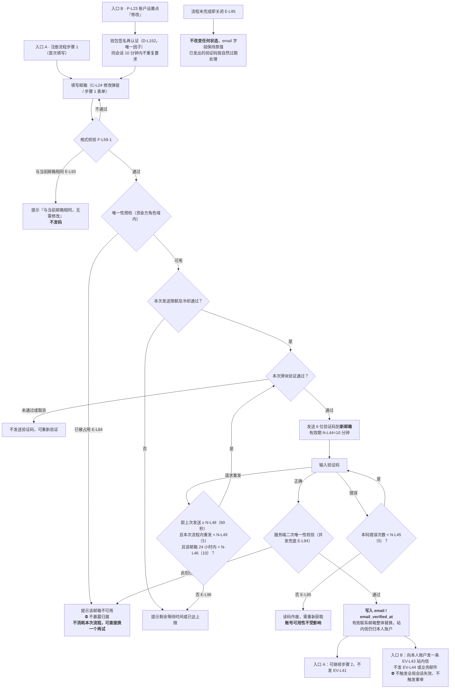
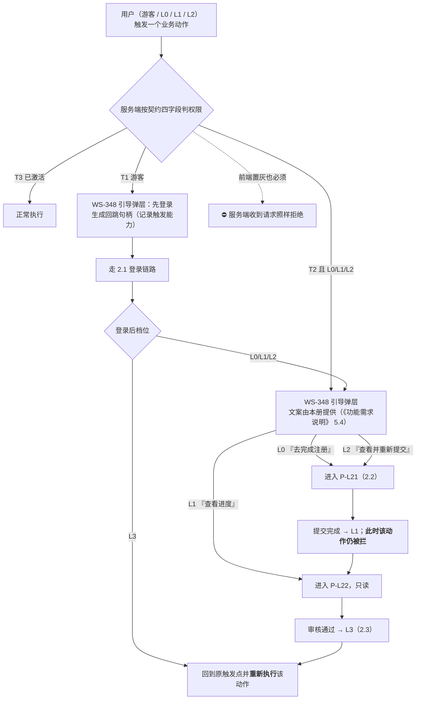
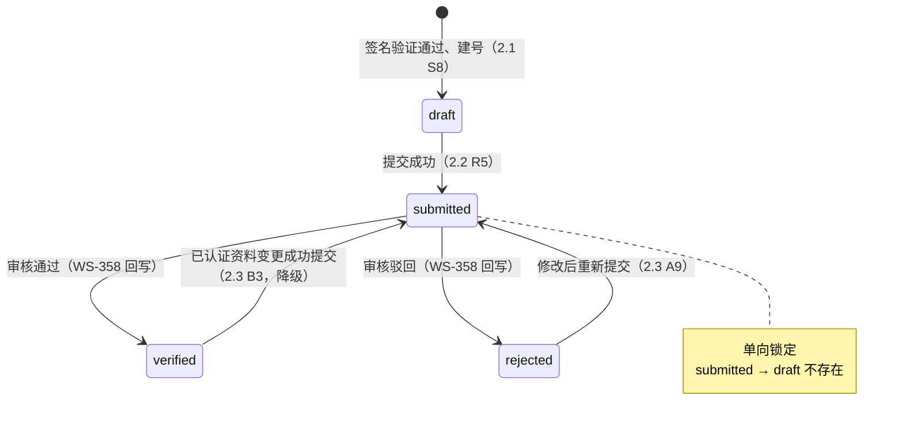
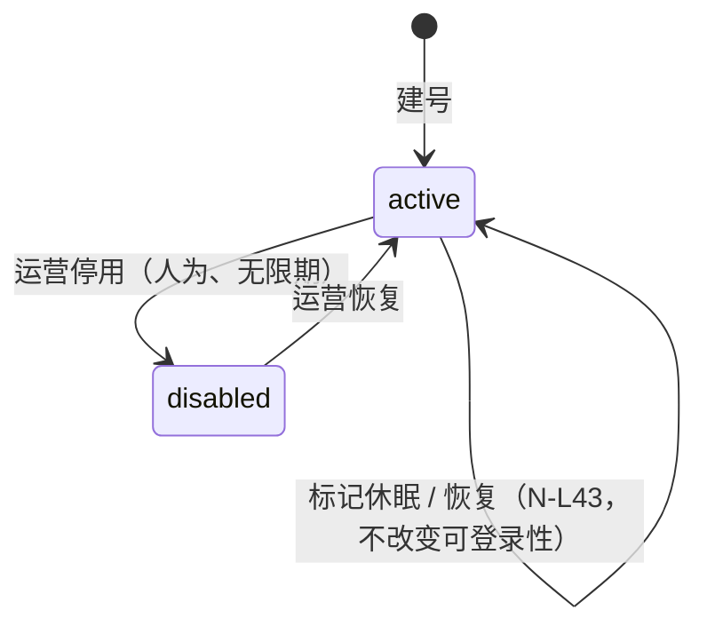
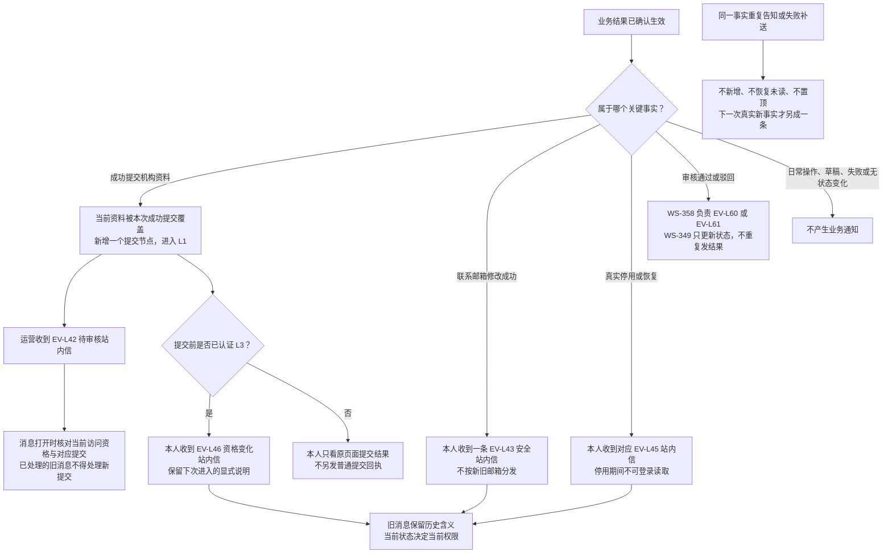
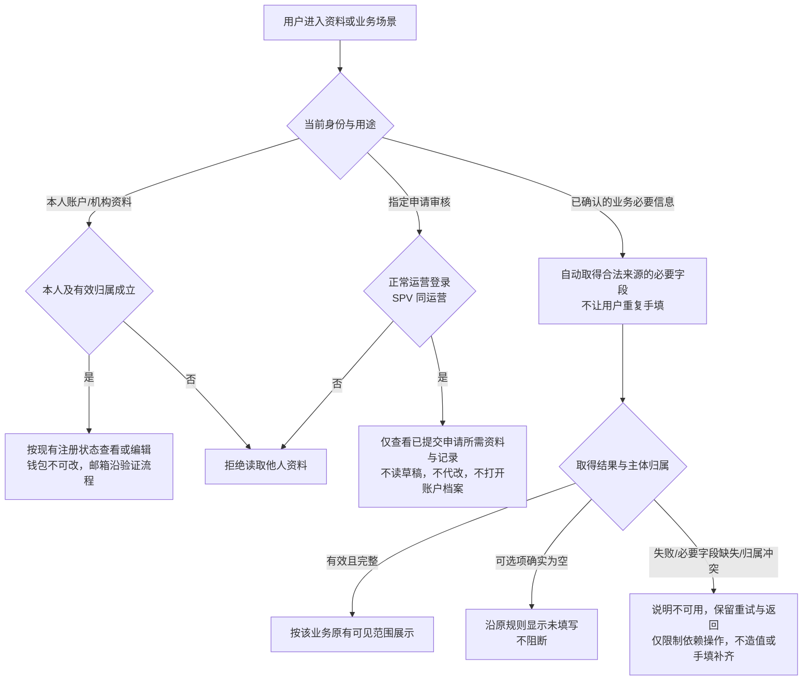

# 资金方登录与账户体系 PRD（V2.1）· 流程图与状态机

> **本文件是《借贷平台 · 面客端 · 资金方登录与账户体系 PRD》的第四册。**
> 入口与总览见 [`04-资金方登录与账户体系-PRD.md`](./04-资金方登录与账户体系-PRD.md)；功能正文见 [`功能需求说明`](./05-资金方登录与账户体系-功能需求说明.md)；验收见 [`验收需求说明`](./06-资金方登录与账户体系-验收需求说明.md)。
>
> **本册是本模块状态口径的唯一权威定义处。** 状态取值、迁移触发条件、各态允许动作、终态判定、`L` 档映射、`account_status` 与 `L` 档的正交叠加规则，**只在本册定义一次**；主文件与 《功能需求说明》的对应位置改为引用本册，不再给第二份描述。
>
> 编号与前三册连续：本册新落定的口径为 `D-L157`、`D-L158`，其余编号沿用前三册。本册**不新增功能点、不新增验收编号**——本册是口径与图，验收仍在 《验收需求说明》。

---

## 0. 本册定位与权威边界

### 0.1 谁该读本册

| 角色 | 读什么 |
| --- | --- |
| 开发 | 全册。第 2 章是实现顺序的依据，第 3 章是状态机与契约输出的依据 |
| 测试 | 第 3 章（判定基准）+ 第 2 章各流程的分支点；验收条目仍在 《验收需求说明》 |
| 设计师 | 第 2 章全部流程（尤其 2.5 引导回流）+ 3.2 的"各态允许动作"列 |
| 产品 / 评审 | 3.1～3.3 |

### 0.2 权威边界

| 内容 | 权威在哪 |
| --- | --- |
| 状态取值、迁移、允许动作、终态、`L` 档映射、正交叠加 | **本册第 3 章** |
| 三态 `T1`/`T2`/`T3` 与契约四字段的**定义** | **WS-348 主干**（本册只做映射，不重定义） |
| 功能规则、字段校验、文案、权限拦截的执行方式 | **《功能需求说明》** |
| 机构资料同源模版、审核动作与结论承载；实质标准由机构自行决定 | **WS-358** |
| 可判定的验收条目 | **《验收需求说明》** |

### 0.3 图例

| 记号 | 含义 |
| --- | --- |
| 实线箭头 | 状态迁移或流程推进 |
| **粗体状态名** | 本模块持有的状态 |
| `WS-358` 标注 | 该迁移由运营端回写，本册只消费不产生 |
| ⛔ | 服务端必须拒绝的动作（前端不提供入口不构成防线） |

---

## 1. 流程总览

本模块五条主要业务流程的衔接点如下；本册图 6 另集中展示关键业务通知，完整规则见 09《消息通知》。

> 2.4 有两个入口：注册流程步骤 1 的**首次填写**，和账户设置里的**修改**。两者复用同一套验证码规则（`D-L146`），差别只在生效前是否已有有效联系邮箱（3.5 `D-L155`）。

---

## 2. 流程

### 2.1 钱包连接与签名建号

**入口点击即唤起 provider，没有中间登录页**（`D-L159`）；**连接与签名是两个弹窗，签名不自动接着弹**（`D-L160`）。`P-L20` 是连接回来之后的落点，也是全部失败与中断态的承载页（`D-L161`）。

**这条流程上最容易做错的五处**

| # | 易错点 | 正确做法 |
| --- | --- | --- |
| 1 | 在入口和落地页各放一个「连接钱包」，让用户点两次 | **入口点击即唤起 provider**（`D-L159`）。`P-L20` 上的「重新连接钱包」是次要操作，不是主路径的第一步 |
| 2 | 连接弹窗关掉后自动接着弹签名弹窗 | **不允许**（`D-L160`）。签名必须由用户在态 A 显式点击触发，否则用途说明、凭据保管与协议勾选会被整个跳过 |
| 3 | 把建号做在"连接成功"那一刻 | 建号在 **`S6` 验签通过之后**（`D-L135`）。连接是几乎无成本的误操作，签名不是 |
| 4 | 失败态没有界面落点，或落了却没有出路 | 各失败 / 中断态都有明确落点（`P-L20` 态 B～E，环境不可用与入口点击后的取消回类型选择页），**每一处都带返回类型选择页的出路**（`D-L161`） |
| 5 | 用户第一次点入口就取消，却先给他造一个 `P-L20` 再显示"未连接" | **回到唤起弹窗的那个界面**（主干 `E-L11`）。此时他还没进入资金方链路，落点是类型选择页；**态 B 只用于从 `P-L20` 发起的重连未成功**（`F-L51-7`） |

**失败与中断落点速查**

| 发生时机 | 异常 | 落在哪 | 出路 |
| --- | --- | --- | --- |
| 点击入口、provider 唤不起来 | `E-L70` 无钱包、`E-L74` SDK 失败 | **类型选择页（就地说明）** | 安装指引 / 改用移动端 / 选另一条路径 |
| 连接弹窗内（**由入口点击唤起**） | `E-L73` 拒绝连接、`E-L87` 钱包已锁定 | **类型选择页**（主干 `E-L11`） | 重新点入口 / 选另一条路径 |
| 连接弹窗内（**由 `P-L20`「重新连接钱包」唤起**） | 同上 | `P-L20` **态 B** | 重新连接 / 返回类型选择页 |
| 连接返回后 | `E-L77` 链不支持 | `P-L20` **态 C** | 切换网络后重试 / 重新连接 / 返回类型选择页 |
| 签名弹窗内 | `E-L79` 拒签、`E-L80` 切换账户 | `P-L20` **态 A**（原地） | 重新签名 / 重新连接 / 返回类型选择页 |
| 验签之后 | `E-L81` 地址冲突 | `P-L20` **态 D** | 换钱包重连 / 客服 / 返回类型选择页 |
| 验签之后 | `E-L86` 账号停用 | `P-L20` **态 E** | 客服 / 返回类型选择页 / 以游客身份浏览 |

### 2.2 机构注册提交

| # | 规则要点 |
| --- | --- |
| 1 | 三个步骤**可前后自由跳转**，已填内容不丢失；草稿保留期无限期（`N-L47`） |
| 2 | 草稿不改变有效状态：首次 L0，驳回后编辑 L2，已认证变更草稿 L3；失败或退出不覆盖当前资料、不发送提交或资格变化通知 |
| 3 | `submitted` 后再访问 `P-L21` 的 URL 一律重定向 `P-L22`（`F-L58-5`） |
| 4 | 会话在填表途中过期（`E-L92`）：草稿不丢，重新登录从上次位置继续 |

### 2.3 审核回写：通过 / 驳回 / 重新提交

| # | 规则要点 |
| --- | --- |
| 1 | `verified` / `rejected` 两态由 **WS-358 回写**，本册只消费；审核结论的**通知由 WS-358 发**，本册不重复发送 |
| 2 | 本册的责任是**收到结论后刷新会话态**（3.4 第 ③ 条时机） |
| 3 | 变更成功提交 `L3 → L1` 发 EV-L46 并保留显式说明；无 verified→rejected 直接审核动作；之后 L1→L2 由 WS-358 发驳回结果，不重复发降级消息 |
| 4 | **修改联系邮箱不属于机构资料变更**，不触发重审（`F-L65-4`） |

### 2.4 邮箱填写与修改的验证码流程

**两个入口共用这一条流程。** 差别只有一处：修改入口在新邮箱验证通过并成功生效之前，**旧联系邮箱保持有效，站内信归属不变**（`D-L155`）。

**各 `L` 档能否修改联系邮箱**

| 档位 | `registration_status` | 能否改 | 说明 |
| --- | --- | --- | --- |
| `L0` | `draft` | ✅ | 还没提交，随便改 |
| `L1` | `submitted` | ✅ | **"提交即锁定"锁的是机构资料与申请单，不是账户联系方式**。审核中恰恰最需要它可达——审核员可能要联系补件（`D-L154`） |
| `L2` | `rejected` | ✅ | 驳回原因本身可能就是联系不上 |
| `L3` | `verified` | ✅ | 不触发重审（`F-L65-4`） |
| — | `account_status = disabled` | ❌ | 连会话都建不起来，谈不上改 |

**改邮箱期间的联系信息与消息归属（D-L155）**

| 阶段 | 联系邮箱 | 业务站内信 |
| --- | --- | --- |
| 新邮箱验证且成功生效之前 | 旧值保持有效 | 按本平台资金方账户归属，不转移到新旧邮箱 |
| 变更成功生效后 | 整体替换为新邮箱 | EV-L43 只产生一条；EV-L44 本期不启用 |

邮箱验证码是功能验证邮件，仍向待验证邮箱发送；业务通知仅站内信。关闭、失败、邮箱相同或冲突均不产生变更通知。

### 2.5 被拦截动作的引导回流

| # | 规则要点 |
| --- | --- |
| 1 | **拦截组件归 WS-348**，本册只提供 `L0` / `L1` / `L2` 三种情形的文案（《功能需求说明》 5.4） |
| 2 | `G6R` 那一步不是 bug：补完注册后档位是 `L1`，业务动作仍被拦，引导文案改为"审核中"形态。**这是预期行为，设计稿上要画出来**，否则用户会以为提交失败 |
| 3 | 回跳句柄的生成、校验与消费一律调用 WS-348 的统一实现（`F-L53-5`） |
| 4 | 草稿态**只拦业务动作**，浏览、平台介绍、消息中心不拦（`D-L138`） |

---

## 3. 状态机（**本模块状态口径的唯一权威定义**）

### 3.1 两个维度

账号状态由两个**互相正交**的维度共同表达。合并成一个维度会让"审核被驳回"误伤成"账号不能登录"。

| 维度 | 字段 | 取值 | 回答什么问题 | 谁写 |
| --- | --- | --- | --- | --- |
| 一 · 账户可用性 | `account_status` | `active` / `disabled` | **能不能登录** | 本模块（建号）+ 运营（停用 / 恢复） |
| 二 · 注册进度 | `registration_status` | `draft` / `submitted` / `verified` / `rejected` | **能做到哪一步** | 本模块写 `draft` / `submitted`；**WS-358 回写** `verified` / `rejected` |

> **本版没有 `locked`，也没有 `incomplete`**。`locked` 随账户锁定机制一起作废（主文件 Δ-6）；`incomplete`（凭据未齐）随凭据完备性门槛一起作废（Δ-8）。两者都**永不复用**。

**权限前提**：以下各态的浏览、账户设置及资料查看均须满足 D-L162 的本人归属或既有业务可见范围；L3 不授权查看他人档案。机构自行定标准不取消人工审核，SPV 同运营不增加状态或资金权限。

### 3.2 维度二 · `registration_status` ↔ `L` 档完整状态机

**逐态定义表**

| 状态 | `L` 档 | 三态 | 用户可读表达（EN / 中） | **进入条件** | **允许的动作** | **禁止的动作（⛔ 服务端强制）** | **离开条件** |
| --- | --- | --- | --- | --- | --- | --- | --- |
| **`draft`** 草稿态 | `L0` | `T2` | `Registration not submitted` / `未提交注册` | 建号即进入（唯一入口） | 只读浏览全站；填写 / 编辑注册草稿；修改联系邮箱；查看账户设置；退出登录 | 一切业务动作（出资 / 认购、签署协议、下载合同、维护出资账户等） | 提交成功 → `submitted` |
| **`submitted`** 待审核 | `L1` | `T2` | `Under review` / `审核中` | 满足门槛且提交成功 | 只读浏览全站；**只读**查看进度（`P-L22`）；**修改联系邮箱**（`D-L154`）；退出登录 | 一切业务动作；**编辑机构资料**；**撤回**（不存在该概念） | 仅由 WS-358 的审核结论离开 → `verified` / `rejected` |
| **`rejected`** 已驳回 | `L2` | `T2` | `Rejected` / `已驳回` | WS-358 回写驳回结论 | 只读浏览全站；查看驳回原因；编辑并重新提交（上次内容带出）；修改联系邮箱；退出登录 | 一切业务动作 | 重新提交成功 → `submitted` |
| **`verified`** 已认证 | `L3` | `T3` | `Verified` / `已认证` | WS-358 回写通过结论 | **既有资金方业务权限（仍受业务对象和资料范围限制）**；查看已提交内容（只读）；修改联系邮箱；发起机构资料变更 | — | 发起机构资料变更并提交 → `submitted`（**降级**） |

**迁移触发条件汇总**

| # | 迁移 | 触发 | 触发方 | 副作用 |
| --- | --- | --- | --- | --- |
| 1 | `[*] → draft` | 签名验证通过且该地址在资金方域内无账号 | 本模块 | 建号，不产生 EV-L40 欢迎消息 |
| 2 | `draft → submitted` | 提交门槛满足且提交成功 | 本模块 | 记录提交时间和提交节点、向运营发 `EV-L42`、刷新会话态、跳 `P-L22` |
| 3 | `submitted → verified` | 审核通过结论落库 | **WS-358** | 写 `reviewed_at`、解锁完整权限；通知由 WS-358 发 |
| 4 | `submitted → rejected` | 审核驳回结论落库 | **WS-358** | 写 `reviewed_at` 与驳回原因；`C-L21` 改为"需要修改"形态 |
| 5 | `rejected → submitted` | 重新提交成功，满足全部门槛及既有限频 | 本模块 | 同 #2；累计无上限，每次真实成功提交独立留痕 |
| 6 | `verified → submitted` | 已认证后变更机构资料，确认且成功提交 | 本模块 | 同 #2，外加 EV-L46 向本人告知资格降级，下次进入显式说明（D-L133） |

**不存在的迁移（反向约束）**

| 编号 | 不存在的迁移 | 为什么 |
| --- | --- | --- |
| **`D-L131`** | `submitted → draft` | 提交即锁定，只有审核结论能让它离开。任何出现"撤回申请"的内容一律为过期内容 |
| — | `draft → verified` / `draft → rejected` | 没有提交就没有审核对象 |
| — | `rejected → verified` | 驳回后必须重新提交、重新审核 |
| — | `verified → rejected`（直接） | 结论变更也要先回 `submitted` 重审；直接从 `L3` 跳 `L2` 会让用户没有可申辩的过程 |

**终态**

| 编号 | 口径 |
| --- | --- |
| **`D-L157`** | **`registration_status` 没有终态。** `verified` 看起来像终点，但机构资料变更会把它送回 `submitted`（迁移 #6）。唯一"不可逆"的是 `submitted` 的**单向锁定**——它不能自己走回去，只能等结论。任何把 `verified` 当作终态、据此省略后续状态刷新的实现都是错的 |

### 3.3 维度一 · `account_status` 与 `L` 档的正交叠加

**叠加规则**

| 编号 | 口径 |
| --- | --- |
| **`D-L132`** | `account_status = disabled` **独立于完备度**，不占用 `L0`～`L3` 中的任何一档 |
| **`D-L158`** | **判定顺序固定：先判 `account_status`，再算 `L` 档。** `disabled` 是一票否决——会话根本建不起来，`L` 档无从谈起。实现上不得先算 `L` 档再打折扣，那会产生"已认证但被停用"这种在契约里无法表达的状态 |

**叠加矩阵（穷举，共 8 格）**

| `account_status` | `registration_status` | 输出 `session_state` | 输出 `completeness_level` | 主干三态 | 用户体验 |
| --- | --- | --- | --- | --- | --- |
| （无会话） | — | `guest` | `L0` | `T1` | 游客，可浏览 |
| `active` | `draft` | `authenticated` | `L0` | `T2` | 登录，被引导去注册 |
| `active` | `submitted` | `authenticated` | `L1` | `T2` | 登录，只能看进度 |
| `active` | `rejected` | `authenticated` | `L2` | `T2` | 登录，可改可重提 |
| `active` | `verified` | `authenticated` | `L3` | `T3` | 完整权限 |
| `disabled` | `draft` | `guest`（拒绝建会话 / 现有会话失效） | `L0` | `T1` | 告知停用 + 客服入口（`E-L86`） |
| `disabled` | `submitted` / `rejected` | 同上 | `L0` | `T1` | 同上 |
| `disabled` | `verified` | 同上 | `L0` | `T1` | 同上。**停用期间 `registration_status` 保持 `verified` 不变**，恢复后继续 |

| # | 规则要点 |
| --- | --- |
| 1 | 停用**不清除**注册进度：`registration_status` 原值保留，恢复后直接续上（`F-L66-2`） |
| 2 | 休眠标记（`N-L43`，180 天无活跃且仍为 `draft`）**不改变任何一个维度的取值**，只是运营侧的清理标记；再次登录自动恢复且用户无感知（`E-L90`） |
| 3 | `disabled` 态下 `completeness_level` 输出 `L0` 只是契约上的保守取值，**不代表注册进度被重置** |

### 3.4 状态刷新时机

三态不是前端缓存的值。以下时机**必须**重新向服务端取一次（`F-L67-4`）：

| # | 时机 |
| --- | --- |
| ① | 每次进入需要判定权限的页面 |
| ② | 登录成功、退出登录、注册提交成功之后 |
| ③ | 收到审核结论相关的站内信之后（由 WS-358 触发） |
| ④ | 接口返回会话失效时（立即回落 `T1`，`D-L150`） |

| 编号 | 口径 |
| --- | --- |
| **`D-L130`** | **`L0` / `L1` / `L2` 三档在权限上等同**（都是 `T2`），差异只在提示文案与可执行动作（3.2 逐态定义表第 6、7 列）。这与 WS-348 主干口径一致，本册不另立 |
| **`D-L133`** | 已认证变更成功提交造成 L3→L1 时不得静默：产生 EV-L46 站内信并在下次进入显式说明，权限即时更新。无 verified→rejected 直接迁移；审核驳回由 WS-358 在 L1→L2 时发送结果，消息迟到或未读不能保留旧权限 |
| — | **契约消费方不得读取 `registration_status` / `account_status` 原始值做权限判定**（`F-L67-3`）。本册这两个字段是**生产端口径**，消费端只认 WS-348 的契约四字段 |

### 3.5 本册新落定与本册持有的状态口径

| 编号 | 口径 | 本册位置 |
| --- | --- | --- |
| `D-L130` | `L0`/`L1`/`L2` 权限等同 | 3.4 |
| `D-L131` | `submitted → draft` 回边不存在 | 3.2 |
| `D-L132` | `disabled` 独立于完备度 | 3.3 |
| `D-L133` | 变更成功提交 L3→L1 的资格降级不得静默 | 3.4 |
| **`D-L154`** | **四个 `L` 档均可修改联系邮箱。** "提交即锁定"锁的是机构资料与申请单，不是账户联系方式——审核中恰恰最需要联系通道可达 | 2.4 |
| **`D-L155`** | 新邮箱验证且变更成功前，旧联系邮箱有效；成功后整体替换。站内信始终按本平台资金方账户归属 | 2.4 |
| **`D-L157`** | `registration_status` **没有终态**；唯一不可逆的是 `submitted` 的单向锁定 | 3.2 |
| **`D-L158`** | 判定顺序固定：**先 `account_status`，再 `L` 档**；`disabled` 一票否决 | 3.3 |

---

## 4. 交叉引用索引

| 你要找的 | 去哪 |
| --- | --- |
| 某个状态现在允许做什么 | **本册 3.2** 逐态定义表 |
| 某个迁移由谁触发、有什么副作用 | **本册 3.2** 迁移触发条件汇总 |
| 停用与档位怎么叠加 | **本册 3.3** 叠加矩阵 |
| 某条流程的分支与异常落点 | **本册第 2 章**对应流程图 |
| 字段的类型、必填、校验、默认值 | **《功能需求说明》 `M11`** |
| 页面信息、文案与交互结果 | **《功能需求说明》** 对应模块 |
| 异常编号 `E-L##` 的完整处理 | **《功能需求说明》 `M10`** |
| 通知事件 `EV-L##` 的触发时点与渠道 | **09《消息通知》** |
| 可判定的验收条目 | **《验收需求说明》** |
| 三态 `T1`/`T2`/`T3` 与契约四字段的定义 | **WS-348 主干**（本册只映射） |
| 机构资料同源模版、审核动作与结论承载 | **WS-358** |

## 5. 图 6 · 关键业务通知

关联：M8、EV-L42/43/45/46、F-L61/64/65/66/74；验收：AC-L484～499。完整规则与模板见[09 消息通知册](./09-资金方登录与账户体系-消息通知.md)。本图只表达业务事件，不定义投递实现；EV-L47 是功能验证码，不进入本图的站内信分支。

通知失败不回滚已生效业务，也不延迟权限变化。历史记录不附历史材料；面客只读本人记录且隐藏审核员身份。通知阅读、审核任务完成与当前账户资格分别判断。

## 6. 图 7 · 本人资料访问与业务信息自动获取

关联：F-L60/63/73/78、D-L162/163；验收：AC-L501、503～507、512。完整规则见[功能册 7.6～7.7](./05-资金方登录与账户体系-功能需求说明.md#profile-visibility)。本图不新增认证状态。

资料获取、查看与重试均不产生重审或消息。只有原流程的成功提交或有效审核动作才改变注册状态及对应通知；机构自行决定标准不等于自动通过。通知开关不影响关键消息，规则见[09 册 4.1](./09-资金方登录与账户体系-消息通知.md#notification-policy)。
