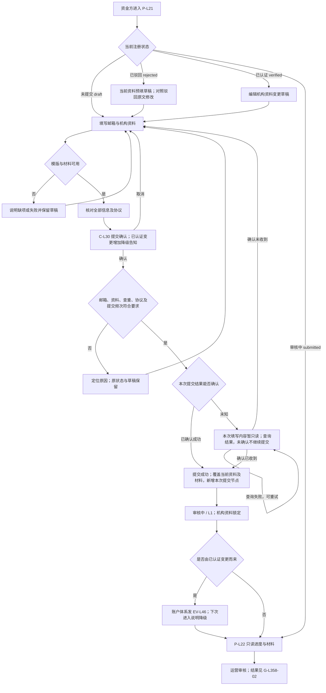
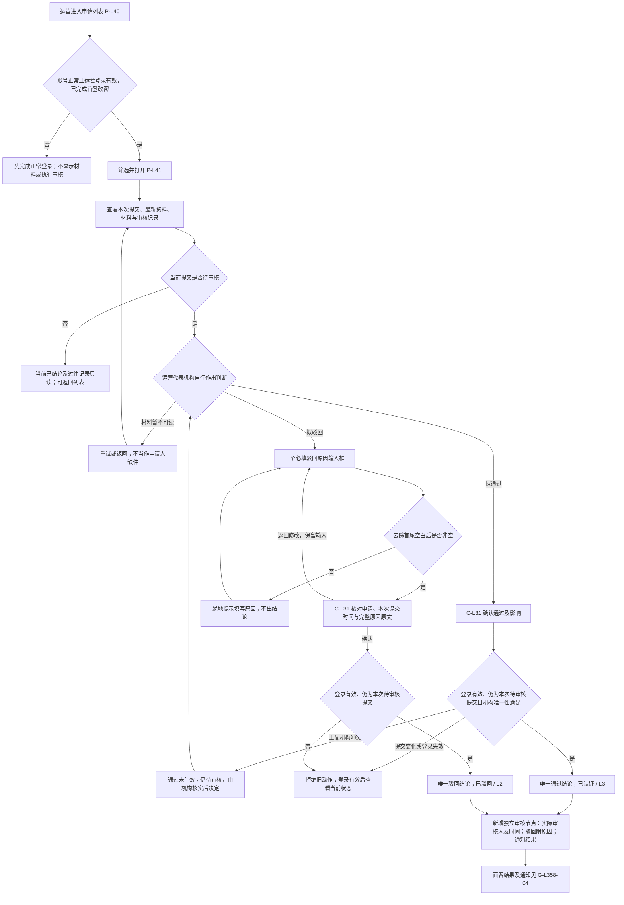
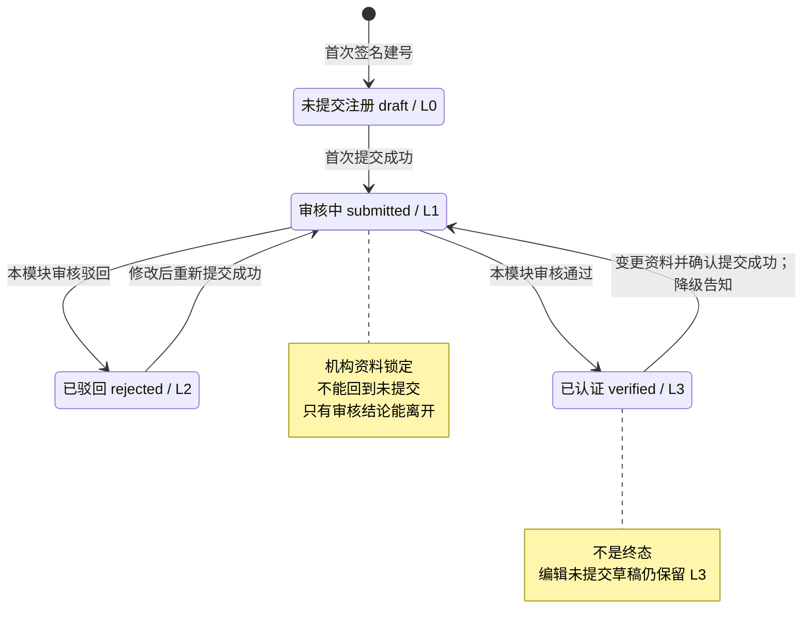
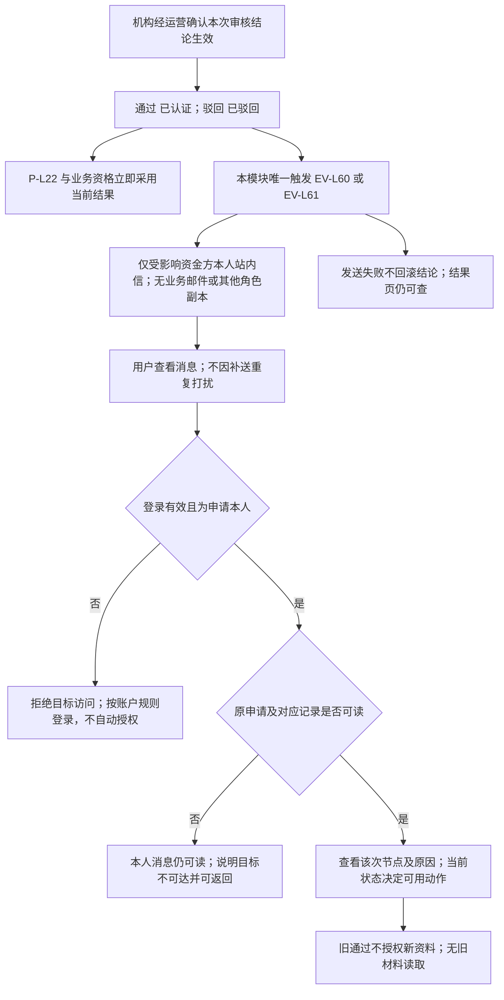
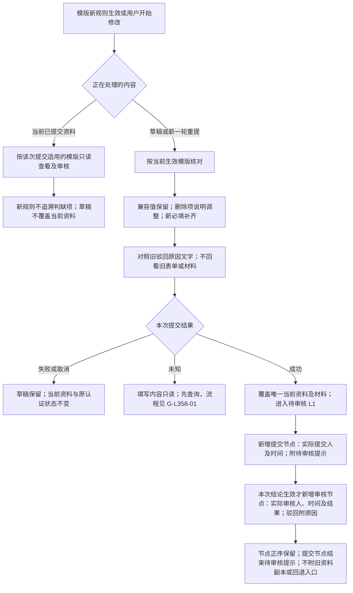
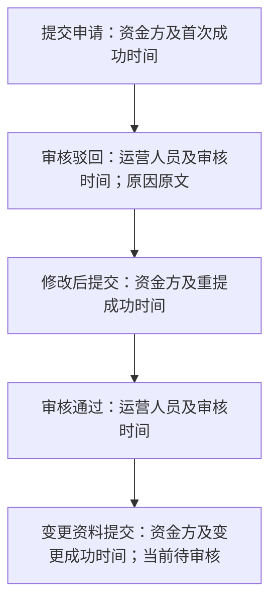

# 资金方机构认证审核 · 流程图与状态机

2026-09-23｜需求评审稿，与[主 PRD](01-资金方机构认证审核-PRD.md#entry)的功能与验收同源。

本册集中本模块的业务流程图与业务对象状态机，与[主 PRD](01-资金方机构认证审核-PRD.md#entry)、[消息通知](03-资金方机构认证审核-消息通知.md#notify-entry)同批阅读。业务规则以主 PRD 第 3 章为唯一来源，验收归主 PRD 第 4 章；本册只表达角色、用户路径和业务状态，不另造规则，不表示页面或组件，承载形式由设计决定（见[统一条款](01-资金方机构认证审核-PRD.md#design-boundary)），也不画协议或程序执行链。图中“通过”结论对应面客“已认证”；“重提”是动作，不是新状态。

| 图号 | 主题 | 功能正文 | 同序验收 |
| --- | --- | --- | --- |
| [G-L358-01](#g-l358-01) | 从填写到提交及重提 | [F-L80](01-资金方机构认证审核-PRD.md#F-L80)、[F-L81](01-资金方机构认证审核-PRD.md#F-L81)、[F-L82](01-资金方机构认证审核-PRD.md#F-L82)、[F-L86](01-资金方机构认证审核-PRD.md#F-L86)、[F-L87](01-资金方机构认证审核-PRD.md#F-L87) | AC-L600～608、618～622、627 |
| [G-L358-02](#g-l358-02) | 运营审核与结果生效 | [F-L83](01-资金方机构认证审核-PRD.md#F-L83)、[F-L84](01-资金方机构认证审核-PRD.md#F-L84)、[F-L88](01-资金方机构认证审核-PRD.md#F-L88)、[F-L89](01-资金方机构认证审核-PRD.md#F-L89) | AC-L609、611～613、623～625、628、630 |
| [G-L358-03](#g-l358-03) | 注册认证状态机与分档 | [F-L85](01-资金方机构认证审核-PRD.md#F-L85)、[F-L86](01-资金方机构认证审核-PRD.md#F-L86)、[F-L87](01-资金方机构认证审核-PRD.md#F-L87) | AC-L614～615、618、621 |
| [G-L358-04](#g-l358-04) | 结果查看与站内通知归属 | [F-L85](01-资金方机构认证审核-PRD.md#F-L85)、[F-L89](01-资金方机构认证审核-PRD.md#F-L89) | AC-L616～617、625、629 |
| [G-L358-05](#g-l358-05) | 模版升级、资料覆盖与提交审核链路 | [F-L80](01-资金方机构认证审核-PRD.md#F-L80)、[F-L82](01-资金方机构认证审核-PRD.md#F-L82)、[F-L86](01-资金方机构认证审核-PRD.md#F-L86)、[F-L87](01-资金方机构认证审核-PRD.md#F-L87)、[F-L88](01-资金方机构认证审核-PRD.md#F-L88) | AC-L602、607、618～619、621、623～624 |

## G-L358-01 从填写到提交及重提

规则：[机构资料模版与材料填写](01-资金方机构认证审核-PRD.md#F-L80)、[机构唯一标识与重复申请](01-资金方机构认证审核-PRD.md#F-L81)、[核对提交与审核锁定](01-资金方机构认证审核-PRD.md#F-L82)、[驳回修改与重新提交](01-资金方机构认证审核-PRD.md#F-L86)、[已认证机构资料变更](01-资金方机构认证审核-PRD.md#F-L87)。注册三步编排归资金方登录与账户体系；机构字段及材料按主 PRD 的同源字段表：机构名称、注册地、标识类型/编号、机构类型、注册地址及机构证明材料必填；材料允许多份，本次拟提交文件全部上传成功且至少保留一份可读取的证明文件；监管机构、金融牌照编号、业务联系人邮箱选填。账户联系邮箱在第 1 步验证，不与材料内业务联系人邮箱混用。

补充：每次成功提交只新增一个提交节点，记录实际提交人和成功时间；首次为“提交申请”，驳回重提为“修改后提交”，已认证变更为“变更资料提交”。最新提交节点可附待审核提示，审核未生效前不生成审核节点；重复成功结果不再次覆盖或增记。提交次序只用于区分各次提交与拒绝旧动作，不展示资料版本。编辑、保存、取消、上传失败或提交失败不覆盖当前已提交资料。编辑变更草稿仍为 L3，编辑驳回草稿仍为 L2。提交结果未知不是新认证状态；确认结果前原注册状态不变、待确认的填写内容只读，重新进入或重新登录仍可继续查询，确认未收到才恢复编辑。材料失败可就地重试，取消替换保留原件，失败/中断后重新进入不视为成功。审核中可按账户流程修改账户联系邮箱，不能修改申请中的业务联系人邮箱。客服联系不改变状态。

## G-L358-02 运营审核与结果生效

规则：[机构唯一标识与重复申请](01-资金方机构认证审核-PRD.md#F-L81)、[运营审核列表与详情](01-资金方机构认证审核-PRD.md#F-L83)、[审核通过与驳回](01-资金方机构认证审核-PRD.md#F-L84)、[提交与审核记录](01-资金方机构认证审核-PRD.md#F-L88)、[失败恢复](01-资金方机构认证审核-PRD.md#F-L89)。机构自行决定材料可接受性及审核结论；平台不设准入评分/判据，资料齐备不等于通过。账号正常、首登改密完成且运营登录有效后即可查询和处置，不区分查询岗与审核岗、不配置权限。审核记录及已出结论的当前资料只读；不分权不取消正常登录、本人资料归属或材料锁定要求。

取消不出结论，返回修改保留输入；失败或结果暂不确定不显示成功。驳回不选择字段/分类、不分别填写中英文或额外补充说明；确认预览、双端详情、修改办理和对应审核记录使用同一原因原文，保留正文换行，切换语言不自动翻译。原因空白校验与字段本身的表单校验是不同规则，不设字段级驳回不取消必填/上传错误定位。同一次提交的后到动作不能覆盖既有结论，也不能因申请已重提而误审最新资料。每次成功提交只形成一个提交节点，其生效结论再形成一个独立审核节点；前一个提交节点的人员和时间不变，仅结束待审核提示，生效结论不可翻转。最新资料保留至下一次成功提交整体替换；过往审核记录不另带材料副本。机构内部政策调整不自动重审或翻转历史结论；不要求向平台提交内部判据，不新建政策配置界面。客服反映材料有误时由运营代表机构核实并使用上述驳回动作，不新增特殊解锁路径。

信息要求按主 PRD 的申请查询与详情规则：P-L40 不展示资料版本；P-L41 须同时可得最新资料、材料、本次结论与完整的“提交与审核记录”，本次审核操作与申请资料分别可辨。各动作从早到晚独立成节点，分别展示实际操作人及时间，驳回原因仅归属对应驳回节点；待审核只在当前提交节点提示，不提前生成审核节点；不提供资料版本或历史资料的读取入口。旧版本链接不提供资料回看，可明确返回最新详情，不冒充当次资料。

## G-L358-03 注册认证状态机与分档

规则：[结果、分档与通知](01-资金方机构认证审核-PRD.md#F-L85)、[驳回修改与重新提交](01-资金方机构认证审核-PRD.md#F-L86)、[已认证机构资料变更](01-资金方机构认证审核-PRD.md#F-L87)。与[登录主干当前资格与审核锁定规则](../v2.0-登录与账户体系/01-登录主干与资产方SSO接入-PRD.md#state-contract)同源，本图聚焦审核闭环。

| 条件 | 可执行动作 | 不允许的结果 |
| --- | --- | --- |
| L0 / 未提交 | 填写、保存、核对提交 | 未提交直接通过或驳回 |
| L1 / 审核中 | 只读进度、材料、联系客服；账户邮箱按账户规则修改 | 编辑申请、撤回、删除、再次提交、回到未提交 |
| L2 / 已驳回 | 看原因、修改、重新提交 | 保存草稿重置为未提交，或不重提直接认证 |
| L3 / 已认证 | 看当前认证、发起资料变更 | 成功变更提交后继续保留 L3，或运营直接改为已驳回 |

T1/T2/T3 是登录主干状态，不与本图混为同一状态轴。有效会话下 L0/L1/L2 为 T2，L3 为 T3；无会话或账户不可用按账户规则回 T1，不清除认证资料、不因审核通过自动恢复登录。停用/恢复操作不在本模块新增。认证生命周期无终态，每次提交已生效的结论不可由后续审核动作改写。

## G-L358-04 结果查看与站内通知归属

规则：[结果、分档与通知](01-资金方机构认证审核-PRD.md#F-L85)、[失败恢复](01-资金方机构认证审核-PRD.md#F-L89)及[消息通知](03-资金方机构认证审核-消息通知.md#notify-entry)。只表达收件范围与业务效果，不定义发送机制。

成功提交的运营待审核通知（EV-L42）与已认证变更降级通知（EV-L46）归资金方登录与账户体系，本模块不重复发、不向资产方或 SPV 新增副本。邮箱变更不改站内信归属，邮箱验证码邮件仍归账户体系。认证关键通知不能被偏好关闭；补送不新增、不恢复未读、不改变原有次序或原时点，新一轮真实结论单独保留。旧消息只读原事实，不能重开旧审核或修改动作；不因机构标准调整发通知或自动改状态。审核员私人身份、原件及私人邮箱不进入消息正文。公共客服仅在真实配置后展示，不编造渠道。UTC 发生时点按偏好显示时区，不改变业务先后。

P-L22 的信息要求与主 PRD 的提交锁定、结果与通知规则一致：状态反馈、提交信息与机构资料同处可得，驳回原因原文及重新提交动作直接可得，审核中可主动查询当前审核结果，“提交与审核记录”属于提交信息并可按需展开，展开后与运营端为同一正序动作记录；提交显示实际资金方账号，审核仅标“运营审核”，各自显示实际时间，原因跟随驳回节点；数量如有则按已发生节点计，不显示审核员身份或历史资料入口；不新增第二套进度入口或重复的动作入口。审核中不承诺天数，客服反馈与驳回原因、原因缺失或加载异常同处可得；无真实渠道时反馈“暂不可用”，不编造联系地址。

## G-L358-05 模版升级、资料覆盖与提交审核链路

规则：[机构资料模版与材料填写](01-资金方机构认证审核-PRD.md#F-L80)、[核对提交与审核锁定](01-资金方机构认证审核-PRD.md#F-L82)、[驳回修改与重新提交](01-资金方机构认证审核-PRD.md#F-L86)、[已认证机构资料变更](01-资金方机构认证审核-PRD.md#F-L87)、[提交与审核记录](01-资金方机构认证审核-PRD.md#F-L88)。模版定义按生效版本管理；用户认证资料不按提交历次留存副本。以下区分当前已提交资料、未提交草稿和提交与审核节点，不规定存储结构。

同图的连续记录示例（箭头表示实际发生先后，不表示自动审核）：

前四个节点构成提交→驳回→重提→通过的完整链路。若认证变更已成功提交、尚未审核，止于第五个提交节点，不追加空白或预计审核节点；发生新结论后才新增下一审核节点。仅编辑、取消、失败或未知结果不增加节点。变更重审被驳回后的重提显示“修改后提交”。同一显示时间仍按真实先后排列，不用版本号对记录分组；面客两个审核节点的操作方统一为“运营审核”，运营端保留实际审核人员，两端时间与原因相同。节点与原因不附历次表单或材料；当前认证状态仍仅按 [G-L358-03](#g-l358-03) 判定。

驳回原因保持单一原文；已有字段级原因及补充说明仅作为过往记录的文字保留，不携带旧字段值或附件，不恢复字段勾选或双语要求。新提交不覆盖旧审核结论，也不能使旧记录打开最新材料。机构唯一标识变更时仍保留原绑定及新旧标识占用关系，这不构成整份历史认证资料。

外部依赖与待决见[主 PRD 第 5 章](01-资金方机构认证审核-PRD.md#questions)：真实材料说明、上传阈值、公共客服与原件读取、运营端权限矩阵接缝、通知共享登记仍待供给，不从演示猜定。页面布局与组件按[统一条款](01-资金方机构认证审核-PRD.md#design-boundary)由设计决定；不新增政策配置、钱包换绑、SPV 认证或机构审核时长承诺。
