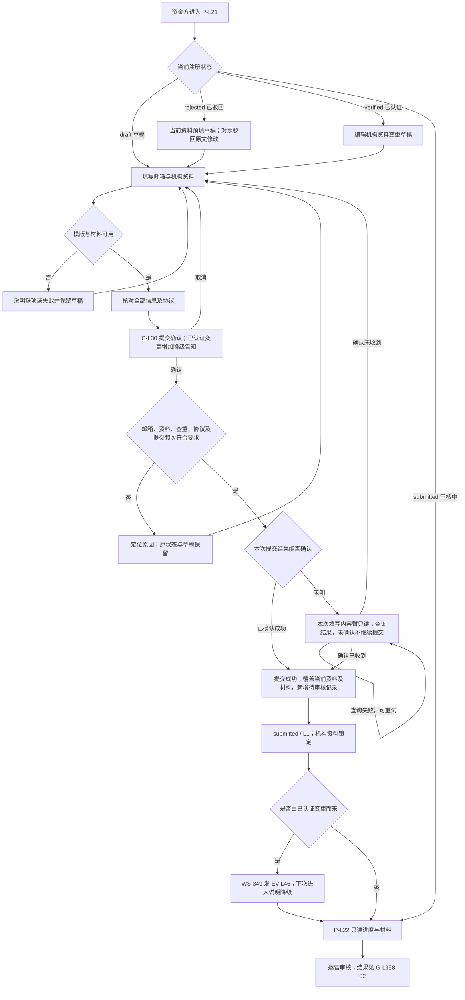
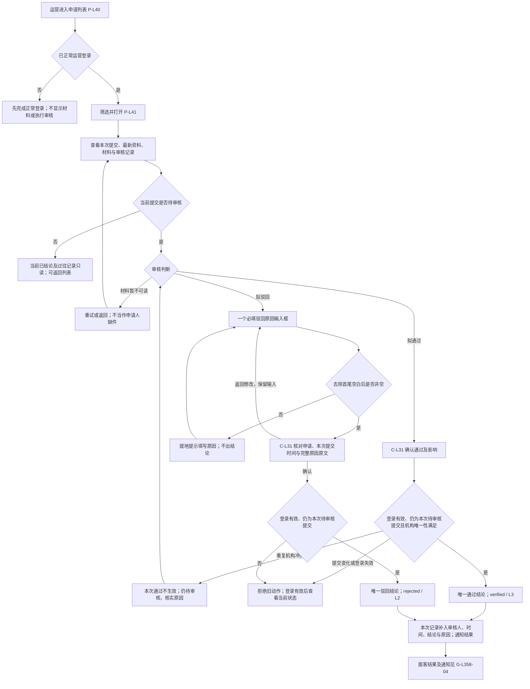
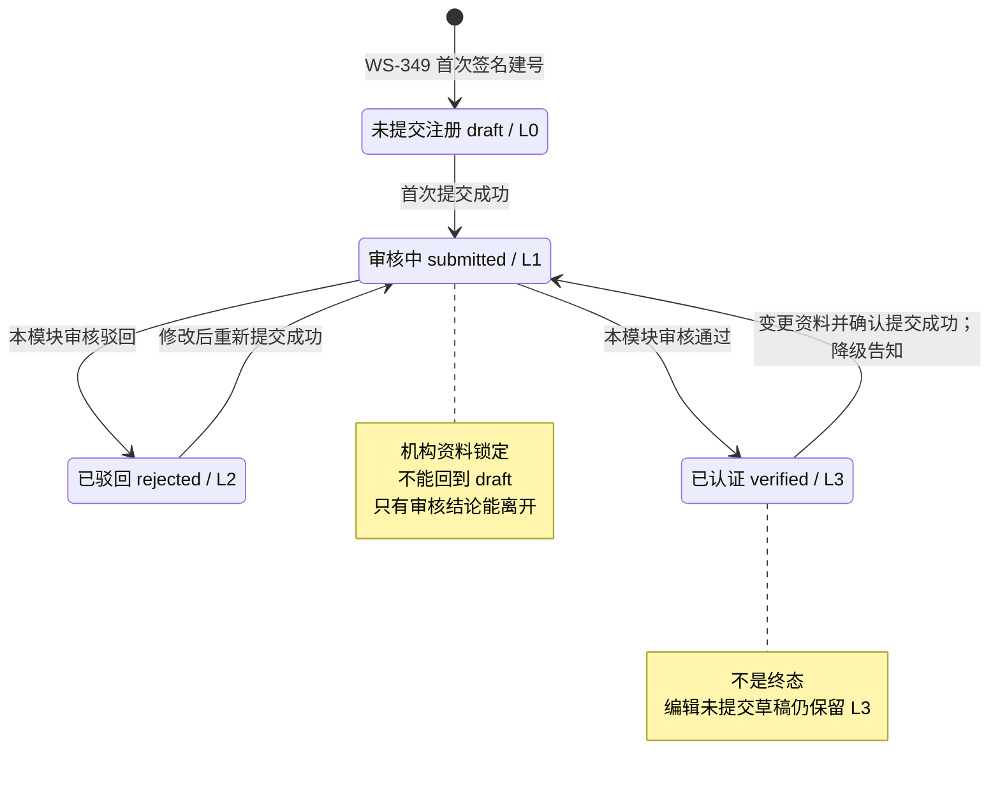
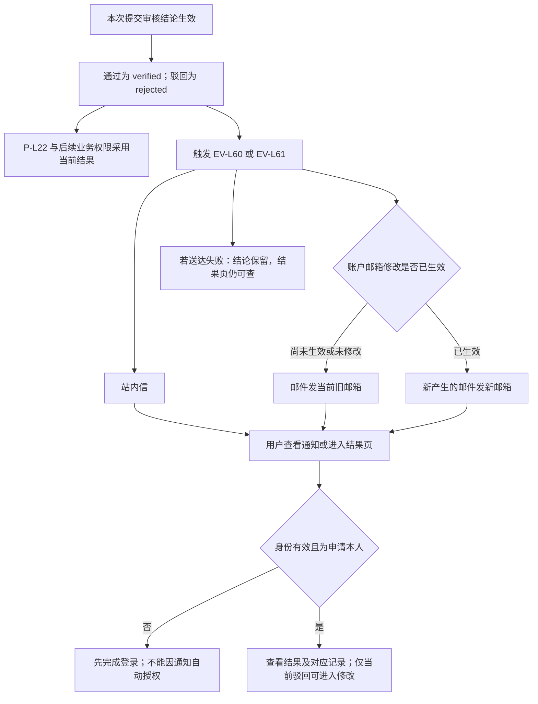
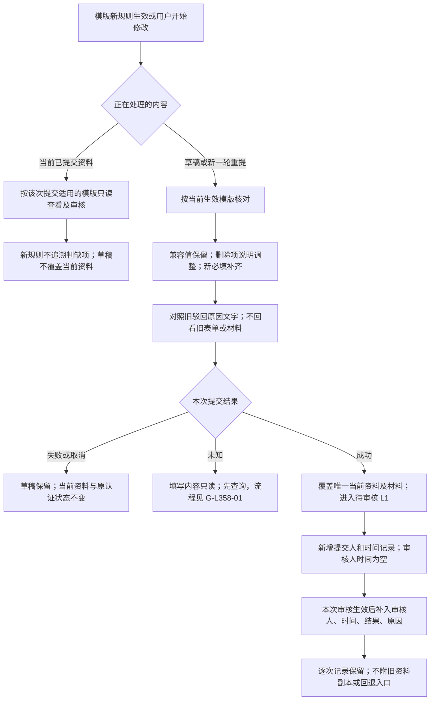

# 资金方机构认证审核 · 流程图与状态机

版本：V2.3｜日期：2026-09-21｜需求：WS-358。

与[《资金方机构认证审核 PRD》](./资金方机构认证审核-PRD.md)同批交付。业务规则以正文第 4 章为准，测试主读正文第 5 章。本册只表达业务角色、用户路径和业务状态，不另造规则。图中“通过”结论对应面客 verified/已认证；“重提”是动作，不是新状态。输入采用正文 S1 的 2026-09-20 四项确认及布局要求、S6/S7 的当前页面与字段（82bd29d），驳回按 S9 用户最新确认及原型 641d4ff：仅一个必填原因输入框，确认后原文回显，既有原因文字只读保留。资料保留与记录按正文 S10 的执行确认：每个资金方仅保留最新已提交资料，成功提交后覆盖；逐次审核记录不附资料副本；无历史资料查看、对比或恢复。SPV 与运营机构同主体，不另建 SPV 认证或运营查询/处置分权。

| 图号 | 主题 | 功能正文 | 验收 |
| --- | --- | --- | --- |
| G-L358-01 | 从填写到提交及重提 | [F-L80](./资金方机构认证审核-PRD.md#f-l80)、[F-L81](./资金方机构认证审核-PRD.md#f-l81)、[F-L82](./资金方机构认证审核-PRD.md#f-l82)、[F-L86](./资金方机构认证审核-PRD.md#f-l86)、[F-L87](./资金方机构认证审核-PRD.md#f-l87) | AC-L600～608、618～622 |
| G-L358-02 | 运营审核与结果生效 | [F-L83](./资金方机构认证审核-PRD.md#f-l83)、[F-L84](./资金方机构认证审核-PRD.md#f-l84)、[F-L88](./资金方机构认证审核-PRD.md#f-l88)、[F-L89](./资金方机构认证审核-PRD.md#f-l89) | AC-L609、611～613、623～625 |
| G-L358-03 | 注册认证状态机与分档 | [F-L85](./资金方机构认证审核-PRD.md#f-l85)、[F-L86](./资金方机构认证审核-PRD.md#f-l86)、[F-L87](./资金方机构认证审核-PRD.md#f-l87) | AC-L614～615、618、621 |
| G-L358-04 | 结果查看与有效通知邮箱 | [F-L85](./资金方机构认证审核-PRD.md#f-l85)、[F-L89](./资金方机构认证审核-PRD.md#f-l89) | AC-L616～617、625 |
| G-L358-05 | 模版升级、资料覆盖与审核记录 | [F-L80](./资金方机构认证审核-PRD.md#f-l80)、[F-L86](./资金方机构认证审核-PRD.md#f-l86)、[F-L88](./资金方机构认证审核-PRD.md#f-l88) | AC-L602、619、623～624 |

## G-L358-01 从填写到提交及重提

规则：[F-L80～82](./资金方机构认证审核-PRD.md#f-l80)、[F-L86](./资金方机构认证审核-PRD.md#f-l86)、[F-L87](./资金方机构认证审核-PRD.md#f-l87)。注册步骤编排沿用 WS-349 P-L21；机构字段及材料按正文 4.1.1 同源表：机构名称、注册地、标识类型/编号、机构类型、注册地址及机构证明材料必填；监管机构、金融牌照编号、业务联系人邮箱选填。账户联系邮箱在第 1 步验证，不与材料邮箱混用。

补充：每次成功提交只新增一条记录，记录提交人和提交时间，待审核时审核人、审核时间和原因为空；重复成功结果不再次覆盖或增记。提交次序只用于区分各次提交与拒绝旧动作，不展示资料版本。编辑、保存、取消、上传失败或提交失败不覆盖当前已提交资料。编辑变更草稿仍为 L3，编辑驳回草稿仍为 L2。提交未知不是新认证状态；确认结果前原注册状态不变、待确认的本次填写内容只读，刷新/重登仍可继续查询，确认未收到才恢复编辑。材料失败可定位重试，取消替换保留原件，失败/中断刷新不视为成功。审核中可按 WS-349 修改账户联系邮箱，不能修改申请中的业务联系人邮箱。客服联系不改变状态。

## G-L358-02 运营审核与结果生效

规则：[F-L81](./资金方机构认证审核-PRD.md#f-l81)、[F-L83～84](./资金方机构认证审核-PRD.md#f-l83)、[F-L88～89](./资金方机构认证审核-PRD.md#f-l88)。正常运营登录后即可查询和处置；不区分查询岗与审核岗，不配置权限。审核记录及已出结论的当前资料只读，不能取消正常登录、本人资料归属或材料锁定要求。

取消不出结论，返回修改保留输入；失败或结果暂不确定不显示成功。新驳回不选择字段/分类、不分别填写中英文或额外补充说明；确认预览、双端详情、修改页和对应审核记录使用同一原因原文，保留正文换行，切换语言不自动翻译。空白校验与字段本身的表单校验是不同规则，取消字段级驳回不取消必填/上传错误定位。同一次提交的后到动作不能覆盖既有结论，也不能因申请已重提而误审最新资料。每次成功提交只对应一条记录，生效结论不可翻转。最新资料保留至下一次成功提交整体替换；过往审核记录不另带材料副本。客服反映材料有误时由运营核实并使用上述驳回动作，不新增特殊解锁路径。

呈现沿用正文 D-L187：P-L40 列表不展示版本；P-L41 详情审核记录在最下方，左右布局时右侧只放审核操作，材料和机构信息放主内容。审核记录展示提交人、提交时间、审核人、审核时间、结果及驳回原因；不显示版本列或历史资料操作。旧版本链接不提供资料回看，可明确返回最新详情，不冒充当次资料。

## G-L358-03 注册认证状态机与分档

规则：[F-L85](./资金方机构认证审核-PRD.md#f-l85)、[F-L86](./资金方机构认证审核-PRD.md#f-l86)、[F-L87](./资金方机构认证审核-PRD.md#f-l87)。与 WS-349 07 图册 §3.2 及 WS-348 主干 §6.3 同源，本图聚焦审核闭环。

| 条件 | 可执行动作 | 不允许的结果 |
| --- | --- | --- |
| L0 / draft | 填写、保存、核对提交 | 未提交直接通过或驳回 |
| L1 / submitted | 只读进度、材料、联系客服；账户邮箱按账户规则修改 | 编辑申请、撤回、删除、再次提交、回 L0 |
| L2 / rejected | 看原因、修改、重新提交 | 保存草稿重置为 L0，或不重提直接认证 |
| L3 / verified | 看当前认证、发起资料变更 | 成功变更提交后继续保留 L3，或运营直接改为 rejected |

T1/T2/T3 是登录主干状态，不能与本图混为同一状态轴。有效会话下 L0/L1/L2 为 T2，L3 为 T3；无会话或账户不可用按 WS-349 回 T1，不清除认证资料、不因审核通过自动恢复登录。停用/恢复操作不在本模块新增。认证生命周期无终态，每次提交记录的生效结论则不可从审核页面改写。

## G-L358-04 结果查看与有效通知邮箱

规则：[F-L85](./资金方机构认证审核-PRD.md#f-l85)、[F-L89](./资金方机构认证审核-PRD.md#f-l89)。本图只表达通知接收与业务效果，不规定送达机制。

本轮不使用模版内业务联系人邮箱代替账号联系邮箱；邮箱改变不重发历史通知。提交成功 EV-L42、变更提交降级 EV-L46 归 WS-349，不由本模块重复发送。驳回通知和引导不要求问题数量，查看原因进入 P-L22 读取原文；不将单一原因解析成字段问题或分类。旧通知对应以前的审核记录，只可读当次结果与原因，不提供旧材料；进入当前申请时重新判断状态，不将旧通过用于新资料。邮件不带完整敏感材料，不透露审核员个人信息。

P-L22 呈现与正文 4.3/4.6 一致：上下分区、驳回原因及重提在首屏，当前审核中刷新位于状态提示内，审核记录在提交信息内默认折叠，面客不显示审核员身份或历史资料入口；不恢复进度侧栏或底部快捷行。审核中不承诺天数，客服靠近驳回/原因缺失/加载异常；无真实渠道时反馈“暂不可用”，不编造联系地址。依据为正文 S1 第 4 项、S6 最新布局及 S8 原有不承诺口径。

## G-L358-05 模版升级、资料覆盖与审核记录

规则：[F-L80](./资金方机构认证审核-PRD.md#f-l80)、[F-L86](./资金方机构认证审核-PRD.md#f-l86)、[F-L88](./资金方机构认证审核-PRD.md#f-l88)。模版定义仍按生效版本管理；用户认证资料不按提交历次留存副本。以下区分当前已提交资料、未提交草稿和逐次审核记录，不规定存储结构。

新原因保持单一原文；已有字段级原因及补充说明仅作为过往记录的文字保留，不携带旧字段值或附件，不恢复字段勾选或双语要求。新提交不覆盖旧审核结论，也不能使旧记录打开最新材料。机构唯一标识变更时仍保留 F-L87 的原绑定及新旧标识占用关系，这不构成整份历史认证资料。

未定边界见[正文第 6 章](./资金方机构认证审核-PRD.md)：机构证明材料的具体可接受证件与审核判据、未定细化校验及字数上限、上传阈值、真实客服渠道。原因分类目录不再需要。字段表及必填性已采纳；DEMO-2 删除联系人邮箱和监管转必填仅为升级演示，不据此改本期字段。SPV 不另建认证已收口；审核沿用不承诺天数的说明，不在图中新增超时判定或虚构联系方式。
