# 资产端 / 资产管理端 · 账户与登录 PRD（含全局国际化基线）

## 1. 文档信息

| 项目 | 内容 |
| --- | --- |
| 文档名称 | 资产端 / 资产管理端 · 账户与登录产品需求文档（含全局国际化基线） |
| 对应需求 | WS-302（父需求 WS-296「资产端、资产管理端-登录和认证」） |
| 上游输入 | 《Carloha 资产端与资产管理端登录、认证及通知需求诊断简报》V1.0 |
| 编写人 | 许楚清（需求分析师） |
| 文档语言 | 中文（界面文案给出中英对照） |
| 覆盖端 | 资产端 Web、资产管理端 Web |
| 关联需求 | WS-301「资产管理端 · 协议管理模块」——协议正文、版本、生效与重新同意规则由该需求定义，本文档只消费其「当前生效版本」口径；WS-303 个人认证——本文档只定义发起认证前的凭据完备性校验与引导挂载点，不展开认证流程 |

> 说明：本文中的功能口径与安全口径均已由需求方确认，作为正文规则直接执行，不再保留 `[待确认]` / `[建议值]` 标记。第 19 章给出全部已确认口径的汇总表；截至本版本已无开放问题。
> 文中个别性能与体验类目标值（如接口响应时间、可用性、滑块一次通过率）标注为「目标值」，需在联调与灰度阶段校准，不影响功能逻辑与验收通过与否。
> 第 12 章的三条安全条款（会话失效、登录锁定、验证码人机校验与限频）为强制条款，不可省略、不可降级。

---

## 2. 背景与目标

### 2.1 背景

平台面向国际资产参与方，资产端用户同时持有邮箱与 EVM 钱包两类身份凭据，资产管理端由平台分配账号运营。当前需要先把「账户如何建立、如何登录、如何找回、如何变更」这条最底层的链路定义清楚，其余业务模块（实名认证、消息通知、资产业务）都依赖本模块产出的账户主体与登录态。

在开户环节，平台采取**无独立注册流程**的设计：用户首次用邮箱验证码或钱包签名登录时，系统自动为其建立账户。这样做的原因是——这两条路径本身就已经完成了凭据所有权的证明（能收到验证码即证明控制该邮箱，能签名即证明控制该钱包），再让用户走一遍「注册」表单只是重复劳动，且会在「我到底该点登录还是注册」上制造无谓的选择成本。

同时，中英双语与国际化展示口径是全平台的基线能力，若不在本模块一次性定义，后续每个模块都会各自实现一套语言/时区/金额/地址展示口径，造成割裂。因此国际化基线在本文档统一定义，其他需求直接引用。

### 2.2 本期目标

1. **开户零门槛**：不存在独立的注册流程与注册页；用户首次用邮箱验证码或钱包签名登录即自动建号，其余信息在引导页按需补齐。
2. 三种登录方式（邮箱验证码、邮箱密码、钱包签名）指向**同一个账户**，用户不会因为换了入口而进到不同账户。
3. **凭据门槛只设一道**：邮箱与钱包地址两项在**发起个人认证时**必须同时具备，缺哪项就地引导补齐；**密码是可选凭据**，任何时候都不阻塞用户。
4. 用户丢失任一凭据都有明确的自助找回路径：丢密码走邮箱，丢邮箱走钱包签名。
5. 敏感变更（密码、邮箱、钱包地址）具备再认证与会话失效保护，凭据泄露不等于账户被接管。
6. 管理端账号由系统分配、以工作邮箱作为登录账号，初始密码线下交付，首次登录强制重置密码，未重置不得使用任何管理功能；系统任何时刻至少保留一个可用管理员。
7. 全平台**默认英文**、中英可即时切换、偏好在未登录态与已登录态均持久化；时间、数字、金额、链上地址与哈希有统一展示口径。

### 2.3 本期不做

| 不做项 | 说明 |
| --- | --- |
| 独立的注册流程与注册页 | 已合并进登录。历史注册路由重定向到登录页。 |
| 一个账号管理多家企业 | 后期迭代。本期数据模型预留扩展位，但不出任何功能与界面。 |
| 实名认证（KYC）与企业认证（KYB）、审核流 | 归属 WS-303 与对应子需求。本文档只定义「发起个人认证」前的凭据完备性校验与引导挂载点。 |
| 站内消息与通知中心 | 归属对应子需求。本文档涉及的安全通知只定义「需要发出」，不定义通知中心形态。 |
| 协议正文维护、版本管理、生效与重新同意的判定规则 | 归属 WS-301。本文档只写**资产端**前台的勾选、同意提交、强制重新同意弹窗三段用户侧交互。 |
| **跟随浏览器语言自动判定** | **本期不做**。未登录且从未手动切换过的用户一律英文，不读取 `navigator.language`。13.3 的判定框架已预留扩展位，后续需要时插入一级即可。 |
| MFA（TOTP / Passkey）、设备管理、地域风险策略 | 后续迭代，本期不做。 |
| 手机号 / 短信通道 | 本期不引入。 |
| 第三方社交登录、企业 SSO | 本期不引入。 |
| 管理端多角色划分 | 本期管理端只有「管理员」一种角色，所有管理员权限等同。 |
| 管理端「创建第一个账号」的自举入口 | 第一个管理员账号由开发在部署环节写入，界面不提供任何绕过登录的初始化页面。 |
| 区块浏览器映射表的管理端配置页 | 本期由部署配置文件维护。 |
| **营销邮件订阅** | **本期不做**。登录页不提供订阅勾选，账户上不存储订阅状态，本模块不产生任何营销订阅数据。 |
| **沉默账号清理** | **本期不做**。建号后长期未补全凭据、未再登录的账户不做自动清理或归档，保留观察。 |
| 历史密码代数比对 | 本期仅比对原密码与初始密码，不做「禁止与最近 N 次密码相同」。 |
| 滑块人机校验的无障碍替代方案 | 本期不提供，作为已知缺口记录在第 15 章。 |
| 递增式锁定时长、表单草稿暂存、双凭据丢失的人工恢复兜底 | 本期均不做。 |

---

## 3. 范围与边界

### 3.1 已确认的产品决策（直接作为约束）

| # | 决策 |
| --- | --- |
| 1 | 账户模型：邮箱与钱包地址均全局唯一，且与账户一对一绑定。 |
| 2 | 支持链：EVM 系列。 |
| 3 | 钱包登录一律采用链上消息签名验证（链下签名消息，不发起交易）。 |
| 4 | **首次用邮箱验证码或钱包签名登录即自动建号**，不存在独立注册流程；其余信息在引导页补齐，可跳过。 |
| 5 | **邮箱密码登录不参与自动建号**（密码不构成邮箱所有权证明）。 |
| 6 | **邮箱 + 钱包地址两项是发起个人认证的前置条件**，必须同时具备；**密码为可选凭据**，任何时候都不作为门槛。 |
| 7 | 账户恢复：钱包签名验证通过即可修改邮箱。 |
| 8 | 敏感变更安全：按需求诊断简报中的最低建议执行。 |
| 9 | 管理端运营：管理员用分配的账号密码登录，首次登录直接进入密码重置。 |
| 10 | 国际化与合规口径必须在 PRD 中写明，不留白。 |
| 11 | 多企业本期不做；数据模型可预留扩展，不出功能。 |
| 12 | 退出登录、修改密码、重置密码、修改邮箱、修改钱包地址成功后，旧会话全部失效（含当前设备与其他所有设备）。 |
| 13 | 密码登录失败或钱包签名验证失败连续 5 次进入账户锁定；登录成功或锁定到期后失败计数清零。 |
| 14 | 所有发送邮箱验证码的入口，发送前统一先过滑块人机校验弹窗，并施加发送限频。 |
| 15 | 密码复杂度：8–20 字符，至少包含 1 个英文字母和 1 个数字。 |
| 16 | 新密码不得与原密码相同，管理端账号另不得与初始密码相同。 |
| 17 | 管理端登录不以同意用户协议为前置，管理端登录页无协议勾选。 |
| 18 | 管理端登录账号采用工作邮箱；初始密码线下交付，不通过邮件下发。 |
| 19 | 管理端本期只有「管理员」一种角色，所有管理员权限等同；**不允许停用或删除最后一个可用管理员**。 |
| 20 | 第一个管理端账号由开发在部署环节创建，界面无自举入口。 |
| 21 | 滑块人机校验自研；钱包连接走三方 SDK 服务，具体选型由技术决定。 |
| 22 | **语言默认英文**；中英可切换，切换即时生效并持久化；本期不跟随浏览器语言。 |

### 3.2 与其他需求的接口

| 依赖方向 | 内容 | 归属 |
| --- | --- | --- |
| 本模块 → 其他模块 | `account_id`（不可变账户主键）、登录态与会话、账户状态、语言与时区偏好 | 本文档定义 |
| 本模块 ← WS-301 | 「当前生效协议版本」「是否强制重新同意」两个口径 | WS-301 定义，本模块消费 |
| 本模块 → WS-303 个人认证 | 「发起个人认证」按钮上的凭据完备性前置校验与就地补齐引导 | 本文档定义校验与引导；认证流程本身归 WS-303 |
| 本模块 → 各业务模块 | 业务功能的放行**以认证状态为准**，不以本模块的凭据完备状态为准 | 边界声明，见 7.5.3 |
| 本模块 → 通知模块 | 安全事件触发点清单（见 12.5） | 本文档只列事件，不定义通知形态 |
| 本模块 → 通知 / 营销相关模块 | **本期不采集营销订阅意愿，不产生任何营销订阅数据**：登录页无订阅勾选，账户对象上也没有对应字段 | 若后续要发营销类邮件，其发送资格判定不能读取本模块的账户字段，需由该模块自行设计订阅采集与退订机制；本模块不提供、也不预留该字段 |
| 本模块 → 技术选型 | 钱包连接 SDK 与支持钱包清单 | PRD 只写能力要求，不约束具体选型 |
| 本模块 → 部署 | 第一个管理员账号的初始化、区块浏览器映射表配置 | 见 7.7.1 与 13.6 |

---

## 4. 用户角色与场景

### 4.1 角色

| 角色 | 所在端 | 描述 | 本模块内的核心诉求 |
| --- | --- | --- | --- |
| 资产端首次到访用户 | 资产端 | 尚无账户，从登录页进入 | 用手上已有的一种凭据（邮箱或钱包）直接进门，不必先填一份注册表 |
| 资产端已有账户用户 | 资产端 | 日常登录与维护 | 三种入口都能进同一个账户；改密码 / 改邮箱 / 改钱包时清楚知道后果 |
| 资产端准备做认证的用户 | 资产端 | 要发起个人认证 | 清楚知道还差哪项凭据，并能在当前页面就地补齐，不被踢走 |
| 资产端失联用户 | 资产端 | 丢失邮箱访问权或忘记密码 | 有明确的自助找回路径，不需要联系客服 |
| 管理员 | 管理端 | 使用系统分配的工作邮箱账号，本期唯一的管理端角色 | 首次拿到账号能顺利改密上岗；忘记密码能自助重置；可创建账号、可解除账户锁定 |
| 国际用户（跨语言 / 跨时区） | 双端 | 默认看到英文，按需切中文 | 语言切换即时生效并被记住；时间与金额按本地口径展示 |

### 4.2 用户故事

| # | 角色 | 用户故事 | 对应功能 |
| --- | --- | --- | --- |
| US-01 | 首次到访用户 | 作为一个只有邮箱的新用户，我希望在登录页填邮箱、收一次验证码就直接进去，系统自动帮我建好账户，我不必先找注册入口 | 邮箱验证码首次登录自动建号 |
| US-02 | 首次到访用户 | 作为一个 Web3 用户，我希望连上钱包签个名就直接进去，不必留邮箱、也不必走注册 | 钱包签名首次登录自动建号 |
| US-03 | 首次到访用户 | 作为刚被自动建号的用户，我希望系统明确告诉我「账户已创建」，并说明还缺什么，而不是让我一头雾水 | 建号后引导页 |
| US-04 | 已有账户用户 | 作为已有账户的用户，我希望无论用验证码、密码还是钱包登录，进的都是同一个账户和同一份数据 | 三方式统一登录 |
| US-05 | 已有账户用户 | 作为没设过密码的用户，我不希望被迫设密码；我想设的时候能随时在账户设置里设 | 密码为可选凭据 |
| US-06 | 准备做认证的用户 | 作为要发起个人认证的用户，我希望在缺凭据时能在当前位置直接补上，补完就继续，而不是被踢到别的页面再找回来 | 认证前置校验与就地引导 |
| US-07 | 跳过引导的用户 | 作为暂时不想补全信息的用户，我希望仍能正常浏览和使用平台，只在真的要做认证时才被拦住 | 受限态收敛 |
| US-08 | 已有账户用户 | 作为忘记密码的用户，我希望用邮箱自助重置密码 | 忘记密码 |
| US-09 | 失联用户 | 作为丢失邮箱但还持有钱包的用户，我希望用钱包签名证明我是账户所有者，然后换成新邮箱 | 账户恢复 |
| US-10 | 已有账户用户 | 作为改了密码的用户，我希望其他设备上的登录立刻失效，这样即使有人偷看过我的会话也没用 | 会话全局失效 |
| US-11 | 已有账户用户 | 作为账户被人尝试爆破的用户，我希望系统在连续失败后锁住账户并通知我 | 登录锁定 |
| US-12 | 任意用户 | 作为收验证码的用户，我不希望别人拿我的邮箱地址无限刷验证码轰炸我 | 滑块人机校验 + 发送限频 |
| US-13 | 管理员 | 作为拿到线下交付的初始密码的管理员，我希望第一次登录就被引导改掉初始密码，改完才能干活 | 首登强制重置 |
| US-14 | 管理员 | 作为忘记管理端密码的管理员，我希望通过工作邮箱自助重置，不必找别人 | 管理端忘记密码 |
| US-15 | 管理员 | 作为要停用同事账号的管理员，我希望系统在我可能把最后一个管理员也停掉时拦住我 | 最后一个管理员保护 |
| US-16 | 国际用户 | 作为国际用户，我希望打开就是英文；切成中文后下次换台电脑登录还是中文 | 国际化基线 |
| US-17 | 国际用户 | 作为跨时区用户，我希望所有时间都带时区标注，不用自己换算 | 时区展示口径 |
| US-18 | 已有账户用户 | 作为查看钱包地址的用户，我希望能一键跳到区块浏览器核对，而不是自己复制去搜 | 区块浏览器跳转 |

---

## 5. 信息架构与页面流

### 5.1 页面清单

**资产端（未登录）**

| 编号 | 页面 | 说明 |
| --- | --- | --- |
| P-A01 | 登录页 | **资产端唯一入口**。三种登录方式在同一页面切换（Tab / 分区）；验证码与钱包两条路径承担首次建号 |
| P-A03 | 忘记密码 - 提交邮箱 | 输入邮箱，发送重置验证码 |
| P-A04 | 忘记密码 - 设置新密码 | 验证码校验通过后设置新密码 |
| P-A05 | 账户恢复 - 钱包签名 | 丢失邮箱时的入口，**不参与自动建号** |
| P-A06 | 账户恢复 - 绑定新邮箱 | 签名通过后设置新邮箱 |
| P-A07 | 账户锁定提示页 / 态 | 锁定状态下的统一提示（可作为登录页内的状态态） |

> **P-A02（原注册页）已取消。** 不再存在独立注册页与「没有账户？去注册」跳转。历史注册路由（如 `/register`、`/signup`）一律重定向到 P-A01 登录页，避免外部已有链接失效后落到 404。

**资产端（已登录）**

| 编号 | 页面 | 说明 |
| --- | --- | --- |
| P-A10 | 建号后引导页 | 自动建号后首次进入时展示，引导补另一项凭据（必要）与设置密码（可选），可跳过 |
| P-A11 | 账户设置 - 安全 | 邮箱、密码、钱包地址的查看与变更/补设入口 |
| P-A12 | 修改邮箱流程 | 再认证 → 旧邮箱验证（可用时）→ 新邮箱验证 |
| P-A13 | 修改 / 设置密码流程 | 再认证 → 设置新密码 |
| P-A14 | 修改钱包地址流程 | 再认证 → 旧钱包签名（可用时）→ 新钱包签名 |
| P-A15 | 账户设置 - 偏好 | 语言、时区 |

**全局组件（双端复用）**

| 编号 | 组件 | 说明 |
| --- | --- | --- |
| C-01 | 滑块人机校验弹窗 | 所有发送邮箱验证码的入口前置，自研 |
| C-02 | 协议勾选行 | **仅资产端登录页**，全站只出现这一处 |
| C-03 | 强制重新同意弹窗 | **仅资产端**，登录后拦截 |
| C-04 | 语言切换器 | 顶部导航 / 登录页页脚 |
| C-05 | 会话失效提示 Toast | 被踢出时的统一提示 |
| C-06 | 钱包连接与签名面板 | 连接钱包 → 请求签名 → 结果，基于三方 SDK 实现 |
| C-07 | 地址 / 哈希展示组件 | 缩略、复制、区块浏览器跳转 |
| C-08 | 常驻补全提示条 | 凭据未齐时全局展示，可折叠、不可永久关闭 |
| C-09 | 凭据补齐弹层 | 发起个人认证时缺凭据的就地补齐，补完原地继续 |

**资产管理端**

| 编号 | 页面 | 说明 |
| --- | --- | --- |
| P-M01 | 管理端登录页 | 工作邮箱 + 密码，**无用户协议勾选**、无注册入口 |
| P-M02 | 首登强制重置密码页 | 未完成不得跳转任何其他页面 |
| P-M03 | 管理端忘记密码 - 提交工作邮箱 | |
| P-M04 | 管理端忘记密码 - 设置新密码 | |
| P-M05 | 管理端账户设置 - 修改密码 | |
| P-M06 | 账户管理 | 创建管理端账号、停用/恢复账号、手工解除账户锁定；所有管理员均可访问；受最后一个管理员保护约束 |

### 5.2 资产端主页面流

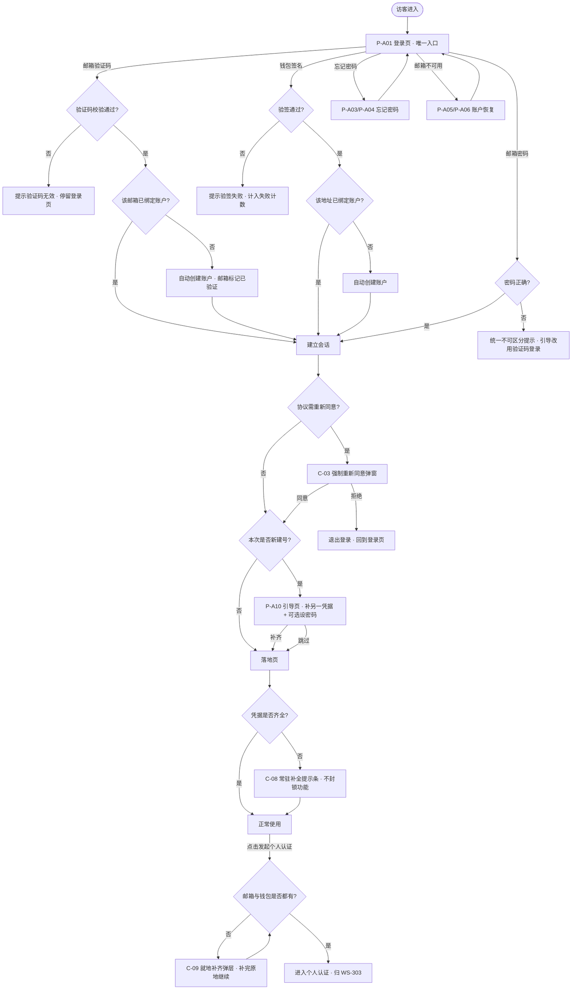

---

## 6. 功能清单

| 模块 | 编号 | 功能点 | 优先级 | 验收口径 |
| --- | --- | --- | --- | --- |
| 首次登录建号 | F-01 | 邮箱验证码首次登录自动建号 | P0 | 验证码通过且邮箱未绑定 → 建号并登录，邮箱视为已验证 |
| 首次登录建号 | F-02 | 钱包签名首次登录自动建号 | P0 | 验签通过且地址未绑定 → 建号并登录 |
| 首次登录建号 | F-03 | 邮箱密码登录不参与建号 | P0 | 邮箱不存在或未设密码时不建号，返回不可区分的统一提示 |
| 首次登录建号 | F-04 | 建号后引导页 | P0 | 明确告知账户已创建、还缺什么；可跳过 |
| 登录 | F-05 | 三方式指向同一账户 | P0 | 同一 `account_id` 下任一凭据登录后数据一致 |
| 凭据管理 | F-06 | 密码为可选凭据 | P0 | 任何流程都不因未设密码而阻塞；账户设置中可随时补设 |
| 凭据管理 | F-07 | 常驻补全提示条 | P0 | 凭据未齐时全局展示，可折叠、不可永久关闭，不封锁功能 |
| 凭据管理 | F-08 | 发起个人认证的凭据完备性前置校验与就地引导 | P0 | 邮箱与钱包缺任一项则拦截，弹层就地补齐，补完原地继续 |
| 协议交互 | F-09 | 资产端登录页协议勾选与同意提交 | P0 | 未勾选不可提交；全站只此一处勾选；**管理端不适用** |
| 协议交互 | F-10 | 资产端强制重新同意弹窗 | P0 | 登录后拦截；同意后放行，拒绝则退出登录 |
| 找回与恢复 | F-11 | 忘记密码（资产端） | P0 | 邮箱验证码校验通过后设置新密码；**不建号** |
| 找回与恢复 | F-12 | 账户恢复（钱包签名换邮箱） | P0 | 签名验证通过即可绑定新邮箱；**不建号** |
| 账户变更 | F-13 | 修改邮箱 | P0 | 再认证 + 新邮箱验证；旧邮箱可用时需旧邮箱确认 |
| 账户变更 | F-14 | 修改 / 设置密码 | P0 | 再认证 + 新密码规则校验 |
| 账户变更 | F-15 | 修改钱包地址 | P0 | 再认证 + 旧钱包签名（可用时）+ 新钱包签名 |
| 账户变更 | F-16 | 新密码与原密码 / 初始密码比对 | P0 | 相同则拒绝，双端全部设密码入口生效 |
| 安全与风控 | F-17 | 会话全局失效 | P0 | 触发操作成功后该账户所有会话（含当前设备）失效 |
| 安全与风控 | F-18 | 登录失败锁定 | P0 | 连续 5 次凭据校验失败锁定；成功或到期清零 |
| 安全与风控 | F-19 | 滑块人机校验（自研） | P0 | 所有邮箱验证码发送入口前置滑块，服务端校验票据与轨迹 |
| 安全与风控 | F-20 | 验证码发送限频 | P0 | 邮箱 / IP / 设备三维度限频 |
| 安全与风控 | F-21 | 安全事件通知 | P1 | 敏感变更成功后向相关邮箱发出安全通知 |
| 管理端 | F-22 | 管理端工作邮箱 + 密码登录 | P0 | 登录账号即工作邮箱；无协议勾选；无验证码/钱包登录；无自动建号 |
| 管理端 | F-23 | 首登强制重置密码 | P0 | 未完成重置不得访问任何其他管理页面 |
| 管理端 | F-24 | 管理端忘记密码 | P0 | 工作邮箱验证码 → 设置新密码 |
| 管理端 | F-25 | 管理端账号创建与初始密码线下交付 | P0 | 初始密码仅在创建成功页展示一次，7 天有效；不发任何邮件 |
| 管理端 | F-26 | 最后一个可用管理员保护 | P0 | 停用/删除会使可用管理员归零时，服务端拒绝并提示 |
| 管理端 | F-27 | 手工解除账户锁定 | P1 | 所有管理员均可执行，操作留痕 |
| 国际化 | F-28 | 中英语言切换与即时生效 | P0 | 切换后当前页面不刷新即变更 |
| 国际化 | F-29 | 语言判定优先级与双态持久化 | P0 | 手动偏好 > 账户偏好 > 英文默认；不读浏览器语言 |
| 国际化 | F-30 | 时区偏好与时间展示口径 | P0 | 存 UTC，展示本地并带时区标注 |
| 国际化 | F-31 | 数字 / 金额 / 地址 / 哈希展示口径 | P0 | 按第 13 章规则统一渲染 |
| 国际化 | F-32 | 区块浏览器跳转 | P1 | 地址与哈希提供跳转入口，无对应浏览器时降级 |

---
## 7. 模块详情

### 7.1 M1 · 首次登录即注册（自动建号）

> **本模块取代原「资产端注册」。** 平台不存在独立的注册流程、注册页与注册按钮；开户是登录的副作用，而不是一个独立动作。

#### 7.1.1 自动建号的适用范围

| 登录路径 | 是否自动建号 | 判定条件 |
| --- | --- | --- |
| 邮箱验证码登录 | ✅ 是 | 验证码校验通过 **且** 该邮箱未绑定任何账户 |
| 钱包签名登录 | ✅ 是 | 验签通过 **且** 该地址未绑定任何账户 |
| 邮箱密码登录 | ❌ 否 | 见 7.1.2 |
| 忘记密码 | ❌ 否 | 该入口是找回意图，不是开户意图 |
| 账户恢复（钱包签名换邮箱） | ❌ 否 | 该入口是恢复意图，地址未绑定时明确报错 |
| 管理端登录 | ❌ 否 | 管理端账号一律由管理员创建 |

**为什么只有验证码与签名两条路径可以建号**

这两条路径在建号那一刻，用户已经完成了对该凭据的**所有权证明**：

- 能收到并输入验证码 → 证明其控制该邮箱；
- 能对服务端下发的一次性消息签名 → 证明其控制该钱包私钥。

有了所有权证明，自动建号就不会造成「替别人抢注」。这也是把注册合并进登录的前提——没有所有权证明的路径，一律不得建号。

#### 7.1.2 邮箱密码登录为什么不建号

密码**不构成对邮箱的所有权证明**：任何人都可以对一个从未见过的邮箱地址编造一个密码。如果密码路径也能建号，攻击者只要输入受害者的邮箱和任意密码，就能把这个邮箱抢注成自己的账户，等真正的邮箱主人来用验证码登录时，会发现邮箱已被占用。因此：

- 邮箱不存在 → **不建号**；
- 邮箱存在但从未设置过密码 → **不建号**，也不放行；
- 邮箱存在且有密码但密码错误 → 拒绝。

上述三种情况**返回完全相同的、不可区分的提示**，见 7.2.2。

#### 7.1.3 建号时写入的内容

| 建号路径 | 写入 | 未写入 |
| --- | --- | --- |
| 邮箱验证码 | `email`、`email_verified_at`（当前时间）、`created_via = email_code`、协议同意记录、语言与时区偏好 | `wallet_address`、密码 |
| 钱包签名 | `wallet_address`、`wallet_bound_at`、`created_via = wallet_signature`、协议同意记录、语言与时区偏好 | `email`、密码 |

- 建号后账户状态为 `incomplete`（邮箱与钱包未同时具备）。
- 建号与登录在同一次提交内完成，用户感知上只有「登录成功」这一个动作，不需要二次确认。
- **验证码邮件文案不区分是否首次**：无论该邮箱是否已有账户，邮件都是同一套「登录验证码」文案。这样既避免了新用户收到「欢迎注册」而困惑（他以为自己在登录），也避免邮件内容本身泄漏该邮箱是否已注册。

#### 7.1.4 建号后引导页（P-A10，F-04）

**触发**：仅在本次登录**新建了账户**时展示一次；老用户登录不进此页。

**内容结构**

1. 顶部明确的建号确认：`Welcome! Your account has been created. / 欢迎！你的账户已创建。`——这是用户唯一能感知到「我刚开了户」的地方，必须显著，不能只做一闪而过的 Toast。
2. 缺什么、补了能干什么：

| 建号路径 | 主引导（必要，但不强制此刻完成） | 说明文案 |
| --- | --- | --- |
| 邮箱验证码建号 | 绑定 EVM 钱包（连接 + 签名） | `Link an EVM wallet. You'll need both an email and a wallet to start identity verification. / 绑定 EVM 钱包。发起个人认证时需要同时具备邮箱与钱包。` |
| 钱包签名建号 | 绑定邮箱（输入邮箱 → 滑块 → 验证码） | `Add an email address. You'll need both an email and a wallet to start identity verification, and we'll use it for security notifications. / 绑定邮箱。发起个人认证时需要同时具备邮箱与钱包，我们也会用它发送安全通知。` |

3. **可选项**：`Set a login password (optional) / 设置登录密码（可选）`——文案必须带「可选」二字，并说明 `You can always sign in with an email code or your wallet. / 你随时可以用邮箱验证码或钱包登录。`
4. 双凭据保管提示：`Keep both your email and wallet accessible — if you lose both, your account cannot be recovered. / 请同时保管好邮箱与钱包，两者都丢失将无法找回账户。`
5. 底部「Later / 稍后」跳过按钮，与主操作等权重呈现，不做视觉惩罚（不置灰、不藏在角落）。

**跳过后的行为**：见 7.5，不做全局封锁。

**异常**

| 场景 | 处理 |
| --- | --- |
| 补全时输入的邮箱/地址已被他人绑定 | 明确报错并保留在当前页，账户状态不变 |
| 补全过程中断（关页面） | 引导页只展示一次；后续通过常驻提示条（C-08）与账户设置补全，不再强制进引导页 |

### 7.2 M2 · 资产端登录

三种方式在同一登录页内切换，页面顶部为方式切换器，底部为协议勾选。**页面上没有注册入口**。

#### 7.2.1 邮箱验证码登录（含首次建号，F-01）

1. 输入邮箱 → 点「Send code」→ 滑块校验 → 限频校验 → 发码 → 60 秒倒计时。
2. 输入验证码 → 勾选协议 → 提交。
3. 服务端校验验证码：
   - 通过 **且** 邮箱已绑定账户 → 登录该账户；
   - 通过 **且** 邮箱未绑定任何账户 → **创建账户并登录**，邮箱标记为已验证；
   - 不通过 → 提示 `Invalid or expired code. / 验证码不正确或已过期。`
4. 建号成功后进入 P-A10 引导页；老账户登录进落地页。

> **枚举防护说明**：合并后，未注册邮箱走本路径会直接建号成功，用户看到的都是「登录成功」，界面上不存在「该邮箱未注册」这种信号，因此「已注册 / 未注册」在本路径上**天然不可区分**，无需额外的防枚举处理。攻击者即便输入他人邮箱，也拿不到验证码，无法完成任何一步。

#### 7.2.2 邮箱密码登录（不建号，F-03）

1. 输入邮箱 + 密码 → 勾选协议 → 提交。
2. 以下三种情况**返回完全相同的提示**，从响应文案到响应时间均不可区分：
   - 该邮箱未绑定任何账户；
   - 该邮箱已绑定账户但从未设置密码；
   - 该邮箱已绑定账户且有密码，但密码错误。
3. 统一提示：

| English | 中文 |
| --- | --- |
| Incorrect email or password. If you haven't set a password, sign in with an email verification code instead. | 邮箱或密码不正确。如果你尚未设置密码，请改用邮箱验证码登录。 |

4. 只有第三种情况（账户存在且有密码）计入登录失败计数——前两种情况不存在「该账户的凭据被试错」，不应让攻击者通过一个不存在的邮箱去锁定别人。**但计数与否不得体现在响应上**（响应始终一致，剩余次数提示只在真实计数达到阈值时才出现，见 12.2.5）。
5. 密码 Tab 下常驻一行次要引导（静态文案，与是否失败无关，因此不泄漏任何信息）：

| English | 中文 |
| --- | --- |
| No password? Sign in with an email code → | 没有密码？改用邮箱验证码登录 → |

点击直接切到验证码 Tab 并把已填的邮箱带过去。

> 这条常驻引导是密码路径体验的主要承载。**不能**像旧版那样用「该账户尚未设置密码」这类动态错误提示来引导——那等于告诉调用者「这个邮箱确实注册过」，是明确的枚举泄漏点。

6. 支持密码显示/隐藏切换、浏览器密码管理器自动填充。

#### 7.2.3 钱包签名登录（含首次建号，F-02）

1. 点「Sign in with wallet」→ 通过钱包连接 SDK 连接钱包 → 获取地址与链 ID。
2. 请求一次性签名消息 → 用户签名 → 服务端验签。
3. 验签通过：
   - 地址已绑定账户 → 登录该账户；
   - 地址未绑定任何账户 → **创建账户并登录**。
4. 验签失败 → 提示 `Signature verification failed. / 签名验证失败。` 并计入登录失败计数。
5. **不允许仅输入地址登录**，必须完成签名。

> 钱包地址是链上公开信息，本路径不涉及枚举问题。

**钱包连接的能力要求（不锁定具体 SDK 与钱包清单）**

钱包连接与签名通过三方 SDK 服务实现，具体 SDK 与支持的钱包清单由技术选型决定，PRD 不约束。所选方案必须覆盖以下能力与用户侧表达：

| 能力 | 用户侧表达要求 |
| --- | --- |
| 连接钱包 | 展示可选钱包列表；连接中有加载态；连接成功后展示当前地址（缩略格式） |
| 断开连接 | 账户设置与钱包面板中提供「Disconnect / 断开连接」；断开只影响前端连接态，不解绑账户绑定关系，需在文案中说明 |
| 切换账户 | 用户在钱包内切换账户时，前端需感知并提示；若与当前登录账户绑定的地址不一致，中止当前操作并提示切回 |
| 切换网络 | 用户切换到非 EVM 或不支持的网络时，提示切换回受支持的 EVM 网络，并提供一键切换（SDK 支持时） |
| 链上消息签名 | 展示待签消息全文；明确声明不发起交易、不转移资产、不涉及授权 |

| 异常 | 提示 |
| --- | --- |
| 未检测到可用钱包 | `No wallet detected. Install a supported wallet to continue. / 未检测到可用钱包，请先安装受支持的钱包。` |
| 用户拒绝连接 | 回到初始态，不弹错误框 |
| 用户拒绝签名 | `Signature request was rejected in your wallet. / 你在钱包中拒绝了签名请求。` |
| 网络不受支持 | `Please switch your wallet to a supported EVM network. / 请将钱包切换到受支持的 EVM 网络。` |
| SDK 加载失败 | `Wallet service is unavailable. Please retry or sign in with your email. / 钱包服务暂不可用，请重试或改用邮箱登录。` |

#### 7.2.4 三方式同账户（F-05）

- 账户主键为不可变的 `account_id`；邮箱与钱包地址均为可换绑的登录标识。
- 任一入口登录后，会话中承载的都是同一个 `account_id`，账户数据、语言偏好、认证状态完全一致。
- 换绑邮箱或钱包后，`account_id` 不变，历史记录不断裂。
- 用邮箱验证码建号的用户，后续绑定钱包后即可用钱包登录同一账户；反之亦然。

#### 7.2.5 登录后的处理顺序

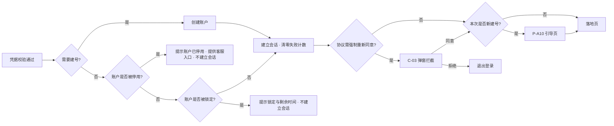

> 与旧版的关键差异：**凭据是否补全不再作为进入落地页的拦截条件**。老用户即使凭据不齐也直接进落地页，只看到常驻提示条。

### 7.3 M3 · 用户协议前台交互（仅资产端）

> 协议正文、版本号、生效时间、语种、是否「强制重新同意」的判定，全部由 **WS-301** 定义。本模块只做以下三段用户侧交互。
> **管理端不适用本节全部内容**：管理端登录不以同意用户协议为前置，登录页无协议勾选，也无强制重新同意弹窗。

#### 7.3.1 勾选（C-02）

- 位置：**资产端登录页提交按钮上方，全站仅此一处**。注册页取消后，不再存在「注册时勾一次、登录时再勾一次」的分裂。
- 形态：单个复选框 + 内联链接文本。默认**不勾选**。
- 文案：`I have read and agree to the <Terms of Service> and <Privacy Policy>. / 我已阅读并同意《服务条款》和《隐私政策》。`
- 链接点击后在新窗口/弹层打开当前生效版本正文，不打断表单填写状态。
- 未勾选时提交按钮置灰；点击置灰按钮时在复选框下方显示红色提示并使复选框抖动一次。
- **协议区只有这一个复选框**：登录页不提供营销邮件订阅勾选，也不提供任何其他可选勾选项。本期不采集营销订阅意愿，见 3.2 的接口说明。

#### 7.3.2 同意提交

- 提交时随请求带上当前展示的协议版本号与语种。
- 服务端记录一条同意记录（账户、协议类型、版本、语种、时间、IP/设备摘要）。
- **自动建号场景**：协议同意记录与账户在同一次提交内一并写入，保证「不存在没有同意记录的账户」。
- 记录的存储与查询归 WS-301，本模块只负责在正确时机提交。

#### 7.3.3 强制重新同意弹窗（C-03）

- 触发时机：资产端登录成功、建立会话之后、进入落地页或引导页之前。
- 形态：模态弹窗，不可点击遮罩关闭，无右上角关闭按钮。
- 内容：更新说明摘要 + 协议正文滚动区 + 「Agree and continue / 同意并继续」主按钮 + 「Sign out / 退出登录」次按钮。
- 正文未滚动到底时主按钮置灰。
- 点「同意并继续」→ 提交同意记录 → 关闭弹窗 → 继续登录后流程。
- 点「退出登录」→ 立即销毁本次会话 → 回登录页。
- 弹窗展示期间，用户仍可切换语言、查看协议、退出登录；不阻断这三项。

### 7.4 M4 · 忘记密码（资产端，F-11）

**主流程**

1. 登录页点「Forgot password? / 忘记密码？」→ P-A03。
2. 输入邮箱 → 点「Send code」→ 滑块校验 → 限频校验 → 发码。
3. 输入验证码 → 校验通过 → 进入 P-A04。
4. 设置新密码 + 确认新密码 → 提交（新密码需通过 8.4 的全部规则，含与原密码不同的比对）。
5. 成功 → **该账户全部会话失效** → 提示 `Password reset. Please sign in with your new password. / 密码已重置，请使用新密码登录。` → 跳登录页。
6. 向该邮箱发送安全通知邮件。

**关键规则**

- **本入口不建号**。输入未绑定任何账户的邮箱时，前端表现与已绑定时一致（提示已发送），验证码校验阶段统一返回失败——这条防枚举要求**依然有效**，因为本路径不像验证码登录那样天然不可区分：如果这里对未注册邮箱直接报「该邮箱不存在」，就重新打开了枚举通道。
- 页面上提供一条静态引导，帮助误入此页的新用户：`No account yet? Just sign in with an email code — we'll create one for you. / 还没有账户？直接用邮箱验证码登录即可，系统会自动为你创建。`（静态文案，对所有人一致，不泄漏信息。）
- 若账户此前未设置过密码，本流程等同于「设置密码」，成功后可用密码登录；此时无原密码可比对，跳过比对校验。
- 重置成功后清零登录失败计数并解除锁定（忘记密码是锁定的提前解锁通道之一）。

**异常**

| 场景 | 提示 |
| --- | --- |
| 验证码错误 | `Invalid or expired code. / 验证码不正确或已过期。` |
| 验证码过期 | 同上，并把「Send code」按钮恢复可点 |
| 单码验证失败次数超限 | `Too many attempts. Please request a new code. / 尝试次数过多，请重新获取验证码。` 并作废该码 |
| 两次密码不一致 | `Passwords do not match. / 两次输入的密码不一致。` |
| 密码不满足规则 | 见 8.4 |
| 新密码与原密码相同 | `Your new password must be different from your current password. / 新密码不能与原密码相同。` |
| 账户只有钱包、无邮箱 | 用户不会走到这里（无邮箱可填）；若强行输入他人邮箱则按防枚举统一失败处理 |

### 7.5 M5 · 凭据完备性与受限态收敛

本节定义合并注册后**唯一的凭据硬门槛**，以及跳过引导后的产品行为。

#### 7.5.1 凭据的三种角色

| 凭据 | 角色 | 是否作为门槛 |
| --- | --- | --- |
| 邮箱 | 身份标识 + 安全通知通道 + 找回通道 | **是**——发起个人认证时必须具备 |
| 钱包地址 | 身份标识 + 链上业务主体 + 账户恢复通道 | **是**——发起个人认证时必须具备 |
| 登录密码 | 便利性登录方式 | **否**——任何时候都不作为门槛，随时可补设，也可以永远不设 |

> 请注意：文档中任何位置都不存在「密码必须补全」的要求。密码只是三种登录方式之一，用户完全可以长期只用验证码或钱包登录。

#### 7.5.2 硬门槛：发起个人认证的前置校验（F-08）

- **校验时点**：用户点击「发起个人认证 / Start identity verification」按钮时。
- **校验内容**：账户的 `email` 与 `wallet_address` 是否**同时非空**。密码不参与判定。
- **未通过时的表现**：**不跳走**，在当前页面弹出就地补齐弹层（C-09）：

| 缺失项 | 弹层内容 |
| --- | --- |
| 缺钱包 | 标题 `Link your wallet to continue / 绑定钱包后继续`；正文说明为什么需要；「Connect wallet」按钮，走连接 + 签名；成功后弹层自动关闭并**原地继续**发起认证 |
| 缺邮箱 | 标题 `Add your email to continue / 绑定邮箱后继续`；邮箱输入框 + 滑块 + 验证码；成功后自动关闭并原地继续 |
| 两项都缺 | 分两步在同一弹层内依次完成，带步骤指示（1/2、2/2） |

- 弹层可关闭（用户可以决定现在不做认证），关闭后回到原页面，不改变任何状态。
- 补齐成功后账户状态由 `incomplete` 变为 `active`，常驻提示条消失。
- **服务端必须同样校验**：发起认证的接口在服务端再校验一次凭据完备性，前端弹层不是唯一防线。

#### 7.5.3 受限态收敛：跳过引导不做全局封锁（F-07）

**规则**

- 跳过引导页后，用户**不进入任何全局受限态**：可以正常浏览、进入账户设置、查看平台内容、使用不依赖认证的功能。
- 唯一的凭据硬卡点是 7.5.2 的「发起个人认证」。
- 凭据未齐时，全局展示常驻补全提示条（C-08）：
  - 文案（缺钱包）：`Link a wallet to be ready for identity verification. / 绑定钱包后即可发起个人认证。`
  - 文案（缺邮箱）：`Add an email to be ready for identity verification and to receive security notifications. / 绑定邮箱后即可发起个人认证，并接收安全通知。`
  - 提示条可折叠为一个小图标，但**不可永久关闭**（下次进入仍展示），直到凭据补齐为止。
  - 提示条上带「Complete now / 立即补全」按钮，点击进入账户设置对应项。

**为什么这样改（取舍说明）**

旧口径是「跳过引导 → 进入受限态 → 禁止一切业务功能」。改为现在这样，是因为：

1. **两种方案的实际效果几乎等价。** 平台的业务功能本来就以「个人认证通过」为前置条件——一个凭据不全的用户，即使不做全局封锁，也照样做不了业务，因为他连认证都还没发起。把封锁提前到进门处，并没有多挡住任何一个真正的业务操作，只是把同一道门往前挪了一格。
2. **代价却是实打实的。** 提前封锁意味着新用户刚被自动建号、还没搞清楚这个平台是干什么的，就先撞上一堵「你什么都不能做」的墙。这与「首次登录即注册」这个改动的初衷直接冲突——我们刚刚把开户门槛降到最低，不应该在进门后第二步又立一道墙。
3. **信息传达比封锁更有效。** 用户不补全凭据，通常不是因为拒绝，而是因为不知道为什么要补、补了有什么用。常驻提示条把「为什么」讲清楚，比一堵墙更能促成补全；而真正到了必须补的时刻（发起认证），就地弹层补齐的转化率也远高于「被踢到设置页再自己找回来」。
4. **风险可控。** 凭据不全的账户拿不到任何业务能力，不产生资金或合规风险；它唯一的「成本」是数据库里多一条 `incomplete` 记录。

**边界声明（必须写进各业务模块的对接说明）**

> 各业务模块的功能放行，**以认证状态为准，不以本模块的凭据完备状态为准**。本模块只保证「凭据不全的账户无法发起个人认证」，因而也就无法取得认证通过状态。业务模块不应该、也不需要自行去读 `account_status == incomplete` 来做拦截——那会造成同一件事在两处判断、口径漂移。

#### 7.5.4 补设密码（F-06）

- 入口：P-A11 账户设置 - 安全，「Set password / 设置登录密码」。
- 账户从未设过密码时，该项展示为 `Not set / 未设置` + 「Set password」按钮，**不带任何警示色或感叹号图标**——它是可选项，不是缺陷。
- 设置流程见 7.6.3（无原密码时跳过比对与再认证中的密码因子）。
- 设置成功后即可使用邮箱密码登录。

### 7.6 M6 · 账户变更（修改邮箱 / 密码 / 钱包地址）

统一入口：P-A11 账户设置 - 安全。三项变更均遵循「先再认证、再验证新标识、成功后全局会话失效」的统一骨架。

#### 7.6.1 再认证（Re-authentication）

| 账户已有凭据 | 可用的再认证因子（任选其一） |
| --- | --- |
| 有密码 | 输入当前密码 |
| 有钱包 | 钱包签名（用途声明为「Re-authenticate」） |
| 有邮箱 | 旧邮箱验证码（发送前同样过滑块与限频） |

- 页面同时展示该账户可用的全部因子，用户自选，不强制某一种。
- 只有一种可用因子时（例如钱包建号且未补邮箱未设密码的用户，只有签名一种），直接进入该因子，不展示选择列表。
- 再认证通过后，在 10 分钟内不重复要求；超时后再次进入变更流程需重新认证。
- 再认证失败计入登录失败计数。

#### 7.6.2 修改邮箱（F-13）

1. 再认证。
2. **旧邮箱可用时**：向旧邮箱发送验证码（滑块 + 限频），校验通过后进入下一步。旧邮箱不可用时用户应走 M7 账户恢复，本流程不提供跳过。
3. 输入新邮箱 → 滑块 → 新邮箱验证码 → 校验通过。
4. 提交 → 邮箱替换 → **全部会话失效** → 跳登录页并提示用新邮箱登录（登录页邮箱输入框自动填入新邮箱）。
5. 向旧邮箱与新邮箱各发安全通知。

> 若账户原本无邮箱（钱包建号且未补），本流程即「绑定邮箱」，跳过第 2 步，标题与按钮文案变为 `Add email / 绑定邮箱`。绑定成功后若两项凭据齐备，账户状态转为 `active`。

#### 7.6.3 修改 / 设置密码（F-14）

1. 再认证（当前密码、钱包签名或邮箱验证码任选）。
2. 输入新密码 + 确认新密码，按 8.4 校验全部规则，包含**与原密码比对**。
3. 提交 → **全部会话失效** → 跳登录页并提示用新密码登录。
4. 向绑定邮箱发安全通知（无邮箱时跳过）。
5. 账户原本无密码时，本流程即「设置密码」，标题与按钮文案变为 `Set password / 设置登录密码`，此时无原密码可比对。

#### 7.6.4 修改钱包地址（F-15）

1. 再认证。
2. **旧钱包可用时**：要求旧钱包签名（用途声明为「Unlink wallet」）。旧钱包不可用时，改为「当前密码 + 邮箱验证码」双因子替代。
3. 连接新钱包 → 新钱包签名（用途声明为「Link wallet」）→ 验签。
4. 提交 → 地址替换 → **全部会话失效** → 跳登录页。
5. 向绑定邮箱发安全通知，通知中同时展示旧地址与新地址（均按缩略格式）。
6. 变更记录不可覆盖，保留全部历史地址与变更时间。

> 若账户原本无钱包（邮箱建号且未补），本流程即「绑定钱包」，跳过第 2 步，文案变为 `Link wallet / 绑定钱包`。绑定成功后若两项凭据齐备，账户状态转为 `active`。

### 7.7 M7 · 账户恢复（钱包签名换邮箱，F-12）

面向「丢失邮箱访问权、但仍持有钱包」的用户。

**主流程**

1. 登录页点「Can't access your email? / 无法访问邮箱？」→ P-A05。
2. 连接钱包 → 服务端下发一次性签名消息（用途声明为「Account recovery」）→ 用户签名 → 验签。
3. 验签通过**且该地址已绑定账户** → 进入 P-A06。
4. 输入新邮箱 → 滑块校验 → 发送验证码 → 输入验证码 → 提交。
5. 成功 → 账户邮箱替换为新邮箱 → **全部会话失效** → 提示并跳登录页。
6. 向旧邮箱与新邮箱各发一封安全通知（旧邮箱通知内含「不是本人操作」的申诉入口）。

**关键规则**

- **本入口不自动建号**。地址未绑定任何账户时，明确提示 `This wallet is not linked to any account. / 该钱包尚未绑定任何账户。` 并提供一行引导 `To create an account, sign in with your wallet on the sign-in page. / 如需创建账户，请在登录页使用钱包登录。` ——恢复是明确的找回意图，不能被悄悄转成建号。
- 钱包签名验证通过即可修改邮箱，本期不加人工复核。
- 新邮箱不得为平台上任何其他账户已绑定的邮箱。
- 验签失败计入登录失败计数，该入口同样受锁定约束。
- 恢复成功后清零失败计数并解除锁定。
- 本模块只记录 `recovery_at` 时间戳，不定义恢复后的业务冻结规则。
- **邮箱与钱包同时丢失时本期无恢复通道**，需在引导页与账户设置中明确告知用户保管好两项凭据。

### 7.8 M8 · 资产管理端账号、登录与首登强制重置

#### 7.8.1 账号来源与初始密码线下交付（F-25）

**第一个管理员账号：由部署环节创建（R-02 已确认）**

| 项 | 规则 |
| --- | --- |
| 创建方式 | 系统上线时，由开发人员通过**部署脚本 / 数据初始化**写入第一个管理员账号（工作邮箱、姓名、初始密码哈希、`must_reset_password = true`） |
| 初始密码交付 | 线下交付给指定负责人 |
| 界面约束 | 管理端**不提供**「创建第一个账号」的自举入口，**不提供**任何绕过登录的初始化页面、安装向导或首次配置页；未登录状态下除登录页与忘记密码页外无任何可达页面 |
| 后续账号 | 第一个账号登录并完成首登重置后，由其在 P-M06 创建其余管理员账号 |
| 部署前置条件 | 「初始化第一个管理员账号」是系统可用的**部署前置条件**，须写入部署清单；未执行则管理端无人可登录，且系统不提供任何自救入口 |

**后续账号的创建**

1. 任一管理员在 P-M06 填写工作邮箱与姓名，提交创建。
2. 系统生成随机初始密码（满足 8.4 的密码规则）。
3. **初始密码仅在创建成功页明文展示一次**，提供复制按钮与「我已记录 / I have saved it」确认；离开该页面后**不可再次查看**，系统只保留其不可逆哈希。
4. 创建者通过**线下渠道**交付。**系统不通过邮件、站内信或任何在线渠道下发初始密码**，账号创建过程不触发任何邮件。
5. 初始密码有效期 7 天。
6. 忘记记录或超期时，任一管理员执行「重新生成初始密码」，流程同上，账号状态回到 `pending_reset`。

**首次登录前的状态表达（P-M06 列表）**

| 账号状态 | 列表展示 |
| --- | --- |
| 已创建、初始密码未过期、未首登 | `Pending first sign-in · Initial password expires on {日期时间 + 时区} / 待首次登录 · 初始密码有效期至 {日期时间 + 时区}` |
| 已创建、初始密码已过期、未首登 | `Initial password expired — regenerate to continue / 初始密码已过期，需重新生成`，并高亮「重新生成初始密码」操作 |
| 已完成首登重置 | `Active / 正常` |
| 锁定中 | `Locked · unlocks in {剩余时间} / 已锁定 · {剩余时间} 后解除`，并提供「解除锁定」操作 |
| 已停用 | `Disabled / 已停用` |

#### 7.8.2 登录（F-22）

- 登录字段：**工作邮箱** + 密码。仅此一种方式，管理端**不提供**验证码登录、钱包登录、第三方登录与**自动建号**。
- **登录页无用户协议勾选行**，管理端登录不以同意用户协议为前置条件。
- 不提供「记住我」，不提供注册入口。
- 登录失败计入登录失败计数，锁定规则与资产端一致。
- 失败提示统一为 `Incorrect email or password. / 邮箱或密码不正确。`（防枚举，不区分账号是否存在）。
- 初始密码已过期时登录：提示 `Your initial password has expired. Contact an administrator to have it regenerated. / 初始密码已过期，请联系管理员重新生成。` 并不建立会话。

#### 7.8.3 首次登录强制重置密码（F-23）

- 判定：账户字段 `must_reset_password = true`。
- 登录成功后**立即**跳转 P-M02，且：
  - 前端路由守卫拦截所有其他管理端路由，任何跳转均重定向回 P-M02；
  - 服务端对所有管理端业务接口做同样拦截，**前端拦截不可作为唯一防线**。
- P-M02 页面元素：当前（初始）密码、新密码、确认新密码、密码规则实时校验清单、**管理端安全须知阅读确认**。
  - 安全须知确认文案：`I have read the Admin Security Notice. / 我已阅读《管理端安全须知》。`
  - > 明确界定：这是管理端内部的安全操作须知阅读确认，**不是用户协议同意**，不产生任何协议同意记录，不受 WS-301 的协议版本与重新同意规则约束。管理端全程没有用户协议同意环节。
- 新密码需通过 8.4 的全部规则，包含与原（初始）密码的比对。
- 重置成功 → `must_reset_password = false`，状态置 `active` → **全部会话失效** → 跳回登录页。
- P-M02 页面上只保留「退出登录」和语言切换两个逃生出口。

#### 7.8.4 管理端忘记密码（F-24）

1. 登录页点「Forgot password?」→ P-M03，输入工作邮箱。
2. 滑块校验 → 限频校验 → 向该工作邮箱发送验证码。**不透露该邮箱是否为有效管理端账号**：`If this email belongs to an admin account, a verification code has been sent. / 若该邮箱为管理端账号，验证码已发送。`
   > 管理端**忘记密码的验证码仍走工作邮箱**，这条不受「初始密码线下交付」影响——线下交付只针对初始密码。
3. 输入验证码 → 校验通过 → P-M04 设置新密码。
4. 新密码需通过 8.4 全部规则，包含与原密码、与初始密码的比对。
5. 成功 → 全部会话失效 → 跳登录页。
6. 向工作邮箱发安全通知。

### 7.9 M9 · 管理端账户管理（P-M06）

本期管理端只有「管理员」一种角色，**所有管理员权限等同**，均可执行以下操作，且每一次操作都留痕：

| 操作 | 说明 | 留痕内容 |
| --- | --- | --- |
| 创建管理端账号 | 见 7.8.1 | 操作人、新账号工作邮箱、创建时间 |
| 重新生成初始密码 | 见 7.8.1 | 操作人、目标账号、生成时间 |
| 停用 / 恢复管理端账号 | 停用后不可登录，已有会话立即失效 | 操作人、目标账号、操作类型、时间 |
| 删除管理端账号 | 与停用同受最后一个管理员保护约束 | 操作人、目标账号、时间 |
| 手工解除账户锁定 | 适用于资产端账户与管理端账号；解除后清零失败计数 | 操作人、目标账户、操作前的锁定原因与剩余时长、时间 |

#### 7.9.1 最后一个可用管理员保护（F-26，R-01 新增硬约束）

**规则**：系统任何时刻至少保留 **1 个处于可用状态的管理员**。当一次停用或删除操作会使可用管理员数量归零时，该操作被拒绝。

**「可用」的判定口径与理由**

| 账号状态 | 是否计入可用数量 | 理由 |
| --- | --- | --- |
| `active` | ✅ 计入 | 可正常登录并执行管理操作 |
| `pending_reset` **且初始密码未过期** | ✅ 计入 | 持有初始密码的人可以登录并完成首登重置，随后即可管理系统，是真实可用的管理能力 |
| `pending_reset` **且初始密码已过期** | ❌ **不计入** | 该账号事实上已无法登录，且解除这个状态本身就需要另一个管理员来「重新生成初始密码」。若把它算作可用，就会出现「停用了唯一能登录的账号，只剩一个谁也进不去的账号」——系统彻底失去管理能力，而这正是本约束要防止的死锁 |
| `locked` | ✅ 计入 | 锁定是 30 分钟的临时态，会自动解除；且解除后账号完全可用。把临时态算作不可用，会导致「有人恰好被锁 30 分钟」期间管理员总数虚减，误伤正常的停用操作 |
| `disabled` | ❌ 不计入 | 已被停用，不可登录 |

**校验时点**

- **服务端在提交停用/删除操作时强制校验**，这是唯一有效的防线。校验逻辑为：计算「执行本次操作后」的可用管理员数量，若结果为 0 则拒绝，并且这个计算与操作本身必须是原子的，避免两个管理员同时停用对方时双双通过校验、最终一个不剩。
- 前端在列表中对「当前唯一可用管理员」的停用/删除按钮置灰并附 tooltip，属于体验优化，**不能作为唯一防线**。

**提示文案（中英双语）**

| 场景 | English | 中文 |
| --- | --- | --- |
| 拒绝停用/删除最后一个管理员 | This is the only available administrator. Create or activate another administrator before disabling this one. | 这是系统中唯一可用的管理员。请先创建或启用另一个管理员，再停用此账号。 |
| 按钮置灰 tooltip | The last available administrator cannot be disabled or deleted. | 不能停用或删除最后一个可用的管理员。 |
| 因初始密码过期而不计入可用的说明 | Accounts whose initial password has expired don't count as available administrators. | 初始密码已过期的账号不计入可用管理员数量。 |

#### 7.9.2 与「不能停用自己」的关系（两条独立约束）

| | 「不能停用自己」 | 「不能停用最后一个可用管理员」 |
| --- | --- | --- |
| 保护对象 | **操作者个人** | **系统整体的管理能力** |
| 防止的问题 | 管理员误操作把自己锁在门外，需要别人来救 | 系统失去全部管理能力，无人可登录、无人可创建账号，只能重新走部署初始化 |
| 触发条件 | 目标账号 == 操作者本人 | 操作后可用管理员数量 == 0 |
| 是否可绕过 | 由另一个管理员代为停用即可 | **不可绕过**，必须先增加一个可用管理员 |
| 严重程度 | 可恢复 | 不可自助恢复，需要开发介入重新初始化 |

**两条并存**，互不替代。当系统只剩一个管理员且他试图停用自己时，两条同时命中——此时**优先展示「最后一个可用管理员」的提示**，因为它是更根本、更严重的系统级约束，且它的解决办法（先创建另一个管理员）同时也解决了第一条。

**交互**

- 停用、删除、解除锁定均需二次确认弹窗，弹窗中展示目标账户标识与操作后果。
- 管理员不能停用自己、不能删除自己、不能重新生成自己的初始密码；界面上对自己的这些操作置灰并给出说明 `You cannot perform this action on your own account. / 不能对自己的账号执行该操作。`
- 所有留痕记录在管理端可查询（查询界面归审计模块，本模块只保证写入）。

---
## 8. 页面与字段定义

### 8.1 字段总表（校验规则）

| 字段 | 所在页面 | 类型 | 必填 | 校验规则 | 默认值 |
| --- | --- | --- | --- | --- | --- |
| 邮箱 `email` | 登录 / 忘记密码 / 绑定或改邮箱 / 恢复 | string | 视场景 | RFC 5322 基本格式；长度 ≤ 254；前后空格自动去除；大小写不敏感（存储小写） | 空 |
| 工作邮箱 `work_email` | 管理端登录 / 忘记密码 / 账号创建 | string | 是 | 同上；**即管理端登录账号**，全局唯一 | 空 |
| 验证码 `code` | 所有验证码环节 | string | 是 | 6 位数字；仅接受数字输入；粘贴自动去除空格与连字符 | 空 |
| 登录密码 `password` | 登录 / 设置或改密码 / 重置密码 | string | 视场景 | 见 8.4；**资产端账户可以永远不设密码** | 空 |
| 确认密码 `password_confirm` | 设置/重置密码 | string | 是 | 必须与 `password` 完全一致 | 空 |
| 钱包地址 `wallet_address` | 登录 / 绑定或改钱包 / 恢复 | string | 视场景 | EVM 地址：`0x` + 40 位十六进制；带校验和时按 EIP-55 校验；由钱包 SDK 回传，不允许手工输入 | 空 |
| 签名 `signature` | 钱包相关环节 | string | 是 | 由钱包回传；服务端验签，地址须与连接地址一致 | — |
| 协议勾选 `agree_terms` | **仅资产端登录页** | bool | 是 | 必须为 true 才可提交 | false |
| 安全须知确认 `ack_admin_notice` | 管理端 P-M02 | bool | 是 | 必须勾选才可提交；**不是协议同意** | false |
| 语言 `locale` | 全局 / 账户设置 | enum | 是 | `en` / `zh-CN` | `en`（默认英文） |
| 时区 `timezone` | 账户设置 | string | 是 | IANA 时区标识 | 按浏览器推断，兜底 `UTC` |

> **没有任何字段的必填性来自「注册」**：资产端不存在注册表单，字段的必填性只由所在流程决定（例如验证码登录必填邮箱与验证码）。

### 8.2 邮箱校验细则

- 前端做格式校验，失焦时校验，提交时再校验一次。
- 不做 MX / 可达性探测；可达性由「能否收到验证码」自然验证。

### 8.3 钱包地址校验细则

- 地址一律由钱包 SDK 回传，界面上不提供手工输入框，杜绝错填地址导致的账户不可用。
- 服务端存储统一小写，唯一性判断基于小写。
- 展示时按 EIP-55 校验和大小写渲染（见 13.5）。
- 连接的钱包链不在支持范围时提示切换网络。

### 8.4 密码规则

适用于全部设置密码的入口：资产端补设/修改密码、资产端忘记密码重置、管理端首登强制重置、管理端修改密码、管理端忘记密码重置，以及系统生成管理端初始密码。

| 规则 | 取值 |
| --- | --- |
| 长度 | **8–20 字符**（少于 8 或多于 20 均拒绝） |
| 复杂度 | **至少包含 1 个英文字母和 1 个数字** |
| 字符集 | 英文字母、数字之外可自由使用符号，不做额外限制；前后空格自动去除，中间不接受空格 |
| 大小写 | 不区分要求，不强制大写 |
| 新密码限制（全端通用） | **不得与原密码相同** |
| 新密码限制（管理端额外） | **不得与初始密码相同** |
| 历史密码 | **本期仅比对原密码与初始密码**，不做「禁止与最近 N 次密码相同」的历史代数比对 |
| 是否必设（资产端） | **否**，密码是可选凭据 |
| 输入体验 | 支持显示/隐藏切换；支持密码管理器；不禁用粘贴 |

#### 8.4.1 前端规则提示

密码输入框下方展示两条实时校验清单，满足即打勾、不满足为灰色，两条全绿即可提交。**不展示弱/中/强分档**，避免与硬规则不一致造成误解。

| 校验项 | English | 中文 |
| --- | --- | --- |
| 长度 | 8–20 characters | 8–20 个字符 |
| 复杂度 | At least one letter and one number | 至少 1 个英文字母和 1 个数字 |

- 用户开始输入后才展示清单，未输入时不展示。
- 「与原密码/初始密码相同」的比对在**提交后由服务端返回**，前端不做预判（前端不持有原密码）。

#### 8.4.2 新密码与原密码 / 初始密码的比对（F-16）

**服务端校验方式**

- 系统只存密码的不可逆哈希，比对不是「取出旧密码做字符串比较」，而是：把用户提交的**新密码明文**分别对以下哈希执行一次密码校验运算，任一命中即判定为「相同」并拒绝：
  1. 该账户**当前密码的哈希**（账户此前无密码时跳过这一项）；
  2. 该管理端账号**初始密码的哈希**（仅管理端账号适用）。
- 管理端账号在创建或重新生成初始密码时，除写入当前密码哈希外，**另单独留存一份初始密码哈希**，账号存续期间不删除。该哈希**仅用于本项比对，不可用于登录校验**。
- 比对在服务端完成，前端不参与、也拿不到任何可反推原密码的信息。

**失败提示文案**

| 场景 | English | 中文 |
| --- | --- | --- |
| 与原密码相同 | Your new password must be different from your current password. | 新密码不能与原密码相同。 |
| 与初始密码相同（管理端） | Your new password must be different from the initial password. | 新密码不能与初始密码相同。 |
| 同时命中（管理端首登，原密码即初始密码） | Your new password must be different from the initial password. | 新密码不能与初始密码相同。 |

### 8.5 中英双语文案对照

#### 8.5.1 通用与导航

| 场景 | English | 中文 |
| --- | --- | --- |
| 登录页标题 | Sign in | 登录 |
| 登录页副标题 | New here? Just sign in with an email code or your wallet — we'll create your account automatically. | 第一次来？直接用邮箱验证码或钱包登录，系统会自动为你创建账户。 |
| 登录方式 - 邮箱验证码 | Email verification code | 邮箱验证码 |
| 登录方式 - 邮箱密码 | Email and password | 邮箱密码 |
| 登录方式 - 钱包 | Sign in with wallet | 钱包登录 |
| 发送验证码 | Send code | 发送验证码 |
| 重新发送（倒计时） | Resend in {n}s | {n} 秒后重发 |
| 提交登录 | Sign in | 登录 |
| 忘记密码入口 | Forgot password? | 忘记密码？ |
| 邮箱不可用入口 | Can't access your email? | 无法访问邮箱？ |
| 密码 Tab 常驻引导 | No password? Sign in with an email code → | 没有密码？改用邮箱验证码登录 → |
| 连接钱包 | Connect wallet | 连接钱包 |
| 断开连接 | Disconnect | 断开连接 |
| 签名消息 | Sign message | 签署消息 |
| 稍后 | Later | 稍后 |
| 退出登录 | Sign out | 退出登录 |
| 保存 | Save | 保存 |
| 取消 | Cancel | 取消 |
| 复制地址 | Copy address | 复制地址 |
| 区块浏览器跳转 | View on explorer | 在区块浏览器中查看 |
| 立即补全 | Complete now | 立即补全 |
| 未设置（密码） | Not set | 未设置 |
| 可选标记 | Optional | 可选 |

> 已删除的文案：`Create account`（注册页标题）、`Don't have an account? Sign up`、`Already have an account? Sign in`、`This account has no password yet...`。前三条随注册页取消而失效；最后一条是枚举泄漏点，已由 8.5.2 的统一提示取代。

#### 8.5.2 表单校验与错误

| 场景 | English | 中文 |
| --- | --- | --- |
| 邮箱必填 | Email is required. | 请输入邮箱。 |
| 邮箱格式错误 | Enter a valid email address. | 请输入有效的邮箱地址。 |
| 验证码必填 | Enter the 6-digit code. | 请输入 6 位验证码。 |
| 验证码错误/过期 | Invalid or expired code. | 验证码不正确或已过期。 |
| 单码验证次数超限 | Too many attempts. Please request a new code. | 尝试次数过多，请重新获取验证码。 |
| 密码必填 | Password is required. | 请输入密码。 |
| **密码登录失败（统一，不可区分）** | Incorrect email or password. If you haven't set a password, sign in with an email verification code instead. | 邮箱或密码不正确。如果你尚未设置密码，请改用邮箱验证码登录。 |
| 管理端登录失败 | Incorrect email or password. | 邮箱或密码不正确。 |
| 密码长度不符 | Password must be 8–20 characters. | 密码长度需为 8–20 个字符。 |
| 密码复杂度不符 | Password must contain at least one letter and one number. | 密码需至少包含 1 个英文字母和 1 个数字。 |
| 密码长度与复杂度均不符 | Password must be 8–20 characters and contain at least one letter and one number. | 密码需为 8–20 个字符，且至少包含 1 个英文字母和 1 个数字。 |
| 密码含空格 | Password cannot contain spaces. | 密码不能包含空格。 |
| 两次密码不一致 | Passwords do not match. | 两次输入的密码不一致。 |
| 新密码与原密码相同 | Your new password must be different from your current password. | 新密码不能与原密码相同。 |
| 新密码与初始密码相同 | Your new password must be different from the initial password. | 新密码不能与初始密码相同。 |
| 协议未勾选（仅资产端） | Please read and agree to the Terms of Service and Privacy Policy. | 请阅读并同意《服务条款》和《隐私政策》。 |
| 安全须知未确认（管理端） | Please confirm you have read the Admin Security Notice. | 请确认已阅读《管理端安全须知》。 |
| 邮箱已被占用 | This email is already linked to another account. | 该邮箱已绑定其他账户。 |
| 钱包已被占用 | This wallet is already linked to another account. | 该钱包地址已绑定其他账户。 |
| 钱包未绑定（账户恢复入口） | This wallet is not linked to any account. | 该钱包尚未绑定任何账户。 |
| 钱包未绑定的引导（账户恢复入口） | To create an account, sign in with your wallet on the sign-in page. | 如需创建账户，请在登录页使用钱包登录。 |
| 未检测到钱包 | No wallet detected. Install a supported wallet to continue. | 未检测到可用钱包，请先安装受支持的钱包。 |
| 网络不支持 | Please switch your wallet to a supported EVM network. | 请将钱包切换到受支持的 EVM 网络。 |
| 用户拒绝签名 | Signature request was rejected in your wallet. | 你在钱包中拒绝了签名请求。 |
| 签名超时 | The signature request expired. Please try again. | 签名请求已过期，请重试。 |
| 验签失败 | Signature verification failed. | 签名验证失败。 |
| 钱包服务不可用 | Wallet service is unavailable. Please retry or sign in with your email. | 钱包服务暂不可用，请重试或改用邮箱登录。 |
| 账户已停用 | This account has been disabled. Contact support for help. | 该账户已被停用，请联系客服。 |
| 初始密码已过期 | Your initial password has expired. Contact an administrator to have it regenerated. | 初始密码已过期，请联系管理员重新生成。 |
| 最后一个管理员保护 | This is the only available administrator. Create or activate another administrator before disabling this one. | 这是系统中唯一可用的管理员。请先创建或启用另一个管理员，再停用此账号。 |
| 不能对自己执行 | You cannot perform this action on your own account. | 不能对自己的账号执行该操作。 |
| 网络异常 | Network error. Please try again. | 网络异常，请重试。 |

#### 8.5.3 建号、引导与凭据补全

| 场景 | English | 中文 |
| --- | --- | --- |
| 建号确认（引导页顶部） | Welcome! Your account has been created. | 欢迎！你的账户已创建。 |
| 验证码已发送 | Code sent. Check your inbox and spam folder. | 验证码已发送，请查看收件箱和垃圾邮件。 |
| 引导页标题 | Finish setting up your account | 完善你的账户 |
| 引导 - 绑钱包 | Link an EVM wallet. You'll need both an email and a wallet to start identity verification. | 绑定 EVM 钱包。发起个人认证时需要同时具备邮箱与钱包。 |
| 引导 - 绑邮箱 | Add an email address. You'll need both an email and a wallet to start identity verification, and we'll use it for security notifications. | 绑定邮箱。发起个人认证时需要同时具备邮箱与钱包，我们也会用它发送安全通知。 |
| 引导 - 设密码（可选） | Set a login password (optional) | 设置登录密码（可选） |
| 引导 - 设密码说明 | You can always sign in with an email code or your wallet. | 你随时可以用邮箱验证码或钱包登录。 |
| 双凭据保管提示 | Keep both your email and wallet accessible — if you lose both, your account cannot be recovered. | 请同时保管好邮箱与钱包，两者都丢失将无法找回账户。 |
| 常驻提示条 - 缺钱包 | Link a wallet to be ready for identity verification. | 绑定钱包后即可发起个人认证。 |
| 常驻提示条 - 缺邮箱 | Add an email to be ready for identity verification and to receive security notifications. | 绑定邮箱后即可发起个人认证，并接收安全通知。 |
| 认证前置弹层 - 缺钱包 | Link your wallet to continue | 绑定钱包后继续 |
| 认证前置弹层 - 缺邮箱 | Add your email to continue | 绑定邮箱后继续 |
| 认证前置弹层 - 说明 | Identity verification requires both an email address and a wallet address. | 发起个人认证需要同时具备邮箱与钱包地址。 |
| 补全成功 | All set. You're ready to start identity verification. | 已完成，你现在可以发起个人认证了。 |
| 忘记密码页的新用户引导 | No account yet? Just sign in with an email code — we'll create one for you. | 还没有账户？直接用邮箱验证码登录即可，系统会自动为你创建。 |

#### 8.5.4 成功与状态

| 场景 | English | 中文 |
| --- | --- | --- |
| 密码重置成功 | Password reset. Please sign in with your new password. | 密码已重置，请使用新密码登录。 |
| 密码修改成功 | Password updated. Please sign in again. | 密码修改成功，请重新登录。 |
| 密码设置成功 | Password set. Please sign in again. | 密码设置成功，请重新登录。 |
| 邮箱绑定成功 | Email added. Please sign in with your email. | 邮箱绑定成功，请使用邮箱登录。 |
| 邮箱修改成功 | Email updated. Please sign in with your new email. | 邮箱修改成功，请使用新邮箱登录。 |
| 钱包绑定成功 | Wallet linked. Please sign in again. | 钱包绑定成功，请重新登录。 |
| 钱包修改成功 | Wallet updated. Please sign in again. | 钱包地址修改成功，请重新登录。 |
| 账户恢复成功 | Your email has been updated. Please sign in with your new email. | 邮箱已更新，请使用新邮箱登录。 |
| 地址已复制 | Address copied | 地址已复制 |
| 管理端首登标题 | Set a new password to continue | 请设置新密码后继续 |
| 管理端首登说明 | For security, you must replace the initial password before using the console. | 出于安全考虑，请先替换初始密码后再使用管理端。 |
| 管理端账号创建成功 | Account created. Copy the initial password now — it will not be shown again. | 账号创建成功，请立即复制初始密码，离开本页后将无法再次查看。 |
| 初始密码有效期提示 | This initial password expires on {日期时间 + 时区}. | 该初始密码的有效期至 {日期时间 + 时区}。 |
| 我已记录 | I have saved it | 我已记录 |

> 会话失效、登录锁定、滑块与限频相关文案见第 12 章对应小节。

### 8.6 关键页面线框级说明

**P-A01 资产端登录页（唯一入口）**

```
┌──────────────────────────────────────────────┐
│  Logo                        [语言切换 EN/中] │
├──────────────────────────────────────────────┤
│                 Sign in                       │
│  New here? Just sign in with an email code    │
│  or your wallet — we'll create your account   │
│  automatically.                               │
│  ┌─────────┬─────────────┬────────────────┐  │
│  │Email code│Email+Password│ Wallet        │  │
│  └─────────┴─────────────┴────────────────┘  │
│                                               │
│  [ Email address                           ]  │
│  [ Code            ] [ Send code / 59s ]      │  ← 点击先弹滑块 C-01
│                                               │
│  [ ] I have read and agree to the Terms ...   │  ← 默认不勾，全站唯一一处
│                                               │  ← 协议区仅此一个复选框
│  [            Sign in            ]            │
│                                               │
│  Forgot password?   Can't access your email?  │
└──────────────────────────────────────────────┘
  注：无「去注册」入口。密码 Tab 下常驻一行
      「No password? Sign in with an email code →」
```

**P-A10 建号后引导页**

```
┌──────────────────────────────────────────────┐
│  ✓ Welcome! Your account has been created.    │  ← 显著，唯一的建号感知点
├──────────────────────────────────────────────┤
│  Finish setting up your account               │
│                                               │
│  ① Link an EVM wallet                         │  ← 主引导（按建号路径变化）
│     You'll need both an email and a wallet    │
│     to start identity verification.           │
│     [        Connect wallet        ]          │
│                                               │
│  ② Set a login password  (Optional)           │  ← 明确标注可选
│     You can always sign in with an email      │
│     code or your wallet.                      │
│     [        Set password          ]          │
│                                               │
│  Keep both your email and wallet accessible — │
│  if you lose both, your account cannot be     │
│  recovered.                                   │
│                                               │
│  [            Later            ]              │  ← 与主操作等权重，不置灰
└──────────────────────────────────────────────┘
```

**P-M01 管理端登录页**

```
┌──────────────────────────────────────────────┐
│  Logo (Console)              [语言切换 EN/中] │
├──────────────────────────────────────────────┤
│                 Sign in                       │
│  [ Work email                              ]  │  ← 工作邮箱即登录账号
│  [ Password                            👁 ]  │
│  [            Sign in            ]            │
│  Forgot password?                             │
└──────────────────────────────────────────────┘
  注：无协议勾选行、无「记住我」、无注册入口、
      无自动建号、无验证码与钱包登录入口。
```

**P-M02 管理端首登重置页**：无侧边栏、无顶部导航（仅保留语言切换与退出登录），居中单卡片表单，含当前密码、新密码、确认新密码、规则校验清单、管理端安全须知阅读确认。

---

## 9. 主流程与异常流程

### 9.1 邮箱验证码登录（含首次自动建号）

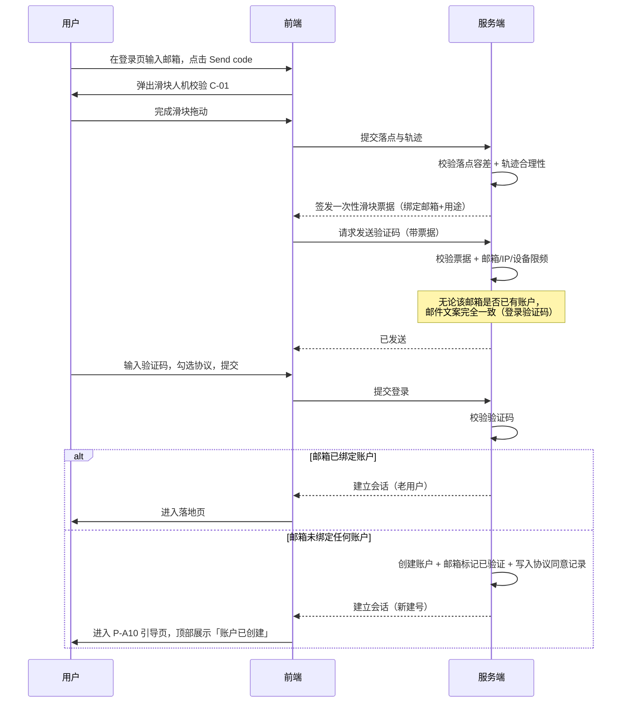

### 9.2 钱包签名登录（含首次自动建号）

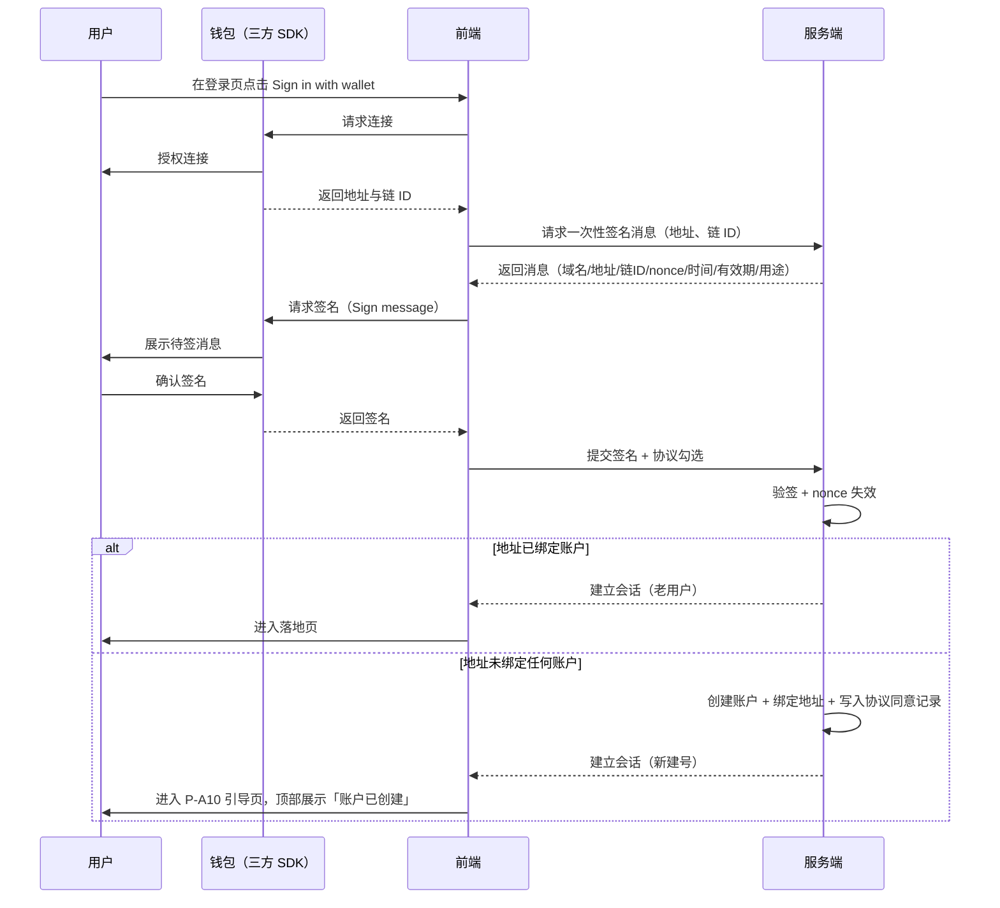

### 9.3 发起个人认证的凭据前置校验

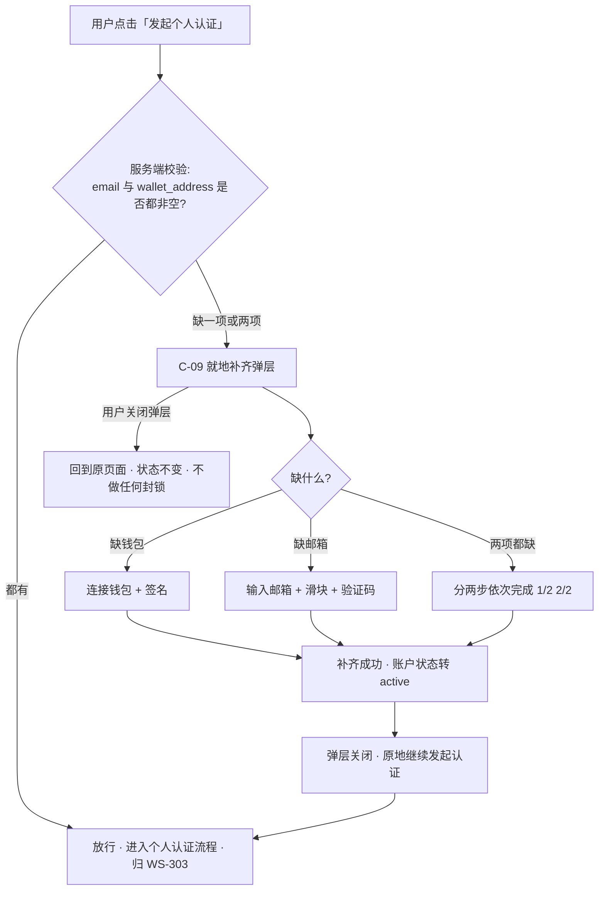

### 9.4 管理端账号创建与首登

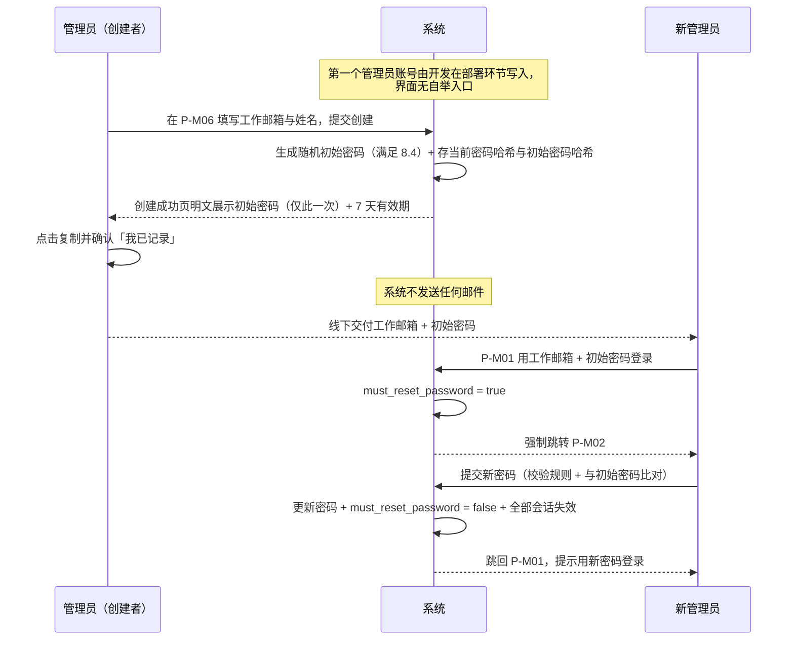

### 9.5 异常流程总表

| 环节 | 异常 | 系统行为 | 用户可做什么 |
| --- | --- | --- | --- |
| 发送验证码 | 滑块校验失败 | 弹窗内抖动 + 换图 + 复位，不签发票据、不发码 | 重试；连续失败 5 次进入 60s 冷却 |
| 发送验证码 | 票据无效 / 已使用 / 已过期 | 服务端拒绝发码，前端重新弹出滑块 | 重新完成滑块 |
| 发送验证码 | 邮箱维度限频超限 | 不发码，返回剩余冷却秒数 | 等待倒计时结束 |
| 发送验证码 | IP / 设备维度限频超限 | 不发码，提示稍后再试 | 等待或更换网络环境 |
| 发送验证码 | 邮件发送方失败 | 返回失败，允许立即重试 1 次且不计入限频 | 重试 |
| 验证码登录 | 码错误 | 计入单码验证失败次数，**不建号** | 重新输入或重发 |
| 验证码登录 | 单码失败超 5 次 | 作废该码 | 重新获取 |
| 验证码登录 | 码过期 | 提示过期，恢复发送按钮 | 重新获取 |
| **验证码登录** | **邮箱未绑定账户** | **不是异常——自动建号并登录** | 进入引导页 |
| 密码登录 | 邮箱不存在 / 未设密码 / 密码错误 | **三者返回完全一致的提示**，不建号 | 改用验证码登录 / 忘记密码 |
| 密码登录 | 真实密码错误达 5 次 | 账户锁定 | 等待解锁 / 走忘记密码 |
| 管理端登录 | 初始密码已过期 | 不建立会话，提示联系管理员重新生成 | 联系任一管理员 |
| 钱包连接 | 未检测到钱包 | 提示并给出安装引导 | 安装后重试 |
| 钱包连接 | 用户拒绝连接 | 回到初始态，无报错弹窗 | 重新点击连接 |
| 钱包连接 | SDK 加载失败 | 提示钱包服务不可用，引导改用邮箱路径 | 重试或换方式 |
| 钱包签名 | 用户拒绝签名 | 提示已拒绝，不计入失败计数，**不建号** | 重新发起 |
| 钱包签名 | 签名消息过期 | 提示过期，自动重新获取消息 | 重新签名 |
| 钱包签名 | 验签失败 | 登录失败计数 +1，**不建号** | 检查钱包账户是否切换后重试 |
| 钱包签名 | 签名时钱包切换了账户 | 检测到地址不一致，中止并提示 | 切回原账户 |
| **钱包签名登录** | **地址未绑定账户** | **不是异常——自动建号并登录** | 进入引导页 |
| 账户恢复 | 地址未绑定账户 | 明确报错，**不建号**，引导去登录页用钱包登录建号 | 去登录页 |
| 忘记密码 | 邮箱未绑定账户 | 表现与已绑定一致（防枚举），校验阶段统一失败，**不建号** | 改用验证码登录直接建号 |
| 引导页 | 补全时邮箱/地址已被占用 | 明确报错，保留在当前页 | 换一个或去登录 |
| 引导页 | 用户点「Later」 | 正常进入落地页，**不做任何封锁**，展示常驻提示条 | 随时在账户设置或提示条补全 |
| 发起个人认证 | 凭据不齐 | 弹出就地补齐弹层，不跳走 | 补齐后原地继续，或关闭弹层稍后再说 |
| 发起个人认证 | 绕过前端直接调接口 | 服务端同样校验凭据完备性并拒绝 | — |
| 设置密码 | 长度或复杂度不符 | 前端实时清单标红，提交按钮置灰 | 按清单修正 |
| 设置密码 | 与原密码 / 初始密码相同 | 服务端返回并展示对应文案，保留已填内容 | 换一个新密码 |
| 管理端账号管理 | 停用/删除最后一个可用管理员 | 服务端拒绝并提示 | 先创建或启用另一个管理员 |
| 管理端账号管理 | 对自己执行停用/删除/重生成初始密码 | 按钮置灰 + 服务端拒绝 | 请其他管理员代为操作 |
| 登录后 | 账户已停用 | 不建立会话，展示停用提示与客服入口 | 联系客服 |
| 登录后 | 协议需重新同意但用户拒绝（仅资产端） | 销毁会话，回登录页 | 重新登录并同意 |
| 任意受保护操作 | 会话已失效 | 清本地态，跳登录页 + 原因提示 | 重新登录 |
| 地址展示 | 链 ID 无对应区块浏览器 | 隐藏跳转入口，只保留复制 | 手动查询 |
| 弱网 | 请求超时 | 按钮恢复可点，保留已填内容 | 重试 |

---
## 10. 状态机

### 10.1 账户状态（资产端）

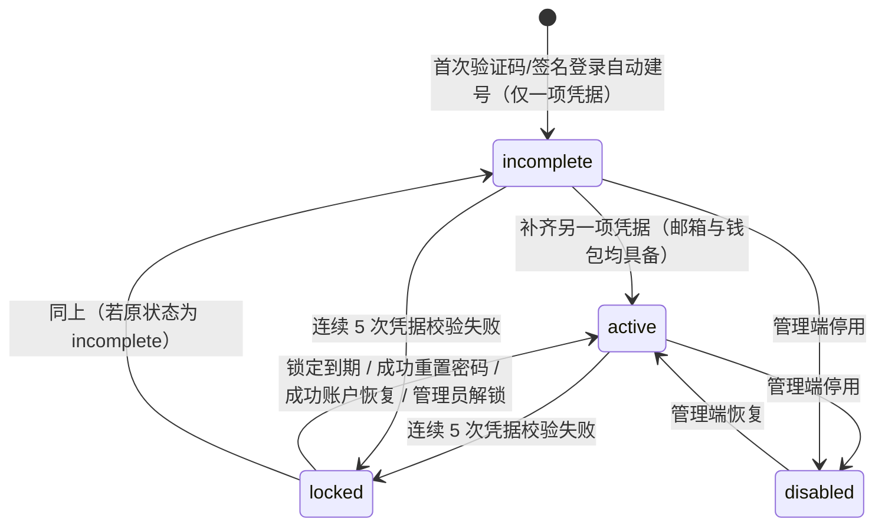

| 状态 | 定义 | 可登录 | 可发起个人认证 | 是否封锁其他功能 |
| --- | --- | --- | --- | --- |
| `incomplete` | **邮箱与钱包地址未同时具备**（有其一，缺其一） | 是 | ❌ 否 | **否**——不做全局封锁，只展示常驻提示条 |
| `active` | **邮箱与钱包地址均已绑定** | 是 | ✅ 是（后续能否通过由 WS-303 决定） | 否 |
| `locked` | 因连续登录失败被锁定 | 否（见 12.2 各入口口径） | 否 | — |
| `disabled` | 被管理端停用 | 否 | 否 | — |

**关键口径**

- **密码不参与状态判定**。一个只有邮箱+钱包、从未设过密码的账户，状态就是 `active`，一切正常。
- 状态转换只由「邮箱与钱包是否都有」驱动：`incomplete → active` 的唯一条件是补齐缺失的那一项。
- 换绑邮箱或钱包不改变状态（换绑前后两项都在）。
- `locked` 是叠加在 `incomplete` / `active` 之上的临时态，解除后回到原状态，不改变凭据完备进度。

### 10.2 管理端账号状态

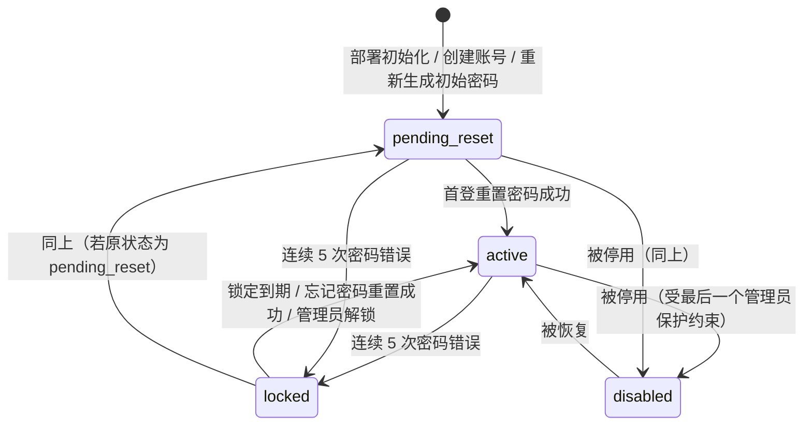

| 状态 | 含义 | 行为 | 是否计入「可用管理员」 |
| --- | --- | --- | --- |
| `pending_reset`（初始密码未过期） | 已创建/已重新生成初始密码 | 登录后强制跳 P-M02，其他页面全部拦截 | ✅ 计入 |
| `pending_reset`（初始密码已过期） | 同上，但已无法登录 | 登录被拒，需管理员重新生成初始密码 | ❌ 不计入 |
| `active` | 已完成重置 | 正常使用全部管理端功能 | ✅ 计入 |
| `locked` | 连续登录失败 | 不可登录，30 分钟后自动解除 | ✅ 计入 |
| `disabled` | 停用 | 不可登录，已有会话立即失效 | ❌ 不计入 |

### 10.3 会话状态

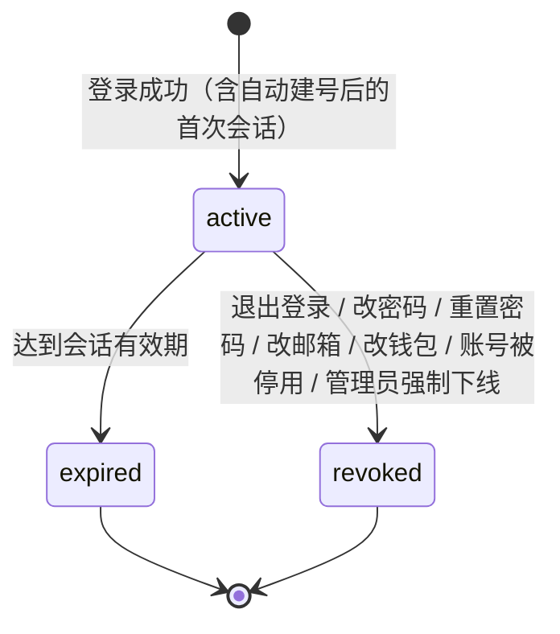

### 10.4 邮箱验证码状态

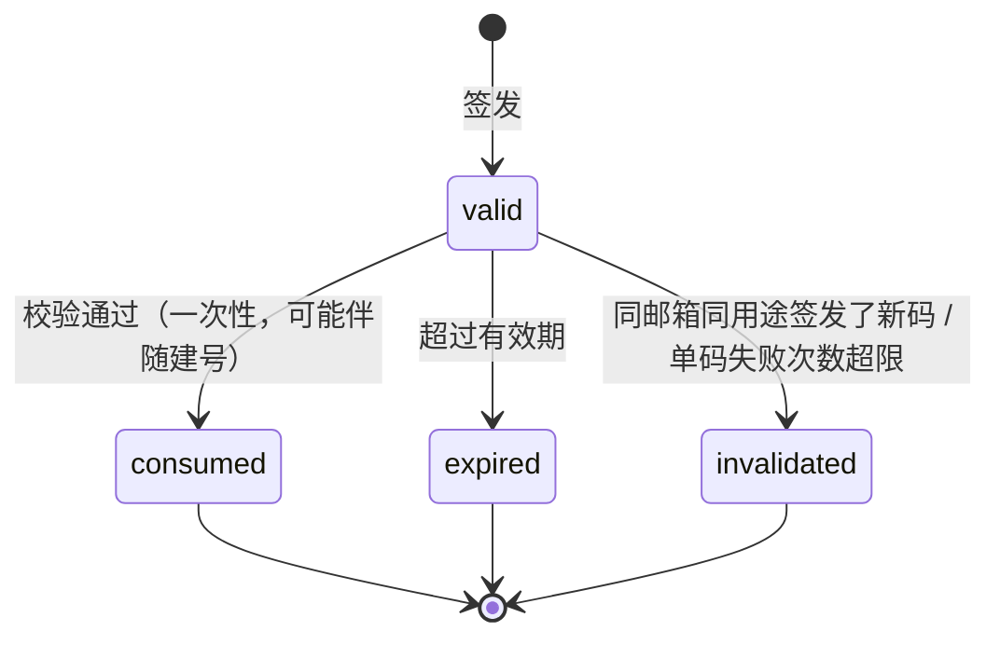

### 10.5 滑块票据状态

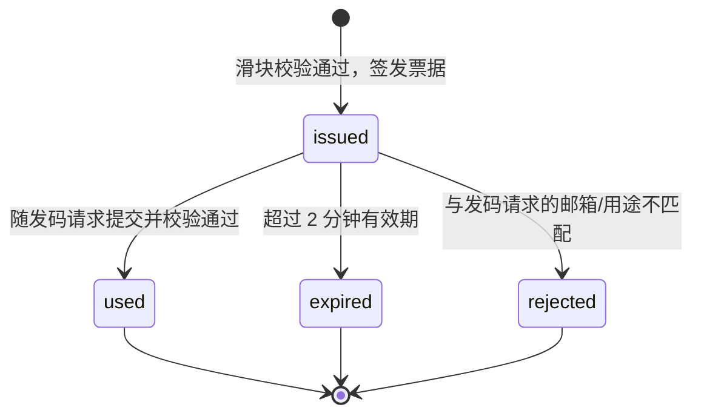

---

## 11. 权限

### 11.1 资产端

| 能力 | 未登录 | `incomplete` | `active` | `locked` | `disabled` |
| --- | --- | --- | --- | --- | --- |
| 访问登录页 | ✅ | — | — | ✅ | ✅ |
| 切换语言 | ✅ | ✅ | ✅ | ✅ | ✅ |
| 查看协议与隐私政策 | ✅ | ✅ | ✅ | ✅ | ✅ |
| 联系客服 | ✅ | ✅ | ✅ | ✅ | ✅ |
| 登录（验证码 / 钱包，含首次建号） | ✅ | ✅ | ✅ | 见 12.2.4 | ❌ |
| 登录（邮箱密码，不建号） | ✅ | ✅ | ✅ | ❌ | ❌ |
| 浏览平台内容与不依赖认证的功能 | — | ✅ | ✅ | ❌ | ❌ |
| 补全凭据（绑邮箱 / 绑钱包） | — | ✅ | — | ❌ | ❌ |
| 补设 / 修改密码 | — | ✅ | ✅ | ❌ | ❌ |
| 账户设置（改邮箱/钱包、语言、时区） | — | ✅ | ✅ | ❌ | ❌ |
| **发起个人认证** | — | ❌（弹层就地补齐） | ✅ | ❌ | ❌ |
| 退出登录 | — | ✅ | ✅ | — | — |
| 业务功能 | ❌ | **由各业务模块按认证状态放行**，不按本模块的凭据状态拦截 | 同左 | ❌ | ❌ |

> `incomplete` 那一列与旧版的关键差异：除「发起个人认证」外**不再有任何禁止项**。旧版把整列业务功能标为 ❌ 的写法已删除，理由见 7.5.3。

### 11.2 管理端

本期管理端**只有「管理员」一种角色**，所有管理员权限完全等同，不做权限分级。权限差异只来自账号状态：

| 能力 | `pending_reset` | `active` | `locked` / `disabled` |
| --- | --- | --- | --- |
| 登录管理端 | ✅（初始密码未过期时；登录后强制跳 P-M02） | ✅ | ❌ |
| 访问 P-M02 重置密码页 | ✅ | — | ❌ |
| 访问其他任何管理端页面与接口 | ❌（前端与服务端双重拦截） | ✅ | ❌ |
| 修改自己的密码 | 通过 P-M02 完成 | ✅ | ❌ |
| 创建管理端账号 | ❌ | ✅ | ❌ |
| 重新生成他人初始密码 | ❌ | ✅（不能对自己执行） | ❌ |
| 停用 / 恢复 / 删除管理端账号 | ❌ | ✅（不能对自己执行；受最后一个管理员保护约束） | ❌ |
| 手工解除账户锁定（资产端 / 管理端） | ❌ | ✅ | ❌ |
| 查看登录与安全操作审计日志 | ❌ | ✅ | ❌ |

> 所有管理员均可执行账号创建与解锁，**每一次操作都留痕**，以留痕替代权限分级作为约束手段。
> 两条独立的账号保护约束见 7.9.1 与 7.9.2：不能停用自己（保护个人）、不能停用最后一个可用管理员（保护系统）。

---

## 12. 安全与风控

> 本章 12.1、12.2、12.3 三节为强制条款，功能本身不可省略、不可降级。

### 12.1 会话失效（强制条款）

#### 12.1.1 触发操作

| # | 操作 | 端 |
| --- | --- | --- |
| 1 | 退出登录 | 资产端 + 管理端 |
| 2 | 修改 / 设置密码 | 资产端 + 管理端 |
| 3 | 重置密码（忘记密码流程，含管理端首登强制重置） | 资产端 + 管理端 |
| 4 | 绑定 / 修改邮箱（含账户恢复中的换邮箱） | 资产端 |
| 5 | 绑定 / 修改钱包地址 | 资产端 |
| 6 | 账号被停用 | 资产端 + 管理端 |

> **注意**：引导页与就地补齐弹层里的「绑定邮箱 / 绑定钱包」同属第 4、5 类操作，成功后同样触发全局会话失效。为避免刚建号的用户在引导页补一项凭据就被踢出去重登（体验极差），本模块作如下例外约定：
> **补齐凭据（从无到有的首次绑定）不触发会话失效**；只有**变更已有凭据**（换邮箱、换钱包）才触发。
> 理由：会话失效的目的是「凭据可能已泄漏或已易主，旧会话不可信」。首次绑定不存在旧凭据，也就不存在旧凭据泄漏的风险；而变更已有凭据意味着原凭据可能已失控，旧会话必须清掉。这条例外只适用于 `email` / `wallet_address` 从空变为非空的场景，且服务端需据此判定，不由前端决定。

#### 12.1.2 失效范围

| 载体 | 是否失效 |
| --- | --- |
| 当前设备的当前会话 | ✅ 失效 |
| 其他设备 / 其他浏览器 / 其他标签页的会话 | ✅ 失效 |
| 刷新令牌（refresh token） | ✅ 全部作废 |
| 「记住我」长期免登录凭证 | ✅ 全部作废 |
| 未消费的登录类邮箱验证码 | ✅ 作废 |
| 未使用的钱包签名 nonce | ✅ 作废 |
| 未使用的滑块票据 | ✅ 作废 |

**当前设备口径**：触发操作成功后，**当前设备同样退出登录，用户需重新登录**。

理由：口径唯一，用户只需记住「改了就要重登」；提示文案唯一；避免「当前会话续期」成为绕过点；变更后立即用新凭据登录一次，可当场确认新凭据可用。

#### 12.1.3 被踢出设备的前端表现

- **触发时机**：被踢出的设备再次发起任何受保护请求时，服务端返回会话失效错误码。
- **前端处理顺序**：
  1. 立即清除本地登录态与缓存的账户数据（语言偏好保留在本地，不清）；
  2. 中止页面上进行中的请求，不再重试；
  3. 弹出全局 Toast（C-05），停留 5 秒，可手动关闭；
  4. 跳转登录页，并携带原页面路径，登录成功后回跳原页面；
  5. 若当前页面有未保存的表单内容，**不做本地暂存**，但在跳转前的 Toast 中提示内容未保存。
- **同一浏览器多标签页**：任一标签页检测到会话失效后，通过浏览器本地事件同步通知其他标签页，全部一并跳登录页。

#### 12.1.4 会话失效提示文案（中英双语）

| 失效原因 | English | 中文 |
| --- | --- | --- |
| 密码被修改 | Your password was changed. Please sign in again. | 你的密码已被修改，请重新登录。 |
| 密码被重置 | Your password was reset. Please sign in again. | 你的密码已被重置，请重新登录。 |
| 邮箱被修改 | Your email address was changed. Please sign in with your new email. | 你的邮箱已被修改，请使用新邮箱登录。 |
| 钱包地址被修改 | Your wallet address was changed. Please sign in again. | 你的钱包地址已被修改，请重新登录。 |
| 在其他设备退出登录 | You signed out on another device. Please sign in again. | 你已在其他设备退出登录，请重新登录。 |
| 会话过期 | Your session has expired. Please sign in again. | 登录状态已过期，请重新登录。 |
| 被管理员强制下线 | Your session was ended by an administrator. Please sign in again. | 你的登录状态已被管理员终止，请重新登录。 |
| 账户被停用 | This account has been disabled. Contact support for help. | 该账户已被停用，请联系客服。 |
| 操作设备的成功页提示（主动变更后） | For your security, all devices have been signed out. | 出于安全考虑，所有设备均已退出登录。 |

- 「其他设备退出登录」这条文案下，额外提供一行次要说明与申诉入口：`Wasn't you? Reset your password. / 不是你操作的？请重置密码。`

#### 12.1.5 会话有效期、续期与过期提示

| 项 | 取值 |
| --- | --- |
| 资产端会话有效期（未勾选「记住我」） | **4 小时** |
| 资产端「记住我」有效期 | **30 天** |
| 管理端会话有效期 | 2 小时（管理端**不提供**「记住我」） |
| 管理端无操作自动登出 | 30 分钟无操作 |
| 资产端无操作自动登出 | 不做 |

**续期规则**

- 资产端未勾选「记住我」的 4 小时会话：**不做静默续期**，自登录时刻起算，满 4 小时即失效。
- 资产端勾选「记住我」的会话：30 天窗口内每次有效请求刷新窗口起点（滑动续期）；连续 30 天无请求则失效。
- 管理端 2 小时会话：不做静默续期，但支持到期前主动续期。
- 任何续期都不改变 12.1.1 触发的强制失效——强制失效优先于一切续期逻辑。

**过期提示**

| 端 | 提示方式 |
| --- | --- |
| 资产端（4 小时会话） | 到期前 5 分钟，页面顶部展示非阻断提示条：`Your session will expire in 5 minutes. Save your work. / 登录状态将在 5 分钟后过期，请及时保存。` 可关闭，不打断操作 |
| 资产端（记住我） | 因滑动续期，正常使用中不会触发到期提示 |
| 管理端 | 到期前 2 分钟弹出续期确认弹窗，提供「Stay signed in / 继续保持登录」与「Sign out / 立即退出」；点前者重新计时 2 小时 |
| 管理端（无操作登出） | 30 分钟无操作后自动登出，提示 `You were signed out due to inactivity. / 因长时间未操作，已自动退出登录。` |

### 12.2 登录失败与账户锁定（强制条款）

#### 12.2.1 计数规则

- **触发计数的失败类型**：
  1. 邮箱密码登录，**账户存在且已设密码**但密码错误；
  2. 钱包消息签名验证失败（验签不通过、地址不匹配、消息被篡改）；
  3. 敏感操作再认证时的密码错误与签名验证失败；
  4. 管理端工作邮箱 + 密码登录，密码错误。
- **不触发计数的情况**：邮箱不存在或未设密码时的密码登录尝试（不存在可被锁定的目标账户）、用户在钱包中主动拒绝签名、签名消息过期、钱包未连接、SDK 加载失败、网络异常、邮箱验证码输错（验证码有独立的单码失败上限）。
- **阈值**：连续累计 **5 次** 失败 → 账户进入锁定。
- **清零条件**：任一方式登录成功；锁定到期自动解除；成功重置密码；成功完成账户恢复；管理员手工解锁。

> 计数与否**不得体现在响应上**：密码登录的三种失败情形返回完全一致的提示，剩余次数提示只在真实计数达到阈值时才出现（见 12.2.5），因此不会因为「有没有出现剩余次数提示」而反推出账户是否存在。

#### 12.2.2 计数维度（账户层 + IP 层并行）

| 层 | 计数键 | 阈值 | 作用 |
| --- | --- | --- | --- |
| 账户层（主） | 账户标识 | 连续 5 次失败 → 账户锁定 30 分钟 | 保护单个账户不被爆破 |
| IP 层（辅，本期实现「强制人机校验」档） | 客户端 IP | 同一 IP 在 1 小时内累计失败 20 次 → 该 IP 的后续登录请求**强制先过滑块人机校验**才允许提交 | 防止撞库 |

- **两层并行、不叠加计数**。
- 本期 IP 层**只做到「强制人机校验」这一档**，不做 IP 临时封禁——封禁对共享出口 IP（企业 NAT）的连带影响过大。
- IP 层触发后的用户表现：登录按钮点击时先弹出滑块弹窗（复用 C-01），通过后才提交。文案不解释触发原因。

#### 12.2.3 密码失败与签名失败共用同一计数器

密码校验失败与签名校验失败**共用同一个计数器**，两者相加满 5 次即锁定。

理由：
1. 两者本质相同——都是「向系统证明我是这个账户的所有者」的凭据校验，风险性质一致；
2. 若拆成两个独立计数器，攻击者可在两条路径间横跳，实际获得 10 次机会，账户级额度被稀释一倍；
3. 用户侧解释简单：「连续 5 次验证失败就会锁定」；
4. 真实用户几乎不会在一次会话里同时试错密码和签名。

#### 12.2.4 锁定时长与锁定期间的入口表现

| 项 | 取值 |
| --- | --- |
| 锁定时长 | **30 分钟**，到期自动解除 |
| 是否递增 | 本期不做递增锁定 |

| 入口 | 锁定期间 | 说明 |
| --- | --- | --- |
| 邮箱密码登录 | ❌ 锁死 | 直接展示锁定提示，不再校验密码，不再增加计数 |
| 钱包签名登录 | ❌ 锁死 | 同上，连签名请求都不下发 |
| 邮箱验证码登录 | ✅ **不锁死** | 见下方理由 |
| 忘记密码 | ✅ 不锁死 | 作为提前解锁通道 |
| 账户恢复 | ❌ 锁死 | 该入口依赖签名校验，与被锁的凭据同源 |
| 管理端登录（仅密码一种） | ❌ 锁死 | 可走管理端忘记密码，或由任一管理员手工解锁 |

> **锁定不影响自动建号**：账户锁定是针对**已存在账户**的状态。一个未绑定任何账户的邮箱或钱包，走验证码/签名路径仍可正常建号——它不属于任何被锁账户。

**验证码登录不一并锁死的理由**：
1. 锁定的目的是阻断「猜密码 / 伪造签名」这类**猜测型**攻击；邮箱验证码不是猜出来的，要求攻击者真实控制用户邮箱，与被锁凭据不是同一攻击面；
2. 「忘记密码」作为提前解锁通道本身就是发邮箱验证码——若验证码登录被锁死而忘记密码不锁，逻辑自相矛盾；
3. 验证码本身已有滑块、三维度限频、10 分钟有效期、单码失败上限四重防护；
4. 保留一条真实用户可用的自助路径，大幅降低客服量。

**提前解锁通道**：成功完成忘记密码重置 / 成功用邮箱验证码登录（仅资产端）/ 等待锁定到期 / 管理员手工解锁（所有管理员均可执行）。

#### 12.2.5 剩余次数的提示时机

**前 2 次失败不提示剩余次数；从第 3 次失败起提示剩余次数。**

| 失败次数 | 提示 |
| --- | --- |
| 第 1、2 次 | 仅提示凭据错误，不透露剩余次数 |
| 第 3、4 次 | 凭据错误 + 剩余次数提示 |
| 第 5 次（触发锁定） | 锁定提示 + 剩余时间 + 解锁通道 |

**锁定相关文案（中英双语）**：

| 场景 | English | 中文 |
| --- | --- | --- |
| 剩余次数提示（密码） | Incorrect email or password. {n} attempts remaining before your account is locked. | 邮箱或密码不正确，还可尝试 {n} 次，超出后账户将被锁定。 |
| 签名失败剩余次数 | Signature verification failed. {n} attempts remaining before your account is locked. | 签名验证失败，还可尝试 {n} 次，超出后账户将被锁定。 |
| 刚触发锁定 | Too many failed attempts. Your account is locked for {m} minutes. | 失败次数过多，账户已锁定 {m} 分钟。 |
| 锁定期间再次尝试 | Your account is locked. Try again in {m}m {s}s. | 账户已锁定，请在 {m} 分 {s} 秒后重试。 |
| 锁定期间的解锁引导（资产端） | You can unlock now by resetting your password, or sign in with an email code. | 你可以通过重置密码立即解锁，也可以使用邮箱验证码登录。 |
| 锁定期间的解锁引导（管理端） | You can unlock now by resetting your password, or ask another administrator to unlock your account. | 你可以通过重置密码立即解锁，也可以请其他管理员为你解除锁定。 |
| 解锁成功（管理员操作后用户侧） | Your account has been unlocked. | 你的账户已解除锁定。 |

- 锁定提示中的剩余时间需**实时倒计时**，到 0 后自动恢复表单可用。

#### 12.2.6 锁定的通知与留痕

- 账户进入锁定状态时，向绑定邮箱发送安全通知（账户无邮箱时跳过），内含时间、大致地区/IP 摘要、解锁方式、「不是你？立即重置密码」入口。
- 每次失败与每次锁定/解锁均写入安全审计日志，保留期 180 天。

### 12.3 邮箱验证码：滑块人机校验与发送限频（强制条款）

#### 12.3.1 适用范围（所有发送邮箱验证码的入口，无例外）

| # | 入口 | 端 |
| --- | --- | --- |
| 1 | 邮箱验证码登录（含首次自动建号） | 资产端 |
| 2 | 忘记密码 | 资产端 |
| 3 | 引导页 / 账户设置中的邮箱绑定 | 资产端 |
| 4 | 发起个人认证时的就地补齐弹层（绑邮箱） | 资产端 |
| 5 | 修改邮箱 - 旧邮箱验证 | 资产端 |
| 6 | 修改邮箱 - 新邮箱验证 | 资产端 |
| 7 | 敏感操作再认证（选择邮箱验证码因子时） | 资产端 |
| 8 | 账户恢复 - 新邮箱验证 | 资产端 |
| 9 | 管理端忘记密码 | 管理端 |

> 口径统一：只要界面上出现「Send code / 发送验证码」这个动作，就必须先过滑块，再过限频。不允许任何入口豁免。
> 此外，IP 层风控触发后的登录提交（见 12.2.2）也复用同一个滑块组件。

#### 12.3.2 滑块弹窗交互（C-01）

**正常路径**

1. 用户点击「Send code」。
2. 立即弹出滑块弹窗（模态，遮罩半透明，可点击遮罩或右上角 × 关闭）。
3. 弹窗内容：带缺口的背景图 + 可拖动拼图 + 底部滑轨 + 提示文案 `Slide to complete the puzzle / 拖动滑块完成拼图` + 右上角刷新按钮。
4. 用户按住滑块横向拖动，拼图实时跟随。
5. 松手 → 进入校验中态 → 前端把落点与轨迹提交服务端。
6. 校验通过 → 滑轨变绿 + 「Verified / 验证通过」+ 停留 400ms → 弹窗自动关闭 → 携带票据发送验证码请求。

**失败与重试表达**

| 情况 | 表现 |
| --- | --- |
| 单次校验失败 | 滑轨变红 + 滑块抖动一次 + 拼图滑回起点 + 自动换新图 + 提示 `Verification failed. Please try again. / 验证失败，请重试。` 弹窗**不关闭** |
| 连续失败 3 次 | 提示语升级为 `Having trouble? Tap the refresh icon for a new puzzle. / 遇到困难？点击右上角刷新换一张。` |
| 连续失败 5 次 | 弹窗进入 60 秒冷却，滑块禁用并展示倒计时 `Too many attempts. Try again in {n}s. / 尝试次数过多，请在 {n} 秒后重试。` |
| 用户关闭弹窗 | 不发送验证码，「Send code」按钮恢复原态，表单内容不丢失 |
| 滑块资源加载失败 | 展示 `Failed to load. Tap to retry. / 加载失败，点击重试。` 并提供重试按钮 |

**其他交互要求**

- 每次点击「Send code」都要重新过滑块。
- 弹窗支持键盘操作：Tab 聚焦后用左右方向键控制位移、Enter 提交。
- 弹窗内提供 `Need help? Contact support / 需要帮助？联系客服` 入口（无障碍缺口的兜底，见 15.2）。

#### 12.3.3 自研滑块的服务端校验要求

滑块人机校验为**自研实现**，不接第三方服务。以下为服务端必须满足的要求：

| # | 要求 |
| --- | --- |
| 1 | **图与答案由服务端生成**：背景图、拼图块、缺口的正确坐标全部在服务端生成；正确坐标**不下发前端** |
| 2 | **前端只回传行为数据**：落点坐标与拖动轨迹采样（坐标序列 + 各点时间戳），不回传任何校验结论 |
| 3 | **落点容差校验**：落点与服务端答案的偏差在设定容差内才算通过 |
| 4 | **轨迹合理性校验**：时间戳单调递增；总耗时落在合理区间（过快视为脚本、过慢视为异常）；采样点数不低于下限；速度曲线不得为完全匀速直线 |
| 5 | **挑战一次性**：同一挑战只允许提交一次校验，无论通过与否，提交后立即作废 |
| 6 | **票据签发**：校验通过后签发一次性滑块票据 |
| 7 | **票据绑定**：绑定本次挑战 ID、目标邮箱、发码用途、请求来源（IP + 设备指纹） |
| 8 | **票据有效期**：2 分钟，过期自动作废 |
| 9 | **票据一次性**：只能用于随后的那**一次**发码请求，用过即废 |
| 10 | **发码接口强校验**：必须校验票据存在、未过期、未使用，且绑定的邮箱与用途与本次请求**完全一致**，任一不符即拒绝。**前端通过不等于放行，服务端校验是唯一防线** |
| 11 | **挑战签发限频**：滑块挑战本身按 IP 与设备维度限频，防止刷挑战穷举答案 |
| 12 | **失败计数**：滑块连续失败次数按来源（IP + 设备）在服务端记录，冷却期内服务端同样拒绝新挑战请求 |

#### 12.3.4 发送限频维度与阈值

三个维度**同时**生效，任一维度超限即拒绝发送：

| 维度 | 规则 | 阈值 |
| --- | --- | --- |
| 同一邮箱 | 相邻两次发送的最小间隔 | 60 秒 |
| 同一邮箱 | 滚动 1 小时内最大发送次数 | 5 次 |
| 同一邮箱 | 滚动 24 小时内最大发送次数 | 10 次 |
| 同一 IP | 滚动 1 小时内最大发送次数 | 20 次 |
| 同一 IP | 滚动 24 小时内最大发送次数 | 100 次 |
| 同一设备 | 滚动 1 小时内最大发送次数 | 10 次 |
| 同一设备 | 滚动 24 小时内最大发送次数 | 30 次 |

- 「同一设备」以浏览器设备指纹标识；指纹不可用时该维度不生效，不因此阻断发送。
- 各用途的限频**共享同一份邮箱维度额度**，不按用途各给一份，否则可在入口间横跳绕过。
- 邮件服务商返回发送失败时，允许立即重试 1 次且不计入额度。

#### 12.3.5 超限后的提示与倒计时表达

| 超限维度 | English | 中文 |
| --- | --- | --- |
| 邮箱 60 秒冷却 | Resend in {n}s | {n} 秒后重发 |
| 邮箱小时/日额度超限 | You've requested too many codes. Please try again in {t}. | 验证码请求过于频繁，请在 {t} 后重试。 |
| IP 维度超限 | Too many requests from your network. Please try again later. | 当前网络请求过于频繁，请稍后重试。 |
| 设备维度超限 | Too many requests from this device. Please try again later. | 当前设备请求过于频繁，请稍后重试。 |
| 通用兜底 | Too many requests. Please try again in {t}. | 请求过于频繁，请在 {t} 后重试。 |

**倒计时表达规则**

- 60 秒冷却：按钮文字变为倒计时，按钮禁用，每秒刷新，到 0 恢复为「Send code」（重发时改为「Resend code / 重新发送」）。
- 小时/日额度超限：不用按钮倒计时，改为输入框下方的错误提示，`{t}` 用可读时长渲染（`< 1 小时`显示分钟，`≥ 1 小时`显示小时）。
- 刷新页面或换标签页后倒计时状态需保持（以服务端返回的剩余秒数为准）。
- 超限提示**不区分**该邮箱是否已有账户。

#### 12.3.6 验证码本身的规则

| 项 | 取值 |
| --- | --- |
| 长度与字符集 | 6 位纯数字 |
| 有效期 | 10 分钟 |
| 单码可验证次数 | 最多 5 次错误尝试，超出后立即作废 |
| 一次性 | 校验通过后立即作废，不可复用 |
| 新码签发 | 同一邮箱同一用途签发新码时，此前未消费的码立即作废 |
| 跨用途 | 码与用途绑定，用途不匹配一律判为无效 |
| **邮件文案** | **不区分该邮箱是否已有账户**，统一为「登录验证码」文案；明示验证码、用途、有效期、时区、「非本人操作请忽略」；不暴露完整账户信息 |
| 送达提示 | 发送成功后前端提示查看垃圾邮件文件夹 |
| 验证码失败计数 | 独立于登录失败计数，验证码输错**不**触发账户锁定 |

### 12.4 其他安全要求

| 项 | 要求 |
| --- | --- |
| 密码存储 | 仅存不可逆哈希；任何界面、日志、邮件、客服工具中都不得出现明文密码；唯一例外是管理端账号创建成功页对初始密码的一次性展示，该页面内容不写入任何日志 |
| 初始密码哈希 | 管理端账号另存一份初始密码哈希，仅用于「新密码不得与初始密码相同」的比对，不可用于登录校验 |
| 传输 | 全站强制 HTTPS |
| 签名消息 | 必须包含域名、账户地址、链 ID、nonce、签发时间、有效期、用途声明；文案使用「Sign message」，明确说明不会发起交易、不会转移资产、不涉及授权 |
| nonce | 一次性，验签成功或失败后立即失效；有效期 5 分钟 |
| **账户枚举防护** | **邮箱密码登录**（三种失败情形响应完全一致）、**忘记密码**、**管理端登录**、**管理端忘记密码**四处，不得因账户是否存在而返回可区分的响应（含文案与响应时间）。**邮箱验证码登录路径无需额外处理**——未绑定邮箱会直接建号成功，「已注册/未注册」在该路径上天然不可区分 |
| 自动建号的滥用防护 | 建号必须以验证码校验通过或验签通过为前提；滑块 + 三维度限频同时约束建号速率；服务端不提供任何无凭据证明的建号接口 |
| 日志脱敏 | 日志中邮箱按 `a***@example.com` 脱敏，地址按缩略格式，验证码、密码与签名不入日志 |
| 审计留存 | 登录成功/失败、自动建号、锁定/解锁、密码/邮箱/钱包变更、管理端账号创建/停用/删除/初始密码重新生成，全部留痕，保留期 180 天 |
| 越权防护 | 所有账户操作在服务端校验操作者与目标账户一致；管理端操作校验账号状态为 `active` |
| 邮件发送域 | 使用可信发件域并配置 SPF / DKIM / DMARC |

### 12.5 安全事件通知触发点（供通知模块消费）

| 事件 | 通知对象 |
| --- | --- |
| 密码修改 / 设置成功 | 绑定邮箱 / 工作邮箱 |
| 密码重置成功（含管理端首登重置、管理端忘记密码） | 绑定邮箱 / 工作邮箱 |
| 邮箱修改成功 | 旧邮箱 + 新邮箱 |
| 钱包地址修改成功 | 绑定邮箱 |
| 账户恢复成功 | 旧邮箱 + 新邮箱 |
| 账户被锁定 | 绑定邮箱 / 工作邮箱 |
| 账户被管理员解锁 | 绑定邮箱 / 工作邮箱 |
| 管理端账号被停用 | 工作邮箱 |

> **自动建号本身不发欢迎邮件**——建号已在界面上明确告知（引导页顶部），再发一封「欢迎注册」的邮件会与「验证码邮件不区分是否首次」的口径冲突，反而泄漏该邮箱此前是否已有账户。
> **管理端账号创建与初始密码重新生成不发送任何邮件**。
> 首次绑定邮箱（从无到有）时向该邮箱发送一封绑定成功的安全通知，属于第 4 类事件。

---

## 13. 国际化基线（全局，其他模块直接引用）

### 13.1 语言支持

| 项 | 取值 |
| --- | --- |
| 支持语言 | 英文 `en`、简体中文 `zh-CN` |
| **默认语言** | **英文 `en`** |
| 语言码规范 | 使用 BCP 47 语言码（`en`、`zh-CN`），不使用「中文 / 英文」这类地区式表述，便于后续扩展 |
| 切换器位置 | 已登录：顶部导航右侧；未登录：登录页页脚与右上角 |
| 切换器展示 | 以目标语言的自称展示：`English` / `简体中文`，不使用国旗图标 |

> 本期**不跟随浏览器语言**：未登录且从未手动切换过的用户一律展示英文，系统不读取 `navigator.language`。

### 13.2 即时生效

- 切换语言后**当前页面不刷新即完成全部文案替换**，包括：导航、表单标签、占位符、按钮、校验错误提示、密码规则清单、常驻提示条、Toast、模态弹窗内文案、空状态、日期与数字格式。
- 已经展示在屏幕上的错误提示与倒计时，切换后也必须同步换语言。
- 用户已填写的表单内容在切换语言后**不丢失**。
- 邮件与通知不随之改写：一封已发出的邮件语言以**发送时**账户语言偏好为准，历史内容不随后续切换而变化。

### 13.3 语言判定优先级与双态持久化

#### 13.3.1 判定优先级（三级）

自上而下，命中即用：

| 优先级 | 来源 | 说明 |
| --- | --- | --- |
| ① | **用户在本浏览器手动切换过的语言偏好** | 持久化在浏览器本地存储，长期保留，是用户最明确的意愿表达 |
| ② | **已登录账户的语言偏好** | 未登录态跳过本级 |
| ③ | **英文 `en`（默认）** | 前两级都未命中时使用 |

- **未登录态**：只有 ①③ 生效。全新浏览器（无手动偏好）首次访问一律英文，**不论浏览器语言是什么**。
- **已登录态**：①②③ 全部生效。
- **判定框架预留了扩展位**：若后续需要跟随浏览器语言，在 ② 与 ③ 之间插入一级「浏览器语言在支持列表中则取之」即可，前两级与兜底级不受影响。本期该级不存在。

#### 13.3.2 双态持久化

| 状态 | 写入位置 |
| --- | --- |
| **未登录** | 用户手动切换的语言写入浏览器本地存储（长期保留），同时记录切换时间 |
| **已登录** | 用户手动切换的语言同时写入浏览器本地存储与账户语言偏好（异步保存），两侧均记录设置时间 |

**冲突处理**

- 本地手动偏好与账户偏好不一致时，以**两者中较晚的一次显式设置**为准，并把结果回写到另一侧，保证两端最终一致。
  - 本地手动偏好更晚 → 用本地，登录后回写账户；
  - 账户偏好更晚 → 用账户（视为用户在另一台设备上做出的更新的显式选择），并覆盖本地。
- 账户偏好保存失败时不阻断界面，下次进入时静默重试。
- 退出登录后，**保留本地语言偏好**，不重置为英文。
- 用户**显式**切换过的语言，任何情况下都不被自动逻辑覆盖。

> 以上双态持久化、冲突处理、退出保留、显式优先四条规则与上一版完全一致，本轮只删除了「浏览器语言」这一判定级。

### 13.4 时区与时间展示

| 项 | 规则 |
| --- | --- |
| 存储 | 所有时间以 UTC 存储，审计日志一律 UTC |
| 账户时区 | 账户可选 IANA 时区，账户设置中可改 |
| 默认时区 | 建号时按浏览器时区自动推断并写入账户；推断失败兜底 `UTC` |
| 未登录时区 | 按浏览器时区展示 |
| 展示原则 | 界面上展示的所有时间点**必须带时区标注**，不出现裸时间 |
| 时区标注格式 | 优先展示 UTC 偏移，如 `(UTC+8)`；hover 展示完整时区名 |
| 相对时间 | 24 小时内可用相对时间，hover 展示绝对时间；超过 24 小时一律绝对时间 |
| 倒计时 | 按客户端本地秒数渲染，但起点以服务端返回的剩余秒数为准 |

> 注意：**时区仍然按浏览器推断**，这与语言不同。语言是内容呈现的选择（有明确默认值更可预期），时区是客观事实（推断错了会导致时间显示错误），两者口径不同是有意为之。

**日期时间格式**

| 场景 | English (`en`) | 中文 (`zh-CN`) |
| --- | --- | --- |
| 日期 | `Sep 7, 2026` | `2026-09-07` |
| 日期 + 时间 | `Sep 7, 2026, 14:30 (UTC+8)` | `2026-09-07 14:30 (UTC+8)` |
| 完整时间戳（审计） | `Sep 7, 2026, 14:30:52 (UTC+8)` | `2026-09-07 14:30:52 (UTC+8)` |
| 时钟制 | 24 小时制（两种语言统一） | 24 小时制 |

### 13.5 数字、金额、地址与哈希展示

**数字**

| 场景 | English | 中文 |
| --- | --- | --- |
| 千分位分隔 | `1,234,567.89` | `1,234,567.89` |
| 小数点 | `.` | `.` |
| 百分比 | `12.34%` | `12.34%` |
| 大数缩写 | 不缩写，完整展示 | 同左 |

**金额**（本模块无金额展示场景，作为全局基线供业务模块引用）

| 规则 | 说明 |
| --- | --- |
| 展示形态 | 金额 + 币种代码，如 `1,234.56 USDT`；法币可用符号 + 代码 `$1,234.56 USD` |
| 币种代码 | 一律大写 ISO 4217 或链上代币符号，不做翻译 |
| 符号位置 | 两种语言统一「数值在前、币种代码在后」 |
| 小数位 | 法币 2 位；链上代币按精度展示，默认保留 6 位有效小数并去尾零，hover/详情展示完整精度 |
| 零与空 | 金额为 0 展示 `0.00 USDT`；无数据展示 `—` |
| 正负 | 负数用前置 `-`，不使用括号 |

**链上地址（组件 C-07）**

| 规则 | 说明 |
| --- | --- |
| 存储 | 全小写 |
| 完整展示 | 按 EIP-55 校验和大小写渲染 |
| 缩略展示 | 前 6 位 + `…` + 后 4 位，如 `0x5aAeb6…eAed` |
| 复制 | 缩略与完整展示处均提供复制按钮（复制完整地址），Toast：`Address copied / 地址已复制` |
| Tooltip | hover 展示完整地址 |
| 字体 | 等宽字体 |
| 换行 | 完整地址允许任意字符处换行，不溢出容器 |

**交易哈希 / 消息哈希**

| 规则 | 说明 |
| --- | --- |
| 缩略展示 | 前 10 位 + `…` + 后 8 位 |
| 其余 | 复制、tooltip、等宽字体规则与地址一致 |

### 13.6 区块浏览器跳转（F-32）

| 项 | 规则 |
| --- | --- |
| 入口呈现 | 在复制按钮右侧增加一个外链图标按钮（`↗`）；缩略与完整两种形态下都提供 |
| Tooltip | `View on explorer / 在区块浏览器中查看` |
| 多链 URL 确定方式 | 按该条数据所属的**链 ID** 查「链 ID → 区块浏览器基址」映射表；地址拼接 `{基址}/address/{完整地址}`，交易哈希拼接 `{基址}/tx/{完整哈希}` |
| **映射表维护方式** | **由部署配置文件维护**（随部署下发），新增受支持的 EVM 链只需补一条配置并重新下发，不需要改前端代码。**本期不提供管理端配置页**（已确认口径，见 19.1 的 R-03）；若后续要改为管理端可配，属于新增功能，需另行评估 |
| 打开方式 | **新标签页打开**（`target="_blank"` + `rel="noopener noreferrer"`），不离开当前页面 |
| 降级表现 | 以下任一情况**不展示跳转入口**（只保留复制按钮），不展示置灰按钮或死链接：① 数据未携带链 ID；② 链 ID 在映射表中无对应浏览器；③ 映射表未加载成功 |
| 无障碍 | 图标按钮需有可读的 `aria-label`，键盘可聚焦、可回车触发 |

### 13.7 文案与翻译规范

| 项 | 规则 |
| --- | --- |
| 术语一致性 | 登录统一用 `Sign in` / `Sign out`（不混用 `Log in` / `Login`） |
| **注册术语** | 界面上**不出现** `Sign up` / `Register` / `Create account` 等注册类术语——平台没有注册这个动作。涉及建号的表达一律用 `we'll create your account automatically` / `系统会自动为你创建账户` 这类描述性说法 |
| 钱包术语 | 「钱包地址」= `Wallet address`；签名提示一律 `Sign message`，**禁止** `Confirm transaction` / `Approve` |
| 验证码术语 | `Verification code`，界面动作 `Send code` / `Resend code` |
| 管理端术语 | 角色统一称「管理员 / Administrator」，全文不出现「超级管理员 / Super admin」等分级称谓 |
| 可选项标注 | 非必填项必须显式标 `Optional / 可选`，尤其是密码 |
| 变量插值 | 用占位符（`{n}`、`{m}`、`{t}`），不拼接句子片段 |
| 复数 | 英文需处理单复数；中文无复数变化 |
| 布局适配 | 中文文案通常比英文短 20~30%，按钮与标签需自适应宽度；英文长词需支持换行不截断 |
| 缺失兜底 | 缺少中文翻译时回落英文，**不展示文案键名**，构建期报告缺失项 |
| 空状态与错误页 | 同样纳入翻译范围，不留英文硬编码 |

---
## 14. 数据对象与字段

> 只定义业务字段与口径，不指定存储实现。

### 14.1 账户 Account（资产端）

| 字段 | 口径 | 类型 | 必填 | 说明 |
| --- | --- | --- | --- | --- |
| `account_id` | 账户唯一主键 | string | 是 | **不可变**，任何标识换绑都不改变它 |
| `email` | 绑定邮箱 | string | 否 | 全局唯一（小写比对）；钱包建号时为空 |
| `email_verified_at` | 邮箱验证时间 | datetime | 否 | 通过验证码即视为已验证 |
| `wallet_address` | 绑定钱包地址 | string | 否 | 全局唯一（小写存储）；邮箱建号时为空 |
| `wallet_bound_at` | 钱包绑定时间 | datetime | 否 | |
| `has_password` | 是否已设置密码 | bool | 是 | **仅用于登录体验分流与是否执行原密码比对；不参与账户状态判定，不作为任何门槛** |
| `account_status` | 账户状态 | enum | 是 | `incomplete`（邮箱与钱包未同时具备）/ `active`（两项均具备）/ `disabled`；**密码不计入判定** |
| `locked_until` | 锁定截止时间 | datetime | 否 | 为空或已过期表示未锁定 |
| `failed_attempts` | 连续凭据校验失败次数 | int | 是 | 默认 0，密码与签名共用 |
| `locale` | 语言偏好 | enum | 否 | `en` / `zh-CN`；未显式设置过时为空，按 13.3 判定 |
| `locale_set_at` | 语言偏好设置时间 | datetime | 否 | 用于 13.3.2 的冲突处理 |
| `timezone` | 时区偏好 | string | 是 | IANA 标识，建号时按浏览器推断 |
| `agreed_terms_version` | 已同意的协议版本 | string | 是 | 建号时随账户一并写入，不存在无同意记录的账户 |
| `created_via` | **建号路径** | enum | 是 | `email_code` / `wallet_signature`；用于分析与引导文案分流。**取代旧的 `registered_via`**——平台没有注册动作 |
| `guide_shown_at` | 引导页展示时间 | datetime | 否 | 引导页只展示一次的依据 |
| `recovery_at` | 最近一次账户恢复时间 | datetime | 否 | 供业务模块判断冷静期；本模块只写入不消费 |
| `created_at` / `updated_at` | 创建/更新时间 | datetime | 是 | UTC |

**多企业预留说明**：本期一个账户对应一个使用主体，账户档案中**不直接承载企业字段**。后续支持「一账号管理多家企业」时，按「账户 — 个人主体 — 企业实体」三层关系扩展，企业作为独立对象通过中间关系表与账户关联，本期无需改动上述账户字段。本期不出任何企业相关功能与界面。

### 14.2 管理端账号 AdminAccount

| 字段 | 口径 | 类型 | 必填 | 说明 |
| --- | --- | --- | --- | --- |
| `admin_id` | 唯一主键 | string | 是 | 不可变 |
| `work_email` | 工作邮箱 | string | 是 | **即登录账号**，全局唯一；用于忘记密码验证码与安全通知 |
| `display_name` | 姓名 | string | 是 | 用于界面展示与操作留痕 |
| `role` | 角色 | enum | 是 | 本期固定为 `administrator` 单一取值，界面只读展示 |
| `must_reset_password` | 是否需强制重置密码 | bool | 是 | 创建或重新生成初始密码时 true；重置成功后 false |
| `initial_password_expires_at` | 初始密码有效期 | datetime | 否 | 创建/重新生成时刻起 7 天；**用于判定是否计入可用管理员** |
| `initial_password_hash_kept` | 初始密码哈希（留存） | string | 是 | 仅用于「新密码不得与初始密码相同」的比对；**不可用于登录校验**；账号存续期间不删除 |
| `status` | 状态 | enum | 是 | `pending_reset` / `active` / `locked` / `disabled` |
| `locked_until` / `failed_attempts` | 同资产端 | | | |
| `locale` | 语言偏好 | enum | 否 | 判定规则同 13.3 |
| `created_by` | 创建人 | string | 是 | 由管理员创建时为该管理员 `admin_id`；**部署初始化写入的第一个账号取固定值 `system_bootstrap`**，便于审计区分 |
| `last_login_at` | 最近登录时间 | datetime | 否 | |

**可用管理员数量的计算口径**（供 7.9.1 的服务端校验使用）：

```
可用数量 = count(status == 'active')
         + count(status == 'locked')
         + count(status == 'pending_reset' AND initial_password_expires_at > now())
```

`disabled` 与「`pending_reset` 且初始密码已过期」均不计入。

### 14.3 会话 Session

| 字段 | 口径 | 说明 |
| --- | --- | --- |
| `session_id` | 会话唯一标识 | |
| `account_id` / `admin_id` | 所属账户 | |
| `issued_at` / `expires_at` | 签发与过期时间 | UTC；资产端普通会话 4 小时，「记住我」30 天，管理端 2 小时 |
| `remember_me` | 是否长期会话 | 管理端恒为 false |
| `last_active_at` | 最近活跃时间 | 用于「记住我」滑动续期与管理端无操作登出判定 |
| `device_summary` | 设备摘要 | User-Agent 摘要 + IP 归属地，仅用于安全通知与审计 |
| `revoked_at` / `revoke_reason` | 失效时间与原因 | 原因枚举对应 12.1.4 的文案分支 |

### 14.4 验证码 VerificationCode

| 字段 | 口径 | 说明 |
| --- | --- | --- |
| `code_id` | 唯一标识 | |
| `email` | 目标邮箱 | **签发时不要求该邮箱已有账户** |
| `purpose` | 用途 | 登录（含建号）/ 忘记密码 / 绑定邮箱 / 改邮箱（旧）/ 改邮箱（新）/ 再认证 / 账户恢复 / 管理端找回 |
| `expires_at` | 有效期 | 10 分钟 |
| `attempt_count` | 已验证失败次数 | 上限 5 |
| `status` | 状态 | `valid` / `consumed` / `expired` / `invalidated` |

> 验证码本身不明文落库，只存不可逆摘要。

### 14.5 滑块挑战与票据 CaptchaChallenge / CaptchaTicket

| 字段 | 口径 | 说明 |
| --- | --- | --- |
| `challenge_id` | 挑战唯一标识 | 一次性，提交校验后即作废 |
| `answer_x` | 缺口正确坐标 | **仅服务端持有，不下发前端** |
| `challenge_expires_at` | 挑战有效期 | 与票据有效期独立 |
| `ticket_id` | 票据唯一标识 | 校验通过后签发 |
| `bound_email` | 绑定邮箱 | 票据只能用于向该邮箱发码 |
| `bound_purpose` | 绑定用途 | 票据只能用于该用途的发码 |
| `bound_source` | 绑定来源 | IP + 设备指纹 |
| `ticket_expires_at` | 票据有效期 | 2 分钟 |
| `ticket_status` | 票据状态 | `issued` / `used` / `expired` / `rejected` |

### 14.6 签名挑战 SignChallenge

| 字段 | 口径 | 说明 |
| --- | --- | --- |
| `nonce` | 一次性随机数 | 验签成功或失败后立即失效 |
| `wallet_address` | 目标地址 | **签发时不要求该地址已有账户** |
| `chain_id` | 链 ID | 同时用于区块浏览器跳转的映射查询 |
| `purpose` | 用途 | 登录（含建号）/ 绑定钱包 / 解绑钱包 / 再认证 / 账户恢复 |
| `expires_at` | 有效期 | 5 分钟 |

### 14.7 安全审计日志 SecurityAuditLog

| 字段 | 说明 |
| --- | --- |
| `event_type` | 登录成功 / 登录失败 / **自动建号** / 锁定 / 解锁 / 密码变更 / 密码重置 / 邮箱绑定 / 邮箱变更 / 钱包绑定 / 钱包变更 / 账户恢复 / 会话失效 / 管理端账号创建 / 初始密码重新生成 / 管理端账号停用恢复删除 |
| `subject_id` | 被作用账户 |
| `operator_id` | 操作者（自助操作时同 `subject_id`；管理员代操作时为该管理员；部署初始化为 `system_bootstrap`） |
| `ip` / `user_agent_summary` | 来源摘要 |
| `occurred_at` | UTC 时间 |
| `result` | 成功 / 失败 + 失败原因 |
| `context` | 操作前状态摘要（如解锁前的锁定原因与剩余时长、建号路径） |

---

## 15. 非功能要求

| 维度 | 要求 |
| --- | --- |
| 性能 - 页面 | 登录页首屏可交互 ≤ 2s（正常网络，目标值） |
| 性能 - 接口 | 登录（含建号）、发码、验签、滑块校验接口 P95 ≤ 800ms（目标值） |
| 性能 - 邮件 | 验证码邮件 P90 在 30s 内送达（目标值）；界面明确提示可能延迟并提供重发 |
| 性能 - 语言切换 | 切换后界面完成重渲染 ≤ 300ms，不出现整页白屏 |
| 可用性 | 登录相关服务可用性 ≥ 99.9%（目标值） |
| 浏览器兼容 | Chrome / Edge / Firefox / Safari 最近两个大版本；钱包连接依赖三方 SDK 与浏览器插件，需在不支持环境给出明确提示而非静默失败 |
| 响应式 | 桌面优先；≥ 768px 完整布局，< 768px 单列布局，登录/建号/引导/找回全流程在移动端可完成；滑块弹窗需适配触屏拖动 |
| 弱网 | 请求超时后按钮恢复可点、已填内容不丢失；倒计时以服务端剩余秒数为准 |
| 国际化完整性 | 界面上不得出现未翻译的硬编码文案；构建期检查文案键完整性 |
| 安全 | 见第 12 章 |
| 可观测 | 登录成功率、自动建号量、发码成功率、邮件送达率、验签成功率、锁定触发量、滑块通过率、凭据补全率需可监控并可按语言/地区维度下钻 |
| 部署前置 | **第一个管理员账号的初始化是系统可用的部署前置条件**，须写入部署清单并在上线检查中确认；未执行则管理端无人可登录且无自救入口 |

### 15.1 可访问性

| 项 | 要求 |
| --- | --- |
| 表单 | 所有表单控件有关联 label；错误提示与输入框程序化关联并可被屏幕阅读器朗读 |
| 键盘 | 登录、验证码输入、钱包连接、引导页、密码设置全流程键盘可达；焦点顺序合理；焦点可见 |
| 对比度 | 符合 WCAG AA |
| 图标按钮 | 复制、区块浏览器跳转等图标按钮必须有 `aria-label` |
| 动态提示 | Toast、锁定倒计时、密码规则清单、常驻补全提示条的状态变化需通过 live region 通知屏幕阅读器 |
| 滑块弹窗 | 支持键盘操作（Tab 聚焦、方向键位移、Enter 提交） |

### 15.2 已知无障碍缺口（本期不解决，明确记录）

**缺口**：滑块人机校验**本期不提供无障碍替代校验方案**（不提供音频验证码或其他非视觉、非拖拽的校验通道）。

**影响范围**：

- 受影响人群：依赖屏幕阅读器的视障用户；因运动功能障碍无法完成精确拖拽、且无法使用键盘方向键微调的用户。
- 受影响功能：**所有需要发送邮箱验证码的操作**，即 12.3.1 列出的 **9 个入口**——邮箱验证码登录（含首次自动建号）、忘记密码、引导页/账户设置绑邮箱、认证前置弹层绑邮箱、修改邮箱的新旧两次验证、敏感操作邮箱再认证、账户恢复、管理端忘记密码。
- 影响程度：上述用户**无法通过邮箱路径自助开户或登录**，只能通过客服人工协助。
- 部分缓解：滑块弹窗支持键盘方向键操作，可覆盖「不能用鼠标但能用键盘且能看见画面」的用户；但无法覆盖视障用户，因为拼图缺口位置是纯视觉信息。
- **未受影响的路径**：钱包签名登录与建号**不经过滑块**。这意味着受影响用户仍有一条完整可用的开户与登录路径（连接钱包 → 签名），只是依赖钱包插件自身的可访问性，不在本平台控制范围内。合并注册进登录后，这条路径的价值比旧版更高——旧版走注册流程仍要过表单，现在签个名就能进。

**处置**：作为已知缺口列入下一期需求候选，本期在客服支持流程中准备人工协助通道。**不在界面上静默失败**——滑块弹窗内提供「Need help? Contact support / 需要帮助？联系客服」入口。

---

## 16. 指标

| 层级 | 指标 | 目标值 |
| --- | --- | --- |
| 开户转化 | 登录页到建号成功的完成率（分验证码路径与钱包路径） | 由业务设定 |
| 开户转化 | 两条建号路径的分布（`created_via` 分布） | 观测指标 |
| 开户转化 | **合并注册前后的开户完成率对比** | 观测指标，用于验证本次改动的效果 |
| 凭据补全 | 建号后 7 日内补齐另一项凭据的比例 | 由业务设定 |
| 凭据补全 | 引导页当场补全率 vs 跳过后经提示条补全率 vs 认证前置弹层补全率 | 观测指标，用于验证 7.5.3 的取舍是否成立 |
| 凭据补全 | 密码设置率（可选项，低不代表有问题） | 观测指标 |
| 登录体验 | 各方式登录成功率（验证码 / 密码 / 钱包） | 由业务设定 |
| 登录体验 | 密码登录失败后转用验证码登录的比例 | 观测指标，用于验证统一提示的引导效果 |
| 登录体验 | 验证码邮件送达率与验证成功率、钱包签名完成率 | 由业务设定 |
| 认证前置 | 发起个人认证时被凭据校验拦截的比例、拦截后当场补齐的比例 | 观测指标 |
| 找回闭环 | 忘记密码完成率、账户恢复完成率 | 由业务设定 |
| 安全 | 锁定触发量与误锁率 | 观测指标 |
| 安全 | 滑块一次通过率 | ≥ 90%（目标值） |
| 安全 | 验证码轰炸拦截量、IP 层强制人机校验触发量 | 观测指标 |
| 安全 | **异常建号速率**（单位时间建号量突增） | 观测指标，自动建号的滥用监测 |
| 国际化 | 语言切换成功率、中英用户占比 | 观测指标 |
| 管理端 | 首登改密完成率、初始密码过期导致的重新生成次数、最后一个管理员保护的触发次数 | 观测指标 |

---

## 17. 依赖与风险

### 17.1 外部依赖

| 依赖 | 说明 | 风险 |
| --- | --- | --- |
| 邮件服务商 | 验证码与安全通知的送达通道 | 国际邮件送达不稳定、进垃圾箱。缓解：可信发件域 + SPF/DKIM/DMARC、界面明示查看垃圾箱、支持重发、监控送达率 |
| 钱包连接 SDK（三方） | 连接、断开、切换账户/网络、签名 | 选型未定、SDK 可用性与地区可达性未知、版本升级兼容风险。缓解：PRD 只定义能力要求（见 7.2.3），技术选型时按该清单验收；SDK 不可用时降级提示并引导改用邮箱路径 |
| 钱包插件（终端用户侧） | 用户本机的钱包 | 用户未安装、版本差异、签名弹窗被拦截。缓解：明确的未安装引导、拒绝签名的友好处理 |
| 区块浏览器 | 地址与哈希的外部跳转目标 | 浏览器域名变更、某些链无可用浏览器。缓解：映射表随部署配置下发，无映射时降级隐藏入口 |
| **部署环节的管理员初始化** | 第一个管理员账号由部署脚本/数据初始化写入 | **未执行则管理端完全无人可登录，且系统不提供任何自举或自救入口，只能重新执行初始化**。缓解：写入部署清单作为强制前置项；上线检查表中单列一项确认；初始密码线下交付给指定负责人 |
| **部署配置文件（区块浏览器映射表）** | 链 ID → 浏览器基址映射 | 配置缺失或错误会导致跳转入口消失或跳错。缓解：无映射时降级隐藏而非报错；新增链需重新下发配置 |
| WS-301 协议管理 | 当前生效版本与是否强制重新同意 | WS-301 未就绪时，资产端协议交互无法联调。缓解：先约定接口口径，联调阶段用固定版本号打桩 |
| WS-303 个人认证 | 「发起个人认证」的下游流程 | WS-303 未就绪时，凭据前置校验的后半段（放行后进入认证）无法联调。缓解：本模块只负责校验与引导，放行后的跳转目标可先打桩 |

> 滑块人机校验为**自研**，不属于外部依赖；其风险见下表。

### 17.2 风险

| 风险 | 影响 | 缓解 |
| --- | --- | --- |
| **自动建号被滥用，产生大量垃圾账户** | 数据污染、发信成本上升 | 建号必须以验证码校验通过或验签通过为前提（有所有权证明）；滑块 + 三维度限频同时约束建号速率；监控异常建号速率；服务端不提供任何无凭据证明的建号接口 |
| **用户误用错误的钱包账户签名，建出一个非预期的新账户** | 用户以为在登录旧账户，实际建了新号，数据「不见了」 | 引导页顶部明确展示「账户已创建」而非「登录成功」，让用户当场察觉；引导页与账户设置中显著展示当前绑定的地址（缩略 + 可展开完整）；钱包地址可在账户设置中修改 |
| **用户误输入他人邮箱** | 收不到码，无法完成，不会建号 | 天然无害——没有验证码就建不了号 |
| 合并注册后用户不知道自己已开户 | 后续找不回、重复建号 | 引导页顶部的建号确认是强制展示的显著提示，非 Toast |
| 自研滑块强度不足，被脚本绕过 | 验证码轰炸与撞库防线失效，且**建号也失去约束** | 严格执行 12.3.3 的 12 条服务端要求；上线后监控异常通过率、发码量与建号速率，必要时调整容差与轨迹判定 |
| 自研滑块难度过高，误伤真实用户 | 开户与登录转化下降 | 监控滑块一次通过率（目标 ≥ 90%），低于阈值时调低容差要求 |
| **跳过引导后凭据长期不齐** | 大量账户停留 `incomplete`，认证转化低 | 常驻提示条 + 认证前置就地补齐；监控三处补全率（引导页 / 提示条 / 前置弹层），若前置弹层承担了绝大部分补全量，说明提示条效果不足，需加强文案而非改回全局封锁 |
| **受限态收敛后，业务模块误用 `account_status` 做拦截** | 同一件事两处判断，口径漂移 | 7.5.3 的边界声明写入各业务模块对接说明：业务放行以认证状态为准，不读 `incomplete` |
| 密码路径统一提示导致老用户困惑 | 设过密码的用户输错密码，看到「如果你尚未设置密码」这半句会疑惑 | 提示前半句仍是明确的「邮箱或密码不正确」，后半句是条件式补充；密码 Tab 下另有常驻的静态引导，不依赖错误提示传达 |
| 初始密码线下交付过程中泄露或丢失 | 账号被冒用 / 新管理员无法上岗 | 7 天有效期 + 首登强制重置 + 只展示一次 + 重新生成留痕 |
| **部署时忘记初始化第一个管理员** | 管理端完全不可用，无自救入口 | 写入部署清单强制前置项 + 上线检查表单列一项 |
| 单一「管理员」角色下所有人都能创建账号与解锁 | 权限过宽，误操作或滥用 | 全部操作留痕、不能对自己执行创建/停用类操作、最后一个管理员保护、审计日志可查 |
| **误停用导致管理端失去全部管理能力** | 不可自助恢复，需开发重新初始化 | 最后一个可用管理员保护（服务端原子校验，见 7.9.1） |
| 「账户 5 次锁定」在共享 IP 环境下的误锁 | 同公司多用户被连带影响 | 账户层按账户计数；IP 层只做强制人机校验而非封禁 |
| 密码规则为「字母 + 数字」强度有限 | 弱密码占比上升 | 由 5 次锁定 + IP 层人机校验 + 会话失效三条防线补偿；且密码是可选凭据，不设密码的用户不受此风险影响 |
| 资产端会话缩短到 4 小时后被频繁打断 | 体验下降 | 到期前 5 分钟非阻断提示条 + 「记住我」滑动续期 30 天；监控日均重登次数 |
| 钱包签名被误解为链上交易 | 用户拒签、流失 | 签名消息文案明确声明不发起交易、不转移资产；界面用 `Sign message` |
| 邮箱与钱包同时丢失，账户不可恢复 | 用户入口永久丢失 | 本期无人工恢复通道，在引导页与账户设置显著提示保管好两项凭据 |
| 滑块无障碍缺口 | 视障用户无法走邮箱路径 | 见 15.2；钱包签名路径不过滑块，仍完整可用 |
| 国际化文案漏翻 | 界面中英混杂 | 构建期文案完整性检查 + 缺失回落英文且不显示键名 |

---

## 18. 验收标准

### 18.1 首次登录自动建号

| # | 验收项 |
| --- | --- |
| AC-01 | 资产端**不存在**注册页、注册按钮与「去注册」跳转；登录页是唯一入口 |
| AC-02 | 访问历史注册路由（`/register`、`/signup` 等）被重定向到登录页，不出现 404 |
| AC-03 | 用未绑定任何账户的邮箱走验证码登录，校验通过后自动创建账户并登录成功 |
| AC-04 | 上述建号完成后，邮箱被标记为已验证，无需再次验证 |
| AC-05 | 用未绑定任何账户的钱包地址走签名登录，验签通过后自动创建账户并登录成功 |
| AC-06 | 建号时随账户一并写入协议同意记录，不存在没有同意记录的账户 |
| AC-07 | 建号时写入 `created_via`（`email_code` / `wallet_signature`），可用于分流与统计 |
| AC-08 | 邮箱建号的账户 `wallet_address` 为空、无密码；钱包建号的账户 `email` 为空、无密码 |
| AC-09 | 建号后账户状态为 `incomplete` |
| AC-10 | **邮箱密码登录不建号**：用未绑定任何账户的邮箱 + 任意密码提交，不创建账户 |
| AC-11 | 忘记密码流程输入未绑定邮箱，不创建账户 |
| AC-12 | 账户恢复入口用未绑定地址签名，不创建账户，明确提示未绑定并引导去登录页 |
| AC-13 | 管理端登录不存在任何自动建号行为 |
| AC-14 | 验证码邮件文案在「该邮箱已有账户」与「无账户」两种情况下完全一致 |
| AC-15 | 建号成功后不发送任何欢迎/注册邮件 |

### 18.2 引导页与凭据完备性

| # | 验收项 |
| --- | --- |
| AC-16 | 仅在本次登录新建了账户时展示引导页；老用户登录不进此页 |
| AC-17 | 引导页顶部显著展示「Welcome! Your account has been created. / 欢迎！你的账户已创建。」 |
| AC-18 | 邮箱建号 → 引导绑钱包；钱包建号 → 引导绑邮箱，两种内容不串 |
| AC-19 | 引导页的「设置登录密码」明确标注为可选（Optional / 可选），并说明可用验证码或钱包登录 |
| AC-20 | 引导页展示双凭据保管提示 |
| AC-21 | 「Later / 稍后」按钮与主操作等权重呈现，不置灰、不隐藏 |
| AC-22 | 点「Later」后正常进入落地页，**不进入任何全局受限态**，可浏览、可进账户设置 |
| AC-23 | 引导页只展示一次；再次登录不再强制进入 |
| AC-24 | 凭据未齐时全局展示常驻补全提示条，可折叠为小图标，但下次进入仍展示 |
| AC-25 | 提示条文案按缺失项（缺钱包 / 缺邮箱）正确分支 |
| AC-26 | 提示条「立即补全」按钮可跳到账户设置对应项 |
| AC-27 | 凭据补齐后账户状态转为 `active`，提示条消失 |
| AC-28 | **密码不影响状态**：只有邮箱 + 钱包、从未设密码的账户状态为 `active` |
| AC-29 | 账户设置中未设密码项展示为「Not set / 未设置」，不带警示色或感叹号 |
| AC-30 | 文档与界面中不存在任何「密码必须补全」的要求 |

### 18.3 发起个人认证的前置校验

| # | 验收项 |
| --- | --- |
| AC-31 | 邮箱与钱包均具备时，点击「发起个人认证」直接放行 |
| AC-32 | 缺钱包时，点击「发起个人认证」弹出就地补齐弹层，**不跳走当前页面** |
| AC-33 | 缺邮箱时同上，弹层内提供邮箱输入 + 滑块 + 验证码 |
| AC-34 | 两项都缺时，弹层内分两步依次完成并带步骤指示（1/2、2/2） |
| AC-35 | 补齐成功后弹层自动关闭并**原地继续**发起认证，不需要用户重新点击入口 |
| AC-36 | 用户关闭弹层后回到原页面，账户状态与页面状态均不变，不触发任何封锁 |
| AC-37 | 绕过前端直接调用发起认证接口，服务端同样校验凭据完备性并拒绝 |
| AC-38 | 密码是否设置**不影响**该前置校验的结果 |

### 18.4 登录

| # | 验收项 |
| --- | --- |
| AC-39 | 邮箱验证码、邮箱密码、钱包签名三种方式登录后进入的是同一个账户，数据完全一致 |
| AC-40 | 邮箱建号的用户绑定钱包后，可用钱包登录同一账户；反之亦然 |
| AC-41 | **密码登录的三种失败情形（邮箱不存在 / 未设密码 / 密码错误）返回完全相同的提示**，文案与响应时间均不可区分 |
| AC-42 | 上述统一提示为「邮箱或密码不正确。如果你尚未设置密码，请改用邮箱验证码登录。」 |
| AC-43 | 密码 Tab 下常驻静态引导「没有密码？改用邮箱验证码登录 →」，点击切换 Tab 并带上已填邮箱 |
| AC-44 | 界面上**不存在**「该账户尚未设置登录密码」这类会暴露邮箱是否已注册的动态提示 |
| AC-45 | 仅输入钱包地址（不签名）无法登录 |
| AC-46 | 钱包签名过程中用户在钱包内切换账户，系统检测到地址不一致并中止流程 |
| AC-47 | 钱包 SDK 加载失败时提示钱包服务不可用并引导改用邮箱路径，不白屏 |
| AC-48 | 登录成功后按「建号 → 停用 → 锁定 → 协议重新同意 → 是否新建号决定去向」的顺序处理 |
| AC-49 | **凭据是否补全不再作为进入落地页的拦截条件**：凭据不齐的老用户登录后直接进落地页 |
| AC-50 | 资产端强制重新同意弹窗不可通过点遮罩或 ESC 关闭；拒绝则退出登录 |
| AC-51 | 协议勾选在全站只出现一处（登录页），不存在注册与登录各勾一次的情况 |

### 18.5 密码规则与新旧密码比对

| # | 验收项 |
| --- | --- |
| AC-52 | 密码少于 8 或多于 20 字符时被拒绝 |
| AC-53 | 纯数字密码因缺少字母被拒绝；纯字母密码因缺少数字被拒绝 |
| AC-54 | 8–20 字符且含至少 1 字母 1 数字的密码可通过，符号可用不强制 |
| AC-55 | 含空格的密码被拒绝，前后空格自动去除 |
| AC-56 | 密码输入框下方展示「长度」「复杂度」两条实时校验清单；不展示弱/中/强分档 |
| AC-57 | 资产端修改密码时，新密码与原密码相同被服务端拒绝 |
| AC-58 | 资产端忘记密码重置时，新密码与原密码相同被拒绝 |
| AC-59 | 管理端首登重置时，新密码与初始密码相同被拒绝，只展示「不能与初始密码相同」一条 |
| AC-60 | 管理端修改密码与忘记密码重置时，新密码与原密码或初始密码任一相同均被拒绝 |
| AC-61 | 从未设过密码的资产端账户首次设密码时，不因缺少原密码而报错 |
| AC-62 | 比对全部在服务端完成，前端不持有也不返回任何可反推原密码的信息 |
| AC-63 | 系统生成的管理端初始密码本身满足 8–20 字符且含字母与数字 |
| AC-64 | 中英两种语言下，全部密码相关错误文案均正确展示 |

### 18.6 会话失效（强制条款）

| # | 验收项 |
| --- | --- |
| AC-65 | 在设备 A 退出登录后，设备 B 的会话立即失效 |
| AC-66 | 修改密码成功后，操作设备与其他设备的会话均失效 |
| AC-67 | 忘记密码重置成功后，所有设备会话失效 |
| AC-68 | 管理端首登强制重置成功后，所有会话失效并跳回登录页 |
| AC-69 | **修改**邮箱成功后，所有设备会话失效，提示用新邮箱登录 |
| AC-70 | **修改**钱包地址成功后，所有设备会话失效 |
| AC-71 | **首次绑定**邮箱（从无到有）**不触发**会话失效，用户留在引导页/弹层内继续操作 |
| AC-72 | **首次绑定**钱包（从无到有）**不触发**会话失效 |
| AC-73 | 该例外仅适用于字段从空变为非空，由服务端判定，前端不可决定 |
| AC-74 | 管理端账号被停用后，其已有会话立即失效 |
| AC-75 | 会话失效后「记住我」长期凭证同样失效 |
| AC-76 | 被踢出的设备在下一次受保护操作时展示对应原因文案并跳登录页，不出现空白页或死循环 |
| AC-77 | 提示文案按失效原因分支正确展示，中英两种语言均正确 |
| AC-78 | 同一浏览器多标签页中，任一标签检测到失效后其余标签也跳登录页 |
| AC-79 | 会话失效后，未消费的登录验证码、签名 nonce 与滑块票据均不能再使用 |

### 18.7 会话有效期与过期提示

| # | 验收项 |
| --- | --- |
| AC-80 | 资产端未勾选「记住我」的会话，自登录起满 4 小时失效，期间保持活跃也不延长 |
| AC-81 | 资产端 4 小时会话在到期前 5 分钟展示非阻断顶部提示条，可关闭 |
| AC-82 | 资产端「记住我」会话在 30 天内有活跃即滑动续期；连续 30 天无请求后失效 |
| AC-83 | 管理端会话 2 小时到期，到期前 2 分钟弹出续期确认弹窗，点「继续保持登录」重新计时 |
| AC-84 | 管理端 30 分钟无操作自动登出并提示原因 |
| AC-85 | 管理端无「记住我」选项 |

### 18.8 登录锁定（强制条款）

| # | 验收项 |
| --- | --- |
| AC-86 | 邮箱密码登录连续错误 5 次后账户进入锁定 |
| AC-87 | 钱包签名验证连续失败 5 次后账户进入锁定 |
| AC-88 | 密码失败 3 次 + 签名失败 2 次共用计数，同样触发锁定 |
| AC-89 | 用不存在的邮箱反复尝试密码登录，**不会**锁定任何账户 |
| AC-90 | 第 4 次失败前登录成功，失败计数清零 |
| AC-91 | 锁定 30 分钟到期后自动解除，计数清零 |
| AC-92 | 锁定期间密码登录与钱包签名登录均被拒绝，且不再增加计数 |
| AC-93 | 锁定期间邮箱验证码登录与忘记密码仍可用，成功后立即解除锁定 |
| AC-94 | 锁定期间账户恢复入口被锁死 |
| AC-95 | **账户锁定不影响自动建号**：用未绑定的邮箱或钱包仍可正常建号 |
| AC-96 | 第 3 次失败起提示剩余次数；前 2 次不提示 |
| AC-97 | 剩余次数提示的出现与否不能被用于反推账户是否存在 |
| AC-98 | 锁定提示中的剩余时间实时倒计时，归零后表单自动恢复可用 |
| AC-99 | 用户在钱包中主动拒绝签名不计入失败计数 |
| AC-100 | 邮箱验证码输错不触发账户锁定 |
| AC-101 | 同一 IP 在 1 小时内累计失败 20 次后，该 IP 后续登录提交需先过滑块 |
| AC-102 | IP 层触发后不做封禁，完成滑块后仍可正常提交 |
| AC-103 | 任一管理员均可手工解除锁定，操作留痕；解除后计数清零 |
| AC-104 | 账户被锁定时向绑定邮箱发出安全通知（无邮箱时跳过） |

### 18.9 滑块与限频（强制条款）

| # | 验收项 |
| --- | --- |
| AC-105 | 12.3.1 列出的 9 个入口，点击发送验证码时**全部**先弹出滑块弹窗，无一例外 |
| AC-106 | 滑块未通过时不发送验证码，因而也无法建号 |
| AC-107 | 滑块校验失败后弹窗不关闭，自动换图、复位，可立即重试 |
| AC-108 | 连续失败 5 次后进入 60 秒冷却；冷却期内服务端同样拒绝新挑战 |
| AC-109 | 关闭滑块弹窗后不发码，表单已填内容不丢失 |
| AC-110 | 缺口正确坐标不出现在任何下发给前端的数据中 |
| AC-111 | 同一滑块挑战提交校验两次时，第二次被拒绝 |
| AC-112 | 轨迹为完全匀速直线、或总耗时低于下限时，服务端判定失败 |
| AC-113 | 绕过前端直接调用发码接口（无票据 / 已用票据 / 过期票据）被服务端拒绝 |
| AC-114 | 用 A 邮箱的票据去给 B 邮箱发码时被拒绝 |
| AC-115 | 用「登录」用途的票据去请求「忘记密码」的验证码时被拒绝 |
| AC-116 | 票据超过 2 分钟后失效，需重新完成滑块 |
| AC-117 | 同一邮箱在 60 秒内第二次请求验证码被拒绝，按钮显示倒计时 |
| AC-118 | 同一邮箱在滚动 1 小时内超过 5 次、24 小时内超过 10 次后被拒绝 |
| AC-119 | 同一 IP、同一设备维度的额度分别可独立触发并给出对应文案 |
| AC-120 | 不同用途共享同一份邮箱维度额度，不能通过切换入口绕过 |
| AC-121 | 刷新页面后倒计时仍准确（以服务端剩余秒数为准） |
| AC-122 | 验证码 10 分钟后失效；同邮箱同用途签发新码后旧码立即失效 |
| AC-123 | 同一验证码错误尝试 5 次后作废 |
| AC-124 | 登录用途的验证码无法用于忘记密码 |
| AC-125 | 超限提示不区分该邮箱是否已有账户 |
| AC-126 | 滑块弹窗支持键盘操作并提供「联系客服」入口 |

### 18.10 找回、恢复与变更

| # | 验收项 |
| --- | --- |
| AC-127 | 忘记密码全流程可完成，成功后所有会话失效并跳登录页 |
| AC-128 | 忘记密码页输入未绑定邮箱时，表现与已绑定一致，校验阶段统一失败（防枚举仍有效） |
| AC-129 | 忘记密码页展示静态引导「还没有账户？直接用邮箱验证码登录即可」 |
| AC-130 | 从未设过密码的账户走忘记密码流程，等同于设置密码 |
| AC-131 | 丢失邮箱的用户通过钱包签名可完成账户恢复并绑定新邮箱 |
| AC-132 | 账户恢复成功后向旧邮箱与新邮箱各发安全通知，并写入 `recovery_at` |
| AC-133 | 修改邮箱需再认证 + 旧邮箱验证 + 新邮箱验证 |
| AC-134 | 原本无邮箱的账户走该流程时为「绑定邮箱」，跳过旧邮箱验证步骤 |
| AC-135 | 修改钱包需再认证 + 旧钱包签名（可用时）+ 新钱包签名 |
| AC-136 | 原本无钱包的账户走该流程时为「绑定钱包」，跳过旧钱包签名步骤 |
| AC-137 | 只有一种可用再认证因子时，直接进入该因子，不展示选择列表 |
| AC-138 | 再认证成功后 10 分钟内不重复要求 |
| AC-139 | 所有敏感变更成功后按 12.5 触发对应的安全通知 |

### 18.11 管理端

| # | 验收项 |
| --- | --- |
| AC-140 | 管理端登录页使用**工作邮箱**作为登录账号字段 |
| AC-141 | 管理端登录页**无用户协议勾选行**、无注册入口、无「记住我」 |
| AC-142 | 管理端全流程无强制重新同意协议弹窗 |
| AC-143 | 管理端不提供验证码登录与钱包登录入口 |
| AC-144 | **管理端不存在任何「创建第一个账号」的自举入口或初始化页面**；未登录时除登录页与忘记密码页外无任何可达页面 |
| AC-145 | 部署脚本可写入第一个管理员账号，其 `created_by` 为 `system_bootstrap`，`must_reset_password` 为 true |
| AC-146 | 创建管理端账号后，初始密码**仅在创建成功页展示一次**，离开后无法再次查看 |
| AC-147 | 创建管理端账号的过程**不触发任何邮件** |
| AC-148 | 初始密码有效期 7 天；过期后登录被拒绝，提示联系管理员重新生成 |
| AC-149 | 任一管理员可对他人执行「重新生成初始密码」，账号状态回到 `pending_reset` |
| AC-150 | P-M06 列表按 7.8.1 的状态表达展示五种状态 |
| AC-151 | 新账号首次登录后立即跳转强制重置密码页 |
| AC-152 | 未完成重置时，手工输入任何管理端 URL 均被重定向回重置页 |
| AC-153 | 未完成重置时，直接调用管理端业务接口被服务端拒绝（不依赖前端拦截） |
| AC-154 | P-M02 的「管理端安全须知阅读确认」必须勾选才能提交，且界面明确它不是用户协议同意 |
| AC-155 | 重置成功后所有会话失效，需用新密码重新登录 |
| AC-156 | 管理端忘记密码的验证码**仍发送至工作邮箱**，且不透露该邮箱是否为有效账号 |
| AC-157 | 管理端角色只有「管理员」一种，界面无角色选择项，全文无「超级管理员」等分级称谓 |
| AC-158 | 所有管理员均可创建账号、重新生成初始密码、停用/恢复/删除账号、解除锁定 |
| AC-159 | 管理员不能停用/删除自己、不能重新生成自己的初始密码，对应操作置灰并有说明 |

### 18.12 最后一个可用管理员保护

| # | 验收项 |
| --- | --- |
| AC-160 | 系统仅剩 1 个 `active` 管理员时，停用该账号被**服务端**拒绝并提示 |
| AC-161 | 同上场景下删除该账号同样被拒绝 |
| AC-162 | 前端对唯一可用管理员的停用/删除按钮置灰并附 tooltip，但**关闭前端校验后服务端仍拒绝** |
| AC-163 | `active` 账号计入可用数量 |
| AC-164 | `pending_reset` **且初始密码未过期**的账号计入可用数量：仅剩一个 `active` + 一个未过期 `pending_reset` 时，可以停用那个 `active` |
| AC-165 | `pending_reset` **且初始密码已过期**的账号**不计入**：仅剩一个 `active` + 一个已过期 `pending_reset` 时，停用 `active` 被拒绝 |
| AC-166 | `locked` 账号计入可用数量 |
| AC-167 | `disabled` 账号不计入可用数量 |
| AC-168 | 两个管理员同时互相停用对方时，校验与操作原子执行，最终至少保留 1 个可用管理员 |
| AC-169 | 系统只剩一个管理员且他试图停用自己时，两条约束同时命中，**优先展示「最后一个可用管理员」的提示** |
| AC-170 | 该约束的中英双语提示文案正确展示 |
| AC-171 | 触发该约束的尝试写入审计日志 |

### 18.13 国际化

| # | 验收项 |
| --- | --- |
| AC-172 | 全新浏览器（无手动偏好）、浏览器语言为**中文**时，首次访问界面为**英文** |
| AC-173 | 全新浏览器、浏览器语言为英文或其他任何语种时，首次访问界面均为英文 |
| AC-174 | 系统**不读取** `navigator.language` 参与语言判定 |
| AC-175 | 手动切换语言后，后续访问以手动选择为准 |
| AC-176 | 切换语言后当前页面不刷新即完成全部文案替换，含错误提示、密码规则清单、常驻提示条、Toast、弹窗与倒计时 |
| AC-177 | 切换语言后已填写的表单内容不丢失 |
| AC-178 | 未登录态切换的语言，关闭浏览器重开后仍生效 |
| AC-179 | 已登录态切换的语言，在另一台设备登录后仍生效 |
| AC-180 | 本地手动偏好与账户偏好冲突时，以设置时间较晚的一方为准，并回写另一侧 |
| AC-181 | 退出登录后本地语言偏好保留，不重置为英文 |
| AC-182 | **时区仍按浏览器推断**（与语言口径不同），建号时写入账户 |
| AC-183 | 界面上所有时间点均带时区标注，无裸时间 |
| AC-184 | 中英文的日期格式分别符合 13.4 定义，均为 24 小时制 |
| AC-185 | 地址按 EIP-55 渲染，缩略为前 6 后 4，可复制完整地址，hover 展示全量 |
| AC-186 | 哈希缩略为前 10 后 8，可复制，等宽字体 |
| AC-187 | 地址与哈希展示处提供区块浏览器跳转图标按钮，tooltip 文案正确 |
| AC-188 | 点击跳转按钮在**新标签页**打开对应链的浏览器，地址走 `/address/`、哈希走 `/tx/` |
| AC-189 | 链 ID 缺失或映射表无对应浏览器时，**不展示**跳转入口，只保留复制按钮 |
| AC-190 | 部署配置文件新增一条链映射后，无需改前端代码即可对该链生效 |
| AC-191 | 界面上不出现 `Sign up` / `Register` / `Create account` 等注册类术语 |
| AC-192 | 非必填项（尤其密码）显式标注 `Optional / 可选` |
| AC-193 | 界面上无未翻译的硬编码文案；缺失翻译回落英文而非显示键名 |
| AC-194 | 中英两种语言下按钮与标签均不出现文字截断或溢出 |

---

## 19. 已确认口径汇总与开放问题

### 19.1 已确认口径汇总表

| 编号 | 口径 | 最终结论 | 确认来源 |
| --- | --- | --- | --- |
| Q-01 | 锁定期间验证码登录与忘记密码是否也锁死 | **不锁死**，作为提前解锁通道；密码登录、钱包签名、账户恢复锁死 | 需求方批复，采纳 PRD 建议 |
| Q-02 | 密码失败与签名失败是否共用计数器 | **共用同一计数器** | 需求方批复，采纳 PRD 建议 |
| Q-03 | IP 维度计数是否本期实现 | **本期实现「强制人机校验」档**，不做 IP 封禁 | 需求方批复，采纳 PRD 建议 |
| Q-04 | 变更密码/邮箱后当前设备是否也退出 | **当前设备也退出**；但**首次绑定凭据（从无到有）不触发会话失效**，见 12.1.1 例外 | 需求方批复；例外为 v3 因自动建号新增 |
| Q-05 | 修改钱包地址是否触发全局会话失效 | **触发** | 需求方批复，采纳 PRD 建议 |
| Q-06 | 账户枚举防护 vs 转化率 | **优先防枚举**。v3 合并注册后：验证码登录路径**天然不可区分**，无需额外处理；密码登录（三种失败情形统一提示）、忘记密码、管理端登录与找回四处仍需保持不可区分 | 需求方批复；v3 因注册合并重新评估 |
| Q-07 | 未登录首访是否参考浏览器语言 | **不参考，默认英文**。判定为三级：手动偏好 > 账户偏好 > 英文默认 | **v2 曾按「参考浏览器语言」写，v3 按用户最新口径回退为默认英文**；跟随浏览器语言列入本期不做，判定框架预留扩展位 |
| Q-08 | 管理端登录账号形态 | **工作邮箱**即登录账号 | 需求方批复 |
| Q-09 | 管理端初始密码交付渠道 | **线下交付**；创建成功页展示一次，不发任何邮件；忘记密码验证码仍走工作邮箱 | 需求方批复 |
| Q-10 | 管理端角色划分 | **本期只有「管理员」一种**，所有管理员权限等同，以留痕替代分级 | 需求方批复 |
| Q-11 | 邮箱与钱包均丢失时是否提供人工恢复兜底 | **本期不提供**，在引导页与账户设置明确告知保管好两项凭据 | 需求方批复 |
| Q-12 | 滑块人机校验实现方式 | **自研**；服务端校验要求见 12.3.3 | 需求方批复 |
| Q-13 | 支持的钱包清单 | **走三方 SDK，具体 SDK 与钱包清单由技术选型决定**；PRD 只写能力要求（7.2.3） | 需求方批复；已移交技术选型，不再是开放的产品问题 |
| Q-14 | 是否提供区块浏览器跳转 | **提供**；规范见 13.6 | 需求方批复 |
| Q-15 | 滑块无障碍替代校验本期是否提供 | **本期不提供**；已知缺口记录在 15.2，滑块弹窗内提供客服入口；钱包签名路径不过滑块，仍完整可用 | 需求方批复 |
| Q-16 | 会话失效跳转时是否暂存表单草稿 | **不做** | 需求方批复 |
| Q-17 | 是否引入递增锁定时长 | **不做**，固定 30 分钟 | 需求方批复 |
| Q-18 | 账户恢复后是否冻结业务操作 | 本模块**只记录 `recovery_at`**，是否冻结由业务模块决定 | 需求方批复 |
| **R-01** | 管理端是否需要更高权限的初始账号 | **不需要**，所有管理员权限等同；**新增硬约束：不允许停用或删除最后一个可用管理员**，判定口径与校验时点见 7.9.1 | 需求方批复（v3 新增） |
| **R-02** | 第一个管理端账号如何产生 | **由开发在部署环节通过部署脚本 / 数据初始化写入**，初始密码线下交付；管理端界面无自举入口、无绕过登录的初始化页面；已列为部署前置条件 | 需求方批复（v3 新增） |
| **N-01** | 注册与登录的关系 | **取消独立注册**：首次用邮箱验证码或钱包签名登录即自动建号；邮箱密码登录不参与建号 | 需求方批复（v3 核心改动） |
| **N-02** | 凭据门槛 | **邮箱 + 钱包**是发起个人认证的前置，必须同时具备；**密码为可选**，任何时候都不阻塞 | 需求方批复（v3 新增） |
| **N-03** | 跳过引导后是否封锁业务功能 | **不做全局封锁**：硬卡点只落在发起个人认证，另配常驻补全提示条；业务模块按认证状态放行 | 需求方批复，理由见 7.5.3；与 R-04 为同一结论 |
| **N-04** | 营销邮件订阅 | **本期删除**：登录页不提供订阅勾选，账户对象上不存储订阅状态，本模块不产生任何营销订阅数据；协议区只剩用户协议勾选一项。后续营销类邮件的发送资格判定不得读取本模块字段，见 3.2 接口表 | 需求方批复（v4 新增） |
| **R-03** | 区块浏览器映射表由谁维护 | **由部署配置文件维护，本期不提供管理端配置页**（对应 13.6） | 需求方批复（v4 确认） |
| **R-04** | 跳过引导后是否需要更保守的全局封锁 | **不做全局封锁**，硬卡点只在发起个人认证 + 常驻补全提示条（对应 7.5.3 / 10.1 / 11.1） | 需求方批复（v4 确认） |
| **R-05** | 语言是否需要「默认英文 + 中文浏览器自动切中文」两条并存 | **不并存**：一律英文，不读浏览器语言（对应 13.1 / 13.3.1）。判定框架保持三级，扩展位说明保留 | 需求方批复（v4 确认） |
| **R-06** | 自动建号后的沉默账户清理策略 | **本期不做**清理或归档，保留观察 | 需求方批复（v4 确认） |

**参数取值（本轮无变化）**

| 编号 | 参数 | 取值 |
| --- | --- | --- |
| P-01 | 账户锁定时长 | 30 分钟 |
| P-02 | 触发锁定的连续失败次数 | 5 次 |
| P-03 | 开始提示剩余次数的失败次数 | 第 3 次 |
| P-04 | IP 维度：1 小时失败 → 强制人机校验 | 20 次 |
| P-05 | IP 维度：临时封禁 | 本期不做 |
| P-06 | 同一邮箱验证码发送最小间隔 | 60 秒 |
| P-07 | 同一邮箱 1 小时 / 24 小时发送上限 | 5 次 / 10 次 |
| P-08 | 同一 IP 1 小时 / 24 小时发送上限 | 20 次 / 100 次 |
| P-09 | 同一设备 1 小时 / 24 小时发送上限 | 10 次 / 30 次 |
| P-10 | 验证码有效期 | 10 分钟 |
| P-11 | 单个验证码最大错误验证次数 | 5 次 |
| P-12 | 滑块连续失败进入冷却的次数 / 冷却时长 | 5 次 / 60 秒 |
| P-13 | 滑块票据有效期 | 2 分钟 |
| P-14 | 签名消息（nonce）有效期 | 5 分钟 |
| P-15 | 再认证有效期 | 10 分钟 |
| P-16 | 资产端会话有效期 / 「记住我」有效期 | 4 小时 / 30 天 |
| P-17 | 管理端会话有效期 / 无操作登出 | 2 小时 / 30 分钟 |
| P-18 | 管理端初始密码有效期 | 7 天 |
| P-19 | 密码长度 / 复杂度 | 8–20 字符 / 至少 1 个英文字母 + 1 个数字 |
| P-20 | 安全审计日志保留期 | 180 天 |

### 19.2 仍然开放的问题

**截至本版本无开放问题。**

原 R-03～R-06 四条已全部获得需求方批复并转入 19.1 已确认口径汇总表；此前的 Q-01～Q-18、R-01～R-02、N-01～N-04 亦均已闭环。正文中不再保留任何 `[待确认]` / `[建议值]` 标记，全部口径均可直接进入开发与验收。

两点非开放问题的说明，列在此处仅为避免被误当作遗漏：

- **Q-13 钱包连接 SDK 与支持钱包清单**已明确移交技术选型，不是待决策的产品问题；PRD 侧只按 7.2.3 的能力要求验收。
- **区块浏览器映射表的具体配置内容**（有哪些链、各自的浏览器基址）随部署配置下发，属于上线配置项而非产品口径；映射缺失时的降级表现已在 13.6 定义。
