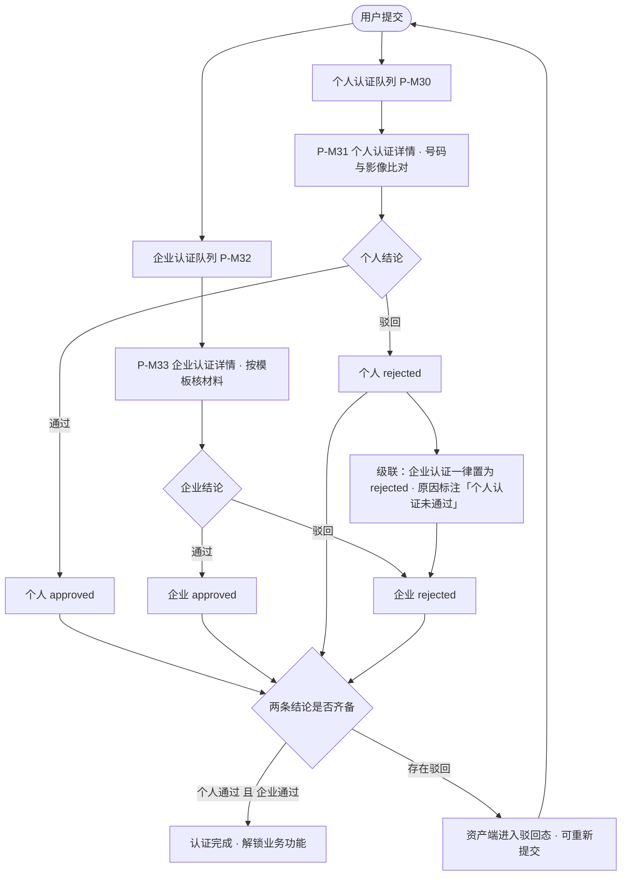

# 资产端 / 资产管理端 · 实名认证与审核 PRD（个人认证 + 企业认证）

> **本 PRD 已拆分为 8 个文件，本文件是主文档与入口。** 拆分**只改文件归属，不改内容**：章节号与全部编号（`DK` / `F-K` / `N-K` / `AC-K` / `R` / `E` / `P-A` / `P-K` / `P-M` / `C-K` / `C-M` / `N-0x` / `Q`）一律沿用拆分前的取值，未做任何重排——原来的「7.5.3.3」拆分后仍叫「7.5.3.3」，只是搬到了另一个文件里。

## 0. 导航索引

### 0.1 文件清单

| 文件 | 装了哪些章节 | 给谁看 |
| --- | --- | --- |
| **`v1.0-实名认证与审核-PRD.md`**（本文件） | 1 文档信息、2 背景与目标、3 范围与边界、4 用户角色与场景、5 信息架构与页面流、6 功能清单、12 权限、16 非功能要求、17 指标、18 依赖与风险、20 待确认事项、21 已确认口径与可调参数 | 所有人的入口。产品、项目、新加入的成员先读这一份 |
| [`01-个人认证.md`](./01-个人认证.md) | 7.1 认证入口与准入、7.2 个人认证填写、8.1 个人字段总表、8.2 证件号码校验与归一化、8.3 证件影像与材料上传 | 前后端与测试。个人认证的字段、校验与影像规则 |
| [`02-企业认证与模板.md`](./02-企业认证与模板.md) | 7.3 企业认证填写、8.4 公共字段与模板机制、8.5 六套模板、9 企业唯一标识 | 前后端与测试。按注册地分模板的全部内容，以及企业唯一键 |
| [`03-流程与状态机.md`](./03-流程与状态机.md) | 7.4 草稿与分步保存、7.5 状态展示与重新提交、10 主流程与异常流程、11 状态机、15 数据对象与字段 | 开发与测试。流程、状态流转与数据字段 |
| [`04-管理端审核.md`](./04-管理端审核.md) | 7.6 个人认证审核、7.7 企业认证审核（含级联）、7.8 审核记录与留痕、8.6 审核要点清单、13 敏感数据的展示与安全 | 管理端开发、测试与安全。审核台的全部内容 |
| [`05-通知.md`](./05-通知.md) | 14 通知（站内信 + 邮件） | 开发与运营。**发什么、什么时候发、发给谁、走哪些渠道、文案是什么** |
| [`06-双语文案与线框.md`](./06-双语文案与线框.md) | 8.7 中英双语文案对照、8.8 关键页面线框级说明 | 前端与设计。界面文案与线框 |
| [`07-验收标准.md`](./07-验收标准.md) | 19 验收标准 | 测试。全部验收条目 |

### 0.2 为什么这样切（切法说明）

| 决定 | 理由 |
| --- | --- |
| **按业务对象切，而不是按章节号顺序切** | 本 PRD 的第 7 章（模块详情）与第 8 章（页面与字段）都是「个人 + 企业 + 管理端」三条线并排写的。若按章号整章搬，看个人认证要同时开两个文件、看企业模板也要开两个文件。按对象切之后，「个人认证的字段与校验」「企业模板与唯一键」「管理端审核台」各自成册，一次只开一个文件 |
| **第 7、8 章被拆到多个文件** | 同上。章节号保持原值，靠 0.3 的对照表定位，不会因此找不到 |
| **9 企业唯一标识跟着 02** | 唯一键的构成完全由各模板的主注册号决定（9.2），与 8.5 的六套模板是同一件事的两面，分开会来回翻 |
| **13 敏感数据跟着 04** | 证件号码明文展示、访问控制与下载留痕，全部发生在管理端审核台上，读者与 7.6～7.8 完全重合 |
| **15 数据对象跟着 03** | 数据字段是状态机与流程的落地形态，一起看才知道每个状态改了哪些字段 |
| **8.7 文案与 8.8 线框单独成册（06）** | 这两节共 320 余行、且是设计与前端的高频查阅项，塞进任何一个业务分册都会喧宾夺主；单独成册后可以直接丢给设计 |
| **通知单独成册（05）** | 第 14 章是与 WS-304 的接口面，改动频率与业务章节不同步，独立成册便于单独评审 |
| 与《账户与登录 PRD》保持同构 | 主文档 + 编号数字前缀的分册、主文档含 0 导航索引、每册开头写「讲什么 / 不讲什么」，都与 `prd/v1.0-账户与登录/` 一致 |

> 与建议切法的差异：建议里是「6 个分册」，实际出了 **7 个**——多出来的是 [`06-双语文案与线框.md`](./06-双语文案与线框.md)。原因见上表倒数第三行。除此之外，分册主题与建议一致。

### 0.3 章节 → 文件对照

| 章节 | 所在文件 |
| --- | --- |
| 1、2、3、4、5、6 | 本文件 |
| 7.1、7.2 | [`01-个人认证.md`](./01-个人认证.md) |
| 7.3 | [`02-企业认证与模板.md`](./02-企业认证与模板.md) |
| 7.4、7.5 | [`03-流程与状态机.md`](./03-流程与状态机.md) |
| 7.6、7.7、7.8 | [`04-管理端审核.md`](./04-管理端审核.md) |
| 8.1、8.2、8.3 | [`01-个人认证.md`](./01-个人认证.md) |
| 8.4、8.5 | [`02-企业认证与模板.md`](./02-企业认证与模板.md) |
| 8.6 | [`04-管理端审核.md`](./04-管理端审核.md) |
| 8.7、8.8 | [`06-双语文案与线框.md`](./06-双语文案与线框.md) |
| 9 | [`02-企业认证与模板.md`](./02-企业认证与模板.md) |
| 10、11 | [`03-流程与状态机.md`](./03-流程与状态机.md) |
| 12 | 本文件 |
| 13 | [`04-管理端审核.md`](./04-管理端审核.md) |
| 14 | [`05-通知.md`](./05-通知.md) |
| 15 | [`03-流程与状态机.md`](./03-流程与状态机.md) |
| 16、17、18 | 本文件 |
| 19 | [`07-验收标准.md`](./07-验收标准.md) |
| 20、21 | 本文件 |

### 0.4 编号索引

拿到一个编号想知道去哪查，对照下表。**这些编号在拆分前后完全一致。**

| 编号 | 含义 | 定义位置 | 说明 |
| --- | --- | --- | --- |
| `F-K01`～`F-K38` | 功能点 | 本文件 第 6 章 | 各功能的详细规则分散在 01～05 分册 |
| `AC-K01`～`AC-K140` | 验收标准 | [`07-验收标准.md`](./07-验收标准.md) 第 19 章 | 按主题分组，含 `AC-K64a` 等带字母后缀的补充条目 |
| `DK-01`～`DK-50` | 已确认口径 | 本文件 21.1 | 每条给出最终结论 |
| `N-K01`～`N-K10` | 可调参数 | 本文件 21.2 | 可改数值、不改逻辑 |
| `Q-01` / `Q-14` | 仍开放的待确认事项 | 本文件 第 20 章 | 其余 14 项已转为 `DK` 口径 |
| `R-01`～`R-13` | 风险 | 本文件 18.2 | |
| `E-01`～`E-25` | 异常流程 | [`03-流程与状态机.md`](./03-流程与状态机.md) 10.5 | |
| `N-01`～`N-07` | 通知节点 | [`05-通知.md`](./05-通知.md) 14.3 | 与 `N-K` 可调参数是两套编号，勿混 |
| `R-P01`～`R-P10`、`R-E01`～`R-E12` | 预置驳回原因项 | [`06-双语文案与线框.md`](./06-双语文案与线框.md) 8.7.4 | 审核端选择、用户侧回显 |
| `T1`～`T6` | 六套企业认证模板 | [`02-企业认证与模板.md`](./02-企业认证与模板.md) 8.5 | |
| `P-A17` | 用户中心 | 本文件 5.1 | 页面本身由 WS-302 定义，本 PRD 定义其认证内容 |
| `P-K01`～`P-K03` | 资产端认证页面 | 本文件 5.1 | 业务规则见 [`01-个人认证.md`](./01-个人认证.md) 与 [`03-流程与状态机.md`](./03-流程与状态机.md) |
| `P-M30`～`P-M33` | 管理端审核页面 | 本文件 5.1 | 由 `P-M10`～`P-M13` 迁移而来，见 [`05-通知.md`](./05-通知.md) 14.10 |
| `C-K01`～`C-K04`、`C-M01`～`C-M03` | 本模块组件 | 本文件 5.1 | 带模块字母，与 WS-301 / WS-302 的 `C-xx` 不冲突 |

---

## 1. 文档信息

| 项目 | 内容 |
| --- | --- |
| 文档名称 | 资产端 / 资产管理端 · 实名认证与审核产品需求文档（个人认证 + 企业认证） |
| 对应需求 | WS-303（父需求 WS-296「资产端、资产管理端-登录和认证」） |
| 上游输入 | 《Carloha 资产端与资产管理端登录、认证及通知需求诊断简报》V1.0；需求方在 WS-303 给出的实名认证字段级规格 |
| 编写人 | 许楚清（需求分析师） |
| 文档语言 | 中文（界面字段与文案给出中英对照） |
| 覆盖端 | 资产端 Web（认证填写与状态）、资产管理端 Web（认证审核） |
| 关联需求 | WS-302「账户与登录（含全局国际化基线）」——账户模型、登录态、凭据完备性前置校验、落地规则、国际化 / 时区 / Toast / 面包屑等全局基线由该需求定义，本文档直接引用不重复定义；WS-301「协议管理」——本文档不涉及；**WS-304「平台消息推送能力」**——消息数据契约、`biz_type` 命名、`category` 枚举、`recipient_scope`、`channels`、`dedupe_key`、`page_target`、进度四态与站内信的展示 / 已读 / 角标由该需求定义，本文档按其契约接入；按 WS-304 D-N45 的职责切分，**认证相关的消息文案与邮件模板由本文档提供**（[`05-通知.md`](./05-通知.md) 第 14 章） |

> 说明：本文中标注为「强制条款」的规则（第 [`01-个人认证.md`](./01-个人认证.md) 8.2 节证件号码校验与归一化、第 [`01-个人认证.md`](./01-个人认证.md) 8.3 节影像必传、第 [`04-管理端审核.md`](./04-管理端审核.md) 13.1 节证件号码明文完整展示、第 [`04-管理端审核.md`](./04-管理端审核.md) 7.7.3 节个人未通过则企业默认不通过）不可省略、不可降级、不可自行改写为其他方案。
> 需求方已对首版列出的 16 项待确认逐条给出结论，全部转为正文口径并汇总在第 21.1 节（DK 编号）。**第 20 章现在只剩两项仍需外部输入**（Q-01 四地材料清单来源、Q-14 材料保留期），两项均不阻塞开发，但须在上线前闭环。
> 性能与体验类目标值（如接口响应、上传成功率）标注为「目标值」，联调与灰度阶段校准，不影响验收通过与否。

---

## 2. 背景与目标

### 2.1 背景

WS-302 已经把「账户怎么建立、怎么登录」这条底层链路定义完成：用户首次用邮箱验证码或钱包签名登录即自动建号，登录后按认证状态落地——个人或企业认证未完成时落到「用户中心」，企业认证通过后落到「总览页」。也就是说，**用户中心里的认证内容就是新用户进门后看到的第一屏实质业务**，本文档定义的正是这一屏及其后台审核闭环。

平台服务的是跨境资产参与方：提交人是自然人，实际参与业务的主体是企业，而企业可能注册在中国大陆、香港、美国、开曼或尼日利亚等不同法域。这带来两个必须在本期解决清楚的问题：

1. **同一套表单装不下所有法域的企业材料**。「统一社会信用代码」在香港没有对应物，美国的注册号按州签发，开曼的公司注册编号与尼日利亚的 RC 编号命名与位数各不相同。若只出一套表单，要么把字段做成一堆自由文本失去校验能力，要么强行套用国内口径导致境外企业填不下去。
2. **企业必须在平台上唯一**。企业是资产业务的权利义务主体，同一家企业若被两个账号各自认证一次，后续的资产归属、额度、对账都会出现两份互不相识的记录。唯一性判定口径必须在认证入口这一层就定死，而不是留给业务模块各自去猜。

同时，认证材料是全平台敏感度最高的数据。需求方已明确运营端审核详情**明文完整展示证件号码**——这是为了让审核员能一眼比对号码与影像，是经过权衡的业务决策；本文档按此执行，并在[`04-管理端审核.md`](./04-管理端审核.md) 第 13 章配套定义与之匹配的访问控制与留痕要求。

### 2.2 本期目标

1. **一次填完**：个人认证与企业认证在资产端合并为一条连续的填写链路，用户不必分两次进入、不必重复填写同一个人的信息。
2. **字段口径统一**：证件类型、姓名、英文姓名、国籍、证件号码、证件影像六项的顺序、校验、归一化与存储口径全部定死，前后端与审核端按同一份规则执行。
3. **按注册地分模板**：企业认证由「企业注册地」驱动加载对应模板，中国大陆、香港、美国、开曼、尼日利亚各一套，其余注册地走通用模板；切换注册地时已填内容有明确的保留 / 清空规则。
4. **企业全平台唯一**：给出各模板下的唯一键构成、归一化规则、查重时点、重复注册的拦截与提示，以及企业与账号的绑定关系；本期不做一账号多企业，但唯一键与数据关系能直接承接该扩展。
5. **两个审核任务并行**：管理端把个人认证与企业认证拆成两个独立队列，可由不同审核员并行处理；个人认证未通过时，企业认证一律不通过。
6. **审核可追溯**：每一次通过、驳回、重新提交都有版本、操作人、时间与原因留痕；每一次查看证件号码与影像也留痕。
7. **驳回可行动**：驳回原因结构化到字段 / 材料一级，用户重新提交时能直接看到「哪一项要改、为什么」。

### 2.3 范围边界

| 边界项 | 归属 |
| --- | --- |
| 账户模型、三种登录方式、会话、锁定、滑块与验证码限频 | WS-302 |
| 发起个人认证前的**凭据完备性校验**（邮箱与钱包须同时具备）与就地补齐弹层 | WS-302 定义，本文档只在 7.1.2 引用其结论 |
| 登录后按认证状态落地的跳转规则 | WS-302 定义（D-04），本文档只提供「个人认证是否完成」「企业认证是否完成」两个状态位 |
| 全局国际化（语言判定、时区、日期 / 数字 / 地址展示）、Toast、面包屑、账号下拉 | WS-302 第 13 章与 8.7 节，本文档直接引用 |
| 用户协议正文、版本与重新同意规则 | WS-301 |
| 站内信的列表展示、未读角标、已读语义、跳转执行与降级 | WS-304。本文档不定义这些页面逻辑 |
| 站内信的投递与去重合并 | WS-304。本文档按其契约产出消息 |
| **认证消息的文案** | **本文档**（[`05-通知.md`](./05-通知.md) 14.7）。按 WS-304 D-N45：通用规则归 WS-304、实际文案由接入方给 |
| **认证邮件的全部环节**（触发、模板、发送、失败与退信处理） | **本文档自持**（[`05-通知.md`](./05-通知.md) 14.8）。用户已裁定邮件不属于消息通知模块 |
| **一个账号管理多家企业** | 后期迭代。本期不出功能、不出页面；数据关系与唯一键预留扩展位，见第 [`02-企业认证与模板.md`](./02-企业认证与模板.md) 9.5 节 |
| 第三方 KYC / KYB 自动核验、OCR 自动识别、人脸活体、证件真伪库比对 | 不在本期。本期为**纯人工审核**（DK-36） |
| 企业成员 / 多操作人、企业角色与授权到期管理 | 后期迭代 |
| 认证通过后的业务功能（资产、额度、合同、结算） | 各业务模块。本文档只提供「双认证通过」这一放行信号 |
| 管理端账号的创建、停用与权限分配 | WS-302 第 7.7 节：由技术在数据层维护，本期管理端只有「管理员」一种角色 |

---

## 3. 范围与边界

### 3.1 已确认的产品决策（直接作为约束）

以下条目均已由需求方确认，作为正文规则直接执行，不再列为待确认项。

| # | 决策 | 来源 |
| --- | --- | --- |
| 1 | **认证准入**：所有资产端用户必须**同时完成**个人认证与企业认证；两者都通过后才解锁业务功能 | WS-296 用户确认 |
| 2 | **前台合并填写**：个人认证与企业认证在资产端统一填写、连续完成，一次提交 | WS-303 issue 描述 |
| 3 | **后台拆两个审核任务**：个人认证审核与企业认证审核相互独立，可并行处理 | WS-296 用户确认 |
| 4 | **级联规则**：个人认证未通过时，企业认证默认不通过 | WS-296 用户确认 |
| 5 | **多企业**：一个账号管理多家企业属后期迭代，本期不做 | WS-296 用户确认 |
| 6 | 个人认证字段共六项，**表单顺序固定**：证件类型 → 姓名 → 英文姓名 → 国籍 → **证件号码** → 证件影像 | WS-303 用户规格 |
| 7 | **证件号码由用户自主填写**（不由 OCR 自动带出、不做只读回填） | WS-303 用户规格 |
| 8 | **身份证号码格式**：18 位，前 17 位为数字，末位为数字或 `X`，**大小写不敏感** | WS-303 用户规格 |
| 9 | **护照号码格式**：先剔除连字符、空格等分隔符，再校验 5–20 位字母或数字；**不按签发国做进一步规则校验** | WS-303 用户规格 |
| 10 | **归一化只用于校验判定与唯一性比对；存储与展示一律保留用户原样输入** | WS-303 用户规格 |
| 11 | 证件号码**须与证件影像上的号码一致**，作为人工审核要点执行 | WS-303 用户规格 |
| 12 | **影像必传规则**：证件类型为身份证时必传人像面 + 国徽面；为护照时必传护照人像页 | WS-303 用户规格 |
| 13 | **运营端审核详情明文完整展示证件号码**，不脱敏、不设「查看完整」二次动作 | WS-303 用户规格（强制条款） |
| 14 | **企业认证按注册地分模板**：中国（大陆）国内模板；香港、美国、开曼、尼日利亚各一套专属模板；其余注册地一套通用模板 | WS-303 用户规格 |
| 15 | 国内模板必填：**统一社会信用代码** + **营业执照** + **法定代表人证件** + **授权委托书** | WS-303 用户规格 |
| 16 | 模板选择由「企业注册地」字段驱动，切换注册地须有明确的已填内容处理规则 | WS-303 用户规格 |
| 17 | **企业在平台内唯一**：各模板下有明确的唯一键构成与归一化规则，重复注册须拦截 | WS-303 用户规格 |
| 18 | 界面语言默认英文、中英可切换，字段与文案给出中英对照 | WS-296 用户确认 |
| 19 | 认证状态机包含：未提交 / 审核中 / 通过 / 驳回 / 重新提交 | WS-303 issue 描述 |
| 20 | 认证材料的敏感变更安全按《需求诊断简报》最低建议执行 | WS-296 用户确认 |
| 21 | **不提供审核 SLA**：界面不出现任何审核时长与时限文案 | WS-303 用户确认 |
| 22 | **管理端不实现多角色区分**：所有管理端登录用户权限等同 | WS-303 用户确认 |
| 23 | **允许审核员下载证件影像与企业材料原件，不做限制**；下载动作计入留痕 | WS-303 用户确认 |
| 24 | **不提供改判 / 撤销**；误判通过由用户重新提交修正——因此已通过状态下仍可重新提交 | WS-303 用户确认 |
| 25 | **中国澳门、中国台湾地区走通用模板 T6**，不单独建模板 | WS-303 用户确认 |
| 26 | 提交次数不设总量上限；同一账号 24 小时内最多提交 5 次 | WS-303 用户确认 |
| 27 | 通用模板 T6 最低必填＝注册号名称 + 注册号 + 注册证明文件 + 授权人证件 + 授权委托书；**不新增独立补件状态** | WS-303 用户确认 |
| 28 | 管理端列表**不设证件号码列** | WS-303 用户确认 |
| 29 | 国籍清单外的情形按建议处理（不提供自由输入，引导联系客服） | WS-303 用户确认 |
| 30 | 提交人本人即法定代表人 / 董事时**仍需提交授权委托书** | WS-303 用户确认 |
| 31 | **本期不引入 OCR 识别**与第三方自动核验，纯人工审核 | WS-303 用户确认 |
| 32 | **不补充**证件有效期、出生日期、住址等字段 | WS-303 用户确认 |
| 33 | **不建立独立的第五个状态**（重新提交），以「审核中 + 版本号」表达 | WS-303 用户确认 |
| 34 | **不对证件号码做跨账号唯一性拦截** | WS-303 用户确认 |
| 35 | 四地材料清单**无指定来源**，按本文档 [`02-企业认证与模板.md`](./02-企业认证与模板.md) 8.5 的建议清单先行，上线前由合规方闭环 | WS-303 用户确认 |
| 36 | 认证材料保留期需业务 / 合规方给定，本文档不代为设定 | WS-303 用户确认 |
| 37 | **认证消息的文案由本 PRD 提供**；站内信的通用规则与展示归 WS-304 | WS-304 D-N45 |
| 38 | **邮件不属于消息通知模块**，认证邮件的触发、模板、发送与失败处理**由本 PRD 自持**；提交给 WS-304 的 `channels` 一律 `["in_app"]` | 用户 2026-09-08 裁定 |
| 39 | 关键节点走**站内信 + 邮件**双渠道；站内信字段与命名一律按 WS-304 契约执行 | 本轮委派要求 |
| 40 | 管理端页面编号迁移到 `P-M30`～`P-M33`，解决与 WS-301 的重号 | WS-304 X-01 建议方案（用户已批） |

### 3.2 与其他需求的接口

| 依赖方向 | 内容 | 归属 |
| --- | --- | --- |
| 本模块 ← WS-302 | `account_id`（不可变账户主键）、登录态与会话、账户状态、语言与时区偏好、`email` 与 `wallet_address` | WS-302 定义，本模块消费 |
| 本模块 ← WS-302 | **发起个人认证前的凭据完备性校验**（邮箱 + 钱包须同时具备）与就地补齐弹层 C-09 | WS-302 定义（7.5.2），本模块在入口处引用 |
| 本模块 → WS-302 | **「个人认证是否完成」「企业认证是否完成」两个状态位**，供 WS-302 的登录后落地规则（D-04）判定 | 本文档定义 |
| 本模块 → 各业务模块 | **「双认证通过」放行信号**：业务功能一律以本状态为准放行，不以凭据完备状态为准 | 本文档定义，见 [`01-个人认证.md`](./01-个人认证.md) 7.1.3 |
| 本模块 → WS-304 | 7 个站内信事件的 `biz_type`、`category`、`recipient_scope`、`dedupe_key`、`biz_ref` / `page_target`、`progress`、模板 key 与变量（[`05-通知.md`](./05-通知.md) 第 14 章）；`channels` 一律 `["in_app"]` | 本文档定义并登记，WS-304 承载与展示 |
| 本模块 ⊥ WS-304 | **邮件不经由 WS-304**：认证邮件由本模块自行触发与发送（14.8.1），两者无接口关系 | 用户 2026-09-08 裁定 |
| 本模块 ← WS-304 | 消息数据契约（`02-数据契约与字段.md` 第 9 章）、`biz_type` 与页面编号的全平台唯一规则、进度四态枚举 | WS-304 定义，本模块遵守 |
| 本模块 → WS-304 | 驳回类消息的**跳转预检接口**（14.6） | 本文档提供接口与失效原因取值 |
| 本模块 ← WS-302 | 国际化基线（语言判定、时区与时间展示、数字与地址展示、文案与翻译规范） | WS-302 第 13 章 |
| 本模块 ← WS-302 | 全局交互规范：Toast（顶部居中，全站唯一轻提示载体）、面包屑、右上角账号下拉、弹窗规范 | WS-302 第 8.7 节与 5.3 节 |
| 本模块 → 后期迭代 | 一账号多企业所需的「账户 — 个人主体 — 企业实体」三层关系与企业唯一键 | 本文档第 [`02-企业认证与模板.md`](./02-企业认证与模板.md) 9.5 节预留 |
| 本模块 → 技术 / 运维 | 认证材料的存储加密、访问审计与保留期要求 | 见第 16 章 |
| 本模块 → 部署 | 国家 / 地区标准清单、美国州清单、企业模板配置的下发方式 | 见 [`02-企业认证与模板.md`](./02-企业认证与模板.md) 8.4.2 与第 18 章 |

---

## 4. 用户角色与场景

### 4.1 角色

| 角色 | 所在端 | 描述 | 本模块内的核心诉求 |
| --- | --- | --- | --- |
| 首次进入的资产端用户 | 资产端 | 刚自动建号、落到用户中心，尚未提交任何认证 | 一次把个人与企业材料填完，中途能存草稿，明确知道要多久出结果 |
| 提交后等待结果的用户 | 资产端 | 已提交，个人 / 企业两条审核在跑 | 随时看到两条各自的进度，不必猜 |
| 被驳回的用户 | 资产端 | 收到驳回结论 | 一眼看到是哪一项不合格、为什么，改完直接重提，不用从头填 |
| 境外注册企业的提交人 | 资产端 | 企业注册在香港 / 美国 / 开曼 / 尼日利亚或其他法域 | 选完注册地就看到自己法域的字段与材料名称，不必去猜「统一社会信用代码」填什么 |
| 个人认证审核员 | 管理端 | 处理个人认证队列 | 证件号码与影像并排、号码完整可见可复制，能快速比对；驳回时能精确指出问题项 |
| 企业认证审核员 | 管理端 | 处理企业认证队列 | 按注册地看到对应的材料清单与审核要点；能跳到同一账号的个人认证结论 |
| 平台安全 / 合规管理员 | 管理端 | 事后审计 | 谁在什么时间看了谁的证件号与影像、谁做的结论、依据是什么，全部可查 |

### 4.2 用户故事

| # | 角色 | 用户故事 | 对应功能 |
| --- | --- | --- | --- |
| US-01 | 首次进入的用户 | 作为刚建号的用户，我希望进门后就清楚看到「要完成个人认证和企业认证才能开始业务」，并能立刻开始填 | 认证入口与准入说明 |
| US-02 | 首次进入的用户 | 作为填表的用户，我希望个人和企业的信息在一条流程里填完，不用退出去再进来一次 | 合并填写、分步表单 |
| US-03 | 填到一半的用户 | 作为材料没带齐的用户，我希望已填的内容被自动保存，换台电脑登录还能接着填 | 草稿与分步保存 |
| US-04 | 填个人信息的用户 | 作为持护照的境外用户，我希望选了护照就只让我传护照人像页，不要求我传身份证国徽面 | 证件类型驱动的影像必传规则 |
| US-05 | 填个人信息的用户 | 作为手动输号码的用户，我希望我输入的号码原样保留（我带的空格和连字符不被系统改掉），同时格式不对时能当场提示我 | 归一化只用于校验、原样存储 |
| US-06 | 境外企业提交人 | 作为香港公司的提交人，我希望表单直接问我 CR 编号和商业登记证，而不是问我统一社会信用代码 | 按注册地分模板 |
| US-07 | 境外企业提交人 | 作为一开始选错注册地的用户，我希望改注册地时系统明确告诉我哪些已填内容会被清空，而不是默默丢掉 | 切换注册地的数据处理 |
| US-08 | 任意提交人 | 作为提交人，我希望在提交时就被告知「这家企业已被注册过」，而不是等审核几天后才被驳回 | 企业唯一性提交前拦截 |
| US-09 | 等待结果的用户 | 作为已提交的用户，我希望分别看到个人认证和企业认证各自走到哪一步 | 双轨状态展示 |
| US-10 | 被驳回的用户 | 作为被驳回的用户，我希望看到具体是哪一张影像 / 哪一个字段有问题，改完那一项就能重提 | 驳回原因字段级回显 |
| US-11 | 个人认证审核员 | 作为审核员，我希望在详情页看到完整的证件号码原文（不打码、不用再点一次「查看完整」），旁边就是证件影像，直接比对 | 证件号码明文完整展示 |
| US-12 | 企业认证审核员 | 作为审核员，我希望看到这家企业注册地对应的审核要点清单，知道该核什么 | 按模板的审核要点 |
| US-13 | 企业认证审核员 | 作为审核员，我希望在企业详情页能看到同一账号的个人认证结论，个人被驳回时企业不需要我再单独判断 | 级联规则与关联跳转 |
| US-14 | 两位审核员 | 作为分工处理的两位审核员，我们希望能同时各审各的，互不等待 | 双队列并行 |
| US-15 | 审核员 | 作为审核员，我希望驳回时从固定选项里选出问题项并补充说明，而不是每次手打一段话 | 结构化驳回原因 |
| US-16 | 审核员 | 作为审核重提件的审核员，我希望能看到用户这次改了什么、上一版被驳回的原因是什么 | 版本与变更标记 |
| US-17 | 合规管理员 | 作为合规管理员，我希望能查到某个账号的证件影像在什么时间被谁看过 | 敏感访问留痕 |
| US-18 | 国际用户 | 作为英文用户，我希望材料名称、国家名称、驳回原因都是英文，而不是中文夹杂 | 中英对照文案 |

---

## 5. 信息架构与页面流

### 5.1 页面清单

**资产端（已登录）**

| 编号 | 页面 / 组件 | 形态 | 说明 |
| --- | --- | --- | --- |
| P-A17 | 用户中心 | 整页 | WS-302 定义的落地页，**本文档定义其内容**：顶部认证状态区（个人 / 企业双轨）+ 主操作按钮 |
| P-K01 | 认证填写页 | 整页 · 三步 | 步骤 1 个人认证信息 → 步骤 2 企业认证信息 → 步骤 3 核对并提交；顶部步骤条，可回退 |
| P-K02 | 提交结果页 | 整页 | 提交成功后的确认页，展示两条审核任务已创建；**不展示任何预计处理时长** |
| P-K03 | 认证详情页 | 整页 | 提交后查看已提交内容（只读）、当前状态、审核结论与驳回原因；驳回态提供「重新提交」入口，**已通过态提供「更新认证资料」入口**（[`03-流程与状态机.md`](./03-流程与状态机.md) 7.5.3.3） |
| C-K01 | 证件 / 材料上传控件 | 组件 | 拖拽或点击上传、预览、替换、删除、上传进度与失败重试 |
| C-K02 | 国家 / 地区选择器 | 组件 | 标准清单、支持中英文名称与代码搜索 |
| C-K03 | 切换确认弹窗 | 弹窗 | 切换证件类型或企业注册地时的二次确认，列出将被清空的内容 |
| C-K04 | 提交前确认弹窗 | 弹窗 | 提交不可撤回的告知与最终确认 |

> 认证相关页面全部挂在「用户中心」下，面包屑为 `用户中心 / 实名认证`（规则见 WS-302 5.3）。左侧菜单不新增菜单项。

**资产管理端**

| 编号 | 页面 | 说明 |
| --- | --- | --- |
| P-M30 | 个人认证审核列表 | 独立菜单项，独立队列 |
| P-M31 | 个人认证审核详情 | 左侧字段（证件号码明文完整）+ 右侧影像预览 + 审核要点 + 结论操作 |
| P-M32 | 企业认证审核列表 | 独立菜单项，独立队列 |
| P-M33 | 企业认证审核详情 | 按注册地模板渲染字段与材料 + 审核要点 + 关联的个人认证结论 + 结论操作 |
| C-M01 | 驳回弹窗 | 结构化问题项多选 + 补充说明（双端可见） |
| C-M02 | 影像 / 材料查看器 | 放大 / 缩小 / 旋转 / 全屏 / 双图并排；**提供原件下载**（不做限制，下载动作计入留痕，见 [`04-管理端审核.md`](./04-管理端审核.md) 13.3） |
| C-M03 | 审核记录时间线 | 嵌在详情页底部，展示全部版本与操作留痕 |

> **管理端页面编号使用 `P-M30`～`P-M33` 段**：原 `P-M10`～`P-M13` 与 WS-301 的协议管理页面重号，会导致 WS-304 的 `page_target` 无法唯一解析，已按 WS-304 的平台级编号唯一性规则整体迁移，迁移对照见 14.10。

**管理端左侧菜单新增**

| 菜单项 | 指向 | 说明 |
| --- | --- | --- |
| 个人认证审核 | P-M30 | 带待审数量角标 |
| 企业认证审核 | P-M32 | 带待审数量角标 |

### 5.2 资产端认证主流程

```mermaid
flowchart TD
    Login([登录成功 · WS-302 落地规则]) --> UC[P-A17 用户中心]
    UC --> St{当前认证状态}

    St -->|未提交| Start[展示「开始认证」主按钮]
    St -->|审核中| Pending[展示双轨进度 · 只读查看 P-K03]
    St -->|存在驳回| Rej[展示驳回原因摘要 + 「重新提交」]
    St -->|双通过| Done[展示已认证 · 后续登录落到总览页]
    Done -->|更新认证资料| S1

    Start --> Gate{邮箱与钱包是否都具备?}
    Gate -->|否| Inline[WS-302 C-09 就地补齐弹层 · 补完原地继续]
    Gate -->|是| S1[P-K01 步骤1 · 个人认证信息]
    Inline --> Gate

    Rej --> S1

    S1 -->|下一步 · 前端校验通过| S2[P-K01 步骤2 · 企业认证信息]
    S2 -->|选择企业注册地| Tpl[加载对应模板字段与材料清单]
    Tpl -->|下一步 · 前端校验通过| S3[P-K01 步骤3 · 核对并提交]
    S3 --> Confirm[C-K04 提交确认弹窗]
    Confirm -->|确认提交| Chk{服务端校验}

    Chk -->|字段/影像不合格| Err[定位到出错项 · Toast 提示]
    Chk -->|企业唯一键冲突| Dup[拦截 · 展示重复注册提示 · 见 [`02-企业认证与模板.md`](./02-企业认证与模板.md) 9.4]
    Chk -->|通过| Create[生成个人认证申请 + 企业认证申请 · 版本+1]

    Create --> P2[P-K02 提交结果页]
    P2 --> Pending
    Pending --> Result{审核结论}
    Result -->|双通过| Done
    Result -->|任一驳回| Rej
```

### 5.3 管理端审核流程



> **并行的含义**：两条队列的领取、审核与结论互不阻塞，任一条先出结论都不等待另一条。级联规则只在「个人结论为驳回」这一刻生效（见 [`04-管理端审核.md`](./04-管理端审核.md) 7.7.3）。

---

## 6. 功能清单

| 模块 | 编号 | 功能点 | 优先级 | 验收口径 |
| --- | --- | --- | --- | --- |
| 认证入口 | F-K01 | 用户中心认证状态区（个人 / 企业双轨） | P0 | 两条认证的状态、时间、结论分别展示，不合并为一条 |
| 认证入口 | F-K02 | 认证准入与未完成时的功能可达范围 | P0 | 双认证通过前业务功能不放行，但账户设置、语言、协议、客服、认证本身全程可用 |
| 认证入口 | F-K03 | 发起认证前的凭据完备性校验（引用 WS-302） | P0 | 缺邮箱或钱包时走 C-09 弹层就地补齐，补完原地继续 |
| 个人认证 | F-K04 | 六字段固定顺序表单 | P0 | 顺序为证件类型 → 姓名 → 英文姓名 → 国籍 → 证件号码 → 证件影像，证件号码固定在国籍之后、影像之前 |
| 个人认证 | F-K05 | 证件类型驱动的影像必传规则 | P0 | 身份证必传人像面 + 国徽面；护照必传人像页；缺任一项不可提交 |
| 个人认证 | F-K06 | 证件号码校验与归一化 | P0 | 身份证 `^[0-9]{17}[0-9Xx]$`；护照剔除分隔符后 `^[A-Za-z0-9]{5,20}$`；归一化只用于判定 |
| 个人认证 | F-K07 | 证件号码原样存储与原样展示 | P0 | 数据库存的、页面展示的、审核端看到的都是用户输入的原始字符串 |
| 个人认证 | F-K08 | 国籍标准清单选择器 | P0 | 来自标准国家 / 地区清单，中英文名称与代码可搜索，不可自由输入 |
| 企业认证 | F-K09 | 注册地驱动的模板加载 | P0 | 选中注册地后立即渲染对应模板的字段与材料清单 |
| 企业认证 | F-K10 | 六套模板（CN / HK / US / KY / NG / 通用） | P0 | 每套模板的注册号命名、位数规则、注册证明文件名称、董事 / 授权人材料按 [`02-企业认证与模板.md`](./02-企业认证与模板.md) 8.5 定义 |
| 企业认证 | F-K11 | 切换注册地的已填内容处理 | P0 | 公共字段保留、模板专有字段与专属材料清空，清空前二次确认并列出清单 |
| 企业认证 | F-K12 | 企业唯一键计算与提交前查重 | P0 | 按 [`02-企业认证与模板.md`](./02-企业认证与模板.md) 9.2 构成唯一键，冲突时提交被拦截并给出可行动提示 |
| 企业认证 | F-K13 | 授权关系字段（被授权人＝本账号个人主体） | P0 | 企业表单不重复填写个人信息，自动引用步骤 1 的姓名与证件 |
| 填写体验 | F-K14 | 三步表单与步骤条 | P0 | 可前后切换，已完成步骤可回改，未完成步骤不可跳入 |
| 填写体验 | F-K15 | 草稿自动保存与手动保存 | P0 | 字段失焦即存、文件上传成功即存；换设备登录可续填 |
| 填写体验 | F-K16 | 材料上传（格式 / 大小 / 张数 / 失败重试） | P0 | 见 [`01-个人认证.md`](./01-个人认证.md) 8.3.2；失败可重试且不丢失已填字段 |
| 状态与重提 | F-K17 | 认证状态机（未提交 / 审核中 / 通过 / 驳回 + 重新提交） | P0 | 按[`03-流程与状态机.md`](./03-流程与状态机.md) 第 11 章状态机执行，两条认证各自独立走一套 |
| 状态与重提 | F-K18 | 驳回原因字段级回显 | P0 | 每条问题项定位到具体字段或材料，重提时该项高亮标「需修改」 |
| 状态与重提 | F-K19 | 重新提交与版本累加 | P0 | 重提生成新版本，历史版本与结论全部保留可查 |
| 管理端审核 | F-K20 | 个人认证审核队列（列表 / 筛选 / 搜索 / 分页） | P0 | 独立菜单与队列，默认按提交时间升序 |
| 管理端审核 | F-K21 | 企业认证审核队列 | P0 | 同上，且可按注册地筛选 |
| 管理端审核 | F-K22 | **证件号码明文完整展示** | P0 | 详情页展示完整原文，无掩码、无「查看完整」二次动作，可一键复制 |
| 管理端审核 | F-K23 | 影像 / 材料查看器（放大 / 旋转 / 并排 / 下载） | P0 | 身份证两面可并排比对；原件可直接下载，每次下载写入留痕 |
| 管理端审核 | F-K24 | 审核要点清单（按证件类型 / 注册地） | P1 | 详情页展示对应清单，含「号码与影像一致」项 |
| 管理端审核 | F-K25 | 通过 / 驳回操作与结构化驳回原因 | P0 | 驳回至少选择一个问题项，可补充说明；说明对用户可见 |
| 管理端审核 | F-K26 | **个人未通过则企业默认不通过（级联）** | P0 | 个人结论为驳回时，企业认证一律置为驳回并标注级联来源 |
| 管理端审核 | F-K27 | 两端关联跳转 | P1 | 个人详情与企业详情可互跳，展示对方当前结论 |
| 管理端审核 | F-K28 | 版本对比与上一版驳回原因回显 | P1 | 重提件详情标出本次变更项 |
| 管理端审核 | F-K29 | 并发结论保护 | P0 | 同一申请已被他人出结论时，后提交者被拒绝并提示刷新 |
| 留痕与审计 | F-K30 | 审核记录时间线 | P0 | 提交、领取、通过、驳回、级联驳回、重提逐条留痕，含操作人与时间 |
| 留痕与审计 | F-K31 | 敏感数据访问留痕 | P0 | 查看认证详情（含证件号明文与影像）记录访问日志 |
| 国际化 | F-K32 | 认证模块中英文案完整覆盖 | P0 | 字段名、材料名、国家名、状态名、驳回原因项均有中英两版 |
| 通知 | F-K33 | 7 个认证通知节点的触发 | P0 | 按 [`05-通知.md`](./05-通知.md) 14.3 的节点表触发，字段取值符合 WS-304 契约；中间态不触发 |
| 通知 | F-K34 | 通知的渠道组合 | P0 | 结论类与合规类走站内信 + 邮件；提交受理只走站内信；提交给 WS-304 的 `channels` 一律 `["in_app"]` |
| 通知 | F-K35 | `dedupe_key` 含版本号 | P0 | 多轮驳回各自成条，不发生覆盖 |
| 通知 | F-K36 | 驳回类消息的跳转预检接口 | P0 | 返回 `resource_deleted` / `state_changed` / `no_permission` 之一 |
| 通知 | F-K37 | 认证消息的中英双语文案与邮件模板 | P0 | 站内信用模板 key + 变量、随语言切换；邮件发送时定语 |
| 通知 | F-K38 | **认证邮件的自持发送** | P0 | 由本模块触发与发送；地址缺失静默跳过；失败不阻断认证状态与站内信（[`05-通知.md`](./05-通知.md) 14.8.1） |

---
## 12. 权限

### 12.1 资产端权限

| 能力 | 未提交 / 草稿 | 审核中 | 存在驳回 | 双通过 |
| --- | --- | --- | --- | --- |
| 填写 / 保存认证草稿 | ✅ | ❌ | ✅（重提） | ✅（更新资料） |
| 提交认证 | ✅ | ❌ | ✅ | ✅（更新资料） |
| 查看已提交内容 | — | ✅ | ✅ | ✅ |
| 查看驳回原因 | — | — | ✅ | — |
| 重新提交 | — | ❌ | ✅（修正驳回项） | ✅（更新认证资料，[`03-流程与状态机.md`](./03-流程与状态机.md) 7.5.3.3） |
| 查看自己的证件号码原文 | ✅ | ✅ | ✅ | ✅ |
| 删除已提交的认证材料 | — | ❌ | ❌ | ❌ |
| 业务功能 | ❌ | ❌ | ❌ | ✅ |

- 用户**只能看到自己账号下的认证数据**，任何接口不得按 `account_id` 越权返回他人数据。
- 用户不可删除已提交的认证材料（审计要求）；账户注销 / 数据删除诉求走 16.4 的保留期与合规流程，不在本期功能内。

### 12.2 管理端权限

本期管理端只有「管理员」一种角色（WS-302 D-19），所有管理员权限等同：

| 能力 | 管理员 |
| --- | --- |
| 查看个人认证队列与详情（含证件号明文、影像） | ✅ |
| 查看企业认证队列与详情（含材料） | ✅ |
| 个人认证通过 / 驳回 | ✅ |
| 企业认证通过 / 驳回 | ✅ |
| 查看审核记录时间线 | ✅ |
| 撤销 / 修改已出具的结论 | ❌（不可撤销，见 [`04-管理端审核.md`](./04-管理端审核.md) 7.6.3） |
| 修改用户提交的认证内容 | ❌（管理端只读用户填写的内容，任何字段都不可代改） |
| 认证数据的字段级批量导出（Excel / CSV） | ❌（本期不提供，见 [`04-管理端审核.md`](./04-管理端审核.md) 13.3） |
| **下载证件影像 / 企业材料原件** | **✅ 允许，不做限制**（无需审批、不加水印、不限次数；每次下载写入敏感访问留痕，见 [`04-管理端审核.md`](./04-管理端审核.md) 13.3） |
| 查看敏感访问日志 | ❌（不在管理端界面暴露，供合规按流程调阅） |

> **需求方已确认：本期管理端不实现多角色区分（DK-38）。** 因此"所有管理员都能审核所有认证、都能看到证件号码明文、都能下载材料原件"是本期的确定口径，不是待补的缺口。这条决定直接改变了敏感数据的防护形态——应用内已无法按角色收窄可见范围，[`04-管理端审核.md`](./04-管理端审核.md) 13.2 据此重写；后续若要引入「审核员 / 只读审计 / 运营」的角色区分，应在管理端账户管理需求中统一定义，不在本模块单独开一套。

### 12.3 数据可见范围

| 数据 | 谁可见 |
| --- | --- |
| 用户自己的认证内容与证件号码 | 该账号本人、管理端管理员 |
| 证件影像与企业材料 | 该账号本人、管理端管理员 |
| 审核员的补充说明 | **对用户可见**（驳回时用户能看到，因此撰写时要求可行动、不含内部讨论） |
| 审核员姓名 / 工号 | **对用户不可见**；仅在管理端审核记录中展示 |
| 其他账号的企业唯一键冲突详情 | **对用户不可见**：只告知"该企业已注册"，不透露占用方任何信息 |
| 敏感访问日志 | 不在任何前台界面展示 |

### 12.4 通知

认证状态变化触发的站内信与邮件，**完整定义在[`05-通知.md`](./05-通知.md) 第 14 章**（节点表、渠道、`biz_type`、`category`、`dedupe_key`、跳转登记、进度四态映射、中英双语文案与邮件模板）。本节只保留两条与权限相关的口径：

- 通知的接收方一律是**该认证申请所属账户本人**（`recipient_scope = account`），不投递给他人、不投递给企业下的其他账户（本期一账号一企业）。
- **管理端在本模块内不产生任何通知**（结论与理由见 [`05-通知.md`](./05-通知.md) 14.9）。
- **邮件由本模块自持**（[`05-通知.md`](./05-通知.md) 14.8），不经由 WS-304；其接收方与站内信一致，同样只发给账户本人。

---

## 16. 非功能要求

### 16.1 性能与容量

| 维度 | 要求 |
| --- | --- |
| 认证填写页首屏可交互 | ≤ 2s（正常网络，目标值） |
| 草稿保存接口 | P95 ≤ 500ms（目标值）；保存过程不阻塞用户继续输入 |
| 模板加载 | 选择注册地后模板段渲染 ≤ 300ms（配置已缓存时） |
| 提交接口（含唯一键查重） | P95 ≤ 1.5s（目标值） |
| 材料上传 | 10 MB 文件在正常网络下 P90 ≤ 30s（目标值）；支持断点重试 |
| 管理端列表 | 单页 20 条，P95 ≤ 800ms（目标值） |
| 管理端详情页（含影像首图） | 首图可见 ≤ 2s（目标值） |
| 影像查看器 | 放大 / 旋转操作无明显卡顿；大图渐进加载 |
| 容量 | 单账号的认证版本数不设上限；材料文件按版本独立保存，历史版本不被覆盖 |

### 16.2 兼容性与响应式

| 维度 | 要求 |
| --- | --- |
| 浏览器 | Chrome / Edge / Firefox / Safari 最近两个大版本（与 WS-302 一致） |
| 响应式（资产端） | 桌面优先；≥ 768px 完整布局，< 768px 单列布局；**认证填写全流程在移动端可完成**，含拍照上传 |
| 响应式（管理端） | 桌面优先，≥ 1280px 为设计基准；审核详情页的左右分栏在 < 1280px 时上下堆叠，但**证件号码与影像仍须保证可在一屏内比对**（号码区吸顶） |
| 弱网 | 上传失败可重试；草稿不丢失；提交超时后按钮恢复可点并提示重试，不产生重复申请（E-13 幂等） |

### 16.3 可访问性

| 项 | 要求 |
| --- | --- |
| 表单 | 所有控件有关联 label；必填项以文字标注而非仅靠颜色；错误提示与输入框程序化关联，可被屏幕阅读器朗读 |
| 键盘 | 认证填写全流程、上传控件、切换确认弹窗、管理端审核操作与驳回弹窗全部键盘可达；焦点可见；弹窗打开时焦点移入、关闭后返回触发元素 |
| 上传控件 | 拖拽区必须同时提供可聚焦的「选择文件」按钮，不得只支持拖拽 |
| 影像查看器 | 放大 / 旋转 / 关闭为语义化按钮并带 `aria-label`；键盘可操作 |
| 对比度 | 符合 WCAG AA；驳回态不能只用红色表达，须同时有图标与文字 |
| 动态提示 | 保存草稿、上传成功 / 失败、提交结果均通过 Toast（WS-302 8.7.1）并经 live region 播报 |
| 状态标签 | 认证状态不能只用颜色区分，须带文字 |

### 16.4 安全与合规

| 项 | 要求 |
| --- | --- |
| 展示与访问控制 | 见[`04-管理端审核.md`](./04-管理端审核.md) 第 13 章（明文展示的强制条款与其配套控制） |
| 越权 | 所有认证接口在服务端校验数据归属；资产端接口只能访问自己 `account_id` 下的数据 |
| 上传安全 | 服务端校验真实文件类型（不只看扩展名）；剥离图片 EXIF（含地理位置）；对上传文件做病毒 / 恶意内容扫描 |
| 材料访问与下载 | 材料地址通过短时效凭据签发（N-K04），不产生长期有效的公开 URL；**审核员下载原件不做限制**（[`04-管理端审核.md`](./04-管理端审核.md) 13.3），但每次下载必须留痕 |
| 传输与存储 | 全链路 HTTPS；材料与证件号码静态加密 |
| 日志 | 应用日志不得出现证件号码原文、材料直链 |
| **保留期** | **[Q-14，仍开放]**：认证材料与证件信息的保留期须由业务 / 合规方给定，本文档不代为设定。在给定前按「长期保留、不自动删除」实现，并保证到时可按保留策略批量清理（即数据须带可用于清理的时间维度） |
| 审计留存 | 审核记录（[`03-流程与状态机.md`](./03-流程与状态机.md) 15.5）与敏感访问日志（[`03-流程与状态机.md`](./03-流程与状态机.md) 15.6）**至少保留 180 天**，与 WS-302 N-21 一致；超出部分随保留期结论确定 |
| 隐私告知 | 认证填写页首屏须展示认证资料的用途说明与隐私政策入口（正文归 WS-301 / 隐私政策，本模块只提供入口） |

### 16.5 国际化

| 项 | 要求 |
| --- | --- |
| 语言 | 遵循 WS-302 第 13 章：默认英文，中英可切换、即时生效、双态持久化 |
| 覆盖范围 | 字段名、材料名称、国家 / 地区名称、状态名、驳回问题项、上传提示、错误提示均须中英双语；**界面上不得出现未翻译的硬编码文案** |
| 材料名称 | 使用该法域官方文件名称，中英并列展示（如「法团成立为法团证明书 / Certificate of Incorporation」），不做意译 |
| 时间 | 一律按 WS-302 13.4：存 UTC，展示本地时间并带时区标注 |
| 姓名与企业名 | 支持非拉丁字符输入与展示，不得因中文 / 其他文字被截断或乱码 |
| 缺失兜底 | 缺中文翻译时回落英文，不展示文案键名；构建期报告缺失项 |

### 16.6 可观测

需可监控：提交量与提交成功率、各注册地模板的使用分布、唯一键冲突拦截量、上传失败率与失败原因分布、审核队列积压量与等待时长（内部口径，不对外承诺）、一次通过率、驳回原因分布、级联驳回量、重提次数分布、限频触发量、已通过后更新的发起量与结果分布、审核详情页访问量与**材料下载量**（按管理员维度）。

---

## 17. 指标

| 层级 | 指标 | 目标值 |
| --- | --- | --- |
| 转化 | 进入认证流程到提交成功的完成率 | 由业务设定 |
| 转化 | 各步骤的流失分布（步骤 1 / 2 / 3） | 观测指标；若步骤 2 流失显著高于步骤 1，说明企业材料门槛过高或模板不匹配 |
| 转化 | 草稿转提交率、草稿平均停留时长 | 观测指标 |
| 质量 | **一次审核通过率**（v1 即通过的比例） | 由业务设定；这是衡量表单与材料说明是否讲清楚的核心指标 |
| 质量 | 驳回原因分布（按问题项编号） | 观测指标；某一项长期居首说明该字段的说明文案或校验需要改进 |
| 质量 | R-P01（号码与影像不一致）的占比 | 观测指标；占比过高说明「用户自主填写号码」这一设计造成了实质困扰，需复盘 |
| 质量 | 平均重提次数 | 观测指标 |
| 效率 | 提交到出结论的中位时长（个人 / 企业分别统计） | 观测指标；**仅用于内部产能评估，不对外承诺、不派生用户可见的时限文案** |
| 效率 | 审核队列积压量与最长等待时长 | 观测指标 |
| 效率 | 两条队列的处理速度差（个人 vs 企业） | 观测指标；差距过大说明并行审核并未真正并行 |
| 国际化 | 各注册地模板的使用分布 | 观测指标；若通用模板 T6 占比很高，说明需要为某些法域补专属模板 |
| 国际化 | 中英文用户在一次通过率上的差异 | 观测指标；差异明显说明英文材料说明不到位 |
| 唯一性 | 企业唯一键冲突拦截量、其中同账号重复提交 vs 跨账号冲突的占比 | 观测指标；跨账号冲突若持续存在，需要人工核查是否有企业被冒名注册 |
| 级联 | 级联驳回量占企业驳回总量的比例 | 观测指标 |
| 安全 | 认证详情页访问量、影像查看量、**材料下载量**，按管理员维度的分布 | 观测指标；异常集中的访问或下载需要人工复核——在不做角色区分、下载不设限的前提下（DK-29 / DK-38），这是发现异常取数行为的主要手段 |
| 体验 | 已通过后发起「更新认证资料」的次数、其中被驳回（导致已认证状态被收回）的比例 | 观测指标；被驳回比例偏高说明更新入口的提示不足，用户在没准备好时就提交了 |
| 体验 | 上传失败率与失败原因分布 | 观测指标 |
| 通知 | 7 类站内信的触发量；**本模块自持邮件**的发送量、失败率与硬退信率 | 观测指标；失败不影响认证流转，但持续偏高说明邮箱质量或发件域有问题 |
| 通知 | 驳回类消息的跳转点击率、预检返回 `state_changed` 的占比 | 观测指标；`state_changed` 占比高说明用户看到消息的时间明显滞后 |

---

## 18. 依赖与风险

### 18.1 依赖

| 依赖 | 说明 |
| --- | --- |
| WS-302 账户与登录 | 账户主体、登录态、凭据完备性校验、落地规则、国际化基线、Toast / 面包屑等全局组件 |
| 国家 / 地区标准清单与美国州清单 | 由部署配置下发，需在上线前准备并校对中英文名称 |
| 六套模板配置 | 字段、材料、校验、文案、唯一键规则的配置文件，需与本文档 [`02-企业认证与模板.md`](./02-企业认证与模板.md) 8.5 / [`02-企业认证与模板.md`](./02-企业认证与模板.md) 9.2 保持一致 |
| 预置驳回原因目录 | [`06-双语文案与线框.md`](./06-双语文案与线框.md) 8.7.4，需随模板一并维护 |
| 私有文件存储与短时效访问凭据 | 材料上传、预览与下载的基础能力 |
| 文件安全扫描能力 | 16.4 上传安全 |
| **WS-304 平台消息推送能力** | 承载第 14 章的 7 类消息：数据契约、站内信展示、跳转路由表与页面编号段位。本模块按其契约产出消息，**不阻塞于它**——任何渠道的投递失败都不得阻断认证状态流转（WS-304 9.9.2 规则 1） |
| 邮件发送能力（发件域与邮件服务商） | **本模块自持的邮件功能所依赖**（[`05-通知.md`](./05-通知.md) 14.8.1）：沿用 WS-302 的发件域与 SPF / DKIM / DMARC 配置；发送失败不阻断认证状态流转 |
| 文案资源与翻译 | [`05-通知.md`](./05-通知.md) 第 14 章的 `msg.verification.*` 模板 key 及其中英文案需随版本发布 |
| 人工审核团队与排班 | 本期为纯人工审核，处理速度取决于人力配置；本期不对外承诺审核时长，积压情况以内部指标监控 |

### 18.2 风险

| # | 风险 | 影响 | 应对 |
| --- | --- | --- | --- |
| R-01 | **境外材料清单未经权威来源确认**（Q-01） | 材料清单与实际登记制度不符，导致合法企业无法完成认证或审核员无据可依 | 本期按 [`02-企业认证与模板.md`](./02-企业认证与模板.md) 8.5 建议清单实现，模板做成配置下发；拿到权威清单后改配置即可，不需改代码。上线前请务必闭环 Q-01 |
| R-02 | **纯人工审核的产能瓶颈** | 提交量上来后队列积压，用户等待时间不可控；且本期不对外承诺时长，用户无预期可依，等待过久时只能通过客服询问 | 队列积压量与最长等待时长纳入内部监控（17 章）；人力配置在上线前确认；积压持续时由运营侧主动介入，后续可考虑引入 OCR 预填与自动初筛（DK-36） |
| R-03 | **证件号码明文展示带来的数据泄露面** | 任一管理端登录用户都能完整获取用户证件号码 | 这是需求方明确的业务决策，按 [`04-管理端审核.md`](./04-管理端审核.md) 13.1 落地；在不做角色区分（DK-38）的前提下，配套控制只剩三条且都不可省略：逐次访问留痕、禁止日志与埋点打印、管理端账号发放与停用的运维管控（[`04-管理端审核.md`](./04-管理端审核.md) 13.2） |
| R-04 | 用户自主填写证件号码导致的录入错误 | 号码与影像不一致被驳回，一次通过率下降 | 输入框下方明确提示须与影像一致；驳回原因 R-P01 单列；R-P01 占比纳入监控，占比过高时复盘该设计 |
| R-05 | **境外注册号只做宽松校验** | 错误号码进入系统，唯一键失真（如把两家公司算成一家，或同一家算成两家） | 审核要点明确要求「注册号与注册证明文件一致」；企业唯一键在审核详情页展示，供审核员核对；唯一键在通过时才固化 |
| R-06 | **切换注册地导致用户已填内容丢失** | 用户重填，体验受损甚至流失 | [`02-企业认证与模板.md`](./02-企业认证与模板.md) 7.3.3 的二次确认必须逐条列出将被清空的内容；被清空的文件在草稿期内不物理删除，可从「最近上传」复用 |
| R-07 | 企业被他人抢先注册（冒名） | 真实企业无法完成认证 | 提交时拦截并引导联系客服；跨账号冲突量纳入监控；客服处理路径需在上线前明确（属运营流程，非本模块功能） |
| R-08 | 级联驳回让用户困惑 | 用户看到企业材料没问题却被驳回 | 用户侧文案明确写「因个人认证未通过」，并引导先修正个人材料；企业审核详情页禁用「通过」按钮，避免审核员做无效结论 |
| R-09 | 审核结论不可撤销（DK-27） | 误判只能靠用户重提修正：误驳时用户要多走一轮，误判通过时要靠用户自己发起更新——后者用户未必有动力去做 | 驳回原因结构化 + 补充说明降低误判概率；误判通过的兜底是「已通过后仍可重新提交」这条路径（[`03-流程与状态机.md`](./03-流程与状态机.md) 7.5.3.3）；若实际误判较多，需重新评估是否引入改判能力 |
| R-10 | 材料保留期未定（Q-14，仍开放） | 长期堆积敏感数据，合规风险与存储成本上升；**下载解禁后，副本还会散落在审核员本地**，保留期不定意味着这些副本同样没有清理约束 | 数据带时间维度，保留策略确定后可批量清理；上线前闭环 Q-14，并把「本地副本的处理要求」一并纳入策略 |
| R-11 | 一账号多企业的后续扩展 | 若本期把企业字段挂在账户上，扩展时需要数据迁移 | 本期即把企业独立为 `Enterprise` 对象、唯一键与账号解耦（[`02-企业认证与模板.md`](./02-企业认证与模板.md) 9.5.2），扩展时只需替换关系表 |
| R-12 | 通用模板 T6 覆盖过宽 | 某些法域用通用模板难以判断材料真伪；中国澳门、中国台湾地区本期也走 T6（DK-35） | T6 模板使用分布纳入监控；占比高的法域优先补专属模板 |
| **R-13** | **材料原件下载不做限制（DK-29）** | 证件影像与企业材料一经下载即离开系统边界，系统无法再控制其复制、转发与留存；叠加「管理端不做角色区分」（DK-38），任一管理端账号都能把全部材料拖走 | 这是需求方明确的业务决策，按 [`04-管理端审核.md`](./04-管理端审核.md) 13.3 落地。可用的控制只剩三条，均须落实：① **每次下载留痕**（含打包内逐份计数），是事后追责的唯一依据；② **管理端账号的发放审批、离职转岗即时停用与定期复核**必须写入运维手册（[`04-管理端审核.md`](./04-管理端审核.md) 13.2）；③ 下载量按管理员维度纳入监控（17 章），异常集中的下载需人工复核。此外，Q-14 的保留期策略应把「本地副本的处理要求」一并写明 |

---

## 20. 待确认事项

> 需求方已对原有的 16 项待确认逐条给出结论，结论全部落入正文并汇总在第 21.1 节（DK 编号）。本章现在只保留**仍需外部输入**的两项——两项都**不阻塞开发**（正文已按建议口径写死，可以直接开工），但**须在上线前闭环**。

| 编号 | 仍开放的问题 | 当前执行口径（不阻塞开发） | 需要谁给 | 影响章节 |
| --- | --- | --- | --- | --- |
| **Q-01** | **香港 / 美国 / 开曼 / 尼日利亚四地的材料清单没有权威来源。** [`02-企业认证与模板.md`](./02-企业认证与模板.md) 8.5 的四套模板是依据各地公开的公司登记制度惯例拟定的**建议清单**，需求方答复为「没有明确的清单」 | 按 [`02-企业认证与模板.md`](./02-企业认证与模板.md) 8.5 的建议清单实现；模板（字段、材料、校验、文案、唯一键规则）全部做成**配置下发**，拿到权威清单后改配置即可，不改代码结构。境外注册号一律宽松校验、格式不符只提示不阻断（DK-14） | 业务 / 合规方，或其委托的律所、银行 KYB 清单 | [`02-企业认证与模板.md`](./02-企业认证与模板.md) 8.4.3、[`02-企业认证与模板.md`](./02-企业认证与模板.md) 8.5.2–[`02-企业认证与模板.md`](./02-企业认证与模板.md) 8.5.5 |
| **Q-14** | **认证材料与证件信息的保留期未定**（含账户注销后如何处理）。需求方答复为「需业务 / 合规方给定，本文档不代为设定」 | 按「长期保留、不自动删除」实现；数据须带可用于批量清理的时间维度，保留策略确定后可直接按策略批量清理，不需要补数据改造。审核记录与敏感访问日志另按 ≥ 180 天保留（N-K09） | 业务 / 合规方 | 16.4 |

**上线前的闭环要求**

1. Q-01 不闭环的后果：材料清单与实际登记制度不符时，境外企业可能提交不上来，或审核员无据可依（风险 R-01）。建议在灰度前拿到至少香港与美国两地的确认清单——这两地预计占境外企业的多数。
2. Q-14 不闭环的后果：敏感数据长期堆积，合规风险与存储成本持续上升（风险 R-10）。保留期是策略问题不是功能问题，晚给不影响开发，但不能不给。

---

## 21. 已确认口径与可调参数

### 21.1 已确认口径

| 编号 | 口径 | 结论 |
| --- | --- | --- |
| DK-01 | 认证准入 | 个人与企业**双通过**才放行业务功能；未完成不做全局封锁，账户维护类功能全程可用 |
| DK-02 | 前台与后台的关系 | 前台一次连续填写、一次提交；后台拆成两份独立申请、两个队列并行审核 |
| DK-03 | 个人字段与顺序 | 六项固定顺序：证件类型 → 姓名 → 英文姓名 → 国籍 → **证件号码** → 证件影像 |
| DK-04 | 证件号码来源 | **用户自主填写**，不做 OCR 自动带出、不做只读回填 |
| DK-05 | 身份证号码校验 | 18 位；前 17 位数字，末位数字或 `X`（大小写不敏感）；**不校验末位校验码、不校验出生日期段** |
| DK-06 | 护照号码校验 | 剔除连字符 / 空格等分隔符后为 5–20 位字母或数字；**不按签发国做进一步校验** |
| DK-07 | 归一化的边界 | **只用于校验判定与比对**；**存储与展示一律保留用户原样输入** |
| DK-08 | 号码与影像一致性 | 必须一致，由**人工审核**保证（审核要点第一条 + 驳回原因 R-P01） |
| DK-09 | 影像必传 | 身份证：人像面 + 国徽面，均必传；护照：人像页，必传 |
| DK-10 | **运营端证件号码展示** | **明文完整展示，不脱敏、不设「查看完整」二次动作**；等宽字体、可复制、与影像同屏 |
| DK-11 | 明文展示的配套控制 | 管理端登录用户即可见（不做角色收窄，见 DK-38）；配套控制为逐次访问与下载留痕、禁止日志与埋点打印、管理端账号发放与停用的运维管控（[`04-管理端审核.md`](./04-管理端审核.md) 13.2） |
| DK-12 | 企业模板 | 六套：T1 中国大陆、T2 香港、T3 美国、T4 开曼、T5 尼日利亚、T6 通用；由**企业注册地**驱动加载 |
| DK-13 | 国内模板必填 | 统一社会信用代码 + 营业执照 + 法定代表人证件 + 授权委托书，四项均必填 |
| DK-14 | 注册号校验强度 | 中国大陆统一社会信用代码**强校验**；境外注册号**宽松校验**，不符只提示不阻断 |
| DK-15 | 切换注册地 | 公共字段与「证件 / 委托书」类材料保留；模板专有号码字段与注册证明文件清空，清空前逐条列出并二次确认 |
| DK-16 | 切换证件类型 | 清空证件号码与证件影像，姓名 / 英文姓名 / 国籍保留，二次确认 |
| DK-17 | **企业唯一键** | `{作用域}:{归一化主注册号}`；作用域跟随登记机关层级（**美国到州**）；美国另有 `US-EIN` 第二唯一键 |
| DK-18 | 唯一键归一化 | NFKC → 去首尾空白 → 剔除所有非字母数字字符 → 转大写 →（尼日利亚）剥离 RC/BN/IT 前缀 |
| DK-19 | 唯一键占用 | `under_review` 与 `approved` 占用；`draft` 与 `rejected` 不占用；**已通过后重新提交期间不释放**（[`03-流程与状态机.md`](./03-流程与状态机.md) 7.5.3.3） |
| DK-20 | 查重时点 | 提交时（主拦截）+ 企业审核通过时（并发保护） |
| DK-21 | 冲突提示 | 不透露占用方的任何信息；同账号重复提交单独提示 |
| DK-22 | 账号与企业的关系 | 本期 **1 : 1**；企业独立为 `Enterprise` 对象，唯一键与账号解耦，扩展多企业时只替换关系表 |
| DK-23 | 状态机 | `not_submitted` / `draft` / `under_review` / `approved` / `rejected`；**不建立独立的第五个状态**，「重新提交」为动作，表达为「审核中 + 版本号」 |
| DK-24 | 重提范围 | 两段一并重提，版本号同步 +1；未被驳回的一方由审核端标注「与上一版一致」 |
| DK-25 | **级联规则** | 个人 `rejected` → 企业一律 `rejected`（含覆盖企业此前的 `approved`）；企业审核员原结论保留在审核记录中 |
| DK-26 | 驳回原因 | 结构化问题项（预置目录）+ 可选补充说明；补充说明**对用户可见**，审核员姓名对用户不可见 |
| DK-27 | 结论不可撤销 | 管理端**不提供改判 / 撤销**；误判（含误判通过）一律由用户重新提交修正，因此 `approved` 不是终态（DK-34） |
| DK-28 | 管理端只读用户内容 | 管理端不可代改用户提交的任何字段 |
| DK-29 | **材料原件下载** | **允许审核员下载证件影像与企业材料原件，不做限制**（无需审批、不加水印、不限次数）；**每次下载必须留痕**（[`04-管理端审核.md`](./04-管理端审核.md) 13.3）。认证数据的字段级批量导出（Excel / CSV）仍不提供 |
| DK-30 | 国际化 | 默认英文、中英可切换；字段名、材料名、国家名、状态、驳回原因均双语；材料名称用官方名称不意译 |
| DK-31 | 通知 | 按 WS-304 契约接入（第 14 章）：7 个事件、结论类走站内信 + 邮件、提交受理只走站内信；**文案与邮件模板由本模块提供**；认证与合规类不可退订（`subscribable = false`） |
| DK-50 | **邮件归属** | **邮件不属于消息通知模块**：认证邮件的触发、模板、发送、失败与退信处理全部由本模块自持（[`05-通知.md`](./05-通知.md) 14.8.1）；提交给 WS-304 的 `channels` 一律 `["in_app"]`，避免「两边都不发」或「两边各发一封」 |
| DK-45 | **`dedupe_key` 必须含版本号** | 构造为 `{biz_type}:{resource_id}:v{version}`；本模块允许多轮驳回与已通过后重提，缺版本号会导致后一次驳回**静默覆盖**前一次（[`05-通知.md`](./05-通知.md) 14.4） |
| DK-46 | **驳回映射 `action_required`** | 不映射 `failed`；`failed` 本期不使用（`approved` 非终态、`rejected` 可重提，无终止性失败） |
| DK-47 | 事件分类 | 6 个进度节点归 `business_progress`（带 `progress`）、`duplicate_blocked` 归 `compliance`（不带 `progress`） |
| DK-48 | **管理端不发通知** | 逐条「新申请待审核」不发（理由见 [`05-通知.md`](./05-通知.md) 14.9）；本模块本期不使用 `review_todo` 分类。后续以 `ops_alert` 的积压告警替代（本期不做） |
| DK-49 | **管理端页面编号迁移** | `P-M10`/`P-M11`/`P-M12`/`P-M13` → **`P-M30`/`P-M31`/`P-M32`/`P-M33`**，解决与 WS-301 的重号，保证 `page_target` 全平台唯一（14.10） |
| DK-32 | 审核记录 | 只增不改不删；敏感访问同样留痕 |
| DK-33 | **审核 SLA** | **不提供**：界面不出现任何审核时长、预计完成时间、倒计时或超时提醒文案；审核产能只做内部监控 |
| DK-34 | **已通过后可重新提交** | `approved` 用户可发起「更新认证资料」；**原通过结论在新结论出来前继续有效**，业务不中断；新结论为驳回时收回已认证状态。同一时间只允许一轮进行中的审核（[`03-流程与状态机.md`](./03-流程与状态机.md) 7.5.3.3） |
| DK-35 | **中国澳门 / 中国台湾地区** | 本期走**通用模板 T6**，模板路由按地区代码 `MO` / `TW` 精确匹配，不得并入 T1；唯一键作用域取 `MO:` / `TW:` |
| DK-36 | OCR 与第三方核验 | **本期不引入**：纯人工审核。若后续引入，OCR 只做预填建议，不得覆盖用户自主填写的证件号码 |
| DK-37 | 个人字段范围 | **不补充**证件有效期、出生日期、住址等字段；六项即为本期全集，证件是否过期由审核员看影像判断 |
| DK-38 | **管理端角色** | **本期不实现多角色区分**：所有管理端登录用户权限等同，均可查看证件号码明文、下载材料原件、出具结论 |
| DK-39 | 管理端列表的证件号码列 | **不设该列**；详情页明文完整展示已满足比对需要，列表页提供证件号码精确搜索作为替代 |
| DK-40 | 国籍清单外的情形 | 不提供「其他」自由输入；遇到无国籍、旅行证件、争议地区等情形，引导联系客服由运营侧处理 |
| DK-41 | 授权委托书 | 提交人本人即为法定代表人 / 董事时**仍需提交**，口径统一不设豁免 |
| DK-42 | 证件号码的跨账号唯一性 | **本期不做拦截**：同一自然人可存在多个账号；企业唯一键是本期唯一的唯一性闸门 |
| DK-43 | 提交限频 | 总量不设上限；同一账号 **24 小时滑动窗内最多 5 次成功提交**（N-K05），个人与企业**合并按提交动作计数**；触发时展示具体可再次提交的时间点（[`03-流程与状态机.md`](./03-流程与状态机.md) 7.5.4） |
| DK-44 | 材料保留期 | 待业务 / 合规方给定（Q-14）；未定前按「长期保留、不自动删除」实现 |

### 21.2 可调参数

以下参数可在不改变功能逻辑的前提下调整数值。

| 编号 | 参数 | 取值 |
| --- | --- | --- |
| N-K01 | 单个上传文件大小上限 | 10 MB |
| N-K02 | 可多份材料的单项文件数上限 | 5 份 |
| N-K03 | 良好存续证明 / 现况证明的建议签发时效 | 6 个月内（超期由人工判断） |
| N-K04 | 材料访问凭据有效期（防链接外泄用，不构成对下载的限制） | 5 分钟 |
| N-K05 | 同一账号提交次数上限（**24 小时滑动窗**，合并计数，见 [`03-流程与状态机.md`](./03-流程与状态机.md) 7.5.4） | 5 次 |
| N-K06 | 审核补充说明长度上限 | 500 字 |
| N-K07 | 管理端列表默认每页条数 | 20 条 |
| N-K09 | 审核记录与敏感访问日志保留期 | ≥ 180 天（与 WS-302 N-21 一致） |
| N-K10 | 草稿自动保存的触发延迟 | 字段失焦后即时保存 |

---

> 本文档定义的是「做什么」与「验收什么」，不指定数据库、框架与具体技术选型。文中出现的字段标识仅用于统一前后端与审核端的口径表述，实现方可按自身规范命名，但**语义与规则不得偏离本文档**。
