# 资产端 / 资产管理端 · 账户与登录 PRD（含全局国际化基线）

## 1. 文档信息

| 项目 | 内容 |
| --- | --- |
| 文档名称 | 资产端 / 资产管理端 · 账户与登录产品需求文档（含全局国际化基线） |
| 对应需求 | WS-302（父需求 WS-296「资产端、资产管理端-登录和认证」） |
| 上游输入 | 《Carloha 资产端与资产管理端登录、认证及通知需求诊断简报》V1.0 |
| 编写人 | 许楚清（需求分析师） |
| 文档语言 | 中文（界面文案给出中英对照） |
| 覆盖端 | 资产端 Web、资产管理端 Web |
| 关联需求 | WS-301「资产管理端 · 协议管理模块」——协议正文、版本、生效与重新同意规则由该需求定义，本文档只消费其「当前生效版本」口径；WS-303 个人认证与企业认证——本文档只定义发起认证前的凭据完备性校验、引导挂载点与登录后的落地规则，不展开认证流程 |

> 说明：本文中的功能口径与安全口径均已由需求方确认，作为正文规则直接执行。第 19 章给出全部已确认口径与可调参数的汇总。
> 文中个别性能与体验类目标值（如接口响应时间、可用性、滑块一次通过率）标注为「目标值」，需在联调与灰度阶段校准，不影响功能逻辑与验收通过与否。
> 第 12 章的三条安全条款（会话失效、登录锁定、验证码人机校验与限频）为强制条款，不可省略、不可降级。

---

## 2. 背景与目标

### 2.1 背景

平台面向国际资产参与方，资产端用户同时持有邮箱与 EVM 钱包两类身份凭据，资产管理端由平台运营。当前需要先把「账户如何建立、如何登录、如何找回、如何变更」这条最底层的链路定义清楚，其余业务模块（实名认证、消息通知、资产业务）都依赖本模块产出的账户主体与登录态。

在开户环节，平台采取**无独立注册流程**的设计：用户首次用邮箱验证码或钱包签名登录时，系统自动为其建立账户。这两条路径本身已经完成了凭据所有权的证明（能收到验证码即证明控制该邮箱，能签名即证明控制该钱包私钥），再让用户走一遍「注册」表单只是重复劳动。

同时，中英双语与国际化展示口径是全平台的基线能力，若不在本模块一次性定义，后续每个模块都会各自实现一套语言/时区/金额/地址展示口径，造成割裂。因此国际化基线在本文档统一定义，其他需求直接引用。

### 2.2 本期目标

1. **开户零门槛**：不存在独立的注册流程与注册页；用户首次用邮箱验证码或钱包签名登录即自动建号，其余信息在引导页按需补齐。
2. 三种登录方式（邮箱验证码、邮箱密码、钱包签名）指向**同一个账户**。
3. **凭据门槛只设一道**：邮箱与钱包地址两项在**发起个人认证时**必须同时具备；**密码是可选凭据**，任何时候都不阻塞用户。
4. 用户忘记密码或从未设过密码，都能通过邮箱验证身份后自助设置。
5. 账户与偏好的查看与设置收敛到**一个账户设置单页**，通过右上角账号下拉进入；左侧菜单只承载业务导航。
6. 敏感变更（密码、邮箱）具备再认证与会话失效保护，凭据泄露不等于账户被接管。
7. 连续凭据校验失败按**阶梯时长**锁定账户，锁定期间所有登录方式均不可用。
8. 全平台**默认英文**、中英可即时切换、偏好在未登录态与已登录态均持久化；时间、数字、金额、链上地址与哈希有统一展示口径。

### 2.3 范围边界

以下内容不在本模块覆盖范围内，归属如下：

| 边界项 | 归属 |
| --- | --- |
| 个人认证与企业认证的流程内容 | WS-303。本模块只定义发起认证前的凭据完备性校验、就地补齐引导，以及登录后按认证状态落地的跳转规则 |
| 协议正文维护、版本管理、生效与重新同意的判定规则 | WS-301。本模块只消费「当前生效版本」与「是否强制重新同意」两个口径 |
| 站内消息与通知中心 | 对应子需求。本模块只定义安全事件触发点，不定义通知形态 |
| 资产管理端的账户管理 | 后期其他 issue 实现，本模块不覆盖（见 3.2） |
| 一个账号管理多家企业 | 后期迭代。本模块的数据模型预留扩展位，不出功能与界面 |
| **总览页的页面内容** | 本模块只出**页面壳子**（作为登录后的落地目标与左侧菜单项存在），页面内容归后续需求 |

---

## 3. 范围与边界

### 3.1 已确认的产品决策（直接作为约束）

| # | 决策 |
| --- | --- |
| 1 | 账户模型：邮箱与钱包地址均全局唯一，且与账户一对一绑定。 |
| 2 | 支持链：EVM 系列。 |
| 3 | 钱包登录采用链上消息签名验证（链下签名消息，不发起交易）；**登录时需先手工填写钱包地址**，签名恢复出的地址必须与之一致，不一致直接拒绝。 |
| 4 | **首次用邮箱验证码或钱包签名登录即自动建号**，不存在独立注册流程；其余信息在引导页补齐，可跳过。 |
| 5 | **邮箱密码登录不参与自动建号**（密码不构成邮箱所有权证明）。 |
| 6 | **邮箱 + 钱包地址两项是发起个人认证的前置条件**；**密码为可选凭据**，任何时候都不作为门槛。 |
| 7 | **钱包地址绑定后不支持修改**。 |
| 8 | **修改邮箱须验证旧邮箱**。 |
| 9 | 管理端账号由技术直接提供，界面不提供任何增删改入口；首次登录直接进入密码重置。 |
| 10 | 退出登录、修改密码、重置密码、设置密码、修改邮箱成功后，旧会话全部失效（含当前设备与其他所有设备）。 |
| 11 | 密码登录失败或钱包签名验证失败连续 5 次进入账户锁定；**锁定时长为阶梯：首次 10 分钟，再次 30 分钟**；锁定期间任何登录方式与设置/重置密码均不可用，只能等待到期。 |
| 12 | 所有发送邮箱验证码的入口，发送前统一先过滑块人机校验弹窗，并施加发送限频。 |
| 13 | 密码复杂度：8–20 字符，至少包含 1 个英文字母和 1 个数字。 |
| 14 | 新密码不得与原密码相同，管理端账号另不得与初始密码相同。 |
| 15 | 管理端登录不以同意用户协议为前置，管理端登录页无协议勾选，首登重置页无任何勾选项。 |
| 16 | 管理端登录账号采用工作邮箱；初始密码线下交付，不通过邮件下发。 |
| 17 | 管理端本期只有「管理员」一种角色，所有管理员权限等同。 |
| 18 | 滑块人机校验自研；钱包连接走三方 SDK 服务，具体选型由技术决定。 |
| 19 | **语言默认英文**；中英可切换，切换即时生效并持久化。 |
| 20 | **Toast 是全站统一的轻提示载体，位置固定在顶部居中**，双端通用。 |

### 3.2 与其他需求的接口

| 依赖方向 | 内容 | 归属 |
| --- | --- | --- |
| 本模块 → 其他模块 | `account_id`（不可变账户主键）、登录态与会话、账户状态、语言与时区偏好 | 本文档定义 |
| 本模块 ← WS-301 | 「当前生效协议版本」「是否强制重新同意」两个口径 | WS-301 定义，本模块消费 |
| 本模块 → WS-303 认证 | ① 发起个人认证时的凭据完备性前置校验与就地补齐引导；② 登录后按认证状态决定落地页的跳转规则；③ 「用户中心」作为认证功能的承载入口 | 本文档定义校验、引导与跳转；认证流程内容归 WS-303 |
| 本模块 ← WS-303 认证 | 「个人认证是否完成」「企业认证是否完成」两个状态位，用于 7.4.3 的落地判定 | WS-303 提供，本模块消费 |
| 本模块 → 各业务模块 | 业务功能的放行**以认证状态为准**，不以本模块的凭据完备状态为准 | 边界声明，见 7.5.3 |
| 本模块 → 通知模块 | 安全事件触发点清单（见 12.5） | 本文档只列事件，不定义通知形态 |
| **资产管理端的账户管理** | **归后期其他 issue 实现，本模块不覆盖。** 本期管理端账号全部由技术直接提供，应用层不提供任何增删改入口 | 后期 issue |
| 本模块 → 技术选型 | 钱包连接 SDK 与支持钱包清单 | PRD 只写能力要求，不约束具体选型 |
| 本模块 → 技术 / 运维 | 管理端账号的创建、停用、初始密码发放与重置，均由技术在数据层直接维护 | 见 7.7.1 |
| 本模块 → 部署 | 管理端账号初始化、区块浏览器映射表配置 | 见 7.7.1 与 13.6 |

---

## 4. 用户角色与场景

### 4.1 角色

| 角色 | 所在端 | 描述 | 本模块内的核心诉求 |
| --- | --- | --- | --- |
| 资产端首次到访用户 | 资产端 | 尚无账户，从登录页进入 | 用手上已有的一种凭据直接进门，不必先填注册表 |
| 资产端已有账户用户 | 资产端 | 日常登录与维护 | 三种入口都能进同一个账户；账户与偏好设置集中在一处 |
| 资产端准备做认证的用户 | 资产端 | 要发起个人认证 | 清楚知道还差哪项凭据，并能在当前页面就地补齐 |
| 资产端忘记密码 / 未设密码的用户 | 资产端 | 想用密码登录但没有密码或忘了密码 | 在登录页就能看到出路，用邮箱验证身份后设置或重置密码 |
| 管理员 | 管理端 | 使用技术直接提供的工作邮箱账号，本期唯一的管理端角色 | 拿到账号后顺利改密上岗；忘记密码能自助重置；能查看和设置自己的账号信息与偏好 |
| 技术 / 运维 | 数据层 | 直接维护管理端账号 | 有明确的账号字段与状态口径可依循 |
| 国际用户（跨语言 / 跨时区） | 双端 | 默认看到英文，按需切中文 | 语言切换即时生效并被记住；时间与金额按本地口径展示 |

### 4.2 用户故事

| # | 角色 | 用户故事 | 对应功能 |
| --- | --- | --- | --- |
| US-01 | 首次到访用户 | 作为只有邮箱的新用户，我希望在登录页填邮箱、收一次验证码就直接进去，系统自动帮我建好账户 | 邮箱验证码首次登录自动建号 |
| US-02 | 首次到访用户 | 作为 Web3 用户，我希望填上自己的钱包地址、连钱包签个名就直接进去 | 钱包签名首次登录自动建号 |
| US-03 | 首次到访用户 | 作为刚被自动建号的用户，我希望进门后就看到"账户已创建"并知道还缺什么 | 引导页与建号确认区块 |
| US-04 | 已有账户用户 | 作为已有账户的用户，我希望无论用哪种方式登录，进的都是同一个账户 | 三方式统一登录 |
| US-05 | 未设密码的用户 | 作为没设过密码的用户，我希望在登录页就能看到"没有密码？设置密码"，用邮箱验证一下就能设上 | 设置密码入口 |
| US-06 | 忘记密码的用户 | 作为忘记密码的用户，我希望用邮箱自助重置密码 | 忘记密码（与设置密码同一套流程） |
| US-07 | 准备做认证的用户 | 作为要发起个人认证的用户，我希望缺凭据时能在当前位置直接补上，补完就继续 | 认证前置校验与就地引导 |
| US-08 | 跳过引导的用户 | 作为暂时不想补全信息的用户，我希望能直接进到该去的页面，只在真的要做认证时才被拦住 | 引导页跳过与落地规则 |
| US-09 | 已有账户用户 | 作为想改邮箱或密码的用户，我希望在账户设置页里点一下就能在弹窗里改完 | 账户设置单页 + 弹窗 |
| US-10 | 已有账户用户 | 作为要找账户设置的用户，我希望在右上角我的账号那里就能进去 | 右上角账号下拉 |
| US-11 | 已有账户用户 | 作为在多层页面里的用户，我希望顶部有面包屑能点回上一级 | 面包屑 |
| US-12 | 已有账户用户 | 作为改了密码的用户，我希望其他设备上的登录立刻失效 | 会话全局失效 |
| US-13 | 已有账户用户 | 作为账户被人尝试爆破的用户，我希望系统在连续失败后锁住账户并通知我 | 阶梯锁定 |
| US-14 | 任意用户 | 作为收验证码的用户，我不希望别人拿我的邮箱地址无限刷验证码轰炸我 | 滑块人机校验 + 发送限频 |
| US-15 | 管理员 | 作为拿到技术交付的账号的管理员，我希望第一次登录就被引导改掉初始密码，改完才能干活 | 首登强制重置 |
| US-16 | 管理员 | 作为忘记管理端密码的管理员，我希望通过工作邮箱自助重置 | 管理端忘记密码 |
| US-17 | 国际用户 | 作为国际用户，我希望打开就是英文；切成中文后下次换台电脑登录还是中文 | 国际化基线 |
| US-18 | 国际用户 | 作为跨时区用户，我希望所有时间都带时区标注 | 时区展示口径 |
| US-19 | 已有账户用户 | 作为查看钱包地址的用户，我希望能一键跳到区块浏览器核对 | 区块浏览器跳转 |

---

## 5. 信息架构与页面流

### 5.1 页面清单

**资产端（未登录）**

| 编号 | 页面 | 说明 |
| --- | --- | --- |
| P-A01 | 登录页 | **资产端唯一入口**。三种登录方式在同一页面切换；验证码与钱包两条路径承担首次建号。密码 Tab 下提供「忘记密码」与「没有密码？设置密码」两个入口 |
| P-A03 | 设置 / 重置密码 - 提交邮箱 | 输入邮箱 → 滑块 → 发验证码。**「忘记密码」与「设置密码」两个入口复用本页**，见 7.4 |
| P-A04 | 设置 / 重置密码 - 设置密码 | 验证码校验通过后设置密码，带复杂度实时提示 |
| P-A07 | 账户锁定提示态 | 锁定状态下的统一提示，展示本次锁定的剩余等待时间（作为登录页内的状态态） |

**资产端（已登录）**

| 编号 | 页面 | 形态 | 说明 |
| --- | --- | --- | --- |
| P-A10 | 建号后引导页 | 整页 | 自动建号后**直接进入**（不设独立的建号确认页），顶部即为建号确认区块；引导补另一项凭据（必要）与设置密码（可选）；点「稍后」**整页收回**并按 7.4.3 落地 |
| P-A11 | **账户设置（单页）** | 整页 + tab 锚点 | 页内分「账号信息」与「偏好信息」两个区块，顶部 tab 点击后整页锚点滚动到对应区块。承载邮箱、密码、钱包地址、账户状态的查看与设置，以及语言、时区的设置 |
| P-A12 | 修改邮箱 | **弹窗** | 在 P-A11 内点「邮箱」条目唤起，弹窗内完成再认证 → 旧邮箱验证 → 新邮箱验证 |
| P-A13 | 修改 / 设置密码 | **弹窗** | 在 P-A11 内点「密码」条目唤起，弹窗内完成再认证 → 设置新密码 |
| P-A16 | 总览页 | 整页 | **本期只出壳子**，作为左侧菜单项与企业认证通过后的落地目标存在，页面内容归后续需求 |
| P-A17 | 用户中心 | 整页 | 承载个人认证与企业认证，**内容归 WS-303**；本文档只定义它作为左侧菜单项与未完成认证时的落地目标 |

**全局组件（双端复用）**

| 编号 | 组件 | 说明 |
| --- | --- | --- |
| C-01 | 滑块人机校验弹窗 | 所有发送邮箱验证码的入口前置，自研 |
| C-02 | 协议勾选行 | **仅资产端登录页**，全站仅此一处 |
| C-03 | 强制重新同意弹窗 | **仅资产端**，登录后拦截 |
| C-04 | 语言切换器 | **下拉形态**：语言图标 + 当前语言缩写（`EN` / `中文`），点击展开选项 |
| C-05 | 会话失效提示 | 走 Toast（C-12） |
| C-06 | 链接外部钱包面板 | 连接 / 签名 / 切换账户 / 切换网络；**所有状态提示统一走 Toast** |
| C-07 | 地址 / 哈希展示组件 | 缩略、复制、区块浏览器跳转 |
| C-08 | 常驻补全提示条 | 凭据未齐时全局展示，可折叠、不可永久关闭 |
| C-09 | 凭据补齐弹层 | 发起个人认证时缺凭据的就地补齐，补完原地继续 |
| C-10 | 顶部面包屑 | 位于顶部导航栏**下方**，展示当前页面层级，上级可点击返回 |
| C-11 | 右上角账号下拉 | 悬浮展开，展示当前账号标识与账户状态，提供「账户设置」与「退出登录」 |
| C-12 | Toast 轻提示 | **全站唯一的轻提示载体，位置固定顶部居中**，双端通用 |

**资产管理端**

本期管理端共四块页面：

| 编号 | 页面 | 说明 |
| --- | --- | --- |
| P-M01 | 管理端登录页 | 工作邮箱 + 密码；无协议勾选、无「记住我」 |
| P-M02 | 首登强制重置密码页 | 未完成不得跳转任何其他页面；**无任何勾选项** |
| P-M03 | 管理端忘记密码 - 提交工作邮箱 | |
| P-M04 | 管理端忘记密码 - 设置新密码 | |
| P-M05 | **管理端账户设置（单页）** | 整页 + tab 锚点，展示并设置账号信息与偏好信息；修改密码在本页内以弹窗完成；通过右上角账号下拉进入 |

### 5.2 资产端主页面流

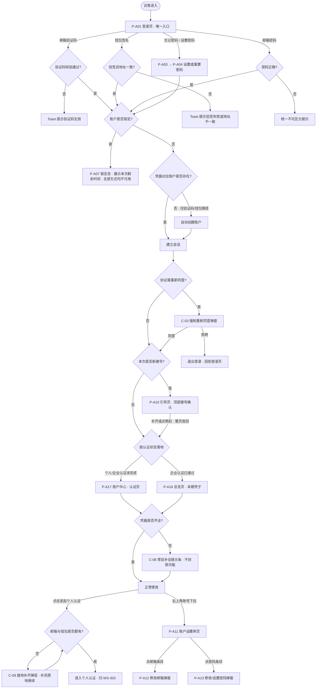

### 5.3 已登录态的信息架构

```
┌────────────────────────────────────────────────────────────┐
│  Logo    顶部导航栏                    [语言下拉] [账号下拉] │  ← C-04 / C-11
├────────────────────────────────────────────────────────────┤
│  面包屑：用户中心 / 个人认证                                 │  ← C-10（导航栏下方）
├──────────────┬─────────────────────────────────────────────┤
│ 左侧菜单      │                                             │
│  · 总览       │              页面主体区域                    │
│  · 用户中心   │                                             │
└──────────────┴─────────────────────────────────────────────┘
```

**左侧菜单**只保留两项：

| 菜单项 | 指向 | 说明 |
| --- | --- | --- |
| 总览 | P-A16 | 本期壳子 |
| 用户中心 | P-A17 | 承载个人认证与企业认证（内容归 WS-303） |

> 左侧菜单只承载业务导航，不承载账户维护入口；账户与偏好的设置统一收敛到右上角账号下拉 → 账户设置单页（P-A11）。

**右上角账号下拉（C-11）**

| 区块 | 内容 |
| --- | --- |
| 账号标识 | 当前账号的邮箱（无邮箱时展示钱包地址缩略） |
| 账户状态 | `凭据未齐` / `正常` 等状态标签 |
| 操作 | 「账户设置」→ P-A11；「退出登录」 |

**面包屑（C-10）规则**

| 项 | 规则 |
| --- | --- |
| 位置 | 顶部导航栏下方，通栏左对齐 |
| 层级 | 最多三级：`一级菜单 / 二级页面 / 当前页`；层级由左侧菜单归属推导 |
| 可点击范围 | **除最后一级（当前页）外，其余各级均可点击**，点击回到该级页面；当前页为纯文本不可点击 |
| 单层页面 | 只有一级时仍展示该级名称，不隐藏面包屑，保证各页面顶部结构一致 |
| 弹窗与弹层 | 弹窗（P-A12 / P-A13）与弹层（C-09）**不产生面包屑层级**，关闭后仍在原页 |

---

## 6. 功能清单

| 模块 | 编号 | 功能点 | 优先级 | 验收口径 |
| --- | --- | --- | --- | --- |
| 首次登录建号 | F-01 | 邮箱验证码首次登录自动建号 | P0 | 验证码通过且邮箱未绑定 → 建号并登录，邮箱视为已验证 |
| 首次登录建号 | F-02 | 钱包签名首次登录自动建号 | P0 | 手填地址 + 验签通过且地址一致且未绑定 → 建号并登录 |
| 首次登录建号 | F-03 | 邮箱密码登录不参与建号 | P0 | 邮箱不存在或未设密码时不建号，返回不可区分的统一提示 |
| 首次登录建号 | F-04 | 建号后引导页 | P0 | 直接进入引导页，顶部为建号确认区块；点「稍后」整页收回 |
| 登录 | F-05 | 三方式指向同一账户 | P0 | 同一 `account_id` 下任一凭据登录后数据一致 |
| 登录 | F-06 | 钱包地址手填 + 签名一致性校验 | P0 | 服务端校验签名恢复地址与手填地址一致，不一致拒绝 |
| 登录 | F-07 | 登录后按认证状态落地 | P0 | 认证未完成 → 用户中心；企业认证通过 → 总览页 |
| 密码 | F-08 | 设置 / 重置密码（同一套流程，两个入口） | P0 | 邮箱 → 滑块 → 验证码 → 设置密码；带复杂度实时提示 |
| 密码 | F-09 | 密码为可选凭据 | P0 | 任何流程都不因未设密码而阻塞 |
| 密码 | F-10 | 新密码与原密码 / 初始密码比对 | P0 | 相同则拒绝，双端全部设密码入口生效 |
| 凭据管理 | F-11 | 常驻补全提示条 | P0 | 凭据未齐时全局展示，可折叠、不可永久关闭，不封锁功能 |
| 凭据管理 | F-12 | 发起个人认证的凭据完备性前置校验与就地引导 | P0 | 邮箱与钱包缺任一项则拦截，弹层就地补齐，补完原地继续 |
| 协议交互 | F-13 | 资产端登录页协议勾选与同意提交 | P0 | 未勾选不可提交；全站只此一处；**管理端不适用** |
| 协议交互 | F-14 | 资产端强制重新同意弹窗 | P0 | 登录后拦截；同意后放行，拒绝则退出登录 |
| 账户设置 | F-15 | 账户设置单页 + tab 锚点滚动 | P0 | 账号信息与偏好信息同页；tab 点击整页滚动到对应区块 |
| 账户设置 | F-16 | 右上角账号下拉 | P0 | 展示账号标识与状态，提供账户设置与退出登录 |
| 账户设置 | F-17 | 修改邮箱（弹窗） | P0 | 弹窗内完成再认证 + 旧邮箱验证 + 新邮箱验证 |
| 账户设置 | F-18 | 修改 / 设置密码（弹窗） | P0 | 弹窗内完成再认证 + 设置新密码 |
| 账户设置 | F-19 | 钱包地址只读展示 | P0 | 绑定后不可修改，展示说明文案，无任何修改入口 |
| 导航 | F-20 | 顶部面包屑 | P1 | 位于导航栏下方，非当前级可点击返回 |
| 导航 | F-21 | 左侧菜单（总览 / 用户中心） | P0 | 只保留两项业务导航，不承载账户维护入口 |
| 安全与风控 | F-22 | 会话全局失效 | P0 | 触发操作成功后该账户所有会话（含当前设备）失效 |
| 安全与风控 | F-23 | **阶梯登录锁定** | P0 | 连续 5 次失败锁定；首次 10 分钟、再次 30 分钟；锁定期间所有方式不可用 |
| 安全与风控 | F-24 | 滑块人机校验（自研） | P0 | 所有邮箱验证码发送入口前置滑块，服务端校验票据与轨迹 |
| 安全与风控 | F-25 | 验证码发送限频 | P0 | 邮箱 / IP / 设备三维度限频 |
| 安全与风控 | F-26 | 安全事件通知 | P1 | 敏感变更成功后向相关邮箱发出安全通知 |
| 管理端 | F-27 | 管理端工作邮箱 + 密码登录 | P0 | 无协议勾选、无验证码/钱包登录、无自动建号 |
| 管理端 | F-28 | 首登强制重置密码 | P0 | 未完成重置不得访问任何其他管理页面；无勾选项 |
| 管理端 | F-29 | 管理端忘记密码 | P0 | 工作邮箱验证码 → 设置新密码 |
| 管理端 | F-30 | 管理端账户设置单页 | P0 | 右上角下拉进入；含修改密码与偏好设置 |
| 国际化 | F-31 | 中英语言切换与即时生效（下拉形态） | P0 | 切换后当前页面不刷新即变更 |
| 国际化 | F-32 | 语言判定优先级与双态持久化 | P0 | 手动偏好 > 账户偏好 > 英文默认 |
| 国际化 | F-33 | 时区偏好与时间展示口径 | P0 | 存 UTC，展示本地并带时区标注 |
| 国际化 | F-34 | 数字 / 金额 / 地址 / 哈希展示口径 | P0 | 按第 13 章规则统一渲染 |
| 国际化 | F-35 | 区块浏览器跳转 | P1 | 地址与哈希提供跳转入口，无对应浏览器时降级 |
| 全局交互 | F-36 | Toast 统一轻提示（顶部居中） | P0 | 全站唯一轻提示载体，双端通用；钱包所有状态提示走此通道 |

---
## 7. 模块详情

### 7.1 M1 · 首次登录即注册（自动建号）

> 平台不存在独立的注册流程、注册页与注册按钮；开户是登录的副作用。

#### 7.1.1 自动建号的适用范围

| 登录路径 | 是否自动建号 | 判定条件 |
| --- | --- | --- |
| 邮箱验证码登录 | ✅ 是 | 验证码校验通过 **且** 该邮箱未绑定任何账户 |
| 钱包签名登录 | ✅ 是 | 验签通过、**签名恢复地址与手填地址一致** **且** 该地址未绑定任何账户 |
| 邮箱密码登录 | ❌ 否 | 见 7.1.2 |
| 设置 / 重置密码 | ❌ 否 | 该入口是找回/补设意图，不是开户意图 |
| 管理端登录 | ❌ 否 | 管理端账号一律由技术直接提供 |

**为什么只有验证码与签名两条路径可以建号**

这两条路径在建号那一刻，用户已完成对该凭据的**所有权证明**：能收到并输入验证码即证明控制该邮箱；能对服务端下发的一次性消息签名即证明控制该钱包私钥。有了所有权证明，自动建号就不会造成「替别人抢注」。没有所有权证明的路径，一律不得建号。

#### 7.1.2 邮箱密码登录为什么不建号

密码**不构成对邮箱的所有权证明**：任何人都可以对一个从未见过的邮箱地址编造一个密码。如果密码路径也能建号，攻击者只要输入受害者的邮箱和任意密码，就能把这个邮箱抢注成自己的账户。因此：

- 邮箱不存在 → **不建号**；
- 邮箱存在但从未设置过密码 → **不建号**，也不放行；
- 邮箱存在且有密码但密码错误 → 拒绝。

上述三种情况**返回完全相同的、不可区分的提示**，见 7.2.2。

#### 7.1.3 建号时写入的内容

| 建号路径 | 写入 | 未写入 |
| --- | --- | --- |
| 邮箱验证码 | `email`、`email_verified_at`（当前时间）、`created_via = email_code`、协议同意记录、语言与时区偏好 | `wallet_address`、密码 |
| 钱包签名 | `wallet_address`、`wallet_bound_at`、`created_via = wallet_signature`、协议同意记录、语言与时区偏好 | `email`、密码 |

- 建号后账户状态为 `incomplete`（邮箱与钱包未同时具备）。
- 建号与登录在同一次提交内完成，用户感知上只有「登录成功」这一个动作。
- **验证码邮件文案不区分是否首次**：无论该邮箱是否已有账户，邮件都是同一套「登录验证码」文案。既避免新用户困惑，也避免邮件内容泄漏该邮箱是否已注册。
- **建号成功后不设独立的确认页**：直接进入引导页 P-A10，确认表达是引导页顶部的一个区块，见 7.4.1。

### 7.2 M2 · 资产端登录

三种方式在同一登录页内切换，页面顶部为方式切换器，底部为协议勾选。

#### 7.2.1 邮箱验证码登录（含首次建号，F-01）

1. 输入邮箱 → 点「Send code」→ 滑块校验 → 限频校验 → 发码 → 60 秒倒计时。
2. 输入验证码 → 勾选协议 → 提交。
3. 服务端校验验证码：
   - 通过 **且** 邮箱已绑定账户 → 进入 7.2.5 的登录后处理顺序；
   - 通过 **且** 邮箱未绑定任何账户 → **创建账户并登录**，邮箱标记为已验证；
   - 不通过 → Toast 提示 `Invalid or expired code. / 验证码不正确或已过期。`

> **枚举防护说明**：未注册邮箱走本路径会直接建号成功，用户看到的都是「登录成功」，界面上不存在「该邮箱未注册」这种信号，因此「已注册 / 未注册」在本路径上**天然不可区分**。

#### 7.2.2 邮箱密码登录（不建号，F-03）

1. 输入邮箱 + 密码（密码框右侧提供**眼睛图标**切换显示/隐藏）→ 勾选协议 → 提交。
2. 以下三种情况**返回完全相同的提示**，从响应文案到响应时间均不可区分：邮箱未绑定账户 / 已绑定但从未设密码 / 已绑定且有密码但密码错误。
3. 统一提示：

| English | 中文 |
| --- | --- |
| Incorrect email or password. If you haven't set a password, sign in with an email verification code instead. | 邮箱或密码不正确。如果你尚未设置密码，请改用邮箱验证码登录。 |

4. 只有第三种情况计入登录失败计数，但**计数与否不得体现在响应上**。
5. 密码 Tab 下常驻**三条静态入口**（静态文案，与是否失败无关，不泄漏任何信息）：

| 入口 | English | 中文 | 去向 |
| --- | --- | --- | --- |
| 忘记密码 | Forgot password? | 忘记密码？ | P-A03 |
| **没有密码** | **No password? Set one** | **没有密码？设置密码** | P-A03（同一流程，见 7.4） |
| 改用验证码 | Sign in with an email code → | 改用邮箱验证码登录 → | 切到验证码 Tab 并带上已填邮箱 |

#### 7.2.3 钱包签名登录（链接外部钱包，含首次建号，F-02 / F-06）

界面上统一称为**「链接外部钱包」**（Link external wallet）。

**流程**

1. **先手工填写钱包地址**：用户在输入框中填入要登录的 EVM 地址，前端做格式校验。
2. 点「Link external wallet / 链接外部钱包」→ 通过钱包连接 SDK 连接钱包。
3. 前端请求一次性签名消息 → 用户在钱包中签名 → 服务端验签。
4. **服务端校验签名恢复出的地址与手填地址是否一致**：
   - 不一致 → **直接拒绝**，Toast 提示，不建号、不登录；
   - 一致且该地址已绑定账户 → 进入 7.2.5 的登录后处理顺序；
   - 一致且该地址未绑定任何账户 → **创建账户并登录**。

**手填地址的语义**

| 项 | 口径 |
| --- | --- |
| 手填地址的作用 | **仅用于指定要登录哪个账户**，它是一个"账户选择器"，不具备任何身份证明效力 |
| 真正的身份证明 | **仍然是钱包消息签名**。签名不通过，填对地址也不放行 |
| 一致性校验 | 服务端从签名中恢复出签名者地址，与手填地址做**大小写不敏感的严格比对**，不一致一律拒绝 |
| 校验位置 | **服务端**。前端可先行比对以便快速反馈，但不构成防线 |
| 填错地址的后果 | 签名恢复出的地址必然与之不符，请求被直接拒绝——既不会登录到错误账户，也不会用错误地址建出新账户。填错只需重填 |

**手填地址的格式校验与提示**

| 校验项 | 规则 | English | 中文 |
| --- | --- | --- | --- |
| 必填 | 不可为空 | Enter your wallet address. | 请输入钱包地址。 |
| 前缀与长度 | `0x` + 40 位十六进制 | Enter a valid EVM wallet address (0x followed by 40 hexadecimal characters). | 请输入有效的 EVM 钱包地址（0x 开头，后跟 40 位十六进制字符）。 |
| 字符集 | 仅 `0-9a-fA-F` | 同上 | 同上 |
| 校验和 | 若填入带大小写校验和的地址，按 EIP-55 校验；不通过时提示但**不阻断**（允许填全小写地址） | This address has an invalid checksum. Check it carefully before continuing. | 该地址的校验和不正确，请仔细核对后再继续。 |
| 空格 | 前后空格自动去除 | — | — |
| 签名地址不一致 | 服务端校验失败 | The signed address doesn't match the address you entered. Check the account selected in your wallet. | 签名地址与你填写的地址不一致，请检查钱包中选择的账户。 |

**所有钱包状态提示统一走 Toast（C-12）**

连接、签名、切换账户、切换网络、拒签、验签失败等**全部状态提示一律通过顶部居中的 Toast 呈现**，钱包面板内不使用内嵌文案或页内提示条。

| 状态 | Toast 文案（English / 中文） |
| --- | --- |
| 未检测到钱包 | No wallet detected. Install a supported wallet to continue. / 未检测到可用钱包，请先安装受支持的钱包。 |
| 连接成功 | Wallet linked. / 钱包已链接。 |
| 用户拒绝连接 | Connection request was rejected in your wallet. / 你在钱包中拒绝了链接请求。 |
| 请求签名中 | Check your wallet to sign the message. / 请在钱包中确认签名。 |
| 用户拒绝签名 | Signature request was rejected in your wallet. / 你在钱包中拒绝了签名请求。 |
| 签名消息过期 | The signature request expired. Please try again. / 签名请求已过期，请重试。 |
| 验签失败 | Signature verification failed. / 签名验证失败。 |
| 地址不一致 | The signed address doesn't match the address you entered. Check the account selected in your wallet. / 签名地址与你填写的地址不一致，请检查钱包中选择的账户。 |
| 钱包内切换了账户 | The account in your wallet changed. Link the wallet again. / 钱包中的账户已切换，请重新链接。 |
| 网络不受支持 | Switch your wallet to a supported EVM network. / 请将钱包切换到受支持的 EVM 网络。 |
| 切换网络成功 | Network switched. / 网络已切换。 |
| SDK 加载失败 | Wallet service is unavailable. Please retry or sign in with your email. / 钱包服务暂不可用，请重试或改用邮箱登录。 |

**钱包连接的能力要求（不锁定具体 SDK 与钱包清单）**

具体 SDK 与支持的钱包清单由技术选型决定，PRD 不约束。所选方案必须覆盖：连接、断开、感知账户切换、感知与切换网络、链上消息签名。断开只影响前端连接态，**不解绑账户绑定关系**，需在文案中说明。

#### 7.2.4 三方式同账户（F-05）

- 账户主键为不可变的 `account_id`；邮箱与钱包地址均为登录标识（钱包地址绑定后不可改）。
- 任一入口登录后，会话中承载的都是同一个 `account_id`，账户数据、语言偏好、认证状态完全一致。
- 邮箱建号的用户后续绑定钱包后即可用钱包登录同一账户；反之亦然。

#### 7.2.5 登录后的处理顺序

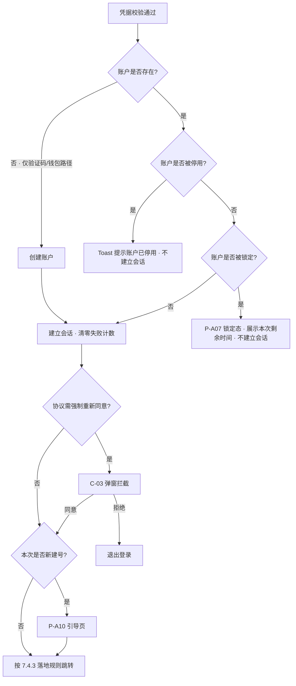

> **锁定判定位于凭据校验之后**，这一顺序对防枚举至关重要，见 12.2.4。

### 7.3 M3 · 用户协议前台交互（仅资产端）

> 协议正文、版本号、生效时间、语种、是否「强制重新同意」的判定，全部由 **WS-301** 定义。
> **管理端不适用本节全部内容**：管理端登录不以同意用户协议为前置，登录页无协议勾选，首登重置页无任何勾选项，全程没有协议同意环节。

#### 7.3.1 勾选（C-02）

- 位置：**资产端登录页提交按钮上方，全站仅此一处**。
- 形态：单个复选框 + 内联链接文本。默认**不勾选**。
- 文案：`I have read and agree to the <Terms of Service> and <Privacy Policy>. / 我已阅读并同意《服务条款》和《隐私政策》。`
- 链接点击后在新窗口/弹层打开当前生效版本正文，不打断表单填写状态。
- 未勾选时提交按钮置灰；点击置灰按钮时在复选框下方显示红色提示并使复选框抖动一次。
- **协议区只有这一个复选框**，不提供任何其他可选勾选项。

#### 7.3.2 同意提交

- 提交时随请求带上当前展示的协议版本号与语种。
- 服务端记录一条同意记录（账户、协议类型、版本、语种、时间、IP/设备摘要）。
- **自动建号场景**：协议同意记录与账户在同一次提交内一并写入，保证「不存在没有同意记录的账户」。

#### 7.3.3 强制重新同意弹窗（C-03）

- 触发时机：资产端登录成功、建立会话之后、进入引导页或落地页之前。
- 模态弹窗，不可点击遮罩关闭，无关闭按钮；正文未滚动到底时主按钮置灰。
- 「Agree and continue / 同意并继续」→ 提交同意记录 → 继续登录后流程；「Sign out / 退出登录」→ 销毁会话回登录页。
- 弹窗展示期间仍可切换语言、查看协议、退出登录。

### 7.4 M4 · 建号后引导与落地规则

#### 7.4.1 引导页（P-A10，F-04）

**触发**：仅在本次登录**新建了账户**时展示一次；老用户登录不进此页。**不设独立的建号确认页**——建号确认是本页顶部的一个区块。

**内容结构**

1. **顶部建号确认区块**：`Welcome! Your account has been created. / 欢迎！你的账户已创建。` 下方展示本次建号所用的凭据（邮箱地址或钱包地址缩略），让用户当场核对是不是自己预期的那个。这是用户唯一能感知到「我刚开了户」的地方，必须显著。
2. **主引导（必要，但不强制此刻完成）**：

| 建号路径 | 引导内容 | 说明文案 |
| --- | --- | --- |
| 邮箱验证码建号 | 绑定 EVM 钱包 | `Link an EVM wallet. You'll need both an email and a wallet to start identity verification. / 绑定 EVM 钱包。发起个人认证时需要同时具备邮箱与钱包。` |
| 钱包签名建号 | 绑定邮箱 | `Add an email address. You'll need both an email and a wallet to start identity verification, and we'll use it for security notifications. / 绑定邮箱。发起个人认证时需要同时具备邮箱与钱包，我们也会用它发送安全通知。` |

3. **可选项**：`Set a login password (optional) / 设置登录密码（可选）`，附说明 `You can always sign in with an email code or your wallet. / 你随时可以用邮箱验证码或钱包登录。`
4. **凭据保管须知**（重要，不可省略）：

| English | 中文 |
| --- | --- |
| Keep both your email and wallet accessible. Neither can be replaced if you lose access to it. | 请妥善保管你的邮箱与钱包，任何一项一旦无法访问都将无法更换。 |

> 这条须知是产品事实的准确表达，其依据见 7.5.4。文案不得弱化为"建议保管"，也不得删除。

5. 底部「Later / 稍后」按钮，与主操作等权重呈现，不置灰、不隐藏。

#### 7.4.2 点「稍后」的行为

- **整页收回**：引导页整体退出，不停留在引导页的任何残留态。
- 随后按 7.4.3 的落地规则跳转。
- 引导页**只展示一次**，后续通过常驻补全提示条（C-08）与账户设置补全，不再强制进入。

#### 7.4.3 登录后的落地规则（F-07）

无论是新建号走完引导页，还是老用户直接登录，最终都按以下规则决定落地页：

| 认证状态 | 落地页 |
| --- | --- |
| 个人认证或企业认证**未完成** | **P-A17 用户中心**（个人认证与企业认证页） |
| 企业认证**已通过** | **P-A16 总览页** |

- 认证状态由 WS-303 提供（见 3.2 接口表）。本模块只消费状态位、决定跳转。
- **总览页本期只出壳子**：作为落地目标与左侧菜单项存在，页面内容归后续需求。
- 若认证状态因接口异常暂时取不到，**默认落到用户中心**（保守选择：引导用户去完成认证，比落到一个空壳总览页更有意义）。

### 7.5 M5 · 凭据完备性与受限态收敛

#### 7.5.1 凭据的三种角色

| 凭据 | 角色 | 是否作为门槛 | 可否更换 |
| --- | --- | --- | --- |
| 邮箱 | 身份标识 + 安全通知通道 + 密码找回通道 | **是**——发起个人认证时必须具备 | 可修改，但**须验证旧邮箱**（见 7.6.3） |
| 钱包地址 | 身份标识 + 链上业务主体 | **是**——发起个人认证时必须具备 | **不可修改**（见 7.6.5） |
| 登录密码 | 便利性登录方式 | **否**——任何时候都不作为门槛 | 可随时设置或修改（P-A13 弹窗） |

> 文档中任何位置都不存在「密码必须补全」的要求。

#### 7.5.2 硬门槛：发起个人认证的前置校验（F-12）

- **校验时点**：用户点击「发起个人认证 / Start identity verification」按钮时（该按钮位于 P-A17 用户中心，功能归 WS-303）。
- **校验内容**：账户的 `email` 与 `wallet_address` 是否**同时非空**。密码不参与判定。
- **未通过时**：**不跳走**，在当前页面弹出就地补齐弹层（C-09）：

| 缺失项 | 弹层内容 |
| --- | --- |
| 缺钱包 | 标题 `Link your wallet to continue / 绑定钱包后继续`；「链接外部钱包」按钮，走连接 + 签名；成功后弹层关闭并**原地继续** |
| 缺邮箱 | 标题 `Add your email to continue / 绑定邮箱后继续`；邮箱输入 + 滑块 + 验证码；成功后原地继续 |
| 两项都缺 | 分两步在同一弹层内依次完成，带步骤指示（1/2、2/2） |

- 弹层可关闭，关闭后回到原页面，不改变任何状态。
- 补齐成功后账户状态由 `incomplete` 变为 `active`，常驻提示条消失。
- **服务端必须同样校验**，前端弹层不是唯一防线。

#### 7.5.3 受限态收敛：跳过引导不做全局封锁（F-11）

- 跳过引导后，用户**不进入任何全局受限态**：可正常浏览、进入账户设置、使用不依赖认证的功能。
- 唯一的凭据硬卡点是 7.5.2 的「发起个人认证」。
- 凭据未齐时全局展示常驻补全提示条（C-08）：
  - 缺钱包：`Link a wallet to be ready for identity verification. / 绑定钱包后即可发起个人认证。`
  - 缺邮箱：`Add an email to be ready for identity verification and to receive security notifications. / 绑定邮箱后即可发起个人认证，并接收安全通知。`
  - 可折叠为小图标，但**不可永久关闭**，直到凭据补齐；带「Complete now / 立即补全」按钮，点击进入 P-A11 账户设置对应区块。

**为什么这样设计**：业务功能本来就以「个人认证通过」为前置条件——凭据不全的用户即使不做全局封锁，也照样做不了业务，因为他连认证都发起不了。把封锁提前到进门处并没有多挡住任何真正的业务操作，代价却是新用户刚建号就撞墙。

**边界声明**：各业务模块的功能放行，**以认证状态为准，不以本模块的凭据完备状态为准**。业务模块不应自行读取 `account_status == incomplete` 做拦截。

#### 7.5.4 凭据一旦丢失即无法更换（须明确告知用户）

本模块的两项身份凭据在丢失后**都没有自助更换途径**，这是本期的产品事实，必须在界面上向用户讲清楚，不能让用户事后才发现：

| 情形 | 后果 |
| --- | --- |
| **失去邮箱访问权** | 修改邮箱须先验证旧邮箱（7.6.3），旧邮箱进不去则该流程走不通，**邮箱无法更换**。此时若账户已绑定钱包，用户仍可用钱包签名登录、账户继续可用，但邮箱将永久停留在旧地址；若账户只有邮箱、且未设密码，则将无法再登录 |
| **失去钱包私钥** | 钱包地址绑定后不可修改（7.6.5），**钱包无法更换**。此时用户仍可用邮箱验证码或密码登录，个人认证的凭据完备性判定也不受影响（地址仍绑定在账户上），但将永久无法再用钱包签名登录 |

**告知方式**（两处，均不可省略）：

1. **引导页凭据保管须知**（7.4.1 第 4 条）：`Keep both your email and wallet accessible. Neither can be replaced if you lose access to it. / 请妥善保管你的邮箱与钱包，任何一项一旦无法访问都将无法更换。`
2. **账户设置页**：邮箱与钱包地址条目下方各展示一行说明，见 7.6.1 与 7.6.5。

> 这是**用户须知**，不是功能描述——它描述的是现有功能的边界，用于让用户在还来得及的时候采取保管措施。相关风险见 17.2。

### 7.6 M6 · 账户设置（P-A11 单页）

#### 7.6.1 页面结构与进入方式

- **进入方式**：右上角账号下拉（C-11）→「账户设置」。**左侧菜单不提供入口**。
- **形态**：单页 + 顶部 tab 锚点。点击 tab 后**整页平滑滚动**到对应区块，不切换路由、不重新加载。

| tab | 区块 | 内容 |
| --- | --- | --- |
| 账号信息 | 账号信息 | 邮箱、登录密码、钱包地址、账户状态 |
| 偏好信息 | 偏好信息 | 界面语言、时区 |

- 页面同时渲染两个区块的全部内容（不是切换显示），tab 只控制滚动位置。

**账号信息区块的条目**

| 条目 | 展示 | 操作 |
| --- | --- | --- |
| 邮箱 | 当前邮箱；未绑定时展示 `Not linked / 未绑定`。已绑定时下方展示一行说明：`Changing your email requires verifying the current one. Keep it accessible. / 更换邮箱需要验证当前邮箱，请妥善保管。` | 「修改」/「绑定」→ 唤起 P-A12 弹窗 |
| 登录密码 | `Set / 已设置` 或 `Not set / 未设置`（**不带警示色或感叹号图标**，它是可选项，不是缺陷） | 「修改」/「设置」→ 唤起 P-A13 弹窗 |
| 钱包地址 | 当前地址（缩略 + 复制 + 区块浏览器跳转）；未绑定时展示 `Not linked / 未绑定` 与「链接外部钱包」按钮 | **已绑定时只读，无任何修改入口**，见 7.6.5 |
| 账户状态 | `凭据未齐` / `正常` 等状态标签 | 只读 |

**偏好信息区块的条目**

| 条目 | 操作 |
| --- | --- |
| 界面语言 | 下拉选择 `English` / `简体中文`，即时生效并持久化（见 13.3） |
| 时区 | 下拉选择 IANA 时区，保存后全站时间展示随之变化 |

#### 7.6.2 再认证（Re-authentication）

修改邮箱、修改/设置密码前，先要求用户证明当前登录态是本人。再认证在**对应弹窗内**完成，不跳页。

| 账户已有凭据 | 可用的再认证因子（任选其一） |
| --- | --- |
| 有密码 | 输入当前密码 |
| 有钱包 | 钱包签名（用途声明为「Re-authenticate」） |
| 有邮箱 | 邮箱验证码（发送前同样过滑块与限频） |

- 弹窗内展示该账户可用的全部因子，用户自选；只有一种可用因子时直接进入该因子。
- 再认证通过后 10 分钟内不重复要求；超时后需重新认证。
- 再认证失败计入登录失败计数。

#### 7.6.3 修改邮箱（P-A12 弹窗，F-17）

在 P-A11 点「邮箱」条目唤起弹窗，弹窗内分步完成：

1. 再认证。
2. **验证旧邮箱**：向当前邮箱发送验证码（滑块 + 限频），校验通过后进入下一步。**本步骤不可跳过**——这意味着失去旧邮箱访问权的用户无法完成本流程，见 7.5.4。
3. 输入新邮箱 → 滑块 → 新邮箱验证码 → 校验通过。
4. 提交 → 邮箱替换 → **全部会话失效** → 关闭弹窗并跳登录页，提示用新邮箱登录。
5. 向旧邮箱与新邮箱各发安全通知。

> 账户原本无邮箱（钱包建号且未补）时，本流程即「绑定邮箱」，跳过第 2 步，标题变为 `Add email / 绑定邮箱`；**首次绑定不触发会话失效**（见 12.1.1 例外）。

#### 7.6.4 修改 / 设置密码（P-A13 弹窗，F-18）

1. 再认证。
2. 输入新密码 + 确认新密码（密码框带**眼睛图标**），按 8.4 校验全部规则并展示实时复杂度提示清单，包含**与原密码比对**。
3. 提交 → **全部会话失效** → 关闭弹窗并跳登录页。
4. 向绑定邮箱发安全通知（无邮箱时跳过）。
5. 账户原本无密码时，本流程即「设置密码」，标题变为 `Set password / 设置登录密码`，此时无原密码可比对。

#### 7.6.5 钱包地址只读（F-19）

**钱包地址绑定后不支持修改。**

| 状态 | 展示 |
| --- | --- |
| 未绑定 | `Not linked / 未绑定` + 「Link external wallet / 链接外部钱包」按钮（走连接 + 签名绑定） |
| 已绑定 | 地址（缩略 + 复制按钮 + 区块浏览器跳转），**无「修改」「解绑」「更换」任何按钮** |

已绑定时在地址下方展示只读说明：

| English | 中文 |
| --- | --- |
| Your wallet address can't be changed after it's linked. Keep this wallet accessible. | 钱包地址绑定后不可修改，请妥善保管该钱包。 |

**连带影响**：见 7.5.4 与 17.2。服务端必须拒绝任何修改钱包地址的请求，不能只靠前端隐藏入口。

### 7.7 M7 · 资产管理端

> **资产管理端的账户管理归后期其他 issue 实现，本模块不覆盖。** 本期管理端共四块：登录、首登强制重置密码、忘记密码、账户设置。

#### 7.7.1 账号来源

| 项 | 口径 |
| --- | --- |
| 账号来源 | **由技术直接提供**：通过部署脚本 / 数据初始化写入，应用层**不提供任何增删改入口** |
| 初始密码 | 由技术生成并**线下交付**给本人；系统不通过邮件、站内信或任何在线渠道下发 |
| 初始密码有效期 | 7 天。过期后需联系技术重新发放 |
| 界面约束 | 管理端不提供任何绕过登录的初始化页面、安装向导或首次配置页；未登录状态下除登录页与忘记密码页外无任何可达页面 |
| 部署前置条件 | 「初始化管理员账号」是系统可用的**部署前置条件**，须写入部署清单；未执行则管理端无人可登录，且系统不提供任何自救入口 |

#### 7.7.2 登录（F-27）

- 登录字段：**工作邮箱** + 密码（密码框带眼睛图标）。仅此一种方式，管理端**不提供**验证码登录、钱包登录、第三方登录与自动建号。
- **登录页无用户协议勾选行**，不提供「记住我」。
- 登录失败计入登录失败计数，锁定规则与资产端一致（阶梯锁定，见 12.2）。
- 失败提示统一为 `Incorrect email or password. / 邮箱或密码不正确。`（防枚举）。
- 初始密码已过期时：提示 `Your initial password has expired. Contact technical support to have it reissued. / 初始密码已过期，请联系技术人员重新发放。` 并不建立会话。

#### 7.7.3 首次登录强制重置密码（F-28）

- 判定：账户字段 `must_reset_password = true`。
- 登录成功后**立即**跳转 P-M02，且：前端路由守卫拦截所有其他管理端路由；**服务端对所有管理端业务接口做同样拦截**，前端拦截不可作为唯一防线。
- P-M02 页面元素：当前（初始）密码、新密码、确认新密码、密码规则实时校验清单。**页面上无任何勾选项。**
- 新密码需通过 8.4 全部规则，包含与原（初始）密码的比对。
- 重置成功 → `must_reset_password = false`，状态置 `active` → **全部会话失效** → 跳回登录页。
- P-M02 上只保留「退出登录」和语言切换两个逃生出口。

#### 7.7.4 管理端忘记密码（F-29）

1. 登录页点「Forgot password?」→ P-M03，输入工作邮箱。
2. 滑块校验 → 限频校验 → 向该工作邮箱发送验证码。**不透露该邮箱是否为有效管理端账号**：`If this email belongs to an admin account, a verification code has been sent. / 若该邮箱为管理端账号，验证码已发送。`
   > 管理端忘记密码的验证码**走工作邮箱**；线下交付只针对初始密码。
3. 输入验证码 → 校验通过 → P-M04 设置新密码。
4. 新密码需通过 8.4 全部规则，包含与原密码、与初始密码的比对。
5. 成功 → 全部会话失效 → 跳登录页。
6. 向工作邮箱发安全通知。

> **账户锁定期间本流程同样不可用**，见 12.2.4。

#### 7.7.5 管理端账户设置（P-M05，F-30）

- **进入方式**：右上角账号下拉 →「账户设置」，与资产端结构一致。
- **形态**：单页 + tab 锚点滚动。

| tab | 条目 | 操作 |
| --- | --- | --- |
| 账号信息 | 工作邮箱 | 只读（登录账号，不可自助修改） |
| 账号信息 | 姓名 | 只读 |
| 账号信息 | 登录密码 | 「修改」→ 弹窗内完成再认证（当前密码）+ 设置新密码，规则同 8.4 |
| 账号信息 | 账号状态 | 只读 |
| 偏好信息 | 界面语言 | 下拉选择，即时生效并持久化 |
| 偏好信息 | 时区 | 下拉选择 |

---
## 8. 页面与字段定义

### 8.1 字段总表（校验规则）

| 字段 | 所在页面 | 类型 | 必填 | 校验规则 | 默认值 |
| --- | --- | --- | --- | --- | --- |
| 邮箱 `email` | 登录 / 设置重置密码 / 绑定或改邮箱 | string | 视场景 | RFC 5322 基本格式；长度 ≤ 254；前后空格自动去除；大小写不敏感（存储小写） | 空 |
| 工作邮箱 `work_email` | 管理端登录 / 忘记密码 | string | 是 | 同上；**即管理端登录账号**，全局唯一，不可自助修改 | 空 |
| 验证码 `code` | 所有验证码环节 | string | 是 | 6 位数字；仅接受数字输入；粘贴自动去除空格与连字符 | 空 |
| 登录密码 `password` | 登录 / 设置或改密码 | string | 视场景 | 见 8.4；**资产端账户可以永远不设密码**；输入框右侧带**眼睛图标**切换显示/隐藏 | 空 |
| 确认密码 `password_confirm` | 设置/重置密码 | string | 是 | 必须与 `password` 完全一致；同样带眼睛图标 | 空 |
| 钱包地址 `wallet_address` | 登录 / 绑定钱包 | string | 视场景 | **由用户手工填写**；`0x` + 40 位十六进制；前后空格自动去除；EIP-55 校验和不通过时提示但不阻断；**服务端必须校验签名恢复地址与之一致** | 空 |
| 签名 `signature` | 钱包相关环节 | string | 是 | 由钱包回传；服务端验签并做地址一致性比对 | — |
| 协议勾选 `agree_terms` | **仅资产端登录页** | bool | 是 | 必须为 true 才可提交 | false |
| 语言 `locale` | 全局 / 账户设置 | enum | 是 | `en` / `zh-CN` | `en`（默认英文） |
| 时区 `timezone` | 账户设置 | string | 是 | IANA 时区标识 | 按浏览器推断，兜底 `UTC` |

### 8.2 邮箱校验细则

- 前端做格式校验，失焦时校验，提交时再校验一次。
- 不做 MX / 可达性探测；可达性由「能否收到验证码」自然验证。

### 8.3 钱包地址校验细则（手填）

| 项 | 规则 |
| --- | --- |
| 输入方式 | **用户手工填写**，界面提供输入框 |
| 格式 | `0x` + 40 位十六进制字符；前后空格自动去除 |
| 大小写 | 比对时大小写不敏感；服务端统一按小写归一化存储 |
| 校验和 | 填入带大小写校验和的地址时按 EIP-55 校验；不通过时**提示但不阻断**，因为用户很可能是从区块浏览器复制的全小写地址 |
| **一致性校验** | **服务端从签名中恢复签名者地址，与手填地址做大小写不敏感的严格比对，不一致一律拒绝**——这是保证"填错地址不会造成错误后果"的关键防线 |
| 网络 | 连接的钱包链不在支持范围时提示切换网络（Toast） |

### 8.4 密码规则

适用于全部设置密码的入口：资产端设置/修改密码、资产端重置密码、管理端首登强制重置、管理端修改密码、管理端忘记密码重置，以及技术生成管理端初始密码。

| 规则 | 取值 |
| --- | --- |
| 长度 | **8–20 字符** |
| 复杂度 | **至少包含 1 个英文字母和 1 个数字** |
| 字符集 | 字母数字之外可自由使用符号；前后空格自动去除，中间不接受空格 |
| 新密码限制（全端通用） | **不得与原密码相同** |
| 新密码限制（管理端额外） | **不得与初始密码相同** |
| 比对范围 | 仅比对原密码与初始密码 |
| 是否必设（资产端） | **否**，密码是可选凭据 |
| 输入体验 | **眼睛图标**切换显示/隐藏；支持密码管理器；不禁用粘贴 |

#### 8.4.1 前端规则提示

密码输入框下方展示两条实时校验清单，满足即打勾、不满足为灰色，两条全绿即可提交。**不展示弱/中/强分档。**

| 校验项 | English | 中文 |
| --- | --- | --- |
| 长度 | 8–20 characters | 8–20 个字符 |
| 复杂度 | At least one letter and one number | 至少 1 个英文字母和 1 个数字 |

- 用户开始输入后才展示清单，未输入时不展示。
- 「与原密码/初始密码相同」的比对在**提交后由服务端返回**，前端不做预判。

#### 8.4.2 新密码与原密码 / 初始密码的比对（F-10）

- 系统只存密码的不可逆哈希。比对方式为：把用户提交的**新密码明文**分别对「当前密码哈希」与「初始密码哈希（仅管理端）」执行一次密码校验运算，任一命中即判定为相同并拒绝。
- 管理端账号在技术写入初始密码时，除当前密码哈希外**另单独留存一份初始密码哈希**，账号存续期间不删除；该哈希**仅用于本项比对，不可用于登录校验**。
- 比对在服务端完成，前端不参与。

| 场景 | English | 中文 |
| --- | --- | --- |
| 与原密码相同 | Your new password must be different from your current password. | 新密码不能与原密码相同。 |
| 与初始密码相同（管理端） | Your new password must be different from the initial password. | 新密码不能与初始密码相同。 |

### 8.5 中英双语文案对照

#### 8.5.1 通用与导航

| 场景 | English | 中文 |
| --- | --- | --- |
| 登录页标题 | Sign in | 登录 |
| 登录方式 - 邮箱验证码 | Email verification code | 邮箱验证码 |
| 登录方式 - 邮箱密码 | Email and password | 邮箱密码 |
| 登录方式 - 钱包 | Link external wallet | 链接外部钱包 |
| 发送验证码 | Send code | 发送验证码 |
| 重新发送（倒计时） | Resend in {n}s | {n} 秒后重发 |
| 提交登录 | Sign in | 登录 |
| 忘记密码入口 | Forgot password? | 忘记密码？ |
| 没有密码入口 | No password? Set one | 没有密码？设置密码 |
| 改用验证码 | Sign in with an email code → | 改用邮箱验证码登录 → |
| 钱包地址输入框 label | Wallet address | 钱包地址 |
| 钱包地址输入框 placeholder | 0x… | 0x… |
| 链接钱包按钮 | Link external wallet | 链接外部钱包 |
| 断开连接 | Disconnect | 断开连接 |
| 签名消息 | Sign message | 签署消息 |
| 稍后 | Later | 稍后 |
| 退出登录 | Sign out | 退出登录 |
| 账户设置 | Account settings | 账户设置 |
| tab - 账号信息 | Account | 账号信息 |
| tab - 偏好信息 | Preferences | 偏好信息 |
| 左侧菜单 - 总览 | Overview | 总览 |
| 左侧菜单 - 用户中心 | User center | 用户中心 |
| 保存 / 取消 | Save / Cancel | 保存 / 取消 |
| 修改 / 绑定 / 设置 | Change / Link / Set | 修改 / 绑定 / 设置 |
| 未绑定 | Not linked | 未绑定 |
| 已设置 / 未设置 | Set / Not set | 已设置 / 未设置 |
| 可选标记 | Optional | 可选 |
| 复制地址 | Copy address | 复制地址 |
| 区块浏览器跳转 | View on explorer | 在区块浏览器中查看 |
| 立即补全 | Complete now | 立即补全 |
| 密码显示/隐藏（图标 aria-label） | Show password / Hide password | 显示密码 / 隐藏密码 |

#### 8.5.2 表单校验与错误

| 场景 | English | 中文 |
| --- | --- | --- |
| 邮箱必填 | Email is required. | 请输入邮箱。 |
| 邮箱格式错误 | Enter a valid email address. | 请输入有效的邮箱地址。 |
| 验证码必填 | Enter the 6-digit code. | 请输入 6 位验证码。 |
| 验证码错误/过期 | Invalid or expired code. | 验证码不正确或已过期。 |
| 单码验证次数超限 | Too many attempts. Please request a new code. | 尝试次数过多，请重新获取验证码。 |
| 密码必填 | Password is required. | 请输入密码。 |
| **密码登录失败（统一，不可区分）** | Incorrect email or password. If you haven't set a password, sign in with an email verification code instead. | 邮箱或密码不正确。如果你尚未设置密码，请改用邮箱验证码登录。 |
| 管理端登录失败 | Incorrect email or password. | 邮箱或密码不正确。 |
| 密码长度不符 | Password must be 8–20 characters. | 密码长度需为 8–20 个字符。 |
| 密码复杂度不符 | Password must contain at least one letter and one number. | 密码需至少包含 1 个英文字母和 1 个数字。 |
| 密码含空格 | Password cannot contain spaces. | 密码不能包含空格。 |
| 两次密码不一致 | Passwords do not match. | 两次输入的密码不一致。 |
| 新密码与原密码相同 | Your new password must be different from your current password. | 新密码不能与原密码相同。 |
| 新密码与初始密码相同 | Your new password must be different from the initial password. | 新密码不能与初始密码相同。 |
| 钱包地址必填 | Enter your wallet address. | 请输入钱包地址。 |
| 钱包地址格式错误 | Enter a valid EVM wallet address (0x followed by 40 hexadecimal characters). | 请输入有效的 EVM 钱包地址（0x 开头，后跟 40 位十六进制字符）。 |
| 钱包地址校验和异常（不阻断） | This address has an invalid checksum. Check it carefully before continuing. | 该地址的校验和不正确，请仔细核对后再继续。 |
| 签名地址与手填地址不一致 | The signed address doesn't match the address you entered. Check the account selected in your wallet. | 签名地址与你填写的地址不一致，请检查钱包中选择的账户。 |
| 协议未勾选（仅资产端） | Please read and agree to the Terms of Service and Privacy Policy. | 请阅读并同意《服务条款》和《隐私政策》。 |
| 邮箱已被占用 | This email is already linked to another account. | 该邮箱已绑定其他账户。 |
| 钱包已被占用 | This wallet is already linked to another account. | 该钱包地址已绑定其他账户。 |
| 账户已停用 | This account has been disabled. Contact support for help. | 该账户已被停用，请联系客服。 |
| 初始密码已过期（管理端） | Your initial password has expired. Contact technical support to have it reissued. | 初始密码已过期，请联系技术人员重新发放。 |
| 网络异常 | Network error. Please try again. | 网络异常，请重试。 |

#### 8.5.3 建号、引导与凭据保管

| 场景 | English | 中文 |
| --- | --- | --- |
| 建号确认（引导页顶部） | Welcome! Your account has been created. | 欢迎！你的账户已创建。 |
| 验证码已发送 | Code sent. Check your inbox and spam folder. | 验证码已发送，请查看收件箱和垃圾邮件。 |
| 引导页标题 | Finish setting up your account | 完善你的账户 |
| 引导 - 绑钱包 | Link an EVM wallet. You'll need both an email and a wallet to start identity verification. | 绑定 EVM 钱包。发起个人认证时需要同时具备邮箱与钱包。 |
| 引导 - 绑邮箱 | Add an email address. You'll need both an email and a wallet to start identity verification, and we'll use it for security notifications. | 绑定邮箱。发起个人认证时需要同时具备邮箱与钱包，我们也会用它发送安全通知。 |
| 引导 - 设密码（可选） | Set a login password (optional) | 设置登录密码（可选） |
| 引导 - 设密码说明 | You can always sign in with an email code or your wallet. | 你随时可以用邮箱验证码或钱包登录。 |
| **凭据保管须知（引导页）** | Keep both your email and wallet accessible. Neither can be replaced if you lose access to it. | 请妥善保管你的邮箱与钱包，任何一项一旦无法访问都将无法更换。 |
| **邮箱条目说明（账户设置）** | Changing your email requires verifying the current one. Keep it accessible. | 更换邮箱需要验证当前邮箱，请妥善保管。 |
| **钱包地址只读说明（账户设置）** | Your wallet address can't be changed after it's linked. Keep this wallet accessible. | 钱包地址绑定后不可修改，请妥善保管该钱包。 |
| 常驻提示条 - 缺钱包 | Link a wallet to be ready for identity verification. | 绑定钱包后即可发起个人认证。 |
| 常驻提示条 - 缺邮箱 | Add an email to be ready for identity verification and to receive security notifications. | 绑定邮箱后即可发起个人认证，并接收安全通知。 |
| 认证前置弹层 - 缺钱包 | Link your wallet to continue | 绑定钱包后继续 |
| 认证前置弹层 - 缺邮箱 | Add your email to continue | 绑定邮箱后继续 |
| 认证前置弹层 - 说明 | Identity verification requires both an email address and a wallet address. | 发起个人认证需要同时具备邮箱与钱包地址。 |
| 补全成功 | All set. You're ready to start identity verification. | 已完成，你现在可以发起个人认证了。 |

#### 8.5.4 成功与状态

| 场景 | English | 中文 |
| --- | --- | --- |
| 密码重置成功 | Password reset. Please sign in with your new password. | 密码已重置，请使用新密码登录。 |
| 密码设置成功 | Password set. Please sign in again. | 密码设置成功，请重新登录。 |
| 密码修改成功 | Password updated. Please sign in again. | 密码修改成功，请重新登录。 |
| 邮箱绑定成功 | Email added. | 邮箱绑定成功。 |
| 邮箱修改成功 | Email updated. Please sign in with your new email. | 邮箱修改成功，请使用新邮箱登录。 |
| 钱包绑定成功 | Wallet linked. | 钱包绑定成功。 |
| 地址已复制 | Address copied | 地址已复制 |
| 偏好保存成功 | Preferences saved. | 偏好设置已保存。 |
| 管理端首登标题 | Set a new password to continue | 请设置新密码后继续 |
| 管理端首登说明 | For security, you must replace the initial password before using the console. | 出于安全考虑，请先替换初始密码后再使用管理端。 |

> 会话失效、登录锁定、滑块与限频相关文案见第 12 章对应小节。

### 8.6 关键页面线框级说明

**P-A01 资产端登录页（验证码 Tab）**

```
┌──────────────────────────────────────────────┐
│  Logo                       [🌐 EN ▾]        │  ← C-04 语言下拉
├──────────────────────────────────────────────┤
│                 Sign in                       │
│  ┌─────────┬─────────────┬────────────────┐  │
│  │Email code│Email+Password│Link ext. wallet│ │
│  └─────────┴─────────────┴────────────────┘  │
│                                               │
│  [ Email address                           ]  │
│  [ Code            ] [ Send code / 59s ]      │  ← 点击先弹滑块 C-01
│                                               │
│  [ ] I have read and agree to the Terms ...   │  ← 默认不勾，全站唯一一处
│                                               │
│  [            Sign in            ]            │
└──────────────────────────────────────────────┘
```

**P-A01 密码 Tab**

```
│  [ Email address                           ]  │
│  [ Password                            👁 ]  │  ← 眼睛图标切换显示/隐藏
│                                               │
│  Forgot password?    No password? Set one     │  ← 两个静态入口，均去 P-A03
│  Sign in with an email code →                 │
```

**P-A01 链接外部钱包 Tab**

```
│  [ Wallet address        0x…               ]  │  ← 手工填写
│                                               │
│  [ ] I have read and agree to the Terms ...   │
│  [      Link external wallet      ]           │
│                                               │
│  所有连接/签名/切链/失败状态 → 顶部居中 Toast   │
```

**P-A10 建号后引导页**（不设独立确认页，确认区块在顶部）

```
┌──────────────────────────────────────────────┐
│  ✓ Welcome! Your account has been created.    │  ← 唯一的建号感知点
│    ada@demo-mail.test                         │  ← 展示本次建号所用凭据
├──────────────────────────────────────────────┤
│  Finish setting up your account               │
│  ① Link an EVM wallet     [Link external…]    │
│  ② Set a login password (Optional) [Set…]     │
│  ⓘ Keep both your email and wallet           │
│    accessible. Neither can be replaced if     │
│    you lose access to it.                     │
│  [            Later            ]              │  ← 点击整页收回并按落地规则跳转
└──────────────────────────────────────────────┘
```

**P-A11 账户设置单页（tab 锚点）**

```
┌──────────────────────────────────────────────┐
│  Logo   顶部导航             [🌐 EN ▾] [账号▾] │  ← C-11 账号下拉（右上角）
├──────────────────────────────────────────────┤
│  账户设置                                      │  ← C-10 面包屑（导航栏下方）
├──────────────────────────────────────────────┤
│  [ 账号信息 ] [ 偏好信息 ]                      │  ← tab，点击整页锚点滚动
├──────────────────────────────────────────────┤
│  账号信息                                      │
│   邮箱        ada@demo-mail.test    [修改]     │  → P-A12 弹窗
│               更换邮箱需要验证当前邮箱…          │
│   登录密码    未设置                 [设置]     │  → P-A13 弹窗
│   钱包地址    0x5aAeb6…eAed  [复制][↗]         │  ← 只读，无修改入口
│               钱包地址绑定后不可修改…            │
│   账户状态    凭据未齐                          │
│                                               │
│  偏好信息                                      │
│   界面语言    [ English        ▾ ]             │
│   时区        [ Asia/Shanghai  ▾ ]             │
└──────────────────────────────────────────────┘
```

**P-M01 管理端登录页**：工作邮箱 + 密码（眼睛图标），无协议勾选、无「记住我」。
**P-M02 管理端首登重置页**：无侧边栏、无导航（仅语言切换与退出登录），当前密码 + 新密码 + 确认新密码 + 规则清单，无任何勾选项。
**P-M05 管理端账户设置**：结构与 P-A11 一致，右上角账号下拉进入，tab 锚点滚动。

### 8.7 全局交互规范（双端通用）

#### 8.7.1 Toast 轻提示（C-12，F-36）

| 项 | 规则 |
| --- | --- |
| **位置** | **顶部居中**，距页面顶部固定间距，水平居中；不随页面滚动 |
| 唯一性 | Toast 是全站**唯一**的轻提示载体；页内提示条仅用于**常驻说明**（如 C-08 补全提示条），不用于操作反馈 |
| 类型 | 成功 / 失败 / 信息三类，用图标与颜色区分，不用位置区分 |
| 停留时长 | 成功与信息 3 秒；失败 5 秒；可手动关闭 |
| 多条堆叠 | 纵向堆叠，最新的在最上方；最多同时展示 3 条，超出则最早的提前消失 |
| 去重 | 相同内容在停留期内重复触发时不新增，重置计时 |
| 不阻断 | Toast 不拦截页面点击 |
| 无障碍 | 通过 live region 播报，失败类使用 assertive、成功与信息使用 polite |
| 适用范围 | 双端通用；**钱包的全部状态提示一律走本通道**，见 7.2.3 |

#### 8.7.2 其他全局控件

| 控件 | 规则 |
| --- | --- |
| 密码显示/隐藏 | 统一使用**眼睛图标**置于输入框右侧内部；图标需有 `aria-label` |
| 语言切换器（C-04） | **下拉形态**：收起时展示语言图标 + 当前语言缩写（`EN` / `中文`），点击展开选项列表（`English` / `简体中文`）；见 13.1 |
| 面包屑（C-10） | 位于顶部导航栏下方；规则见 5.3 |
| 右上角账号下拉（C-11） | 悬浮展开；内容与操作见 5.3 |
| 弹窗 | 修改邮箱、修改/设置密码在弹窗内完成；含多步骤时带步骤指示；弹窗不产生面包屑层级 |

---

## 9. 主流程与异常流程

### 9.1 邮箱验证码登录（含首次自动建号）

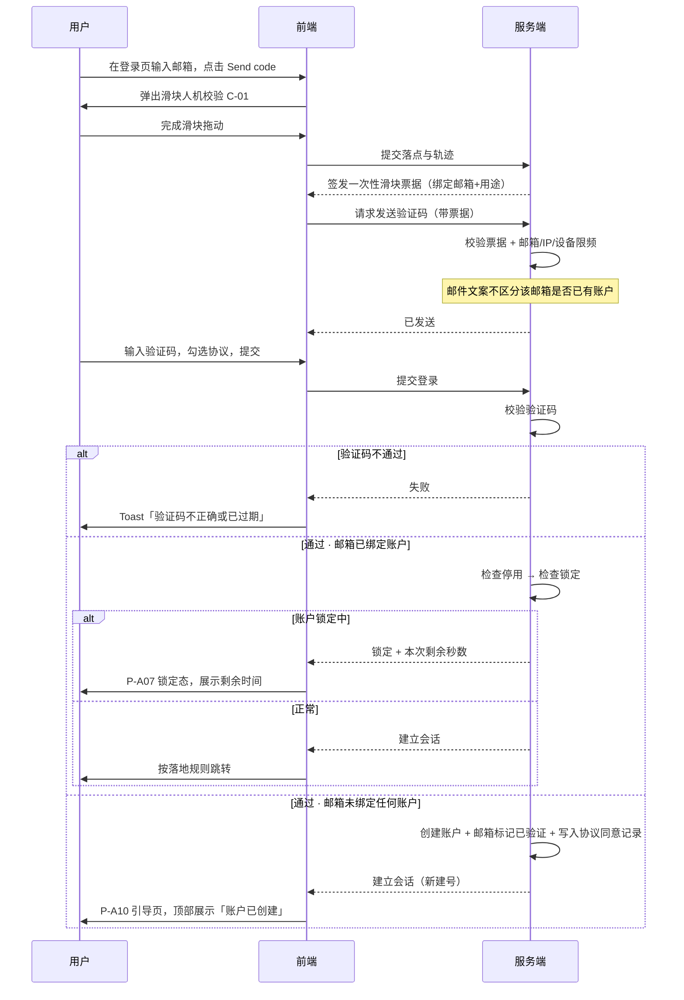

### 9.2 链接外部钱包登录（手填地址 + 签名一致性校验，含首次建号）

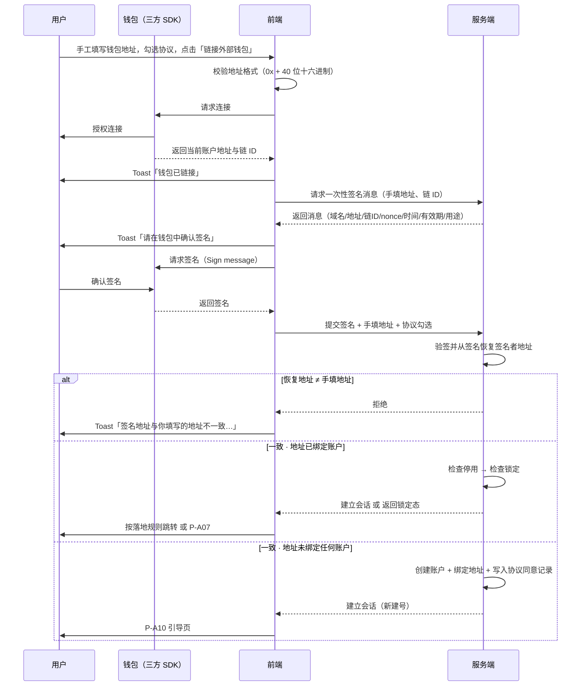

### 9.3 设置 / 重置密码（同一套流程，两个入口）

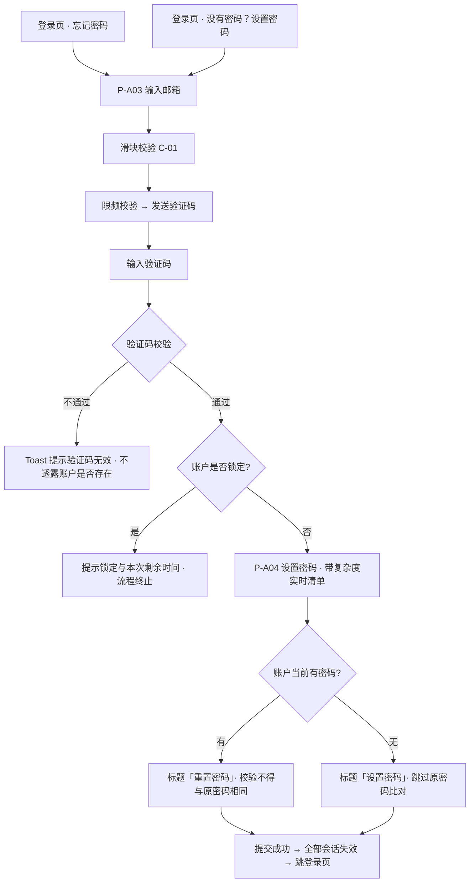

**两个入口复用同一套流程的结论与理由**

| 项 | 结论 |
| --- | --- |
| 是否复用 | **复用同一套流程**：同一组页面（P-A03 / P-A04）、同一个验证码用途、同一套服务端接口。两个入口只是登录页上的两个不同文案链接 |
| 理由 1 | 两条流程的每一步完全相同。做成两条独立流程会产生两份几乎一样的代码与文案，任何改动都要改两遍 |
| 理由 2 | 「有没有密码」这件事**用户自己未必清楚**（尤其是验证码建号的用户）。若做成两条流程，用户选错入口就会走进死胡同；复用之后无论从哪个口进来都能达成目的 |
| **差异点（流程内动态处理）** | ① **标题与按钮文案**：账户已有密码时为「重置密码」，无密码时为「设置密码」；② **成功提示文案**：同上分流；③ **原密码比对**：无密码时跳过该校验 |
| **关键约束（防枚举）** | 上述差异**只能在验证码校验通过之后**（即用户已证明对该邮箱的所有权）才体现。在输入邮箱与发码阶段，页面标题必须使用中性文案 `Set or reset your password / 设置或重置密码`，**不得**根据该邮箱是否已注册、是否已设密码而变化 |

### 9.4 异常流程总表

| 环节 | 异常 | 系统行为 | 用户可做什么 |
| --- | --- | --- | --- |
| 发送验证码 | 滑块校验失败 | 弹窗内抖动 + 换图 + 复位，不签发票据、不发码 | 重试；连续失败 5 次进入 60s 冷却 |
| 发送验证码 | 票据无效 / 已使用 / 已过期 | 服务端拒绝发码，前端重新弹出滑块 | 重新完成滑块 |
| 发送验证码 | 邮箱 / IP / 设备维度限频超限 | 不发码，返回剩余冷却秒数或提示稍后再试 | 等待 |
| 发送验证码 | 邮件发送方失败 | 返回失败，允许立即重试 1 次且不计入限频 | 重试 |
| 验证码登录 | 码错误 / 过期 / 单码失败超 5 次 | Toast 提示，不建号 | 重新输入或重发 |
| **验证码登录** | **邮箱未绑定账户** | **不是异常——自动建号并登录** | 进入引导页 |
| 密码登录 | 邮箱不存在 / 未设密码 / 密码错误 | **三者返回完全一致的提示**，不建号 | 用「没有密码？设置密码」或「忘记密码」 |
| 密码登录 | 真实密码错误达 5 次 | 账户锁定（阶梯时长），全通道锁死 | 只能等待锁定到期 |
| 钱包登录 | 地址格式不合法 | 前端拦截，输入框下方报错 | 修正地址 |
| 钱包登录 | 地址校验和异常 | 提示但不阻断 | 核对后继续或修正 |
| 钱包登录 | 未检测到钱包 / SDK 加载失败 | Toast 提示，引导安装或改用邮箱路径 | 安装后重试或换方式 |
| 钱包登录 | 用户拒绝连接 / 拒绝签名 | Toast 提示，回到初始态，**不计入失败计数** | 重新发起 |
| 钱包登录 | 签名消息过期 | Toast 提示，自动重新获取消息 | 重新签名 |
| **钱包登录** | **签名恢复地址 ≠ 手填地址** | **直接拒绝，Toast 提示，不建号、不登录，计入失败计数** | 检查钱包中选中的账户，或修正手填地址 |
| 钱包登录 | 钱包内切换了账户 | 感知并 Toast 提示，中止当前操作 | 切回目标账户重新链接 |
| **钱包登录** | **地址未绑定账户** | **不是异常——自动建号并登录** | 进入引导页 |
| 设置/重置密码 | 验证码通过但账户处于锁定 | 提示锁定与本次剩余时间，流程终止 | 等待锁定到期 |
| 设置/重置密码 | 邮箱未绑定账户 | 表现与已绑定一致（防枚举），校验阶段统一失败 | 改用验证码登录直接建号 |
| 设置/重置密码 | 新密码与原密码相同 | 服务端返回并展示对应文案 | 换一个新密码 |
| 修改邮箱 | 旧邮箱收不到验证码 | 流程无法继续，**本期无替代途径** | 见 7.5.4；须在丢失前保管好邮箱 |
| 引导页 | 补全时邮箱/地址已被占用 | 明确报错，保留在当前页 | 换一个或去登录 |
| 引导页 | 用户点「稍后」 | **整页收回**，按落地规则跳转，不做任何封锁 | 随时在账户设置或提示条补全 |
| 落地跳转 | 认证状态接口异常取不到 | **默认落到用户中心** | — |
| 发起个人认证 | 凭据不齐 | 弹出就地补齐弹层，不跳走 | 补齐后原地继续，或关闭弹层 |
| 发起个人认证 | 绕过前端直接调接口 | 服务端同样校验凭据完备性并拒绝 | — |
| 账户设置 | 尝试修改钱包地址 | **界面上不存在该入口**；若绕过前端直接调接口，服务端拒绝 | — |
| 管理端登录 | 初始密码已过期 | 不建立会话，提示联系技术人员重新发放 | 联系技术 |
| 任意受保护操作 | 会话已失效 | 清本地态，跳登录页 + 原因 Toast | 重新登录 |
| 地址展示 | 链 ID 无对应区块浏览器 | 隐藏跳转入口，只保留复制 | 手动查询 |
| 弱网 | 请求超时 | 按钮恢复可点，保留已填内容 | 重试 |

---
## 10. 状态机

### 10.1 账户状态（资产端）

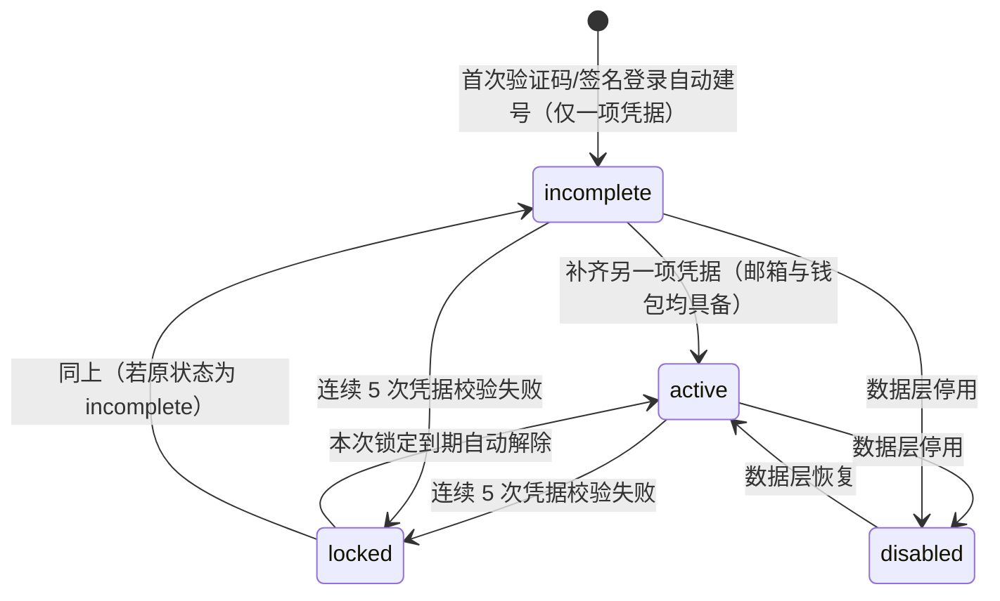

| 状态 | 定义 | 可登录 | 可发起个人认证 | 是否封锁其他功能 |
| --- | --- | --- | --- | --- |
| `incomplete` | **邮箱与钱包地址未同时具备** | 是 | ❌ 否 | **否**——不做全局封锁，只展示常驻提示条 |
| `active` | **邮箱与钱包地址均已绑定** | 是 | ✅ 是（能否通过由 WS-303 决定） | 否 |
| `locked` | 因连续登录失败被锁定 | **否——所有方式均不可用**，见 12.2.4 | 否 | — |
| `disabled` | 被停用（由技术在数据层操作） | 否 | 否 | — |

**关键口径**

- **密码不参与状态判定**。只有邮箱+钱包、从未设过密码的账户，状态就是 `active`。
- 状态转换只由「邮箱与钱包是否都有」驱动。
- 钱包地址不可修改，因此 `active` 一旦达成，不会因钱包变更而回退。
- **`locked` 的唯一出口是本次锁定到期**，锁定时长按 12.2.4 的阶梯规则确定。

### 10.2 管理端账号状态

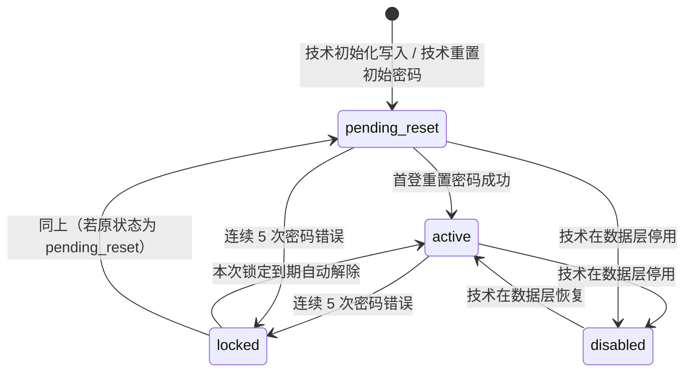

| 状态 | 含义 | 行为 |
| --- | --- | --- |
| `pending_reset`（初始密码未过期） | 技术已写入账号或重置初始密码 | 登录后强制跳 P-M02，其他页面全部拦截 |
| `pending_reset`（初始密码已过期） | 同上，但已无法登录 | 登录被拒，需**联系技术重新发放** |
| `active` | 已完成重置 | 正常使用管理端全部功能 |
| `locked` | 连续登录失败 | 不可登录，只能等待本次锁定到期 |
| `disabled` | 停用 | 不可登录，已有会话立即失效 |

### 10.3 会话状态

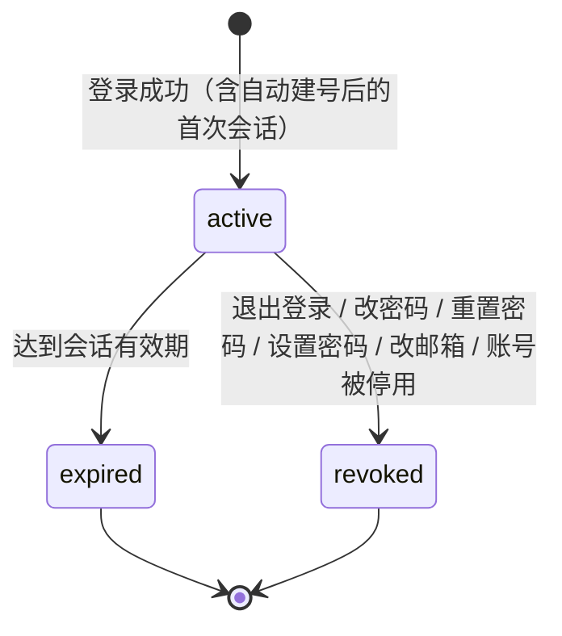

### 10.4 邮箱验证码状态

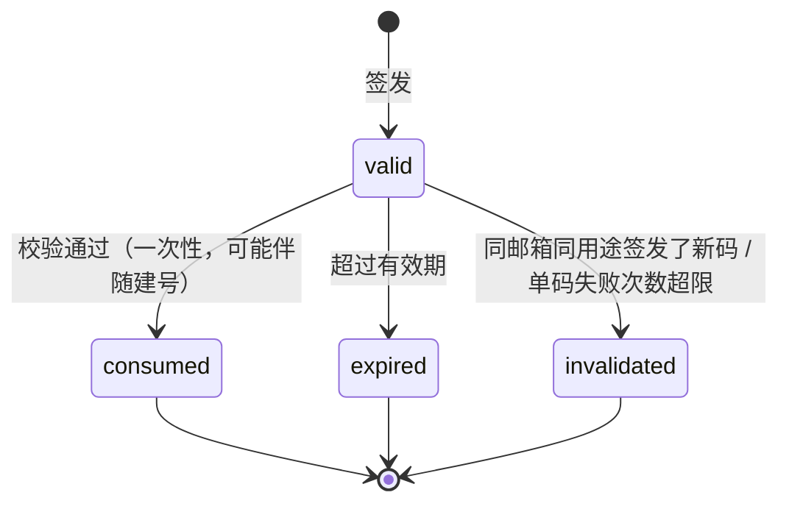

### 10.5 滑块票据状态

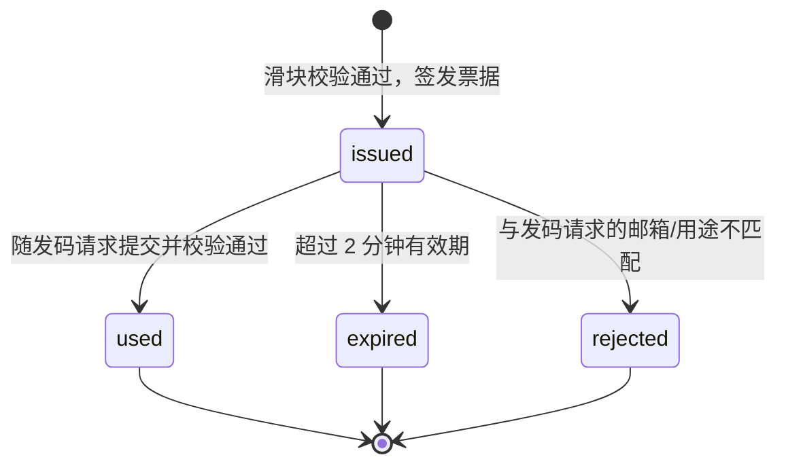

### 10.6 锁定档位（阶梯）

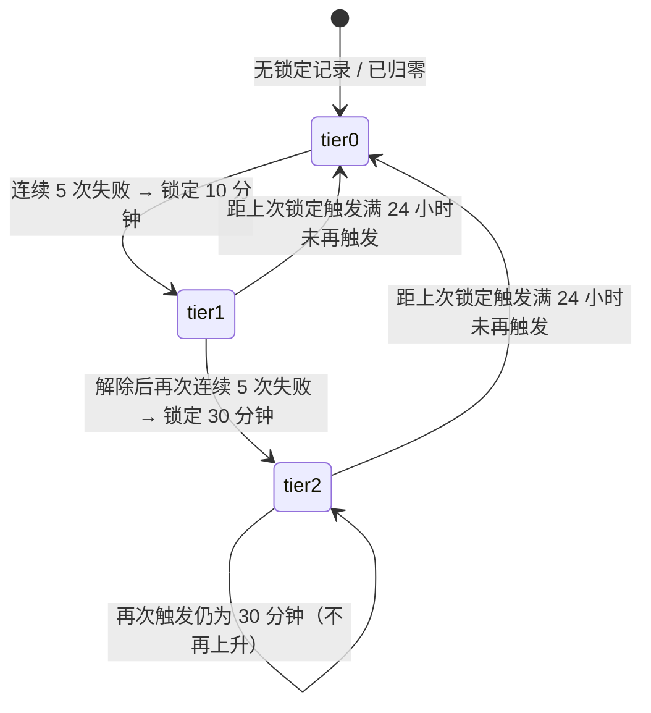

| 档位 | 含义 | 本次锁定时长 |
| --- | --- | --- |
| 第 0 档 | 无有效锁定记录（从未锁定，或已归零） | — |
| 第 1 档 | 首次锁定 | **10 分钟** |
| 第 2 档 | 再次锁定（第 2 次及以后） | **30 分钟** |

> 档位只在**新的锁定被触发那一刻**计算并落定；锁定期间档位不变。详见 12.2.4。

---

## 11. 权限

### 11.1 资产端

| 能力 | 未登录 | `incomplete` | `active` | `locked` | `disabled` |
| --- | --- | --- | --- | --- | --- |
| 访问登录页 | ✅ | — | — | ✅（展示锁定态） | ✅ |
| 切换语言 | ✅ | ✅ | ✅ | ✅ | ✅ |
| 查看协议与隐私政策 | ✅ | ✅ | ✅ | ✅ | ✅ |
| 联系客服 | ✅ | ✅ | ✅ | ✅ | ✅ |
| 登录（验证码 / 钱包 / 密码任一） | ✅ | ✅ | ✅ | **❌ 全部不可用** | ❌ |
| 设置 / 重置密码 | ✅ | ✅ | ✅ | **❌ 不可用** | ❌ |
| 浏览平台内容与不依赖认证的功能 | — | ✅ | ✅ | ❌ | ❌ |
| 左侧菜单：总览 / 用户中心 | — | ✅ | ✅ | ❌ | ❌ |
| 右上角账号下拉 → 账户设置 | — | ✅ | ✅ | ❌ | ❌ |
| 补全凭据（绑邮箱 / 绑钱包） | — | ✅ | — | ❌ | ❌ |
| 修改邮箱（须验证旧邮箱） | — | ✅（已绑定时） | ✅ | ❌ | ❌ |
| 设置 / 修改密码 | — | ✅ | ✅ | ❌ | ❌ |
| 修改钱包地址 | — | ❌ | ❌ | ❌ | ❌ |
| **发起个人认证** | — | ❌（弹层就地补齐） | ✅ | ❌ | ❌ |
| 退出登录 | — | ✅ | ✅ | — | — |
| 业务功能 | ❌ | **由各业务模块按认证状态放行**，不按本模块凭据状态拦截 | 同左 | ❌ | ❌ |

### 11.2 管理端

管理端只有「管理员」一种角色，所有管理员权限完全等同。权限差异只来自账号状态：

| 能力 | `pending_reset` | `active` | `locked` / `disabled` |
| --- | --- | --- | --- |
| 登录管理端 | ✅（初始密码未过期时；登录后强制跳 P-M02） | ✅ | ❌ |
| 访问 P-M02 重置密码页 | ✅ | — | ❌ |
| 访问其他任何管理端页面与接口 | ❌（前端与服务端双重拦截） | ✅ | ❌ |
| 忘记密码 | ✅ | ✅ | ❌（锁定期间不可用） |
| 右上角账号下拉 → 账户设置（P-M05） | ❌ | ✅ | ❌ |
| 修改自己的密码 | 通过 P-M02 完成 | ✅（P-M05 内弹窗） | ❌ |
| 设置自己的语言与时区偏好 | ❌ | ✅ | ❌ |
| 查看管理端业务功能 | ❌ | ✅ | ❌ |

---

## 12. 安全与风控

> 本章 12.1、12.2、12.3 三节为强制条款，功能本身不可省略、不可降级。

### 12.1 会话失效（强制条款）

#### 12.1.1 触发操作

| # | 操作 | 端 |
| --- | --- | --- |
| 1 | 退出登录 | 资产端 + 管理端 |
| 2 | 修改 / 设置密码 | 资产端 + 管理端 |
| 3 | 重置密码（含管理端首登强制重置） | 资产端 + 管理端 |
| 4 | **修改**邮箱 | 资产端 |
| 5 | 账号被停用 | 资产端 + 管理端 |

> **例外：首次绑定凭据不触发会话失效。**
> 「绑定邮箱」「绑定钱包」（字段从空变为非空）**不触发**会话失效，只有**变更已有凭据**才触发。理由：会话失效的目的是「旧凭据可能已失控，旧会话不可信」，而首次绑定不存在旧凭据。若不设此例外，用户刚建号在引导页补一项凭据就会被立刻踢出去重登。该判定由**服务端**依据字段是否由空变为非空来做。

#### 12.1.2 失效范围

| 载体 | 是否失效 |
| --- | --- |
| 当前设备的当前会话 | ✅ 失效 |
| 其他设备 / 其他浏览器 / 其他标签页的会话 | ✅ 失效 |
| 刷新令牌（refresh token） | ✅ 全部作废 |
| 「记住我」长期免登录凭证 | ✅ 全部作废 |
| 未消费的登录类邮箱验证码 | ✅ 作废 |
| 未使用的钱包签名 nonce | ✅ 作废 |
| 未使用的滑块票据 | ✅ 作废 |

**当前设备口径**：触发操作成功后，**当前设备同样退出登录，用户需重新登录**。口径唯一、文案唯一，且避免「当前会话续期」成为绕过点。

#### 12.1.3 被踢出设备的前端表现

1. 立即清除本地登录态与缓存的账户数据（语言偏好保留在本地，不清）；
2. 中止页面上进行中的请求，不再重试；
3. 弹出 **Toast（顶部居中，C-12）**，停留 5 秒，可手动关闭；
4. 跳转登录页，并携带原页面路径，登录成功后回跳；
5. 未保存的表单内容不做本地暂存，但在跳转前的 Toast 中提示内容未保存；
6. **同一浏览器多标签页**：任一标签页检测到失效后，通过浏览器本地事件同步通知其他标签页，全部一并跳登录页。

#### 12.1.4 会话失效提示文案（中英双语）

| 失效原因 | English | 中文 |
| --- | --- | --- |
| 密码被修改 | Your password was changed. Please sign in again. | 你的密码已被修改，请重新登录。 |
| 密码被重置 | Your password was reset. Please sign in again. | 你的密码已被重置，请重新登录。 |
| 密码被设置 | Your password was set. Please sign in again. | 你的密码已设置，请重新登录。 |
| 邮箱被修改 | Your email address was changed. Please sign in with your new email. | 你的邮箱已被修改，请使用新邮箱登录。 |
| 在其他设备退出登录 | You signed out on another device. Please sign in again. | 你已在其他设备退出登录，请重新登录。 |
| 会话过期 | Your session has expired. Please sign in again. | 登录状态已过期，请重新登录。 |
| 账户被停用 | This account has been disabled. Contact support for help. | 该账户已被停用，请联系客服。 |
| 操作设备的成功提示（主动变更后） | For your security, all devices have been signed out. | 出于安全考虑，所有设备均已退出登录。 |

- 「其他设备退出登录」这条文案下额外提供申诉入口：`Wasn't you? Reset your password. / 不是你操作的？请重置密码。`

#### 12.1.5 会话有效期、续期与过期提示

| 项 | 取值 |
| --- | --- |
| 资产端会话有效期（未勾选「记住我」） | 4 小时 |
| 资产端「记住我」有效期 | 30 天 |
| 管理端会话有效期 | 2 小时（管理端不提供「记住我」） |
| 管理端无操作自动登出 | 30 分钟无操作 |
| 资产端无操作自动登出 | 不做 |

**续期规则**：资产端 4 小时会话不做静默续期；「记住我」会话在 30 天窗口内滑动续期；管理端 2 小时会话不静默续期但支持到期前主动续期。**强制失效优先于一切续期逻辑。**

**过期提示**

| 端 | 提示方式 |
| --- | --- |
| 资产端（4 小时） | 到期前 5 分钟顶部展示非阻断提示条：`Your session will expire in 5 minutes. Save your work. / 登录状态将在 5 分钟后过期，请及时保存。` |
| 管理端 | 到期前 2 分钟弹出续期确认弹窗，提供「Stay signed in / 继续保持登录」与「Sign out / 立即退出」 |
| 管理端（无操作） | 30 分钟无操作后自动登出，Toast 提示 `You were signed out due to inactivity. / 因长时间未操作，已自动退出登录。` |

### 12.2 登录失败与账户锁定（强制条款）

#### 12.2.1 计数规则

- **触发计数的失败类型**：
  1. 邮箱密码登录，**账户存在且已设密码**但密码错误；
  2. 钱包消息签名验证失败（验签不通过、**签名恢复地址与手填地址不一致**、消息被篡改）；
  3. 敏感操作再认证时的密码错误与签名验证失败；
  4. 管理端工作邮箱 + 密码登录，密码错误。
- **不触发计数的情况**：邮箱不存在或未设密码时的密码登录尝试、用户在钱包中主动拒绝连接或签名、签名消息过期、钱包未连接、SDK 加载失败、地址格式不合法（前端即拦截）、网络异常、邮箱验证码输错（有独立的单码失败上限）。
- **阈值**：连续累计 **5 次** 失败 → 账户进入锁定。
- **清零条件**：任一方式登录成功；本次锁定到期自动解除。

> 计数与否**不得体现在响应上**：密码登录的三种失败情形返回完全一致的提示。

#### 12.2.2 计数维度（账户层 + IP 层并行）

| 层 | 计数键 | 阈值 | 作用 |
| --- | --- | --- | --- |
| 账户层（主） | 账户标识 | 连续 5 次失败 → 账户锁定（时长按阶梯，见 12.2.4） | 保护单个账户不被爆破 |
| IP 层（辅） | 客户端 IP | 同一 IP 在 1 小时内累计失败 20 次 → 该 IP 的后续登录请求**强制先过滑块人机校验**才允许提交 | 防止撞库 |

- 两层并行、不叠加计数。IP 层只做到「强制人机校验」这一档，不做 IP 封禁。

#### 12.2.3 密码失败与签名失败共用同一计数器

两者**共用同一个计数器**，相加满 5 次即锁定。理由：两者本质相同（都是向系统证明账户所有权），拆开会让攻击者在两条路径间横跳、实际获得 10 次机会；且用户侧解释简单。

#### 12.2.4 阶梯锁定时长

**锁定范围**：锁定期间**所有登录方式与设置/重置密码流程全部不可用**，只能等待本次锁定到期。

**锁定时长按阶梯递进：**

| 档位 | 触发条件 | 本次锁定时长 |
| --- | --- | --- |
| 第 1 档 | 首次触发锁定（或档位已归零后再次触发） | **10 分钟** |
| 第 2 档 | 上一次锁定解除后，再次连续失败 5 次 | **30 分钟** |
| 第 2 档（维持） | 第 3 次及以后触发 | **仍为 30 分钟，不再继续往上加** |

**阶梯归零规则**

- **距上一次锁定被触发满 24 小时且期间未再触发锁定**，档位退回第 1 档。
- 归零判定的起算点是**上一次锁定被触发的时刻**（不是解除时刻），这样口径唯一、不受锁定时长本身影响。
- 判定发生在**新的锁定被触发那一刻**：若 `当前时间 − 上次锁定触发时间 > 24 小时`，则本次按第 1 档（10 分钟）锁定；否则档位 +1（上限第 2 档）。
- 锁定期间档位不变，不会因为用户反复尝试而在同一次锁定内升档。

**参数**：三个数值（10 分钟 / 30 分钟 / 24 小时）均为可调参数，见 19.2 的 N-01～N-03。

**锁定期间各入口的表现——全部不可用**

| 入口 | 锁定期间 |
| --- | --- |
| 邮箱密码登录 | ❌ 不可用（不再校验密码，不再增加计数） |
| 邮箱验证码登录 | ❌ 不可用 |
| 钱包签名登录 | ❌ 不可用（不再下发签名消息） |
| 设置 / 重置密码 | ❌ 不可用 |
| 管理端登录与忘记密码 | ❌ 不可用 |

**页面表现**：进入锁定态（P-A07）后，明确展示**本次锁定的剩余等待时间并实时倒计时**，归零后自动恢复表单可用，无需刷新页面。

**防枚举处理（关键实现约束）**

锁定判定**必须发生在凭据校验通过之后**，不能提前到发码或输入邮箱阶段：

- 若在输入邮箱后就提示「该账户已锁定」，等于告诉任何人"这个邮箱确实注册过"，会重新打开邮箱枚举通道。
- 正确顺序是：**照常发码 → 照常校验验证码 → 验证码通过（用户已证明对该邮箱的所有权）→ 此时才判定锁定并拒绝**。此时提示锁定不再泄漏任何信息。
- 同理适用于设置/重置密码流程（见 9.3 流程图中的锁定判定位置）与钱包路径（验签通过后才判定）。密码登录路径本就在校验后判定。

> 这意味着锁定期间用户**仍会收到验证码邮件**，但输入正确的验证码后会被告知账户锁定、无法登录。这是防枚举与全通道锁死两个要求同时成立的唯一可行组合，实现时不得为"省一次发信"而把锁定判定提前。

**锁定期间没有提前解除方式**：账户一旦锁定，在本次锁定到期前没有任何自助或人工的解除途径，用户只能等待。第 1 档 10 分钟的设计正是为了让首次误锁的代价尽量小。

#### 12.2.5 剩余次数与阶梯的提示

**前 2 次失败不提示剩余次数；从第 3 次失败起提示。**

| 失败次数 | 提示 |
| --- | --- |
| 第 1、2 次 | 仅提示凭据错误，不透露剩余次数 |
| 第 3、4 次 | 凭据错误 + 剩余次数提示 |
| 第 5 次 | 锁定提示 + 本次剩余时间 |

| 场景 | English | 中文 |
| --- | --- | --- |
| 剩余次数提示（密码） | Incorrect email or password. {n} attempts remaining before your account is locked. | 邮箱或密码不正确，还可尝试 {n} 次，超出后账户将被锁定。 |
| 签名失败剩余次数 | Signature verification failed. {n} attempts remaining before your account is locked. | 签名验证失败，还可尝试 {n} 次，超出后账户将被锁定。 |
| **首次锁定（第 1 档）** | Too many failed attempts. Your account is locked for {m} minutes. If it happens again, the lock will last longer. | 失败次数过多，账户已锁定 {m} 分钟。若再次触发，锁定时间会更长。 |
| **再次锁定（第 2 档）** | Too many failed attempts. Your account is locked for {m} minutes. | 失败次数过多，账户已锁定 {m} 分钟。 |
| 锁定期间再次尝试（任何入口） | Your account is locked. All sign-in methods are unavailable until the lock expires. Try again in {m}m {s}s. | 账户已锁定，所有登录方式在锁定解除前均不可用，请在 {m} 分 {s} 秒后重试。 |
| 锁定期间的说明 | Please wait for the lock to expire. | 请等待锁定自动解除。 |

> 第 1 档的提示中附带「若再次触发，锁定时间会更长」这一句，是对真实用户的预警，让他知道停下来核对凭据比继续试更划算；第 2 档已达上限，不再附加该句。

#### 12.2.6 锁定的通知与留痕

- 账户进入锁定状态时，向绑定邮箱发送安全通知（账户无邮箱时跳过），内含锁定时间、大致地区/IP 摘要、**本次预计自动解除时间**、以及「不是你？锁定解除后请立即重置密码」的提示。
  > 通知文案不得引导用户"立即重置密码解锁"——锁定期间重置不可用。
- 每次失败、每次锁定与解除、以及档位变化均写入安全审计日志，保留期 180 天。

### 12.3 邮箱验证码：滑块人机校验与发送限频（强制条款）

#### 12.3.1 适用范围（所有发送邮箱验证码的入口，无例外）

| # | 入口 | 端 |
| --- | --- | --- |
| 1 | 邮箱验证码登录（含首次自动建号） | 资产端 |
| 2 | 设置 / 重置密码（「忘记密码」与「没有密码？设置密码」两个入口复用同一流程） | 资产端 |
| 3 | 引导页 / 账户设置中的邮箱绑定 | 资产端 |
| 4 | 发起个人认证时的就地补齐弹层（绑邮箱） | 资产端 |
| 5 | 修改邮箱弹窗 - 旧邮箱验证 | 资产端 |
| 6 | 修改邮箱弹窗 - 新邮箱验证 | 资产端 |
| 7 | 敏感操作再认证（选择邮箱验证码因子时） | 资产端 |
| 8 | 管理端忘记密码 | 管理端 |

> 口径统一：只要界面上出现「Send code / 发送验证码」这个动作，就必须先过滑块，再过限频，不允许任何入口豁免。
> IP 层风控触发后的登录提交（见 12.2.2）也复用同一个滑块组件。

#### 12.3.2 滑块弹窗交互（C-01）

**正常路径**：点击「Send code」→ 弹出滑块弹窗 → 拖动拼图 → 松手后提交落点与轨迹 → 校验通过 → 滑轨变绿 + `Verified / 验证通过` → 弹窗自动关闭 → 携带票据发码。

**失败与重试**

| 情况 | 表现 |
| --- | --- |
| 单次校验失败 | 滑轨变红 + 滑块抖动 + 拼图复位 + 自动换新图 + `Verification failed. Please try again. / 验证失败，请重试。` 弹窗**不关闭** |
| 连续失败 3 次 | 提示升级为 `Having trouble? Tap the refresh icon for a new puzzle. / 遇到困难？点击右上角刷新换一张。` |
| 连续失败 5 次 | 进入 60 秒冷却，滑块禁用并倒计时 |
| 用户关闭弹窗 | 不发码，按钮恢复原态，表单内容不丢失 |
| 资源加载失败 | `Failed to load. Tap to retry. / 加载失败，点击重试。` |

**其他要求**：每次点击「Send code」都要重新过滑块；支持键盘操作（Tab 聚焦、方向键位移、Enter 提交）；弹窗内提供 `Need help? Contact support / 需要帮助？联系客服` 入口。

#### 12.3.3 自研滑块的服务端校验要求

| # | 要求 |
| --- | --- |
| 1 | 图与答案由服务端生成，正确坐标**不下发前端** |
| 2 | 前端只回传落点坐标与轨迹采样（坐标序列 + 时间戳），不回传校验结论 |
| 3 | 落点与答案的偏差在容差内才算通过 |
| 4 | 轨迹合理性：时间戳单调递增；总耗时落在合理区间；采样点数不低于下限；速度曲线不得为完全匀速直线 |
| 5 | 挑战一次性：同一挑战只允许提交一次校验，提交后立即作废 |
| 6 | 校验通过后签发一次性滑块票据 |
| 7 | 票据绑定挑战 ID、目标邮箱、发码用途、请求来源（IP + 设备指纹） |
| 8 | 票据有效期 2 分钟 |
| 9 | 票据一次性，只能用于随后的那一次发码请求 |
| 10 | 发码接口必须校验票据存在、未过期、未使用，且绑定的邮箱与用途与本次请求完全一致。**服务端校验是唯一防线** |
| 11 | 滑块挑战本身按 IP 与设备维度限频，防止刷挑战穷举答案 |
| 12 | 滑块失败次数按来源在服务端记录，冷却期内服务端同样拒绝新挑战 |

#### 12.3.4 发送限频维度与阈值

| 维度 | 规则 | 阈值 |
| --- | --- | --- |
| 同一邮箱 | 相邻两次发送的最小间隔 | 60 秒 |
| 同一邮箱 | 滚动 1 小时 / 24 小时最大发送次数 | 5 次 / 10 次 |
| 同一 IP | 滚动 1 小时 / 24 小时最大发送次数 | 20 次 / 100 次 |
| 同一设备 | 滚动 1 小时 / 24 小时最大发送次数 | 10 次 / 30 次 |

- 设备以浏览器指纹标识；指纹不可用时该维度不生效，不因此阻断发送。
- 各用途**共享同一份邮箱维度额度**，不能通过切换入口绕过。
- 邮件服务商返回发送失败时，允许立即重试 1 次且不计入额度。

#### 12.3.5 超限后的提示与倒计时表达

| 超限维度 | English | 中文 |
| --- | --- | --- |
| 邮箱 60 秒冷却 | Resend in {n}s | {n} 秒后重发 |
| 邮箱小时/日额度超限 | You've requested too many codes. Please try again in {t}. | 验证码请求过于频繁，请在 {t} 后重试。 |
| IP 维度超限 | Too many requests from your network. Please try again later. | 当前网络请求过于频繁，请稍后重试。 |
| 设备维度超限 | Too many requests from this device. Please try again later. | 当前设备请求过于频繁，请稍后重试。 |

- 60 秒冷却走按钮内倒计时；小时/日额度超限用可读时长展示。
- 刷新页面后倒计时仍准确（以服务端返回的剩余秒数为准）。
- 超限提示**不区分**该邮箱是否已有账户。

#### 12.3.6 验证码本身的规则

| 项 | 取值 |
| --- | --- |
| 长度与字符集 | 6 位纯数字 |
| 有效期 | 10 分钟 |
| 单码可验证次数 | 最多 5 次错误尝试，超出后立即作废 |
| 一次性 | 校验通过后立即作废 |
| 新码签发 | 同一邮箱同一用途签发新码时，此前未消费的码立即作废 |
| 跨用途 | 码与用途绑定，用途不匹配一律判为无效 |
| 邮件文案 | **不区分该邮箱是否已有账户**，统一为「登录验证码」文案 |
| 验证码失败计数 | 独立于登录失败计数，验证码输错**不**触发账户锁定 |

### 12.4 其他安全要求

| 项 | 要求 |
| --- | --- |
| 密码存储 | 仅存不可逆哈希；任何界面、日志、邮件中都不得出现明文密码 |
| 初始密码哈希 | 管理端账号另存一份初始密码哈希，仅用于「不得与初始密码相同」的比对，不可用于登录校验 |
| 传输 | 全站强制 HTTPS |
| 签名消息 | 必须包含域名、账户地址、链 ID、nonce、签发时间、有效期、用途声明；文案使用「Sign message」，明确说明不发起交易、不转移资产、不涉及授权 |
| **签名地址一致性** | **服务端必须从签名恢复签名者地址并与用户手填地址严格比对，不一致一律拒绝**（见 7.2.3） |
| nonce | 一次性，验签成功或失败后立即失效；有效期 5 分钟 |
| **账户枚举防护** | 邮箱密码登录（三种失败情形响应完全一致）、设置/重置密码、管理端登录与忘记密码四处，不得因账户是否存在而返回可区分的响应（含文案与响应时间）。**邮箱验证码登录路径天然不可区分**。**锁定判定必须置于凭据校验之后**（见 12.2.4） |
| 自动建号的滥用防护 | 建号必须以验证码校验通过或（验签通过且地址一致）为前提；滑块 + 三维度限频约束建号速率；服务端不提供任何无凭据证明的建号接口 |
| 日志脱敏 | 邮箱按 `a***@example.com` 脱敏，地址按缩略格式，验证码、密码与签名不入日志 |
| 审计留存 | 登录成功/失败、自动建号、锁定/解除与档位变化、密码/邮箱变更、钱包绑定，全部留痕，保留期 180 天 |
| 越权防护 | 所有账户操作在服务端校验操作者与目标账户一致；管理端操作校验账号状态为 `active` |
| **不可修改项的服务端保护** | 钱包地址在绑定后，服务端必须拒绝任何修改请求，不能只靠前端隐藏入口 |
| 邮件发送域 | 使用可信发件域并配置 SPF / DKIM / DMARC |

### 12.5 安全事件通知触发点（供通知模块消费）

| 事件 | 通知对象 |
| --- | --- |
| 密码修改 / 设置成功 | 绑定邮箱 / 工作邮箱 |
| 密码重置成功（含管理端首登重置） | 绑定邮箱 / 工作邮箱 |
| 邮箱修改成功 | 旧邮箱 + 新邮箱 |
| 首次绑定邮箱 | 新绑定的邮箱 |
| 账户被锁定 | 绑定邮箱 / 工作邮箱（含本次预计自动解除时间） |

> - **自动建号本身不发欢迎邮件**——建号已在引导页顶部明确告知，再发邮件会与「验证码邮件不区分是否首次」的口径冲突，反而泄漏该邮箱此前是否已有账户。
> - **首次绑定钱包不单独发安全通知**（账户可能尚无邮箱可发）。
> - 管理端账号的创建、停用、初始密码重置由技术在数据层直接操作，不经过应用层，因此不触发应用层通知。

---

## 13. 国际化基线（全局，其他模块直接引用）

### 13.1 语言支持

| 项 | 取值 |
| --- | --- |
| 支持语言 | 英文 `en`、简体中文 `zh-CN` |
| **默认语言** | **英文 `en`** |
| 语言码规范 | BCP 47（`en`、`zh-CN`），不使用「中文 / 英文」这类地区式表述 |
| 切换器位置 | 已登录：顶部导航栏右侧；未登录：登录页右上角 |
| **切换器形态** | **下拉选择**：收起态展示**语言图标 + 当前语言缩写**（`EN` / `中文`）与一个下拉箭头；点击展开选项列表，选项以目标语言的自称完整展示（`English` / `简体中文`），当前项带选中标记 |
| 图标 | 使用通用的语言/地球图标，**不使用国旗**（国旗代表国家而非语言） |

### 13.2 即时生效

- 切换语言后**当前页面不刷新即完成全部文案替换**，包括导航、面包屑、左侧菜单、表单标签、占位符、按钮、校验错误提示、密码规则清单、常驻提示条、Toast、弹窗内文案、空状态、日期与数字格式。
- 已展示在屏幕上的错误提示与倒计时，切换后也必须同步换语言。
- 用户已填写的表单内容在切换语言后**不丢失**。
- 邮件与通知不随之改写：一封已发出的邮件语言以**发送时**账户语言偏好为准。

### 13.3 语言判定优先级与双态持久化

#### 13.3.1 判定优先级（三级）

| 优先级 | 来源 | 说明 |
| --- | --- | --- |
| ① | **用户在本浏览器手动切换过的语言偏好** | 持久化在浏览器本地存储，长期保留 |
| ② | **已登录账户的语言偏好** | 未登录态跳过本级 |
| ③ | **英文 `en`（默认）** | 前两级都未命中时使用 |

- **未登录态**：只有 ①③ 生效。全新浏览器首次访问一律英文。
- 判定框架预留扩展位：若后续需要引入新的判定来源，在 ② 与 ③ 之间插入一级即可。

#### 13.3.2 双态持久化

| 状态 | 写入位置 |
| --- | --- |
| **未登录** | 手动切换的语言写入浏览器本地存储，同时记录切换时间 |
| **已登录** | 同时写入浏览器本地存储与账户语言偏好（异步保存），两侧均记录设置时间 |

**冲突处理**：本地手动偏好与账户偏好不一致时，以**较晚的一次显式设置**为准，并回写另一侧，保证两端最终一致。账户偏好保存失败不阻断界面，下次进入静默重试。退出登录后**保留本地语言偏好**。用户显式切换过的语言，任何情况下都不被自动逻辑覆盖。

### 13.4 时区与时间展示

| 项 | 规则 |
| --- | --- |
| 存储 | 所有时间以 UTC 存储，审计日志一律 UTC |
| 账户时区 | 账户可选 IANA 时区，在 P-A11 / P-M05 的偏好信息区块设置 |
| 默认时区 | 建号时按浏览器时区自动推断并写入账户；推断失败兜底 `UTC` |
| 未登录时区 | 按浏览器时区展示 |
| 展示原则 | 界面上所有时间点**必须带时区标注**，不出现裸时间 |
| 时区标注格式 | 优先展示 UTC 偏移，如 `(UTC+8)`；hover 展示完整时区名 |
| 相对时间 | 24 小时内可用相对时间，hover 展示绝对时间；超过 24 小时一律绝对时间 |
| 倒计时 | 按客户端本地秒数渲染，起点以服务端返回的剩余秒数为准（锁定剩余时间、验证码冷却等） |

> **时区按浏览器推断**，这与语言不同：语言是内容呈现的选择（有明确默认值更可预期），时区是客观事实（推断错了会导致时间显示错误）。

**日期时间格式**

| 场景 | English (`en`) | 中文 (`zh-CN`) |
| --- | --- | --- |
| 日期 | `Sep 7, 2026` | `2026-09-07` |
| 日期 + 时间 | `Sep 7, 2026, 14:30 (UTC+8)` | `2026-09-07 14:30 (UTC+8)` |
| 完整时间戳（审计） | `Sep 7, 2026, 14:30:52 (UTC+8)` | `2026-09-07 14:30:52 (UTC+8)` |
| 时钟制 | 24 小时制（两种语言统一） | 24 小时制 |

### 13.5 数字、金额、地址与哈希展示

**数字**：千分位 `1,234,567.89`；小数点 `.`；百分比 `12.34%`；不做大数缩写。两种语言一致。

**金额**（本模块无金额展示场景，作为全局基线供业务模块引用）

| 规则 | 说明 |
| --- | --- |
| 展示形态 | 金额 + 币种代码，如 `1,234.56 USDT`；法币可用符号 + 代码 |
| 币种代码 | 大写 ISO 4217 或链上代币符号，不做翻译 |
| 符号位置 | 两种语言统一「数值在前、币种代码在后」 |
| 小数位 | 法币 2 位；链上代币默认保留 6 位有效小数并去尾零，详情展示完整精度 |
| 零与空 | 0 展示 `0.00 USDT`；无数据展示 `—` |

**链上地址（组件 C-07）**

| 规则 | 说明 |
| --- | --- |
| 存储 | 全小写 |
| 完整展示 | 按 EIP-55 校验和大小写渲染 |
| 缩略展示 | 前 6 位 + `…` + 后 4 位，如 `0x5aAeb6…eAed` |
| 复制 | 缩略与完整展示处均提供复制按钮（复制完整地址），Toast 提示 `Address copied / 地址已复制` |
| Tooltip | hover 展示完整地址 |
| 字体 | 等宽字体 |

**交易哈希 / 消息哈希**：缩略为前 10 位 + `…` + 后 8 位；复制、tooltip、等宽字体规则与地址一致。

### 13.6 区块浏览器跳转（F-35）

| 项 | 规则 |
| --- | --- |
| 入口呈现 | 复制按钮右侧的外链图标按钮（`↗`）；缩略与完整两种形态下都提供 |
| Tooltip | `View on explorer / 在区块浏览器中查看` |
| 多链 URL 确定方式 | 按数据所属**链 ID** 查「链 ID → 区块浏览器基址」映射表；地址拼 `{基址}/address/{完整地址}`，哈希拼 `{基址}/tx/{完整哈希}` |
| 映射表维护方式 | **由部署配置文件维护**（随部署下发），新增链只需补配置，不改前端代码 |
| 打开方式 | **新标签页**（`target="_blank"` + `rel="noopener noreferrer"`） |
| 降级表现 | 数据未携带链 ID / 链 ID 无对应浏览器 / 映射表未加载成功时，**不展示跳转入口**，只保留复制按钮，不展示置灰按钮或死链接 |
| 无障碍 | 图标按钮需有 `aria-label`，键盘可聚焦、可回车触发 |

### 13.7 文案与翻译规范

| 项 | 规则 |
| --- | --- |
| 术语一致性 | 登录统一用 `Sign in` / `Sign out` |
| 注册术语 | 界面上**不出现** `Sign up` / `Register` / `Create account` 等注册类术语——平台没有注册这个动作 |
| **钱包术语** | 入口与按钮统一用 **`Link external wallet` / 「链接外部钱包」**；地址称 `Wallet address` / 「钱包地址」；签名提示一律 `Sign message`，**禁止** `Confirm transaction` / `Approve` |
| 验证码术语 | `Verification code`，动作 `Send code` / `Resend code` |
| 管理端术语 | 角色统一称「管理员 / Administrator」 |
| 可选项标注 | 非必填项必须显式标 `Optional / 可选`，尤其是密码 |
| 变量插值 | 用占位符（`{n}`、`{m}`、`{t}`），不拼接句子片段 |
| 复数 | 英文需处理单复数；中文无复数变化 |
| 布局适配 | 中文文案通常比英文短 20~30%，按钮与标签需自适应宽度；英文长词需支持换行不截断 |
| 缺失兜底 | 缺少中文翻译时回落英文，**不展示文案键名**，构建期报告缺失项 |

---
## 14. 数据对象与字段

> 只定义业务字段与口径，不指定存储实现。

### 14.1 账户 Account（资产端）

| 字段 | 口径 | 类型 | 必填 | 说明 |
| --- | --- | --- | --- | --- |
| `account_id` | 账户唯一主键 | string | 是 | **不可变** |
| `email` | 绑定邮箱 | string | 否 | 全局唯一（小写比对）；钱包建号时为空；修改须验证旧邮箱 |
| `email_verified_at` | 邮箱验证时间 | datetime | 否 | 通过验证码即视为已验证 |
| `wallet_address` | 绑定钱包地址 | string | 否 | 全局唯一（小写存储）；邮箱建号时为空；**绑定后不可修改**，服务端须拒绝任何修改请求 |
| `wallet_bound_at` | 钱包绑定时间 | datetime | 否 | |
| `has_password` | 是否已设置密码 | bool | 是 | **仅用于登录体验分流与是否执行原密码比对；不参与账户状态判定，不作为任何门槛** |
| `account_status` | 账户状态 | enum | 是 | `incomplete`（邮箱与钱包未同时具备）/ `active`（两项均具备）/ `disabled`；**密码不计入判定** |
| `failed_attempts` | 连续凭据校验失败次数 | int | 是 | 默认 0，密码与签名共用 |
| `locked_until` | 本次锁定截止时间 | datetime | 否 | 为空或已过期表示未锁定；到期即自动解除 |
| **`lock_tier`** | **当前锁定档位** | int | 是 | 默认 0；1 = 首次锁定档（10 分钟），2 = 再次锁定档（30 分钟，上限）。见 12.2.4 |
| **`last_locked_at`** | **上一次锁定被触发的时刻** | datetime | 否 | 用于阶梯归零判定：新锁定触发时若距此超过 24 小时则档位回到 1 |
| `locale` | 语言偏好 | enum | 否 | `en` / `zh-CN`；未显式设置过时为空，按 13.3 判定 |
| `locale_set_at` | 语言偏好设置时间 | datetime | 否 | 用于 13.3.2 的冲突处理 |
| `timezone` | 时区偏好 | string | 是 | IANA 标识，建号时按浏览器推断 |
| `agreed_terms_version` | 已同意的协议版本 | string | 是 | 建号时随账户一并写入 |
| `created_via` | 建号路径 | enum | 是 | `email_code` / `wallet_signature` |
| `guide_shown_at` | 引导页展示时间 | datetime | 否 | 引导页只展示一次的依据 |
| `created_at` / `updated_at` | 创建/更新时间 | datetime | 是 | UTC |

**多企业预留说明**：本期一个账户对应一个使用主体，账户档案中**不直接承载企业字段**。后续支持「一账号管理多家企业」时，按「账户 — 个人主体 — 企业实体」三层关系扩展，本期无需改动上述账户字段。

### 14.2 管理端账号 AdminAccount

| 字段 | 口径 | 类型 | 必填 | 说明 |
| --- | --- | --- | --- | --- |
| `admin_id` | 唯一主键 | string | 是 | 不可变 |
| `work_email` | 工作邮箱 | string | 是 | **即登录账号**，全局唯一，不可自助修改 |
| `display_name` | 姓名 | string | 是 | 只读展示 |
| `role` | 角色 | enum | 是 | 本期固定为 `administrator` 单一取值 |
| `must_reset_password` | 是否需强制重置密码 | bool | 是 | 技术写入账号或重置初始密码时为 true；首登重置成功后 false |
| `initial_password_expires_at` | 初始密码有效期 | datetime | 否 | 写入时刻起 7 天；过期后需技术重新发放 |
| `initial_password_hash_kept` | 初始密码哈希（留存） | string | 是 | 仅用于「不得与初始密码相同」的比对；**不可用于登录校验** |
| `status` | 状态 | enum | 是 | `pending_reset` / `active` / `locked` / `disabled` |
| `failed_attempts` / `locked_until` / `lock_tier` / `last_locked_at` | 同资产端 | | | 阶梯锁定规则与资产端完全一致 |
| `locale` / `timezone` | 偏好 | | 否 | 在 P-M05 设置 |
| `last_login_at` | 最近登录时间 | datetime | 否 | |

> 本对象的**全部写操作**（新建、停用、恢复、初始密码发放与重置）由技术在数据层完成。应用层只读取本对象用于登录、首登重置、忘记密码与账户设置，并在首登重置与修改密码时更新密码相关字段。

### 14.3 会话 Session

| 字段 | 说明 |
| --- | --- |
| `session_id` | 会话唯一标识 |
| `account_id` / `admin_id` | 所属账户 |
| `issued_at` / `expires_at` | 签发与过期时间（UTC）；资产端 4 小时 /「记住我」30 天，管理端 2 小时 |
| `remember_me` | 是否长期会话；管理端恒为 false |
| `last_active_at` | 最近活跃时间，用于滑动续期与管理端无操作登出判定 |
| `device_summary` | User-Agent 摘要 + IP 归属地，仅用于安全通知与审计 |
| `revoked_at` / `revoke_reason` | 失效时间与原因，枚举对应 12.1.4 的文案分支 |

### 14.4 验证码 VerificationCode

| 字段 | 说明 |
| --- | --- |
| `code_id` | 唯一标识 |
| `email` | 目标邮箱；**签发时不要求该邮箱已有账户** |
| `purpose` | 登录（含建号）/ 设置或重置密码 / 绑定邮箱 / 改邮箱（旧）/ 改邮箱（新）/ 再认证 / 管理端找回 |
| `expires_at` | 10 分钟 |
| `attempt_count` | 已验证失败次数，上限 5 |
| `status` | `valid` / `consumed` / `expired` / `invalidated` |

> 「忘记密码」与「没有密码？设置密码」两个入口**共用同一个 `purpose`**（设置或重置密码），这是 9.3 流程复用的直接体现。
> 验证码本身不明文落库，只存不可逆摘要。

### 14.5 滑块挑战与票据 CaptchaChallenge / CaptchaTicket

| 字段 | 说明 |
| --- | --- |
| `challenge_id` | 挑战唯一标识，一次性 |
| `answer_x` | 缺口正确坐标，**仅服务端持有** |
| `challenge_expires_at` | 挑战有效期 |
| `ticket_id` | 票据唯一标识 |
| `bound_email` / `bound_purpose` / `bound_source` | 票据绑定的邮箱、用途、来源（IP + 设备指纹） |
| `ticket_expires_at` | 2 分钟 |
| `ticket_status` | `issued` / `used` / `expired` / `rejected` |

### 14.6 签名挑战 SignChallenge

| 字段 | 说明 |
| --- | --- |
| `nonce` | 一次性随机数，验签成功或失败后立即失效 |
| `claimed_address` | **用户手填的目标地址**；服务端据此下发消息，并在验签后与恢复地址比对 |
| `chain_id` | 链 ID；同时用于区块浏览器跳转的映射查询 |
| `purpose` | 登录（含建号）/ 绑定钱包 / 再认证 |
| `expires_at` | 5 分钟 |

### 14.7 安全审计日志 SecurityAuditLog

| 字段 | 说明 |
| --- | --- |
| `event_type` | 登录成功 / 登录失败 / 自动建号 / 锁定触发 / 锁定到期解除 / **锁定档位变化** / 密码设置 / 密码变更 / 密码重置 / 邮箱绑定 / 邮箱变更 / 钱包绑定 / 会话失效 / **签名地址不一致拒绝** |
| `subject_id` | 被作用账户 |
| `operator_id` | 操作者（自助操作时同 `subject_id`） |
| `ip` / `user_agent_summary` | 来源摘要 |
| `occurred_at` | UTC 时间 |
| `result` | 成功 / 失败 + 失败原因 |
| `context` | 操作前状态摘要（如建号路径、本次锁定档位与时长） |

---

## 15. 非功能要求

| 维度 | 要求 |
| --- | --- |
| 性能 - 页面 | 登录页首屏可交互 ≤ 2s（正常网络，目标值） |
| 性能 - 接口 | 登录（含建号）、发码、验签、滑块校验接口 P95 ≤ 800ms（目标值） |
| 性能 - 邮件 | 验证码邮件 P90 在 30s 内送达（目标值） |
| 性能 - 语言切换 | 切换后界面完成重渲染 ≤ 300ms，不出现整页白屏 |
| 性能 - tab 锚点滚动 | 账户设置页 tab 点击后滚动动画 ≤ 400ms，滚动结束时目标区块标题贴合视口顶部安全区 |
| 可用性 | 登录相关服务可用性 ≥ 99.9%（目标值） |
| 浏览器兼容 | Chrome / Edge / Firefox / Safari 最近两个大版本 |
| 响应式 | 桌面优先；≥ 768px 完整布局，< 768px 单列布局；登录、建号、引导、找回、账户设置全流程在移动端可完成；滑块弹窗适配触屏拖动；面包屑在窄屏折叠为「返回上级」 |
| 弱网 | 请求超时后按钮恢复可点、已填内容不丢失；倒计时以服务端剩余秒数为准 |
| 国际化完整性 | 界面上不得出现未翻译的硬编码文案；构建期检查文案键完整性 |
| 安全 | 见第 12 章 |
| 可观测 | 登录成功率、自动建号量、签名地址不一致的拒绝率、发码成功率、邮件送达率、**锁定触发量与档位分布**、滑块通过率、凭据补全率需可监控 |
| **部署前置** | **初始化管理员账号是系统可用的部署前置条件**，须写入部署清单并在上线检查中确认 |
| 运维前置 | 管理端账号的维护由技术在数据层操作，需在运维手册中明确操作方式与审批要求 |

### 15.1 可访问性

| 项 | 要求 |
| --- | --- |
| 表单 | 所有控件有关联 label；错误提示与输入框程序化关联并可被屏幕阅读器朗读 |
| 键盘 | 登录、验证码输入、钱包地址输入与链接、引导页、账户设置、弹窗全流程键盘可达；焦点顺序合理；焦点可见；弹窗打开时焦点移入、关闭后返回触发元素 |
| 对比度 | 符合 WCAG AA |
| 图标按钮 | 密码眼睛图标、复制、区块浏览器跳转、语言下拉均需 `aria-label` |
| 动态提示 | **Toast 通过 live region 播报**（失败用 assertive，成功与信息用 polite）；锁定倒计时、密码规则清单、常驻补全提示条的状态变化同样播报 |
| tab 锚点 | 账户设置页的 tab 需实现为语义化的锚点导航，键盘可操作，滚动后焦点落到目标区块 |
| 面包屑 | 使用语义化导航结构，当前页标记为 `aria-current` |
| 滑块弹窗 | 支持键盘操作（Tab 聚焦、方向键位移、Enter 提交） |

### 15.2 已知无障碍缺口（明确记录）

**缺口**：滑块人机校验**不提供无障碍替代校验方案**（不提供音频验证码或其他非视觉、非拖拽的校验通道）。

**影响范围**

- 受影响人群：依赖屏幕阅读器的视障用户；因运动功能障碍无法完成精确拖拽且无法用键盘方向键微调的用户。
- 受影响功能：12.3.1 列出的 **8 个入口**全部——邮箱验证码登录（含建号）、设置/重置密码、引导页与账户设置绑邮箱、认证前置弹层绑邮箱、修改邮箱的新旧两次验证、邮箱再认证、管理端忘记密码。
- 影响程度：上述用户**无法通过邮箱路径自助开户或登录**，只能通过客服人工协助。
- 部分缓解：滑块弹窗支持键盘方向键，可覆盖「不能用鼠标但能用键盘且能看见画面」的用户；无法覆盖视障用户。
- **未受影响的路径**：**链接外部钱包登录与建号不经过滑块**，受影响用户仍有一条完整可用的开户与登录路径（填地址 → 连接钱包 → 签名）。手填地址是标准文本输入框，对屏幕阅读器友好。

**处置**：列入后续需求候选；本期在客服支持流程中准备人工协助通道，并在滑块弹窗内提供「联系客服」入口，**不静默失败**。

---

## 16. 指标

| 层级 | 指标 | 目标值 |
| --- | --- | --- |
| 开户转化 | 登录页到建号成功的完成率（分验证码路径与钱包路径） | 由业务设定 |
| 开户转化 | 两条建号路径的分布（`created_via`） | 观测指标 |
| 凭据补全 | 建号后 7 日内补齐另一项凭据的比例 | 由业务设定 |
| 凭据补全 | 引导页当场补全率 vs 跳过后经提示条补全率 vs 认证前置弹层补全率 | 观测指标 |
| 凭据补全 | 密码设置率（可选项，低不代表有问题） | 观测指标 |
| 登录体验 | 各方式登录成功率（验证码 / 密码 / 钱包） | 由业务设定 |
| 登录体验 | **签名地址与手填地址不一致的拒绝率** | 观测指标；若持续偏高说明手填地址这一步给用户造成了实质困扰，需要复盘该设计 |
| 登录体验 | 「没有密码？设置密码」与「忘记密码」两个入口的使用分布 | 观测指标 |
| 认证前置 | 发起个人认证时被凭据校验拦截的比例、拦截后当场补齐的比例 | 观测指标 |
| 落地规则 | 登录后落到用户中心 vs 总览页的分布 | 观测指标 |
| 安全 | 锁定触发量 | 观测指标 |
| 安全 | **锁定档位分布**（第 1 档 vs 第 2 档的占比） | 观测指标；若第 2 档占比偏高，说明 10 分钟的第一档不足以让用户停下来核对凭据，需复盘阶梯参数 |
| 安全 | **锁定后用户的后续行为**（锁定期间重复尝试次数、解除后是否成功登录、是否流失） | 观测指标；锁定期间无任何解除通道，需重点关注该指标是否引发投诉 |
| 安全 | 滑块一次通过率 | ≥ 90%（目标值） |
| 安全 | 验证码轰炸拦截量、IP 层强制人机校验触发量、异常建号速率 | 观测指标 |
| 国际化 | 语言切换成功率、中英用户占比 | 观测指标 |
| 管理端 | 首登改密完成率、因初始密码过期需技术重新发放的次数、管理端账户锁定发生次数 | 观测指标；后两项直接反映技术侧的运维负担 |

---

## 17. 依赖与风险

### 17.1 外部依赖

| 依赖 | 说明 | 风险 |
| --- | --- | --- |
| 邮件服务商 | 验证码与安全通知通道 | 国际邮件送达不稳定。缓解：可信发件域 + SPF/DKIM/DMARC、提示查看垃圾箱、支持重发、监控送达率 |
| 钱包连接 SDK（三方） | 连接、断开、感知账户与网络切换、签名 | 选型未定、地区可达性未知。缓解：PRD 只定义能力要求，选型时按 7.2.3 验收；不可用时 Toast 降级提示并引导改用邮箱路径 |
| 钱包插件（终端用户侧） | 用户本机的钱包 | 未安装、版本差异、弹窗被拦截。缓解：明确的未安装引导、拒签的友好处理 |
| 区块浏览器 | 地址与哈希的外部跳转目标 | 域名变更、某些链无可用浏览器。缓解：映射表随部署配置下发，无映射时降级隐藏入口 |
| **技术 / 运维（管理端账号）** | 管理端账号的创建、停用、初始密码发放与重置 | 应用层无入口，全部依赖技术手工操作；响应速度取决于技术人员在岗情况。缓解：操作方式与审批要求写入运维手册 |
| 部署环节 | 管理员账号初始化、区块浏览器映射表配置 | 未执行则管理端不可用且无自救入口。缓解：写入部署清单强制前置项 + 上线检查单列一项 |
| WS-301 协议管理 | 当前生效版本与是否强制重新同意 | 未就绪时协议交互无法联调。缓解：约定接口口径，联调阶段打桩 |
| **WS-303 认证** | 个人认证与企业认证的完成状态位，用于 7.4.3 的落地判定；用户中心页面的实际内容 | 未就绪时落地规则无法联调，用户中心为空壳。缓解：状态位先打桩；接口异常时按 7.4.3 默认落到用户中心 |

### 17.2 风险

| 风险 | 影响 | 缓解 |
| --- | --- | --- |
| **失去邮箱访问权即无法更换邮箱** | 修改邮箱须先验证旧邮箱，旧邮箱进不去则流程走不通。若账户已绑钱包，用户仍可用钱包登录、账户继续可用，但邮箱永久停留在旧地址；若账户只有邮箱且未设密码，将无法再登录 | 已在 **7.5.4** 完整写明，并落到两处用户可见的告知：引导页的凭据保管须知、账户设置页邮箱条目下的说明文案。这是产品事实，缓解手段只能是**提前告知**，让用户在还来得及时采取保管措施 |
| **失去钱包私钥即无法更换钱包地址** | 钱包地址绑定后不可修改，用户将永久无法再用钱包签名登录 | 同上，见 7.5.4 与 7.6.5 的只读说明文案。邮箱路径不受影响，个人认证的凭据完备性判定也不受影响 |
| **两项凭据都失去后账户不可恢复** | 无任何自助或人工的找回途径 | 引导页的凭据保管须知同时覆盖两项凭据，文案明确「任何一项一旦无法访问都将无法更换」 |
| **锁定期间无任何解除通道** | 真实用户被误锁后只能等待，客服无法介入 | **阶梯设计本身就是主要缓解**：首次只锁 10 分钟，误锁代价明显低于固定 30 分钟；第 3 次失败起提示剩余次数以尽量避免误锁；第 1 档锁定提示中告知"再次触发时间会更长"，促使用户停下来核对而非继续试；锁定通知邮件告知预计解除时间 |
| **锁定可被用于骚扰他人（拒绝服务）** | 攻击者知道受害者邮箱后，用错误密码连提 5 次即可锁其账户；且阶梯会让第二次起锁定 30 分钟，骚扰效果比固定时长更强 | 密码登录不需要发码，滑块与限频不构成阻碍，这条路径客观存在。现有缓解：IP 层累计失败 20 次后强制人机校验，可抬高单 IP 的攻击成本，但换 IP 即可绕过。**阶梯设计在防爆破上更强，但在抗骚扰上反而放大了影响**，这一取舍需要知悉；若要根治需引入「锁定来源而非锁定账户」等策略，本期不做 |
| **阶梯归零窗口内的正常用户被升档** | 用户在 24 小时内两次忘记密码，第二次就要等 30 分钟 | 24 小时窗口是常规做法；配合"第 1 档提示会更长"的预警与"设置/重置密码"入口的显著性，正常用户通常在第一次锁定后就会改用邮箱验证码登录而非继续试密码 |
| 自动建号被滥用产生垃圾账户 | 数据污染、发信成本 | 建号必须以验证码通过或（验签通过且地址一致）为前提；滑块 + 三维度限频约束速率；监控异常建号速率 |
| 手填钱包地址增加操作步骤与出错机会 | 用户可能填错地址导致反复失败 | 签名一致性校验保证填错**不会造成错误后果**（不会登错账户、不会误建号），只会当场被拒；错误提示明确指出检查钱包中选择的账户；监控不一致拒绝率 |
| 用户误用错误钱包账户签名建出非预期账户 | 以为在登录旧账户，实际建了新号 | 手填地址 + 一致性校验大幅降低该风险；引导页顶部展示本次建号所用凭据供当场核对 |
| 自研滑块强度不足被绕过 | 验证码轰炸与建号约束同时失效 | 严格执行 12.3.3 的 12 条服务端要求；监控异常通过率、发码量与建号速率 |
| 自研滑块难度过高误伤真实用户 | 开户与登录转化下降 | 监控滑块一次通过率（目标 ≥ 90%），低于阈值时调低容差 |
| 跳过引导后凭据长期不齐 | 大量账户停留 `incomplete` | 常驻提示条 + 认证前置就地补齐；监控三处补全率 |
| 业务模块误用 `account_status` 做拦截 | 同一件事两处判断、口径漂移 | 7.5.3 的边界声明需写入各业务模块对接说明 |
| 密码路径统一提示导致老用户困惑 | 输错密码的用户看到「如果你尚未设置密码」会疑惑 | 前半句仍是明确的「邮箱或密码不正确」；密码 Tab 下另有两条静态入口承担主要引导 |
| 账户设置合并为单页后内容过长 | 用户找不到目标设置项 | tab 锚点滚动 + 区块标题；两个区块全部渲染，用户也可直接滚动浏览 |
| 总览页本期为空壳 | 企业认证通过的用户落地后看到空页面 | 建议壳子中给出简短说明而非完全空白，避免用户以为页面出错 |
| 管理端账号维护依赖技术 | 新增或停用管理员需技术介入，响应慢 | 操作方式与审批要求写入运维手册 |
| 部署时忘记初始化管理员账号 | 管理端完全不可用，无自举入口 | 写入部署清单强制前置项 + 上线检查单列一项 |
| 国际化文案漏翻 | 界面中英混杂 | 构建期文案完整性检查 + 缺失回落英文且不显示键名 |

---

## 18. 验收标准

### 18.1 首次登录自动建号

| # | 验收项 |
| --- | --- |
| AC-01 | 资产端不存在注册页、注册按钮与「去注册」跳转；登录页是唯一入口 |
| AC-02 | 访问历史注册路由被重定向到登录页 |
| AC-03 | 用未绑定的邮箱走验证码登录，校验通过后自动创建账户并登录 |
| AC-04 | 上述建号后邮箱被标记为已验证 |
| AC-05 | 手填未绑定的钱包地址并完成签名，验签与地址一致性均通过后自动创建账户并登录 |
| AC-06 | 建号时随账户一并写入协议同意记录 |
| AC-07 | 建号时写入 `created_via` |
| AC-08 | 邮箱建号的账户 `wallet_address` 为空、无密码；钱包建号的账户 `email` 为空、无密码 |
| AC-09 | 建号后账户状态为 `incomplete` |
| AC-10 | 邮箱密码登录不建号 |
| AC-11 | 设置/重置密码流程输入未绑定邮箱，不创建账户 |
| AC-12 | 管理端登录不存在任何自动建号行为 |
| AC-13 | 验证码邮件文案在「该邮箱已有账户」与「无账户」两种情况下完全一致 |
| AC-14 | 建号成功后不发送任何欢迎/注册邮件 |

### 18.2 登录页

| # | 验收项 |
| --- | --- |
| AC-15 | 登录页无副标题说明文案 |
| AC-16 | 密码输入框使用**眼睛图标**切换显示/隐藏，图标带 `aria-label` |
| AC-17 | 密码 Tab 下同时存在「忘记密码？」与「没有密码？设置密码」两个静态入口 |
| AC-18 | 两个入口点击后进入**同一个** P-A03 页面，流程完全一致 |
| AC-19 | 密码登录的三种失败情形返回完全相同的提示，文案与响应时间均不可区分 |
| AC-20 | 界面上不存在会暴露邮箱是否已注册的动态提示 |
| AC-21 | 语言切换器为**下拉形态**，收起时展示语言图标 + `EN` / `中文` 缩写，不使用国旗图标 |

### 18.3 链接外部钱包（手填地址）

| # | 验收项 |
| --- | --- |
| AC-22 | 钱包 Tab 提供**钱包地址输入框**，用户可手工填写 |
| AC-23 | 地址格式不合法时前端拦截并提示 |
| AC-24 | 地址校验和不通过时**提示但不阻断**，用户可继续 |
| AC-25 | 地址前后空格自动去除 |
| AC-26 | **签名恢复出的地址与手填地址不一致时，服务端直接拒绝**，不登录、不建号 |
| AC-27 | 上述不一致的比对为大小写不敏感 |
| AC-28 | 不一致时展示明确提示，引导用户检查钱包中选择的账户 |
| AC-29 | 不一致的拒绝计入登录失败计数 |
| AC-30 | 关闭前端校验后直接调用接口提交不一致的地址与签名，服务端仍然拒绝 |
| AC-31 | 界面文案统一使用「链接外部钱包 / Link external wallet」 |
| AC-32 | **钱包的全部状态提示均通过顶部居中的 Toast 呈现**，面板内无内嵌提示文案 |

### 18.4 设置 / 重置密码（流程复用）

| # | 验收项 |
| --- | --- |
| AC-33 | 「忘记密码」与「没有密码？设置密码」复用同一套页面与接口 |
| AC-34 | 在输入邮箱与发码阶段，页面标题为中性文案，**不因该邮箱是否已注册或是否已设密码而变化** |
| AC-35 | 验证码校验通过后，账户已有密码时标题为「重置密码」，无密码时为「设置密码」 |
| AC-36 | 账户无密码时跳过与原密码的比对 |
| AC-37 | 账户有密码时，新密码与原密码相同被拒绝 |
| AC-38 | 设置密码页展示密码复杂度实时校验清单（长度、复杂度两条） |
| AC-39 | 成功后所有会话失效并跳登录页 |
| AC-40 | 输入未绑定邮箱时表现与已绑定一致，校验阶段统一失败（防枚举） |

### 18.5 密码规则

| # | 验收项 |
| --- | --- |
| AC-41 | 密码少于 8 或多于 20 字符时被拒绝 |
| AC-42 | 纯数字密码因缺少字母被拒绝；纯字母密码因缺少数字被拒绝 |
| AC-43 | 8–20 字符且含至少 1 字母 1 数字的密码可通过，符号可用不强制 |
| AC-44 | 含空格的密码被拒绝，前后空格自动去除 |
| AC-45 | 不展示弱/中/强分档，只展示长度与复杂度两条清单 |
| AC-46 | 管理端首登重置时，新密码与初始密码相同被拒绝 |
| AC-47 | 管理端修改密码与忘记密码重置时，新密码与原密码或初始密码任一相同均被拒绝 |
| AC-48 | 比对全部在服务端完成，前端不持有也不返回任何可反推原密码的信息 |
| AC-49 | 技术生成的管理端初始密码本身满足 8–20 字符且含字母与数字 |
| AC-50 | 中英两种语言下，全部密码相关错误文案均正确展示 |

### 18.6 引导页与落地规则

| # | 验收项 |
| --- | --- |
| AC-51 | **不存在独立的建号确认页**；建号后直接进入引导页 |
| AC-52 | 引导页顶部展示「欢迎！你的账户已创建。」并展示本次建号所用的凭据 |
| AC-53 | 邮箱建号 → 引导绑钱包；钱包建号 → 引导绑邮箱，两种内容不串 |
| AC-54 | 「设置登录密码」明确标注为可选 |
| AC-55 | **引导页展示凭据保管须知，文案为「请妥善保管你的邮箱与钱包，任何一项一旦无法访问都将无法更换。」** |
| AC-56 | 点「稍后」后**引导页整页收回**，不留任何残留态 |
| AC-57 | 点「稍后」或补齐后，按落地规则跳转：个人/企业认证未完成 → 用户中心；企业认证已通过 → 总览页 |
| AC-58 | 认证状态接口异常时默认落到用户中心 |
| AC-59 | 引导页只展示一次；再次登录不再进入 |
| AC-60 | 跳过引导后**不进入任何全局受限态**，可正常浏览与进入账户设置 |
| AC-61 | 凭据未齐时全局展示常驻补全提示条，可折叠但下次进入仍展示 |

### 18.7 认证前置校验

| # | 验收项 |
| --- | --- |
| AC-62 | 邮箱与钱包均具备时，点击「发起个人认证」直接放行 |
| AC-63 | 缺任一项时弹出就地补齐弹层，**不跳走当前页面** |
| AC-64 | 两项都缺时，弹层内分两步依次完成并带步骤指示 |
| AC-65 | 补齐成功后弹层自动关闭并**原地继续**发起认证 |
| AC-66 | 用户关闭弹层后回到原页面，状态不变，不触发任何封锁 |
| AC-67 | 绕过前端直接调用发起认证接口，服务端同样校验凭据完备性并拒绝 |
| AC-68 | 密码是否设置**不影响**该前置校验的结果 |

### 18.8 信息架构与账户设置

| # | 验收项 |
| --- | --- |
| AC-69 | **面包屑位于顶部导航栏下方**，通栏左对齐 |
| AC-70 | 面包屑中除最后一级外均可点击；当前页为纯文本不可点击 |
| AC-71 | 弹窗与弹层不产生面包屑层级 |
| AC-72 | **左侧菜单只有「总览」与「用户中心」两项** |
| AC-73 | 左侧菜单中不存在账户与偏好相关入口 |
| AC-74 | **账号信息位于页面右上角**，悬浮展开下拉，提供「账户设置」与「退出登录」 |
| AC-75 | 页面左下角不存在账号信息区块 |
| AC-76 | 账户设置是**一个页面**，包含「账号信息」与「偏好信息」两个区块 |
| AC-77 | 顶部 tab 点击后**整页锚点滚动**到对应区块，不切换路由、不重新加载 |
| AC-78 | 两个区块同时渲染，用户可直接滚动浏览全部设置项 |
| AC-79 | 点「邮箱」条目在**弹窗**内完成修改，含再认证步骤 |
| AC-80 | **修改邮箱须验证旧邮箱，该步骤不可跳过** |
| AC-81 | 邮箱条目下方展示「更换邮箱需要验证当前邮箱，请妥善保管。」说明文案 |
| AC-82 | 点「密码」条目在**弹窗**内完成设置/修改，含再认证步骤 |
| AC-83 | 未设密码的账户，密码条目展示「未设置」且不带警示色或感叹号图标 |
| AC-84 | **钱包地址为只读展示，界面上不存在「修改」「解绑」「更换」任何入口** |
| AC-85 | 钱包地址下方展示只读说明文案（中英双语） |
| AC-86 | 绕过前端直接调用接口修改钱包地址，服务端拒绝 |
| AC-87 | 偏好信息区块可设置界面语言与时区，保存后即时生效 |

### 18.9 会话失效

| # | 验收项 |
| --- | --- |
| AC-88 | 在设备 A 退出登录后，设备 B 的会话立即失效 |
| AC-89 | 修改密码 / 设置密码 / 重置密码成功后，所有设备会话失效 |
| AC-90 | **修改**邮箱成功后，所有设备会话失效 |
| AC-91 | **首次绑定**邮箱（从无到有）**不触发**会话失效 |
| AC-92 | **首次绑定**钱包（从无到有）**不触发**会话失效 |
| AC-93 | 该例外仅适用于字段从空变为非空，由服务端判定 |
| AC-94 | 会话失效后「记住我」长期凭证同样失效 |
| AC-95 | 被踢出设备在下一次受保护操作时展示对应原因的 Toast 并跳登录页 |
| AC-96 | 提示文案按失效原因分支正确展示，中英两种语言均正确 |
| AC-97 | 同一浏览器多标签页中，任一标签检测到失效后其余标签也跳登录页 |
| AC-98 | 会话失效后，未消费的登录验证码、签名 nonce 与滑块票据均不能再使用 |
| AC-99 | 资产端未勾选「记住我」的会话满 4 小时失效，期间活跃也不延长 |
| AC-100 | 资产端 4 小时会话在到期前 5 分钟展示非阻断顶部提示条 |
| AC-101 | 资产端「记住我」会话在 30 天内有活跃即滑动续期 |
| AC-102 | 管理端会话 2 小时到期，到期前 2 分钟弹出续期确认弹窗 |
| AC-103 | 管理端 30 分钟无操作自动登出并提示原因 |
| AC-104 | 管理端无「记住我」选项 |

### 18.10 阶梯锁定

| # | 验收项 |
| --- | --- |
| AC-105 | 邮箱密码登录连续错误 5 次后账户进入锁定 |
| AC-106 | 钱包签名验证连续失败 5 次后账户进入锁定 |
| AC-107 | 签名地址不一致的失败同样计入计数 |
| AC-108 | 密码失败 3 次 + 签名失败 2 次共用计数，同样触发锁定 |
| AC-109 | 用不存在的邮箱反复尝试密码登录，不会锁定任何账户 |
| AC-110 | **首次触发锁定时，锁定时长为 10 分钟** |
| AC-111 | **首次锁定解除后，再次连续失败 5 次，锁定时长为 30 分钟** |
| AC-112 | **第 3 次及以后触发锁定，时长仍为 30 分钟，不再继续增加** |
| AC-113 | **距上一次锁定触发满 24 小时且期间未再触发时，下一次锁定回到 10 分钟档** |
| AC-114 | 归零判定的起算点为上一次锁定被**触发**的时刻，而非解除时刻 |
| AC-115 | 锁定期间档位不变，不因用户反复尝试而在同一次锁定内升档 |
| AC-116 | 首次锁定的提示中包含「若再次触发，锁定时间会更长」的预警；第 2 档不含该句 |
| AC-117 | **锁定期间：邮箱密码登录不可用** |
| AC-118 | **锁定期间：邮箱验证码登录不可用**——即使输入正确的验证码也无法登录 |
| AC-119 | **锁定期间：钱包签名登录不可用** |
| AC-120 | **锁定期间：设置/重置密码流程不可用**——即使验证码正确也无法完成 |
| AC-121 | **锁定期间：管理端登录与管理端忘记密码均不可用** |
| AC-122 | 锁定期间界面上不存在任何提前解锁入口 |
| AC-123 | **防枚举：锁定判定发生在凭据校验通过之后**——用未注册邮箱与已锁定账户邮箱分别走发码流程，两者在发码阶段的响应完全一致 |
| AC-124 | 锁定账户走验证码流程时仍能正常收到验证码邮件，输入正确验证码后才被告知账户锁定 |
| AC-125 | 锁定态展示**本次剩余等待时间并实时倒计时**，归零后自动恢复表单可用，无需刷新 |
| AC-126 | 锁定到期后失败计数清零，可正常登录 |
| AC-127 | 第 3 次失败起提示剩余次数；前 2 次不提示 |
| AC-128 | 用户在钱包中主动拒绝签名不计入失败计数 |
| AC-129 | 邮箱验证码输错不触发账户锁定 |
| AC-130 | **账户锁定不影响自动建号**：用未绑定的邮箱或钱包仍可正常建号 |
| AC-131 | 同一 IP 在 1 小时内累计失败 20 次后，该 IP 后续登录提交需先过滑块 |
| AC-132 | 账户被锁定时向绑定邮箱发出安全通知，含本次预计自动解除时间 |
| AC-133 | 锁定触发、解除与档位变化均写入审计日志 |

### 18.11 滑块与限频

| # | 验收项 |
| --- | --- |
| AC-134 | 12.3.1 列出的 8 个入口，点击发送验证码时全部先弹出滑块弹窗 |
| AC-135 | 滑块未通过时不发送验证码，因而也无法建号 |
| AC-136 | 滑块失败后弹窗不关闭，自动换图、复位，可立即重试 |
| AC-137 | 连续失败 5 次后进入 60 秒冷却；冷却期内服务端同样拒绝新挑战 |
| AC-138 | 缺口正确坐标不出现在任何下发给前端的数据中 |
| AC-139 | 同一滑块挑战提交校验两次时，第二次被拒绝 |
| AC-140 | 轨迹为完全匀速直线或总耗时低于下限时，服务端判定失败 |
| AC-141 | 绕过前端直接调用发码接口（无票据/已用票据/过期票据）被拒绝 |
| AC-142 | 用 A 邮箱的票据给 B 邮箱发码被拒绝 |
| AC-143 | 用「登录」用途的票据请求「设置或重置密码」的验证码被拒绝 |
| AC-144 | 同一邮箱 60 秒内第二次请求验证码被拒绝，按钮显示倒计时 |
| AC-145 | 同一邮箱滚动 1 小时超 5 次、24 小时超 10 次后被拒绝 |
| AC-146 | 同一 IP、同一设备维度的额度分别可独立触发 |
| AC-147 | 不同用途共享同一份邮箱维度额度 |
| AC-148 | 刷新页面后倒计时仍准确 |
| AC-149 | 验证码 10 分钟后失效；同邮箱同用途签发新码后旧码立即失效 |
| AC-150 | 同一验证码错误尝试 5 次后作废 |
| AC-151 | 超限提示不区分该邮箱是否已有账户 |
| AC-152 | 滑块弹窗支持键盘操作并提供「联系客服」入口 |

### 18.12 管理端

| # | 验收项 |
| --- | --- |
| AC-153 | 管理端登录页使用工作邮箱作为登录账号字段 |
| AC-154 | 管理端登录页无协议勾选、无注册入口、无「记住我」 |
| AC-155 | 管理端不提供验证码登录与钱包登录 |
| AC-156 | **首登强制重置密码页不存在任何勾选项** |
| AC-157 | 新账号首次登录后立即跳转强制重置密码页 |
| AC-158 | 未完成重置时，手工输入任何管理端 URL 均被重定向回重置页 |
| AC-159 | 未完成重置时，直接调用管理端业务接口被服务端拒绝 |
| AC-160 | 重置成功后所有会话失效 |
| AC-161 | 管理端忘记密码的验证码发送至工作邮箱，且不透露该邮箱是否为有效账号 |
| AC-162 | **管理端界面不存在任何账户管理入口**：除本人账户设置外，无法对任何管理端账号执行增删改操作 |
| AC-163 | 绕过前端直接调用上述管理操作的接口，服务端拒绝或该接口不存在 |
| AC-164 | 管理端不存在任何绕过登录的初始化页面或安装向导 |
| AC-165 | 初始密码过期后登录被拒绝，提示联系**技术人员**重新发放 |
| AC-166 | 管理端右上角提供账号下拉，可进入账户设置 |
| AC-167 | 管理端账户设置为单页 + tab 锚点，修改密码在该页内以弹窗完成 |
| AC-168 | 管理端账户设置可设置界面语言与时区 |
| AC-169 | **管理端页面总数为五个**：登录、首登重置、忘记密码两步、账户设置 |

### 18.13 国际化与全局交互

| # | 验收项 |
| --- | --- |
| AC-170 | 全新浏览器（无手动偏好）首次访问界面为**英文** |
| AC-171 | 手动切换语言后，后续访问以手动选择为准 |
| AC-172 | 切换语言后当前页面不刷新即完成全部文案替换，含面包屑、左侧菜单、Toast、弹窗与倒计时 |
| AC-173 | 切换语言后已填写的表单内容不丢失 |
| AC-174 | 未登录态切换的语言，关闭浏览器重开后仍生效 |
| AC-175 | 已登录态切换的语言，在另一台设备登录后仍生效 |
| AC-176 | 本地手动偏好与账户偏好冲突时，以设置时间较晚的一方为准并回写另一侧 |
| AC-177 | 退出登录后本地语言偏好保留 |
| AC-178 | 时区按浏览器推断并在建号时写入账户 |
| AC-179 | 界面上所有时间点均带时区标注 |
| AC-180 | 中英文的日期格式分别符合 13.4 定义，均为 24 小时制 |
| AC-181 | 地址按 EIP-55 渲染，缩略为前 6 后 4，可复制完整地址 |
| AC-182 | 哈希缩略为前 10 后 8，可复制，等宽字体 |
| AC-183 | 地址与哈希展示处提供区块浏览器跳转图标按钮，新标签页打开 |
| AC-184 | 链 ID 缺失或映射表无对应浏览器时不展示跳转入口 |
| AC-185 | **Toast 位置为顶部居中**，双端一致 |
| AC-186 | Toast 是全站唯一的操作反馈载体；多条时纵向堆叠，最多同时展示 3 条 |
| AC-187 | Toast 不阻断页面点击 |
| AC-188 | Toast 通过 live region 播报，失败类为 assertive |
| AC-189 | 界面上不出现 `Sign up` / `Register` / `Create account` 等注册类术语 |
| AC-190 | 非必填项（尤其密码）显式标注 `Optional / 可选` |
| AC-191 | 界面上无未翻译的硬编码文案；缺失翻译回落英文而非显示键名 |
| AC-192 | 中英两种语言下按钮与标签均不出现文字截断或溢出 |

---

## 19. 已确认口径与可调参数

### 19.1 已确认口径

| 编号 | 口径 | 结论 |
| --- | --- | --- |
| D-01 | 注册与登录的关系 | **取消独立注册**：首次用邮箱验证码或钱包签名登录即自动建号；邮箱密码登录不参与建号 |
| D-02 | 凭据门槛 | **邮箱 + 钱包**是发起个人认证的前置；**密码为可选**，任何时候都不阻塞 |
| D-03 | 跳过引导后是否封锁业务功能 | **不做全局封锁**：硬卡点只在发起个人认证，另配常驻补全提示条 |
| D-04 | 登录后的落地规则 | 个人/企业认证未完成 → 用户中心；企业认证已通过 → 总览页；状态取不到时默认落到用户中心 |
| D-05 | 钱包地址的输入方式 | **由用户手工填写**；手填地址仅用于指定登录哪个账户，身份证明仍是钱包签名；**服务端必须校验签名恢复地址与手填地址一致，不一致直接拒绝** |
| D-06 | 钱包地址能否修改 | **绑定后不可修改**，账户设置中只读展示 |
| D-07 | 修改邮箱的前置 | **须验证旧邮箱**，该步骤不可跳过 |
| D-08 | 设置密码与忘记密码的关系 | **复用同一套流程**（同页面、同接口、同验证码用途），仅入口文案与验证码校验通过后的标题/提示不同；中性标题约束见 9.3 |
| D-09 | 账户设置的形态 | **单页 + tab 锚点滚动**，账号信息与偏好信息同页；邮箱与密码的修改为**弹窗** |
| D-10 | 导航结构 | 左侧菜单只保留「总览」「用户中心」；账号信息在右上角下拉；面包屑在顶部导航栏下方且非当前级可点击 |
| D-11 | 锁定范围 | **锁定期间所有登录方式与设置/重置密码流程全部不可用**，只能等待本次锁定到期，无提前解除通道 |
| D-12 | **锁定时长** | **阶梯：首次 10 分钟，再次 30 分钟，第 3 次及以后维持 30 分钟；距上次触发满 24 小时未再触发则回到首档** |
| D-13 | 密码失败与签名失败是否共用计数器 | **共用同一计数器**，相加满 5 次锁定 |
| D-14 | IP 维度计数 | 实现「强制人机校验」档（1 小时 20 次失败触发），不做 IP 封禁 |
| D-15 | 会话失效的触发与例外 | 退出、改密码/设密码/重置密码、改邮箱、账号停用触发；**首次绑定凭据（从无到有）不触发** |
| D-16 | 变更后当前设备是否也退出 | **当前设备也退出**，口径统一 |
| D-17 | 账户枚举防护 | 验证码登录路径天然不可区分；密码登录、设置/重置密码、管理端登录与找回四处保持不可区分；**锁定判定必须置于凭据校验之后** |
| D-18 | 密码规则 | 8–20 字符，至少 1 个英文字母 + 1 个数字；不得与原密码相同，管理端另不得与初始密码相同 |
| D-19 | 管理端角色 | 只有「管理员」一种，所有管理员权限等同 |
| D-20 | 管理端账号来源 | **由技术直接提供**，界面不提供任何增删改入口；初始密码线下交付 |
| D-21 | 管理端页面范围 | 登录、首登强制重置密码、忘记密码两步、账户设置，共五个页面 |
| D-22 | 管理端协议与勾选 | 登录不以同意协议为前置，登录页无协议勾选，首登重置页无任何勾选项 |
| D-23 | 语言默认与判定 | **默认英文**；判定三级：手动偏好 > 账户偏好 > 英文默认 |
| D-24 | 语言切换器形态 | **下拉选择**，收起态展示语言图标 + `EN` / `中文` 缩写 |
| D-25 | Toast | **顶部居中**，全站唯一的操作反馈载体，双端通用；钱包全部状态提示走此通道 |
| D-26 | 密码显示/隐藏 | 统一使用**眼睛图标** |
| D-27 | 滑块人机校验 | **自研**；服务端校验要求见 12.3.3 |
| D-28 | 滑块无障碍替代方案 | 本期不提供；缺口记录在 15.2，钱包路径不过滑块仍完整可用 |
| D-29 | 钱包连接 SDK 与支持钱包清单 | 走三方 SDK，具体选型由技术决定；PRD 只写能力要求 |
| D-30 | 区块浏览器跳转 | 提供；映射表由部署配置文件维护 |
| D-31 | 会话失效跳转时的表单草稿 | 不做暂存，仅在 Toast 中提示内容未保存 |

### 19.2 可调参数

以下参数可在不改变功能逻辑的前提下调整数值。

| 编号 | 参数 | 取值 |
| --- | --- | --- |
| **N-01** | **首次锁定时长（第 1 档）** | **10 分钟** |
| **N-02** | **再次锁定时长（第 2 档，上限）** | **30 分钟** |
| **N-03** | **锁定档位归零窗口** | **24 小时**（距上次锁定触发） |
| N-04 | 触发锁定的连续失败次数 | 5 次 |
| N-05 | 开始提示剩余次数的失败次数 | 第 3 次 |
| N-06 | IP 维度：1 小时失败次数 → 强制人机校验 | 20 次 |
| N-07 | 同一邮箱验证码发送最小间隔 | 60 秒 |
| N-08 | 同一邮箱 1 小时 / 24 小时发送上限 | 5 次 / 10 次 |
| N-09 | 同一 IP 1 小时 / 24 小时发送上限 | 20 次 / 100 次 |
| N-10 | 同一设备 1 小时 / 24 小时发送上限 | 10 次 / 30 次 |
| N-11 | 验证码有效期 | 10 分钟 |
| N-12 | 单个验证码最大错误验证次数 | 5 次 |
| N-13 | 滑块连续失败进入冷却的次数 / 冷却时长 | 5 次 / 60 秒 |
| N-14 | 滑块票据有效期 | 2 分钟 |
| N-15 | 签名消息（nonce）有效期 | 5 分钟 |
| N-16 | 再认证有效期 | 10 分钟 |
| N-17 | 资产端会话有效期 / 「记住我」有效期 | 4 小时 / 30 天 |
| N-18 | 管理端会话有效期 / 无操作登出 | 2 小时 / 30 分钟 |
| N-19 | 管理端初始密码有效期 | 7 天 |
| N-20 | 密码长度 / 复杂度 | 8–20 字符 / 至少 1 个英文字母 + 1 个数字 |
| N-21 | 安全审计日志保留期 | 180 天 |
