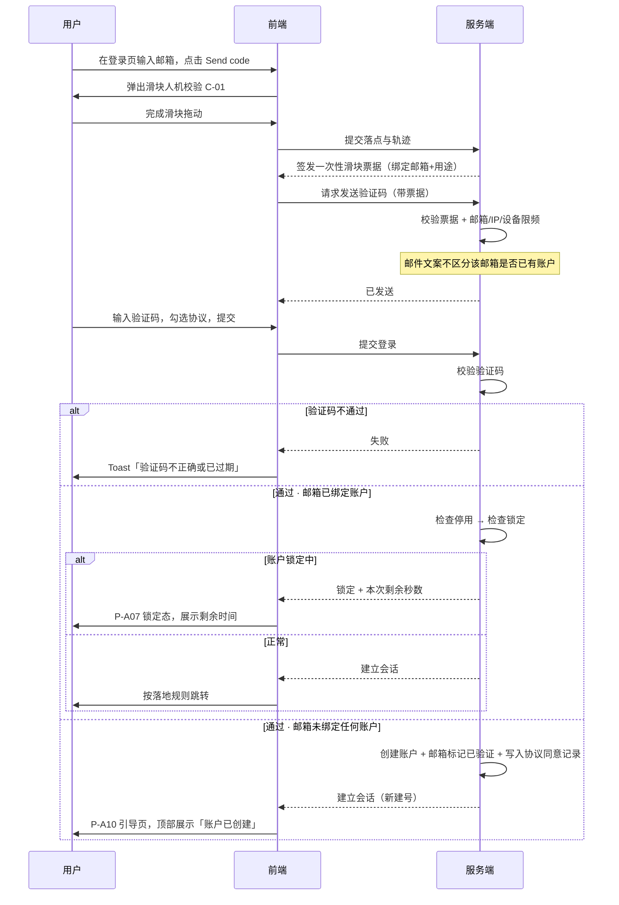
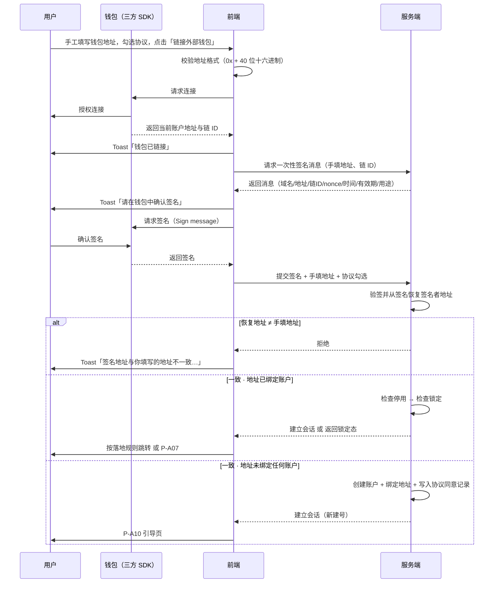
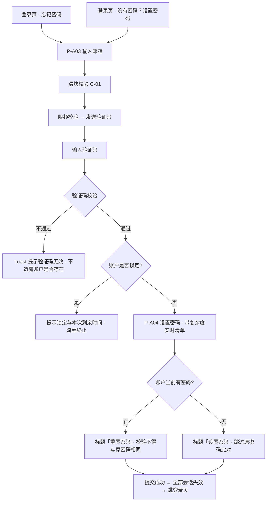
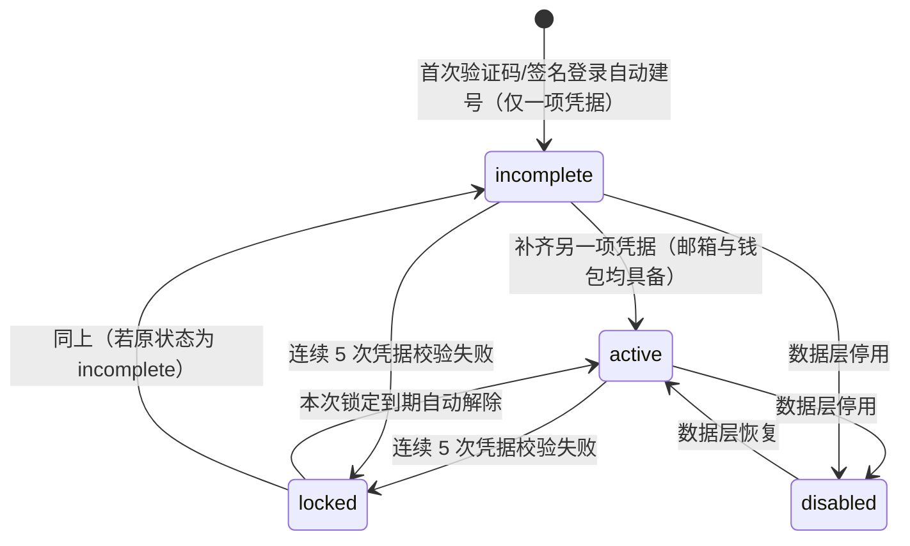
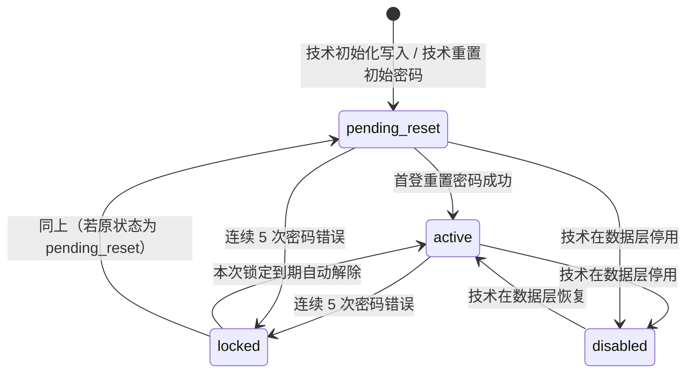
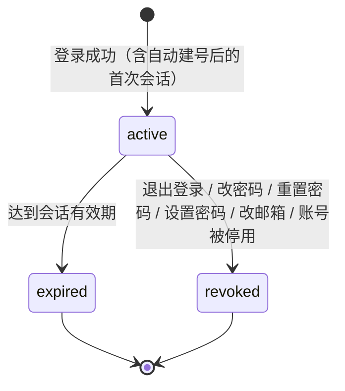
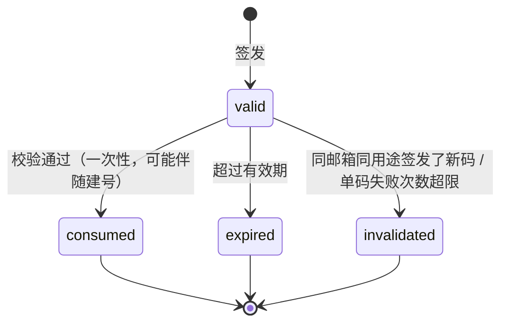
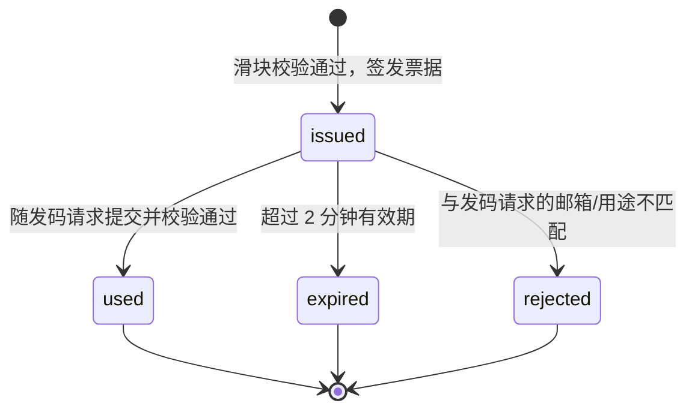
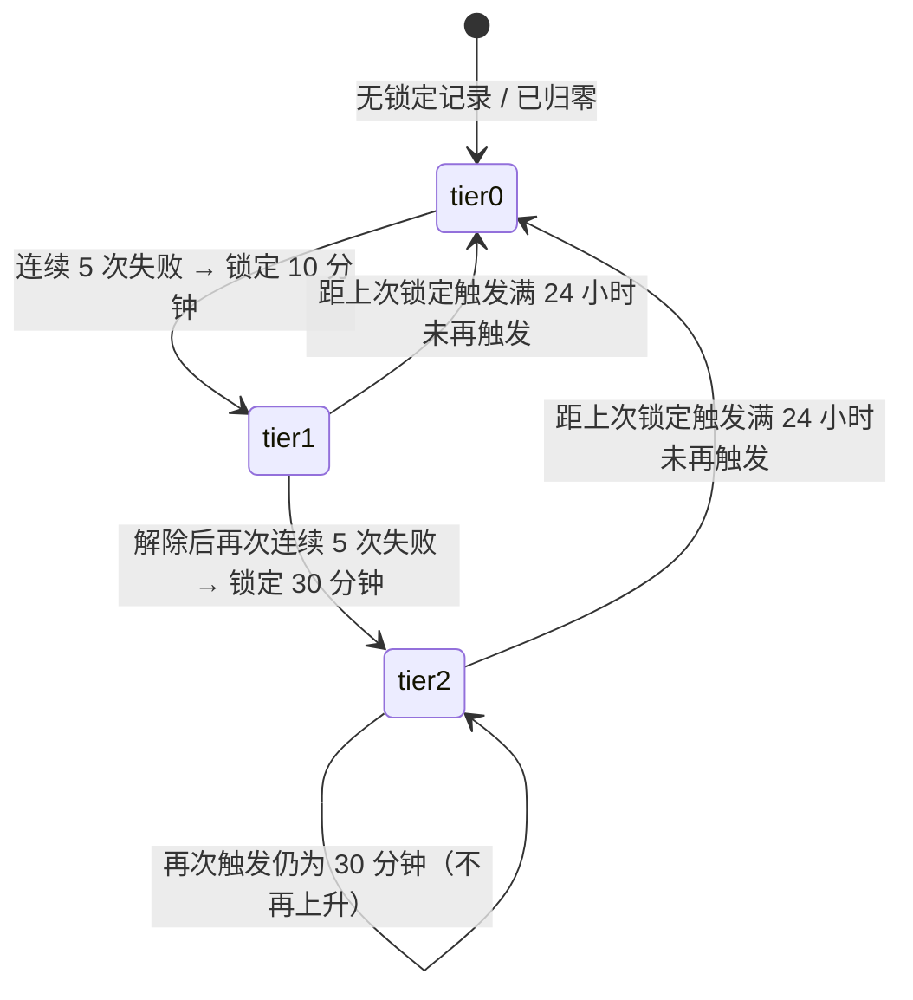

# 账户与登录 PRD · 03 流程图与状态机

> 本文件是《资产端 / 资产管理端 · 账户与登录 PRD》拆分后的分册。章节号与编号沿用拆分前，未做重排。
> 入口与全文导航见主文档 [`v1.0-账户与登录-PRD.md`](./v1.0-账户与登录-PRD.md)。

**本文件讲什么**：第 9 章主流程与异常流程（时序图与异常总表）、第 10 章状态机（账户、管理端账号、会话、验证码、滑块票据、锁定档位）、第 14 章数据对象与字段。

**本文件不讲什么**：

| 你在找 | 去这里 |
| --- | --- |
| 各模块的业务逻辑与规则 | [`01-模块详情.md`](./01-模块详情.md) 第 7 章 |
| 字段校验规则、界面文案、线框 | [`02-页面字段与双语文案.md`](./02-页面字段与双语文案.md) 第 8 章 |
| 功能清单、页面清单、权限矩阵 | 主文档 [`v1.0-账户与登录-PRD.md`](./v1.0-账户与登录-PRD.md) 第 5、6、11 章 |
| 会话失效、账户锁定、滑块与限频的完整规则 | [`04-安全与风控.md`](./04-安全与风控.md) 12.1～12.4 |
| 通知事件负载以外的通知内容 | [`05-消息通知与邮件模板.md`](./05-消息通知与邮件模板.md) 12.5、12.6 |
| 验收标准 | [`06-验收标准.md`](./06-验收标准.md) 第 18 章 |

---

## 9. 主流程与异常流程

### 9.1 邮箱验证码登录（含首次自动建号）

### 9.2 链接外部钱包登录（手填地址 + 签名一致性校验，含首次建号）

### 9.3 设置 / 重置密码（同一套流程，两个入口）

**两个入口复用同一套流程的结论与理由**

| 项 | 结论 |
| --- | --- |
| 是否复用 | **复用同一套流程**：同一组页面（P-A03 / P-A04）、同一个验证码用途、同一套服务端接口。两个入口只是登录页上的两个不同文案链接 |
| 理由 1 | 两条流程的每一步完全相同。做成两条独立流程会产生两份几乎一样的代码与文案，任何改动都要改两遍 |
| 理由 2 | 「有没有密码」这件事**用户自己未必清楚**（尤其是验证码建号的用户）。若做成两条流程，用户选错入口就会走进死胡同；复用之后无论从哪个口进来都能达成目的 |
| **差异点（流程内动态处理）** | ① **标题与按钮文案**：账户已有密码时为「重置密码」，无密码时为「设置密码」；② **成功提示文案**：同上分流；③ **原密码比对**：无密码时跳过该校验 |
| **关键约束（防枚举）** | 上述差异**只能在验证码校验通过之后**（即用户已证明对该邮箱的所有权）才体现。在输入邮箱与发码阶段，页面标题必须使用中性文案 `Set or reset your password / 设置或重置密码`，**不得**根据该邮箱是否已注册、是否已设密码而变化 |

### 9.4 异常流程总表

| 环节 | 异常 | 系统行为 | 用户可做什么 |
| --- | --- | --- | --- |
| 发送验证码 | 滑块校验失败 | 弹窗内抖动 + 换图 + 复位，不签发票据、不发码 | 重试；连续失败 5 次进入 60s 冷却 |
| 发送验证码 | 票据无效 / 已使用 / 已过期 | 服务端拒绝发码，前端重新弹出滑块 | 重新完成滑块 |
| 发送验证码 | 邮箱 / IP / 设备维度限频超限 | 不发码，返回剩余冷却秒数或提示稍后再试 | 等待 |
| 发送验证码 | 邮件发送方失败 | 返回失败，允许立即重试 1 次且不计入限频 | 重试 |
| 验证码登录 | 码错误 / 过期 / 单码失败超 5 次 | Toast 提示，不建号 | 重新输入或重发 |
| **验证码登录** | **邮箱未绑定账户** | **不是异常——自动建号并登录** | 进入引导页 |
| 密码登录 | 邮箱不存在 / 未设密码 / 密码错误 | **三者返回完全一致的提示**，不建号 | 用「没有密码？设置密码」或「忘记密码」 |
| 密码登录 | 真实密码错误达 5 次 | 账户锁定（阶梯时长），全通道锁死 | 只能等待锁定到期 |
| 钱包登录 | 地址格式不合法 | 前端拦截，输入框下方报错 | 修正地址 |
| 钱包登录 | 地址校验和异常 | 提示但不阻断 | 核对后继续或修正 |
| 钱包登录 | 未检测到钱包 / SDK 加载失败 | Toast 提示，引导安装或改用邮箱路径 | 安装后重试或换方式 |
| 钱包登录 | 用户拒绝连接 / 拒绝签名 | Toast 提示，回到初始态，**不计入失败计数** | 重新发起 |
| 钱包登录 | 签名消息过期 | Toast 提示，自动重新获取消息 | 重新签名 |
| **钱包登录** | **签名恢复地址 ≠ 手填地址** | **直接拒绝，Toast 提示，不建号、不登录，计入失败计数** | 检查钱包中选中的账户，或修正手填地址 |
| 钱包登录 | 钱包内切换了账户 | 感知并 Toast 提示，中止当前操作 | 切回目标账户重新链接 |
| **钱包登录** | **地址未绑定账户** | **不是异常——自动建号并登录** | 进入引导页 |
| 设置/重置密码 | 验证码通过但账户处于锁定 | 提示锁定与本次剩余时间，流程终止 | 等待锁定到期 |
| 设置/重置密码 | 邮箱未绑定账户 | 表现与已绑定一致（防枚举），校验阶段统一失败 | 改用验证码登录直接建号 |
| 设置/重置密码 | 新密码与原密码相同 | 服务端返回并展示对应文案 | 换一个新密码 |
| 修改邮箱 | 旧邮箱收不到验证码 | 流程无法继续，**本期无替代途径** | 见 [7.5.4](./01-模块详情.md)；须在丢失前保管好邮箱 |
| 引导页 | 补全时邮箱/地址已被占用 | 明确报错，保留在当前页 | 换一个或去登录 |
| 引导页 | 用户点「稍后」 | **整页收回**，按落地规则跳转，不做任何封锁 | 随时在账户设置或提示条补全 |
| 落地跳转 | 认证状态接口异常取不到 | **默认落到用户中心** | — |
| 发起个人认证 | 凭据不齐 | 弹出就地补齐弹层，不跳走 | 补齐后原地继续，或关闭弹层 |
| 发起个人认证 | 绕过前端直接调接口 | 服务端同样校验凭据完备性并拒绝 | — |
| 账户设置 | 尝试修改钱包地址 | **界面上不存在该入口**；若绕过前端直接调接口，服务端拒绝 | — |
| 管理端登录 | 初始密码已过期 | 不建立会话，提示联系技术人员重新发放 | 联系技术 |
| 任意受保护操作 | 会话已失效 | 清本地态，跳登录页 + 原因 Toast | 重新登录 |
| 地址展示 | 链 ID 无对应区块浏览器 | 隐藏跳转入口，只保留复制 | 手动查询 |
| 弱网 | 请求超时 | 按钮恢复可点，保留已填内容 | 重试 |

---
## 10. 状态机

### 10.1 账户状态（资产端）

| 状态 | 定义 | 可登录 | 可发起个人认证 | 是否封锁其他功能 |
| --- | --- | --- | --- | --- |
| `incomplete` | **邮箱与钱包地址未同时具备** | 是 | ❌ 否 | **否**——不做全局封锁，只展示常驻提示条 |
| `active` | **邮箱与钱包地址均已绑定** | 是 | ✅ 是（能否通过由 WS-303 决定） | 否 |
| `locked` | 因连续登录失败被锁定 | **否——所有方式均不可用**，见 [12.2.4](./04-安全与风控.md) | 否 | — |
| `disabled` | 被停用（由技术在数据层操作） | 否 | 否 | — |

**关键口径**

- **密码不参与状态判定**。只有邮箱+钱包、从未设过密码的账户，状态就是 `active`。
- 状态转换只由「邮箱与钱包是否都有」驱动。
- 钱包地址不可修改，因此 `active` 一旦达成，不会因钱包变更而回退。
- **`locked` 的唯一出口是本次锁定到期**，锁定时长按 [12.2.4](./04-安全与风控.md) 的阶梯规则确定。

### 10.2 管理端账号状态

| 状态 | 含义 | 行为 |
| --- | --- | --- |
| `pending_reset`（初始密码未过期） | 技术已写入账号或重置初始密码 | 登录后强制跳 P-M02，其他页面全部拦截 |
| `pending_reset`（初始密码已过期） | 同上，但已无法登录 | 登录被拒，需**联系技术重新发放** |
| `active` | 已完成重置 | 正常使用管理端全部功能 |
| `locked` | 连续登录失败 | 不可登录，只能等待本次锁定到期 |
| `disabled` | 停用 | 不可登录，已有会话立即失效 |

### 10.3 会话状态

### 10.4 邮箱验证码状态

### 10.5 滑块票据状态

### 10.6 锁定档位（阶梯）

| 档位 | 含义 | 本次锁定时长 |
| --- | --- | --- |
| 第 0 档 | 无有效锁定记录（从未锁定，或已归零） | — |
| 第 1 档 | 首次锁定 | **10 分钟** |
| 第 2 档 | 再次锁定（第 2 次及以后） | **30 分钟** |

> 档位只在**新的锁定被触发那一刻**计算并落定；锁定期间档位不变。详见 [12.2.4](./04-安全与风控.md)。

---

## 14. 数据对象与字段

> 只定义业务字段与口径，不指定存储实现。

### 14.1 账户 Account（资产端）

| 字段 | 口径 | 类型 | 必填 | 说明 |
| --- | --- | --- | --- | --- |
| `account_id` | 账户唯一主键 | string | 是 | **不可变** |
| `email` | 绑定邮箱 | string | 否 | 全局唯一（小写比对）；钱包建号时为空；修改须验证旧邮箱 |
| `email_verified_at` | 邮箱验证时间 | datetime | 否 | 通过验证码即视为已验证 |
| `wallet_address` | 绑定钱包地址 | string | 否 | 全局唯一（小写存储）；邮箱建号时为空；**绑定后不可修改**，服务端须拒绝任何修改请求 |
| `wallet_bound_at` | 钱包绑定时间 | datetime | 否 | |
| `has_password` | 是否已设置密码 | bool | 是 | **仅用于登录体验分流与是否执行原密码比对；不参与账户状态判定，不作为任何门槛** |
| `account_status` | 账户状态 | enum | 是 | `incomplete`（邮箱与钱包未同时具备）/ `active`（两项均具备）/ `disabled`；**密码不计入判定** |
| `failed_attempts` | 连续凭据校验失败次数 | int | 是 | 默认 0，密码与签名共用 |
| `locked_until` | 本次锁定截止时间 | datetime | 否 | 为空或已过期表示未锁定；到期即自动解除 |
| **`lock_tier`** | **当前锁定档位** | int | 是 | 默认 0；1 = 首次锁定档（10 分钟），2 = 再次锁定档（30 分钟，上限）。见 [12.2.4](./04-安全与风控.md) |
| **`last_locked_at`** | **上一次锁定被触发的时刻** | datetime | 否 | 用于阶梯归零判定：新锁定触发时若距此超过 24 小时则档位回到 1 |
| `locale` | 语言偏好 | enum | 否 | `en` / `zh-CN`；未显式设置过时为空，按 [13.3](./02-页面字段与双语文案.md) 判定 |
| `locale_set_at` | 语言偏好设置时间 | datetime | 否 | 用于 13.3.2 的冲突处理 |
| `timezone` | 时区偏好 | string | 是 | IANA 标识，建号时按浏览器推断 |
| `agreed_terms_version` | 已同意的协议版本 | string | 是 | 建号时随账户一并写入 |
| `created_via` | 建号路径 | enum | 是 | `email_code` / `wallet_signature` |
| `guide_shown_at` | 引导页展示时间 | datetime | 否 | 引导页只展示一次的依据 |
| `created_at` / `updated_at` | 创建/更新时间 | datetime | 是 | UTC |

**多企业预留说明**：本期一个账户对应一个使用主体，账户档案中**不直接承载企业字段**。后续支持「一账号管理多家企业」时，按「账户 — 个人主体 — 企业实体」三层关系扩展，本期无需改动上述账户字段。

### 14.2 管理端账号 AdminAccount

| 字段 | 口径 | 类型 | 必填 | 说明 |
| --- | --- | --- | --- | --- |
| `admin_id` | 唯一主键 | string | 是 | 不可变 |
| `work_email` | 工作邮箱 | string | 是 | **即登录账号**，全局唯一，不可自助修改 |
| `display_name` | 姓名 | string | 是 | 只读展示 |
| `role` | 角色 | enum | 是 | 本期固定为 `administrator` 单一取值 |
| `must_reset_password` | 是否需强制重置密码 | bool | 是 | 技术写入账号或重置初始密码时为 true；首登重置成功后 false |
| `initial_password_expires_at` | 初始密码有效期 | datetime | 否 | 写入时刻起 7 天；过期后需技术重新发放 |
| `initial_password_hash_kept` | 初始密码哈希（留存） | string | 是 | 仅用于「不得与初始密码相同」的比对；**不可用于登录校验** |
| `status` | 状态 | enum | 是 | `pending_reset` / `active` / `locked` / `disabled` |
| `failed_attempts` / `locked_until` / `lock_tier` / `last_locked_at` | 同资产端 | | | 阶梯锁定规则与资产端完全一致 |
| `locale` / `timezone` | 偏好 | | 否 | 在 P-M05 设置 |
| `last_login_at` | 最近登录时间 | datetime | 否 | |

> 本对象的**全部写操作**（新建、停用、恢复、初始密码发放与重置）由技术在数据层完成。应用层只读取本对象用于登录、首登重置、忘记密码与账户设置，并在首登重置与修改密码时更新密码相关字段。

### 14.3 会话 Session

| 字段 | 说明 |
| --- | --- |
| `session_id` | 会话唯一标识 |
| `account_id` / `admin_id` | 所属账户 |
| `issued_at` / `expires_at` | 签发与过期时间（UTC）；资产端 4 小时 /「记住我」30 天，管理端 2 小时 |
| `remember_me` | 是否长期会话；管理端恒为 false |
| `last_active_at` | 最近活跃时间，用于滑动续期与管理端无操作登出判定 |
| `device_summary` | User-Agent 摘要 + IP 归属地，仅用于安全通知与审计 |
| `revoked_at` / `revoke_reason` | 失效时间与原因，枚举对应 12.1.4 的文案分支 |

### 14.4 验证码 VerificationCode

| 字段 | 说明 |
| --- | --- |
| `code_id` | 唯一标识 |
| `email` | 目标邮箱；**签发时不要求该邮箱已有账户** |
| `purpose` | 登录（含建号）/ 设置或重置密码 / 绑定邮箱 / 改邮箱（旧）/ 改邮箱（新）/ 再认证 / 管理端找回 |
| `expires_at` | 10 分钟 |
| `attempt_count` | 已验证失败次数，上限 5 |
| `status` | `valid` / `consumed` / `expired` / `invalidated` |

> 「忘记密码」与「没有密码？设置密码」两个入口**共用同一个 `purpose`**（设置或重置密码），这是 9.3 流程复用的直接体现。
> 验证码本身不明文落库，只存不可逆摘要。

### 14.5 滑块挑战与票据 CaptchaChallenge / CaptchaTicket

| 字段 | 说明 |
| --- | --- |
| `challenge_id` | 挑战唯一标识，一次性 |
| `answer_x` | 缺口正确坐标，**仅服务端持有** |
| `challenge_expires_at` | 挑战有效期 |
| `ticket_id` | 票据唯一标识 |
| `bound_email` / `bound_purpose` / `bound_source` | 票据绑定的邮箱、用途、来源（IP + 设备指纹） |
| `ticket_expires_at` | 2 分钟 |
| `ticket_status` | `issued` / `used` / `expired` / `rejected` |

### 14.6 签名挑战 SignChallenge

| 字段 | 说明 |
| --- | --- |
| `nonce` | 一次性随机数，验签成功或失败后立即失效 |
| `claimed_address` | **用户手填的目标地址**；服务端据此下发消息，并在验签后与恢复地址比对 |
| `chain_id` | 链 ID；同时用于区块浏览器跳转的映射查询 |
| `purpose` | 登录（含建号）/ 绑定钱包 / 再认证 |
| `expires_at` | 5 分钟 |

### 14.7 安全审计日志 SecurityAuditLog

| 字段 | 说明 |
| --- | --- |
| `event_type` | 登录成功 / 登录失败 / 自动建号 / 锁定触发 / 锁定到期解除 / **锁定档位变化** / 密码设置 / 密码变更 / 密码重置 / 邮箱绑定 / 邮箱变更 / 钱包绑定 / 会话失效 / **签名地址不一致拒绝** |
| `subject_id` | 被作用账户 |
| `operator_id` | 操作者（自助操作时同 `subject_id`） |
| `ip` / `user_agent_summary` | 来源摘要 |
| `occurred_at` | UTC 时间 |
| `result` | 成功 / 失败 + 失败原因 |
| `context` | 操作前状态摘要（如建号路径、本次锁定档位与时长） |

### 14.8 通知事件负载 NotificationEvent

本模块在 12.5 定义的触发时点产出该对象，交由通知模块投递。**本模块不持有站内信的已读状态、列表顺序等展示态数据**，那些归通知模块。

| 字段 | 口径 | 说明 |
| --- | --- | --- |
| `event_id` | 事件唯一标识 | 幂等键；通知模块重复收到同一 `event_id` 时应丢弃 |
| `event_type` | 事件类型 | 取 12.5.2 的编号语义：`account_created` / `email_linked` / `wallet_linked` / `credentials_completed` / `password_set` / `password_changed` / `password_reset` / `admin_first_reset` / `email_changed_old` / `email_changed_new` / `account_locked` |
| `subject_account_id` | 接收者账户 | 站内信投递给该账户；邮件按 `channel_targets` 投递 |
| `channels` | 渠道 | `email` / `in_app` / 两者，取值由 12.5.2 决定 |
| `channel_targets` | 邮件收件地址 | 仅当含 `email` 渠道时有值；E-09 为旧邮箱，其余为账户当前邮箱或工作邮箱。**账户无邮箱时该字段为空，通知模块跳过邮件投递** |
| `category` | 消息分类 | `security` 安全 / `account` 账户 / `system` 系统 |
| `title_i18n` | 标题 | 中英双语键值对，内容见 [12.5.3](./05-消息通知与邮件模板.md) |
| `body_i18n` | 正文 | 中英双语键值对，变量已由本模块渲染完毕 |
| `variables` | 变量原值 | `{time}`、`{device}`、`{email_mask}`、`{address_short}`、`{unlock_time}` 的原始取值，供通知模块在需要时重新渲染（例如用户切换语言后重渲染历史消息） |
| `link_target` | 跳转目标 | 页面编号（如 `P-A11`）；无跳转时为空 |
| `dedupe_key` | 去重键 | 按 [12.5.6](./05-消息通知与邮件模板.md) 生成：通用事件为 `account_id + event_type + 时间窗`，E-11 为 `account_id + locked_until`，E-01 / E-04 为 `account_id` |
| `occurred_at` | 事件发生时间 | UTC；展示时按接收者时区渲染 |

> **语言口径**：`title_i18n` 与 `body_i18n` 同时携带中英两份内容，由通知模块**在展示时**按用户当前语言偏好选取。这与邮件不同——邮件的语言在**发送时**就已固定（见 [13.2](./02-页面字段与双语文案.md)），因为邮件一旦投递就无法改写；站内信则应随用户语言偏好实时切换，所以两份内容都要带上。

---

