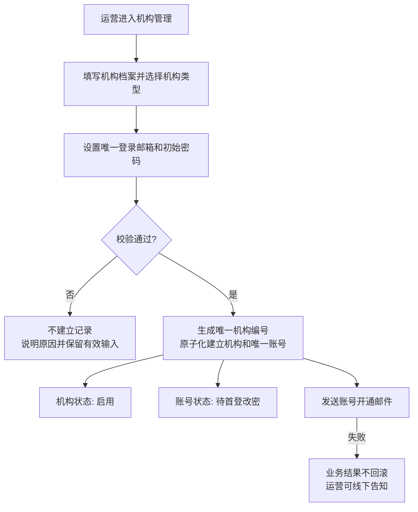
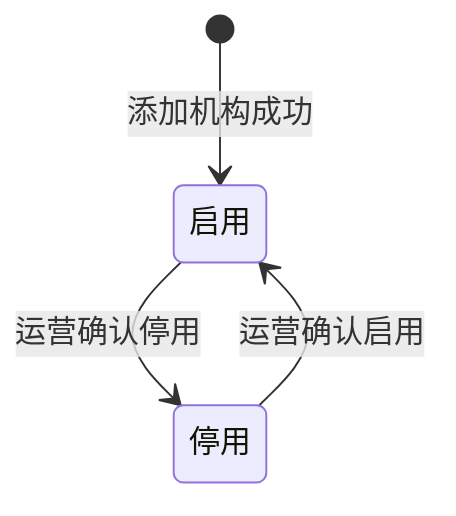

# 机构管理 · 流程图与状态机

2026-11-06｜对应功能册：[01](./01-机构管理-PRD.md)

## 添加机构并开通账号（图 1）

```mermaid
flowchart TD
    A[运营进入机构管理] --> B[填写机构档案并选择机构类型]
    B --> C[设置唯一登录邮箱和初始密码]
    C --> D{校验通过?}
    D -- 否 --> E[不建立记录\n说明原因并保留有效输入]
    D -- 是 --> F[生成唯一机构编号<br/>原子化建立机构和唯一账号]
    F --> G[机构状态: 启用]
    F --> H[账号状态: 待首登改密]
    F --> I[发送账号开通邮件]
    I -->|失败| J[业务结果不回滚\n运营可线下告知]
```

## 停用与启用（图 2）

```mermaid
stateDiagram-v2
    [*] --> 启用: 添加机构成功
    启用 --> 停用: 运营确认停用
    停用 --> 启用: 运营确认启用
```

- 启用机构可进入新业务的机构选择范围；停用机构不可进入。
- 启停不改变账号状态和历史数据。既有业务结果由所属业务模块定义，不进入本模块状态机。
